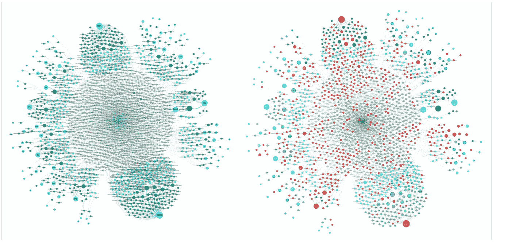
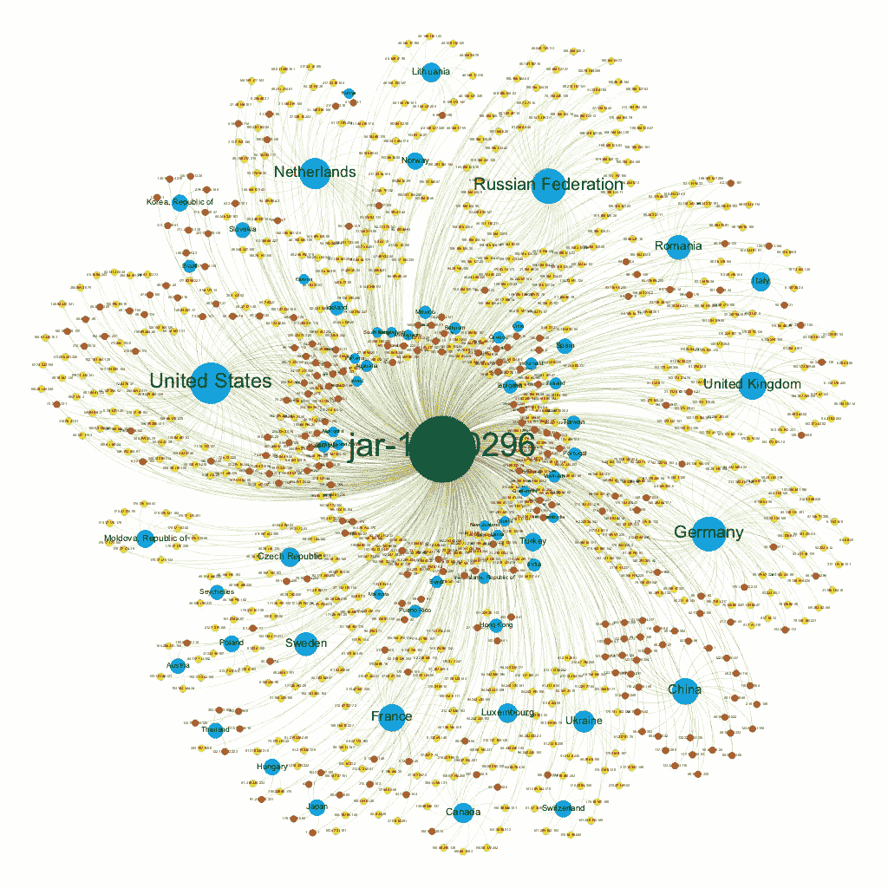
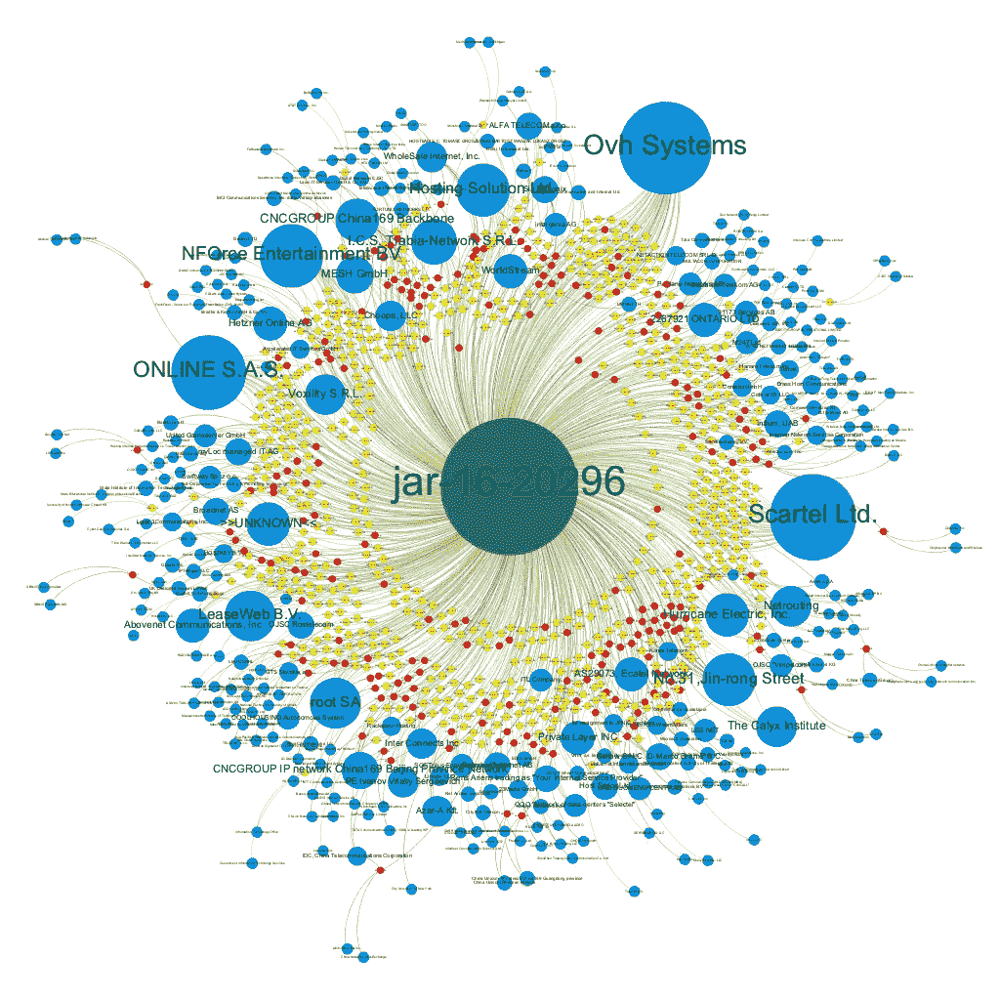
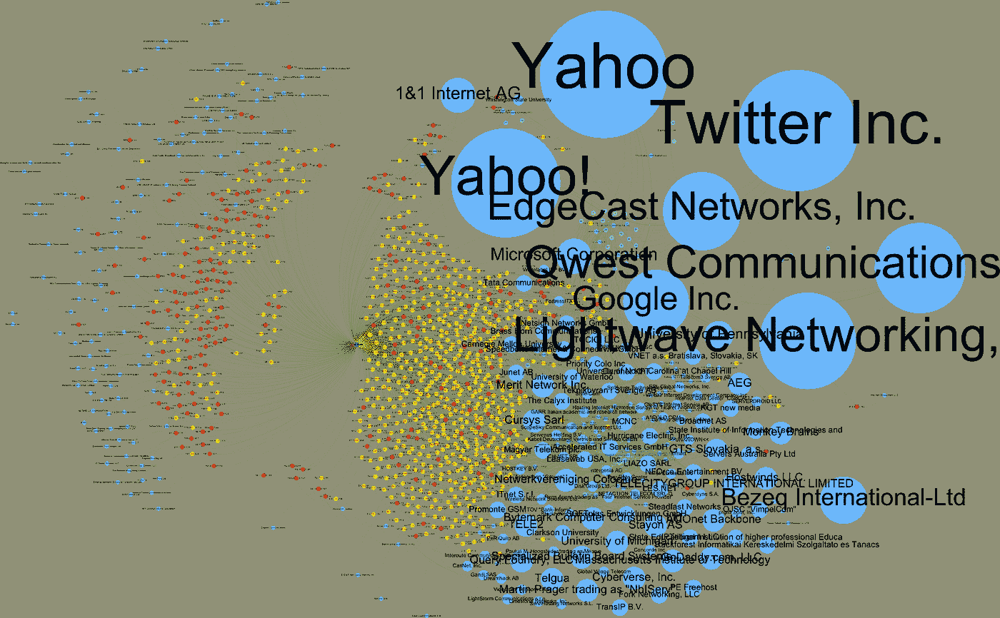
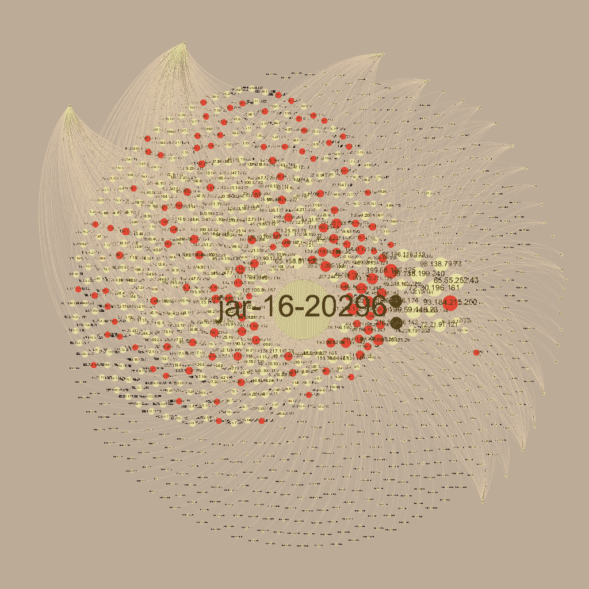

# 俄罗斯黑客、选举和数据驱动分析

> 原文：<https://medium.com/hackernoon/russian-hackers-elections-and-data-driven-analytics-a4a3cc8c07a9>

新年前两天，网络安全领域发生了一件有趣的事情。国土安全部发布了一份关于俄罗斯情报部门针对美国[政府](https://hackernoon.com/tagged/government)的黑客活动的报告。这份报告有些有趣，但是 DHS 也发布了一个包含 956 行数据的. csv 文件中的一组指标。作为一家新的网络安全初创公司的首席执行官，他专注于以更智能、更有趣的方式使用数据，这些数据以一种我没有想到的方式牵引着我。在接下来的两天里，在家庭活动、足球比赛、狗从柜台上抓食物的间隙，我坐在公公家厨房的凳子上，对这个世界视而不见。这个分析中有一些我不能忽视的东西。

> *“2016 年 10 月 7 日，国土安全部(DHS)和国家情报总监办公室(DNI)发表了一份关于选举安全妥协的联合声明。DHS 发布了一份联合分析报告(JAR ),将这些攻击归咎于俄罗斯名为“灰熊草原”的恶意网络活动—*[*https://www . us-cert . gov/security-publications/GRIZZLY-spade-Russian-Malicious-Cyber-Activity*](https://www.us-cert.gov/security-publications/GRIZZLY-STEPPE-Russian-Malicious-Cyber-Activity)

这篇文章旨在总结 Dark Cubed 在 2016 年新年前夕发表的题为“灰熊草原相关网络指标的简要分析”的更详细报告的一些发现。

**Tor 相关基础设施的参与**

我首先注意到的是与 Tor 网络相关的基础设施的普及。在我对发布的 IP 进行反向 DNS 分析时，我偶然发现了这一点。许多返回的 DNS 条目包括 tor-exit 或 tor……这引起了我的兴趣。然后我很快跳转到一个在 https://www.dan.me.uk/tornodes 维护的 Tor 相关 IP 地址的流行列表。

在 DHS 发布的 876 个 IP 地址中，有 211 个出现在所有 Tor 节点的列表中，也就是大约 24%的指标。从另一个角度来看，在撰写本文时，Tor 节点列表上有 6，909 个 IP 地址。因此，DHS IP 地址列表包含了所有 Tor 节点的大约 3%……虽然百分比很小，但这是一个很大的数字。

现在，数字和统计是有趣的，但可视化让这一点真正深入人心。我花在分析 JAR 中发布的数据的大部分时间是在使用 Gephi 构建图形可视化中。下图显示了反向 DNS 分析的结果以及 Tor 的影响。

Visualization of Reverse DNS Data Sets From GRIZZLY STEPPE

在左侧，我们可以看到可视化的反向 DNS 数据集。项目按相关联的 TLD 分组(例如 com，。网，。ru)。图中的关系从 TLD ->域名->完全限定域名-> IP -> JAR。在右边，我们用红色标出了与 Tor 相关的 IP、包含 Tor 的域名以及它们的父节点。一眼就能看出 Tor 网络对数据的影响有多严重，这令人震惊。这一分析的底线是一个简单的问题:*即使攻击是通过 TOR 路由的，政府(或任何其他人)是否应该将相关的 TOR 节点作为这样的数据集的一部分发布？*

**地理位置分析**

在上映。csv 文件，DHS 确定了与每个 IP 相关的国家。这让我开始探索从基于地理位置的分析中可以收集到什么样的见解。当然，第一步是使用 MaxMind 数据库在谷歌地图上简单地映射 IP 地址。结果不一定有帮助，但仍然很有趣。

Mapping the IPs from GRIZZLY STEPPE

快速浏览一下就会发现，这个数据集覆盖了相当多的领域，而且相当广阔。为了进行更详细的分析，我跳回 Gephi 中构建一些可视化，这是一个艰苦的、有条不紊的过程。

> “这些网络行动包括针对政府组织、关键基础设施实体、智库、大学、政治组织和企业的鱼叉式网络钓鱼活动，从而导致信息被盗。”——JAR-16–20296

结果令人着迷，在某些方面看起来像黛西。与上面的地图一样，该图揭示了这是一个非常多样化的数据集，但也有一些非常有趣的金块。

Geolocation Analysis of GRIZZLY STEPPE

首先映入我眼帘的是中国和韩国。这两个国家都有特色，但只与 JAR 确定为指挥和控制的基础设施相关(C2)。看看俄国，当然有大量的节点，但是只有一个被确定为 C2。我们在节点数量较少的国家看到了同样的效果，如波多黎各(3)、泰国和香港。这到底意味着什么还不清楚，但它肯定是一个有趣的结果，值得更多的考虑。

**组织分析**

另一种看待数据集的方式是评估与 IP 地址本身相关的组织。再一次，这花费了大量的时间来以一种值得的方式构建可视化，但是结果是令人着迷的。

Analysis of Organizations Related to GRIZZLY STEPPE

此视图让我们能够深入了解那些拥有比数据集中其他组织更多 IP 地址的组织。像俄罗斯宽带提供商 Scartel Ltd .这样的团体非常突出。我们也看到了云提供商的影响，如在线公司(online.net)和 Ovh 系统公司(ovh.com)。我们将在本文中进行更详细的讨论，但另一个有趣的发现是与中国相关的三个组织，它们似乎与上面讨论的 C2 基础设施有关。

**暗立方分析**

最后，也是我们分析中最详细的部分，与 Dark Cubed 已经收集了将近一年的专有数据有关。我们产品的一个独特之处在于，我们为客户提供实时、完全匿名的信息共享网络功能，能够在不泄露客户身份的情况下实现共享分析。这为我们提供了一个非常独特和有趣的数据集，让我们可以将真实的网络活动与 GRIZZLY spare 发布的指标集进行比较。

> 在最好的情况下，这创造了一个没有价值的兔子洞，在最坏的情况下，嘈杂的威胁情报公司可能会将这些指标引入他们的数据集中，并为大大小小的公司创造一个令人头痛的世界。

当评估这样的数据集时，该数据提供了显著的好处，因为它允许我们将可疑的不良活动与真实的活动混在一起，以查看哪里的指标可能过于嘈杂。下图突出显示了与灰熊草原相关的组织，这些组织受到暗立方客户观察到的这些指标的影响。

GRIZZLY STEPPE Related Organizations By Count Seen in Dark Cubed

通过使用真实世界的数据来分析这些数据集，我们可以立即看到有害噪声的引入。为什么与雅虎、Twitter、谷歌、微软、EdgeCast(威瑞森)相关的指标被列为网络管理员应该寻找的东西？在最好的情况下，这创造了一个没有价值的兔子洞，在最坏的情况下，嘈杂的威胁情报公司可能会将这些指标引入他们的数据集中，并为大大小小的公司创造一个令人头痛的世界。

我们更详细讨论的第二个分析与根据观察指标的客户数量来确定节点大小有关。这为我们提供了一个看待“嘈杂”指标的不同视角。

GRIZZLY STEPPE Indicators By Number of Customers

我们可以在上面看到中间一个相对紧密的分组，它与一组 C2 和非 C2 节点相关联，这些节点出现在大量暗立方体客户网络中。我们还看到大多数指标以相对平衡的方式分布在客户中。

> 在我们的报告中，我们深入探讨了最常见指标的更多细节，但(剧透警告)它们似乎只是噪音。

根据我们对数据的初步调查，这是定期从这些 IP 地址进行广泛、无重点扫描活动的结果。在我们的报告中，我们深入探讨了最常见指标的更多细节，但(剧透警告)它们似乎只是噪音。事实上，上图中四个最大的“C2”节点仅仅是 Yahoo 服务器。

第三个也是更详细的报告之外值得分享的分析是，当客户在他们自己的网络上观察这些指标时，我们叠加了我们为客户计算的分数。我们的分数从低风险、高信心到高风险、高信心不等。下图显示了这一分析的结果。

GRIZZLY STEPPE Indicators By Customer Count, Colored by Threat Score

正如我们从上面可以很快看到的，与 JAR 相关的大部分基础设施已经被认为是可疑的，原因有很多。顺便说一下，中间被评为中性(黄色)或低风险(绿色)的项目是雅虎和谷歌服务器。

> 我们可以肯定地说，暗立方客户所观察到的与灰熊草原相关的基础设施中，有 80%不是由 RIS 威胁行动者独家使用的。

这一点很重要，因为它表明了这个数据集的噪声有多大。我们无法确定基础设施是否被俄罗斯情报部门(RIS)使用，因为我们还没有看到事故响应数据。然而，我们可以肯定地说，暗立方客户观察到的与灰熊草原相关的基础设施，并不是 RIS 威胁行动者*专用的*。

**总结**

在结尾，这个项目是对数据分析能力的一次令人着迷的深入探索，并再次向我强调了使用真实网络数据来帮助消除数据集噪音的必要性，例如与 GRIZZLY STEPPE 联合发布的数据集。它还强化了我们的愿景，即通过一种他们实际上能够负担和使用的工具，向各种规模的公司大规模提供威胁情报和预测分析。随着我们继续建立和发展我们的早期创业公司，我们希望能够继续贡献更多的数据驱动分析，以帮助过滤噪音，让组织保护最重要的东西。

*在这里阅读完整报道:*[*goo.gl/ZRcBRC*](https://t.co/E9Fx9VK7rw)

*访问暗立方网站点击:*[*https://www.darkcubed.com*](https://www.darkcubed.com?source=medium_grizzly_steppe)

> [黑客中午](http://bit.ly/Hackernoon)是黑客如何开始他们的下午。我们是 [@AMI](http://bit.ly/atAMIatAMI) 家庭的一员。我们现在[接受投稿](http://bit.ly/hackernoonsubmission)，并乐意[讨论广告&赞助](mailto:partners@amipublications.com)机会。
> 
> 如果你喜欢这个故事，我们推荐你阅读我们的[最新科技故事](http://bit.ly/hackernoonlatestt)和[趋势科技故事](https://hackernoon.com/trending)。直到下一次，不要把世界的现实想当然！

