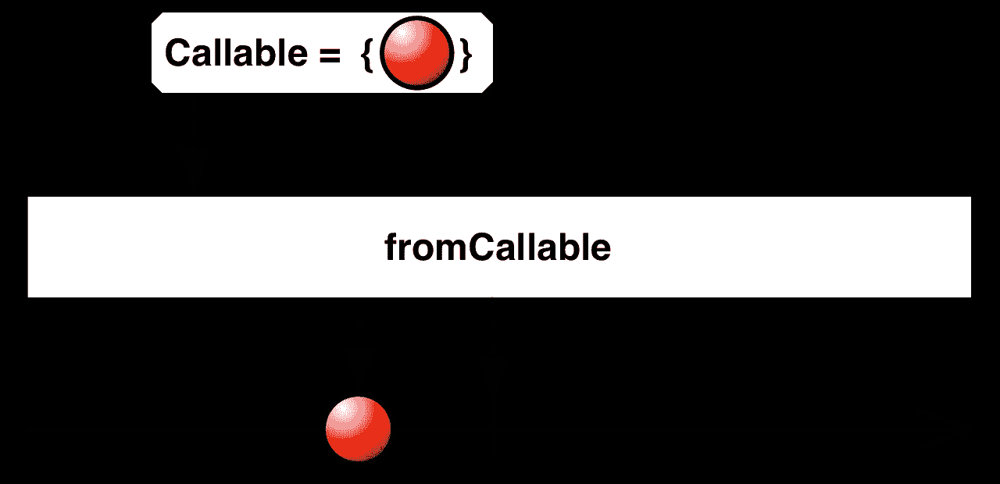

# 处方:包装你的处方

> 原文：<https://medium.com/hackernoon/rxrecipes-wrap-your-way-to-rx-fd40eb5254b6>

Image Credit: [JodiMichelle @ Flickr](https://www.flickr.com/photos/jodimichelle/6421813195/in/photostream/)

> RxRecipes 系列一般指 Android 和 [RxJava2](https://github.com/ReactiveX/RxJava/tree/2.x) ，但同样的 Recipes 可以适用于任何 Rx 实现和平台( [RxJs](https://github.com/Reactive-Extensions/RxJS) 、 [RxSwift](https://github.com/ReactiveX/RxSwift) ，一个带有 RxJava 的后端等)。

# 带外部代码的 Rx 组合

假设您的最新应用程序有一个非常棒的反应式数据层。API/磁盘/缓存设置非常漂亮，如此清新干净，真是一个充满欢乐和奇迹的绿洲。

来自 product 的新需求:您需要用一些静态数据初始化应用程序，以进行无等待/无互联网要求的首次运行。

因此，您决定将一个 JSON 文档放在/assets 文件夹中。

除非您很快意识到这个新数据源(以及相关的 [AssetManager API](https://developer.android.com/reference/android/content/res/AssetManager.html) )不适合您的可组合、可调度、可链接、可终止错误(以及所有其他功能)的反应式数据层。

Ugh. InputStream and array literals, IOException to cover multiple cases (file doesn’t exist, some issue with the disk), synchronous-blocking close. No thanks.

我们真正想要的是这样一个反应式的简洁 API:

Optional since the file may not exist. Completeable for the no-return-value operation. and an Observable stream of locales. Sweet! See discussion in comments regarding Maybe type for the getFileAsString() method.

但是我们如何到达那里呢？

# 解决方案:用 fromCallable()包装

来自官方文件:

*返回一个可观察对象，当观察者订阅它时，调用您指定的函数，然后发出从该函数返回的值。这允许您将指定函数的执行推迟到观察者订阅 ObservableSource 之后。也就是说，它让函数变得“懒惰”*

使用 fromCallable()是获取声明性外部代码并使其具有反应性的最简单方法。

fromCallable()创建方法需要与以下简单接口匹配的可调用实现:

Doesn’t get much simpler than that.

# 让我们看看代码

我将在这个特定的实现中使用一些 [Guava](https://github.com/google/guava) 类(可选的，CharStreams，Lists)。

*   我们返回一个实例，该实例在订阅时执行以下代码:
*   我们尝试获取文件的 InputStream，并将该流读入 CharStream，后者产生一个字符串结果。
*   如果有一个 IOException(文件不存在，一些磁盘问题),我们返回一个缺席可选。

*   我们创建一个可观察对象，它在订阅时执行以下代码:
*   我们获得了资产的现有区域设置(String[])。
*   我们使用 [flatMapIterable](http://reactivex.io/RxJava/javadoc/rx/Observable.html#flatMapIterable%28rx.functions.Func1%29) ()操作符将流从 String[]项转换成发出每个 String[]项的字符串流(在我们的例子中，原始流中只有一个数组)。

*   我们返回一个 Completable，它在订阅时执行 close 方法。
*   编辑:[我们正在使用 fromAction()，它类似于 fromCallable()，只是它接受一个 runnable(无返回类型)。](https://github.com/ReactiveX/RxJava/blob/2.x/src/main/java/io/reactivex/Completable.java#L316) fromAction()仍然是延期执行，但是这样我们就不用做任何奇怪的返回了(感谢 [fromAction())创建一个反应式源，它在订阅时执行它的工作，而不是在我们创建它时执行。](https://medium.com/u/70dbce2c0387#L316)

## RxRecipes 系列的下一步:

TBD — I’ll update this with a link to the next post once it’s done.

喜欢这道菜吗？

不同意执行？

对上面的某句话有火热的看法吗？

我很乐意收到你的来信，请在下面留下你的评论！

> [黑客中午](http://bit.ly/Hackernoon)是黑客如何开始他们的下午。我们是 [@AMI](http://bit.ly/atAMIatAMI) 家庭的一员。我们现在[接受投稿](http://bit.ly/hackernoonsubmission)并乐意[讨论广告&赞助](mailto:partners@amipublications.com)机会。
> 
> 如果你喜欢这个故事，我们推荐你阅读我们的[最新科技故事](http://bit.ly/hackernoonlatestt)和[趋势科技故事](https://hackernoon.com/trending)。直到下一次，不要把世界的现实想当然！

