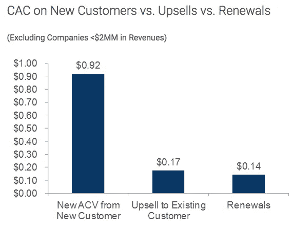
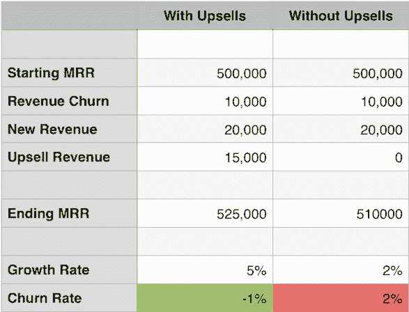

# SaaS 公司:忽视追加销售和扩张收入，后果自负

> 原文：<https://medium.com/hackernoon/saas-companies-ignore-upsell-and-expansion-revenue-at-your-own-peril-28098e0026d7>

发展最快的 SaaS 公司正在利用追加销售来增加收入，甚至发展得更快。追加销售是指公司向你销售更多的相同产品。对 SaaS 来说，这是以额外许可或升级到下一个产品层的形式。从历史上看，这部分收入并没有得到太多重视。

许多公司已经利用追加销售来获得优势，但在今天的市场中，他们需要从战略角度考虑，需要做更多的工作。以下是三个原因:

## 1.追加销售帮助您应对不断增加的采购成本

在过去的几年中，许多 SaaS 产品的出现增加了获取新客户的营销和销售费用。

无论是 CRM、营销自动化套件、支持服务台软件还是招聘工具，都有数百家供应商可供选择。脱颖而出变得越来越难，激烈的竞争正在推高销售和营销成本。

在 2013 年 [Pacific Crest SaaS 调查](http://www.forentrepreneurs.com/2013-saas-survey/)中，新客户的客户获取成本(CAC)中值为新客户每 1 美元新 ACV(平均合同价值)0.92 美元。相比之下，现有客户每增加 1 美元的 ACV，平均成本为 0.17 美元。这是一笔巨款——从现有客户身上多赚 1 美元的成本只是从新客户身上多赚 1 美元成本的 19%。

–【forentrepreneurs.com 提供的 T2 图片】

在两年[后](http://www.forentrepreneurs.com/2015-saas-survey-part-1/)进行的同一项调查中，我们看到风险资本和进入市场的新公司的增加如何提高了收购成本。2015 年，新客户每 1 美元新 ACV 的平均成本为 1.18 美元，现有客户每 1 美元新 ACV 的平均成本为 0.28 美元。

*——照片由 forentrepreneurs.com 提供*

收购成本增加的直接影响反映在*回收期*中，即收回收购成本并开始盈利所需的时间。

追加销售是缩短回收期和应对不断增加的采购成本的一种方式。

## 2.追加销售是减少客户流失的方法

客户流失让创始人夜不能寐。让你努力争取的客户流失是很痛苦的。但是，你总是会有一定程度的流失。这是必然的。

最好的 SaaS 公司设计他们的追加销售机制来抵消流失。这可能会导致所谓的负面流失。

> *负流失率意味着来自现有客户的扩大收入大于流失的收入。*

举例来说，我们以两家公司为例:一家有强大的追加销售计划，另一家没有。正如我们在下表中看到的，实施追加销售计划的公司增长率更高，并且实现了负流失率。

## 3.追加销售帮助您识别最佳客户

你的客户对你的产品有一个自然的轨迹。最有可能的是，他们在承诺全面铺开之前，会小心翼翼地通过一个试验阶段。随着时间的推移，他们要么从你的产品中发现更多价值并消费更多，要么没有发现并大量生产。

最好的客户是那些与你的产品一起成长的客户。

这类客户是长期的，因为他们在你产品的起伏中成长。他们是最忠实的，满怀期待地等待着每一款产品的发布。

当你开始的时候，你没有很多数据来告诉你谁是你最好的客户。你真的是边走边想。随着客户越来越多地使用你的产品，成功的里程碑开始显现。

一旦你有了足够的数据，你就可以开始画一个成功的客户如何采用你的产品的时间表。通过用成功里程碑来衡量每个客户的生命周期，您将知道客户是在正轨上还是需要进一步的入职和支持。如果你发现某个渠道吸引了错误类型的客户，这也有助于塑造你的营销努力。

## 结论:SAAS 追加销售比以往任何时候都更加重要

我们希望，我们已经提出了一个令人信服的论点，说明为什么您现在比以往任何时候都更需要关注追加销售。追加销售对您和您的客户来说是双赢的，明智的做法是在合适的时间要求追加销售。

*最初贴在*【Silota.com】*上*

******

> *[黑客中午](http://bit.ly/Hackernoon)是黑客如何开始他们的下午。我们是 [@AMI](http://bit.ly/atAMIatAMI) 家庭的一员。我们现在[接受投稿](http://bit.ly/hackernoonsubmission)并乐意[讨论广告&赞助](mailto:partners@amipublications.com)机会。*
> 
> *如果你喜欢这个故事，我们推荐你阅读我们的[最新科技故事](http://bit.ly/hackernoonlatestt)和[趋势科技故事](https://hackernoon.com/trending)。直到下一次，不要把世界的现实想当然！*

**