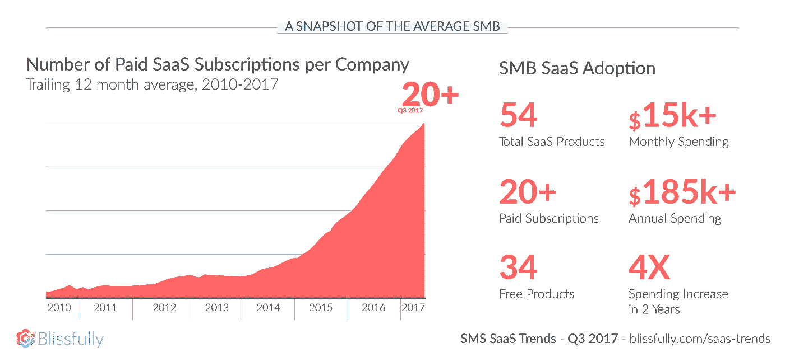
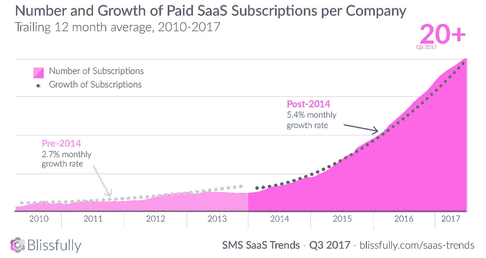
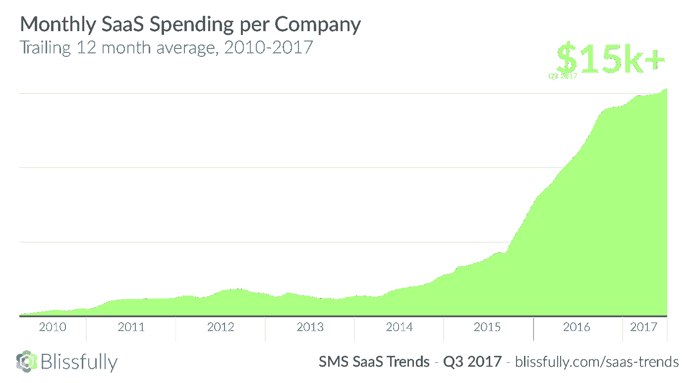
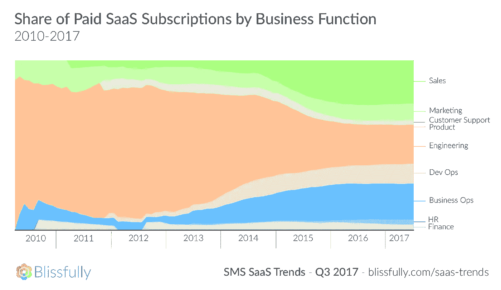
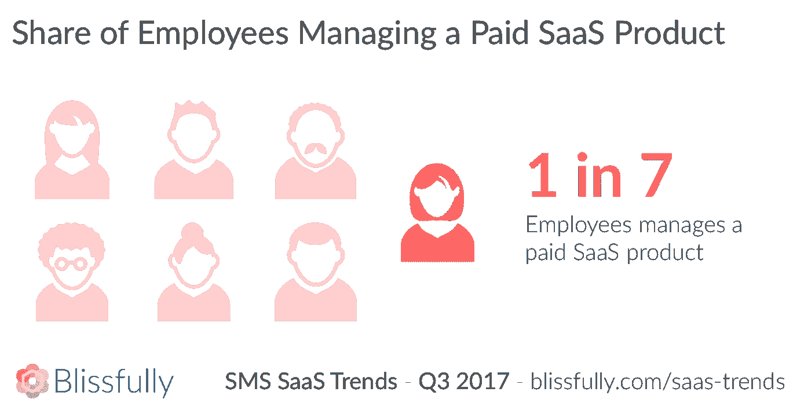
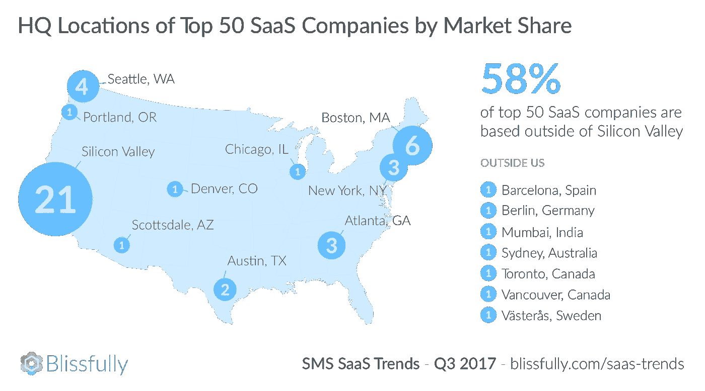
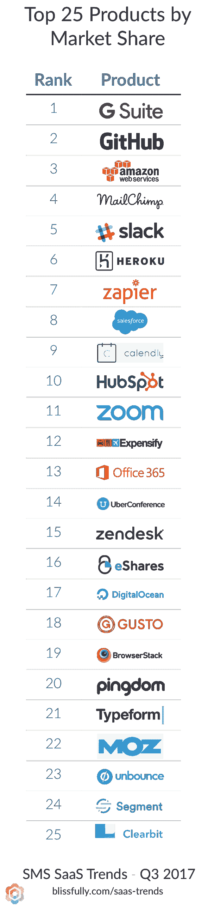

# SaaS 爆炸造成 SaaS 混乱:SaaS 8 年数据分析

> 原文：<https://medium.com/hackernoon/saas-explosion-creates-saas-chaos-analyzing-8-years-of-saas-data-b3a3b6167566>

# 中小企业 SaaS 爆炸

SaaS 提供的部署便利性、业务模式和效率已经改变了各种规模的公司开展业务的方式。因此，十多年来，SaaS 吸引了数十亿美元的风险投资，并激励成千上万的企业家推出新产品。但是，直到最近几年，我们才看到中小型企业(SMB)在各种行业和部门中广泛采用。

Blissfully 帮助数百家公司轻松管理他们的 SaaS 供应商，涵盖数千订阅和数百万月支出。这使我们有一个独特的立场来评估 SaaS 的趋势，尤其是中小型企业。虽然各种研究探讨了 SaaS 在大型企业中的使用情况，但几乎没有关于中小型企业的数据。我们公司平均只有不到 100 名员工。此外，我们汇总了过去八年的真实世界 SaaS 支出和使用数据(不仅仅是调查)，为 SaaS 的发展提供了一些很好的见解。

随着我们对数据的深入研究，出现了一些趋势。总体而言，SaaS 的使用确实在各企业间加速增长，在过去 20 年中，付费 SaaS 订阅的采用率增长了 4 倍多，平均每个中小型企业拥有 20 多种产品。随着非工程 SaaS 支出从 2010 年的约 10%上升到今天的 80%以上，SaaS 已经扎根于所有职能和部门。随着采用率的上升，SaaS 产品和供应商的数量呈爆炸式增长，并在整个组织中蔓延开来。

这些趋势对 SaaS 生态系统中的每个人都有重大影响，从投资者到建筑商再到消费者。

# 中小企业 SaaS 趋势

## 公司为 20 多种 SaaS 产品付费，而且每年都在翻倍。

如今，一般中小型企业在其整个组织中使用 20 种付费 SaaS 产品。这一数字在过去两年中大幅增加，自 2015 年以来翻了两番。2014 年后，中小企业采用 SaaS 产品的比率翻了一番。从 2010 年到 2014 年，整个组织采用的 SaaS 产品数量平均每月增长 2.7%。这一月度增长率在 2014 年后大幅提高至 5.4%。

## SaaS 的支出增长了 4 倍，每月超过 1.5 万美元。

在短短两年的时间里，整个组织内中小型企业在 SaaS 产品上的平均支出翻了两番。如今，中小型企业平均每月在 SaaS 产品上的花费超过 15，500 美元。按年计算，这相当于每家中小企业超过 186，000 美元。支出从 2014 年开始大幅增加，到 2016 年每个季度都大幅增加，今天还在继续增加。

## 整个组织都在使用 SaaS。

几乎整个组织的每个业务部门都在使用 SaaS 产品。2010 年，受工程影响的付费 SaaS 产品占据了中小型企业平均使用量的 90%,如今仅占 20%。销售和业务运营现在各占大约 20%。营销和开发运营各占支出的 10%左右，营销自 2010 年以来保持稳定，开发运营从 2012 年的零支出开始上升。最后，人力资源、财务、产品和客户支持都来自于五年前几乎为零的支出，现在各占 3%左右。

## SaaS 也在整个组织内进行管理。

随着 SaaS 在所有业务功能中的扩散，这也意味着这些订阅的管理和所有权越来越分散。我们的数据显示，七分之一的员工正在为他们的组织管理 SaaS 订阅(例如作为账单所有者)。在整个组织中推行 SaaS 所有权和管理是一种授权，可以带来更好的产品和决策。然而，这也可能导致 SaaS 混乱，造成潜在的安全风险和财政浪费。事实上，这种 SaaS 所有权脱离其控制的趋势是我们幸福起步的一个重要原因。

## SaaS 不仅仅建立在硅谷。

虽然硅谷被称为风险资本投资的中心，但中小企业利用的大多数顶级 SaaS 产品的总部都在硅谷之外。

## 按市场份额排列的顶级产品显示了各种各样的产品功能。

市场份额最高的产品显示了各种各样的商业功能，进一步支持了上述观点，即 SaaS 已经真正渗透到所有的商业功能中。在前 25 名中，我们看到了很多惯常的老牌玩家: [G 套件](https://medium.com/u/17911f92be83?source=post_page-----b3a3b6167566--------------------------------)、 [GitHub](https://medium.com/u/8df3bf3c40ae?source=post_page-----b3a3b6167566--------------------------------) 、AWS、 [Slack](https://medium.com/u/26d90a99f605?source=post_page-----b3a3b6167566--------------------------------) 、 [Salesforce](https://medium.com/u/f4fb2a348280?source=post_page-----b3a3b6167566--------------------------------) 、 [HubSpot](https://medium.com/u/8732e73183e5?source=post_page-----b3a3b6167566--------------------------------) 、 [Office 365](https://medium.com/u/f3da972c633f?source=post_page-----b3a3b6167566--------------------------------) 。我们还看到许多公司专注于营销栈， [MailChimp](https://medium.com/u/772bf2413f17?source=post_page-----b3a3b6167566--------------------------------) ，Moz， [Unbounce](https://medium.com/u/eda63d4fd9e4?source=post_page-----b3a3b6167566--------------------------------) ，辅以数据丰富和同步对[Segment](https://medium.com/u/6e946b6a2866?source=post_page-----b3a3b6167566--------------------------------)+[clear bit](https://medium.com/u/ce5450a7b906?source=post_page-----b3a3b6167566--------------------------------)。你还会注意到，我们在推荐的[初创公司 SaaS 堆栈](/blissfully/startup-saas-stack-4aa9a17b9afc)中重点提到的很多公司都出现在了前 25 名(以及完整报告中的前 50 名)中，包括 G Suite、 [Zapier](https://medium.com/u/530c4c926670?source=post_page-----b3a3b6167566--------------------------------) 、 [eShares](https://medium.com/u/86fddb076fc9?source=post_page-----b3a3b6167566--------------------------------) 、 [Gusto](https://medium.com/u/6abb56c9afcc?source=post_page-----b3a3b6167566--------------------------------) 和 [Zoom](https://medium.com/u/c4c2efc9bc0a?source=post_page-----b3a3b6167566--------------------------------) 。这不应该是一个惊喜，这是我们推荐他们的部分原因！

# 关键要点

该报告中的数据强调了最近中小型企业在支出和使用方面的 SaaS 爆炸式增长。这影响了 SaaS 生态系统中的每一个人:建筑商、投资者和消费者。以下是每组的一些要点。

## SaaS 建筑商:激烈竞争中的增长机遇

如果你在制造和销售 SaaS 产品，这份报告中的上升趋势为持续的颠覆和机会创造了条件。然而，这也意味着竞争将会非常激烈，因为越来越多的产品可以在众多行业和职能部门中为中小型企业所用。

## 风投+ SaaS 投资者:执行力是成功的关键

SaaS 的机会很大，因为利基产品打破了一刀切的产品，新的业务模式方便了中小企业的采用，新产品迎合了中小企业的更多功能。无论如何，对新进入者的竞争将是激烈的，这使得执行的速度和质量成为成功的关键。

## 中小企业和 SaaS 消费者:需要 SaaS 管理

SaaS 产品将继续在您的组织中扩散并提供一系列有意义的价值主张。预计使用和支出将持续增长，SaaS 选项和供应商选择将比以往更多。虽然 SaaS 为您的企业提供了许多优势，但从成本效益、安全性、培训和 it 管理的角度来评估和管理不断增加的选项也是一项艰巨的任务。SaaS 管理层比以往任何时候都更加重要。幸运的是，这就是[存在的原因，有助于简化 SaaS 的管理。](https://www.blissfully.com/)

如果你有兴趣了解更多，你可以下载我们完整的[2027 年第三季度 SaaS 趋势报告](https://www.blissfully.com/saas-trends/q3-2017-saas-explosion-creates-saas-chaos/)，如果你想获得免费的、即时的 SaaS 审计，看看你的公司情况如何，请注册[幸福地](https://www.blissfully.com/)。

*原载于*[*www.blissfully.com*](https://www.blissfully.com/saas-trends/q3-2017-saas-explosion-creates-saas-chaos/)*。*