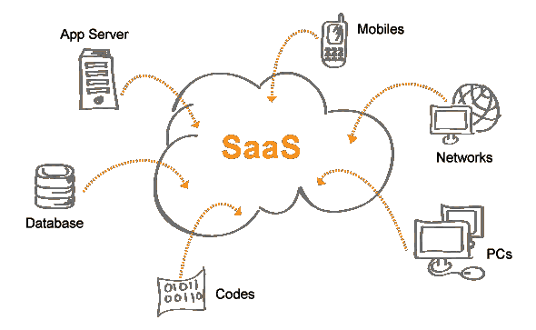

# SAAS(软件即服务)平台架构

> 原文：<https://medium.com/hackernoon/saas-software-as-a-service-platform-architecture-757a432270f5>

软件即服务是一种软件许可和交付模式，在这种模式下，软件在订阅的基础上获得许可，并集中托管。用户可以借助网络浏览器访问它。

SaaS 是许多业务应用程序的常见交付模型，包括办公和消息软件、管理软件、虚拟化等。它是云计算术语的一部分，与基础设施即服务(IaaS)、平台即服务(PaaS)、桌面即服务(DaaS)并列。

它与通过互联网向商业用户提供“收缩包装”应用程序的应用程序服务提供商(ASP)有关。与 SaaS 应用程序相比，早期的互联网交付软件具有类似于本地应用程序的功能。因为这些最初是作为单租户应用程序构建的，所以它们共享数据的能力是有限的。SaaS 应用程序是单实例、多租户架构，可提供与本地应用程序相媲美的丰富功能体验。聚合器将来自不同供应商的 SaaS 产品捆绑在一起，作为统一应用平台的一部分提供。

SaaS 提供商集中托管应用程序和数据，部署补丁程序。它们透明地升级到应用程序，通过互联网向最终用户提供访问。许多供应商提供开发人员用来创建复合应用程序的 API。它包含各种安全机制，用于传输和存储过程中的数据安全。

**SAAS 架构:**

在这种模式下，具有单一配置的应用程序的单一版本适用于所有客户。应用程序安装在多台机器上，以支持可伸缩性(称为水平伸缩)。在某些情况下，建立应用程序的第二个版本是为了向一组精选的客户提供对应用程序的预发布版本的访问，以便进行测试。在这种传统模型中，应用程序的每个版本都基于一个唯一的代码。尽管是个例外，但有些 SaaS 解决方案不使用多租户来经济高效地管理大量客户。多租户是否是……[继续阅读](https://ontoborn.com/blog/saas-software-service-platform-architecture/)