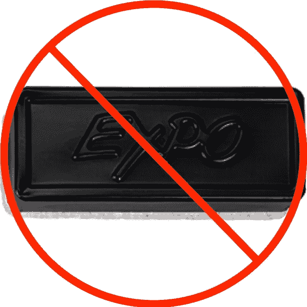

# 悲伤:软件工程师被迫徒手擦除白板上的代码

> 原文：<https://medium.com/hackernoon/sad-software-engineer-forced-to-erase-code-from-whiteboard-with-bare-hands-1e4553ee4c72>

当地软件工程师麦肯齐·贝丝(Mackenzie Beth)煞费苦心地在白板上写下了一个简单的数独解算器实现后，她惊恐地发现房间里没有橡皮擦，这时她听到面试官说了一句可怕的话:“好吧，现在让我们优化一下。”

“什么，这双手永远不会干净吗？”贝丝低声咕哝着，开始擦掉代码，她的面试官平静地看着。在用手掌擦了擦之前干净的白色 t 恤后，她继续说道，“看，我并不是说白板访谈违背了编码本身的本质。但是，”她举起一只完全沾满红色记号笔的手说，“你不得不承认这是噩梦。”

截至发稿时，有消息称贝丝已经开始大喊“出来，该死的斑点！”在睡梦中在空白白板上摩擦。