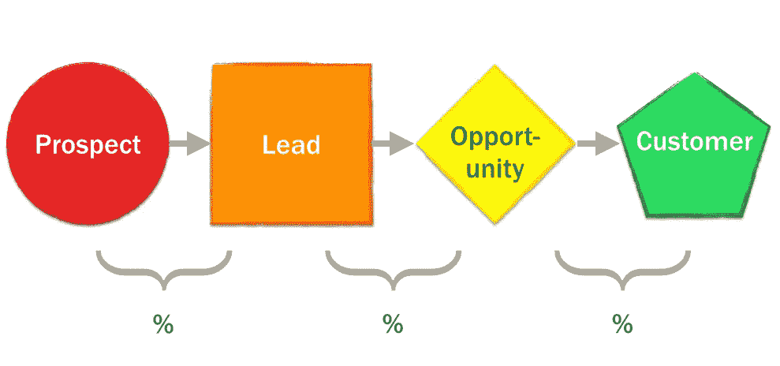

# 工程师销售 101:功能介绍

> 原文：<https://medium.com/hackernoon/sales-101-for-engineers-6fcd1b49cffa>

## 销售人员实际做什么，使用什么型号

*编程注意事项:本帖是 GTM 主题系列中长度不定的 n 篇，主要面向* [*初创*](https://hackernoon.com/tagged/startup) *人群，主要是领导，主要来自非 GTM 背景。末尾有一个列表。*

# **为什么销售**

*   我们需要赚钱来维持经营，为我们的员工和他们的家人提供衣食和健康保险
*   在正确的时间以正确的方式要钱是一种技巧
*   谈判合同是一种技能
*   我们需要“鉴定”任何给定的人或组织是否是现实的潜在客户
*   我们需要了解潜在客户的组织，因此我们知道谁需要说服，谁是最终买家，谁是用户和影响者，以及谁可以破坏交易
*   我们需要将我们的价值与各方的关注点、需求和目标相匹配
*   我们需要用证据和工具武装我们的支持者，让他们支持我们的价值，或者在没有支持者的地方创造支持者
*   我们需要找出并消除或推迟对购买的异议
*   我们需要了解客户的购买流程，以便在与我们做生意时提供良好的体验，例如，了解采购团队要求填写特定的表格并主动填写
*   我们需要预测企业下个月、季度、年将产生多少收入，以便决定雇佣多少人等等

销售的根本目的是要钱，并得到钱——不管是来自第一次接触产品的新潜在客户，还是来自续订期的现有客户，还是来自寻求销售你产品的合作伙伴。

以下内容首先按照功能进行组织，然后是销售模式、一些杂项考虑，最后是术语的非正式定义(您可能想先阅读一下！)和一份阅读清单。

# **从功能上讲——售前**

## *销售发展*

这是与潜在客户互动并过滤掉那些应该引起销售注意的客户的行为。包括但不限于:

*   呼入:将来自任何来源的销售线索视为可接受的销售关注(SAL)
*   外向:联系潜在客户推销产品并确认他们(潜在客户->SAL，甚至可能是 SQL)，通常称为“潜在客户”
*   为销售代表和/或销售工程师安排会议，他们将拥有“客户经理”、“解决方案经理”、“解决方案”、“销售”等头衔
*   发现:了解有关销售线索的相关信息，如正在使用/评估的技术组合和竞争产品——基本上是一项鉴定活动
*   做演示:演示的深度取决于产品的性质

销售发展专业人员被称为销售发展代表(SDR)，有时，令人困惑的是，业务发展代表(BDR)。他们实际从事的活动范围因公司而异，取决于规模、销售模式、客户角色、销售主管的行事风格以及其他因素。

销售开发有时外包给第三方，他们在与销售线索互动时充当公司的员工，外包的呼叫中心员工承担员工的身份。

## *内线销售*

利用以下销售线索进行销售..入境。

实际上，这通常意味着一个由[营销](https://hackernoon.com/tagged/marketing)驱动的漏斗，各种程序和策略“促使”人们访问网站，填写联系表格，开始免费试用，等等。在某种程度上，经过一定的资格审查后，这些销售线索被移交给销售人员或由销售人员挑选出来。

在拥有独立专业销售团队的大型组织中，您可能会有内部销售代表(ISR)。特别提款权可能是内部销售团队的一部分。您也可能有坐在 ISR“之上”的 AE。

在一个非常大的、组织严密的组织中，销售线索沿着人员管道传递，可能看起来像营销> SDR > ISR > AE > AM。

## *外部销售*

利用以下销售线索进行销售..不向内。😃

在实践中，这通常意味着一个外联驱动的漏斗，营销和/或销售人员采用外向策略来接触潜在客户，将他们转化为销售线索。包括但不限于:

*   挖掘 LinkedIn，寻找看起来像现有客户或现有线索的潜在客户，等等
*   购买符合某些人口统计、公司分类等的联系人名单
*   使用拥有专有清单的外包公司来完成上述工作

工程师们通常对这种策略深恶痛绝。

在拥有独立的专业销售团队的大型组织中，您可能会有外部销售代表，他们的头衔很多，包括 BDR 和 AEs。特定于外部的特别提款权有时被称为 BDR。

## *业务发展*

有时这只是对外销售。但更多时候，这是发展销售伙伴关系的行话，这样第三方，如咨询公司，要么帮助销售，要么直接销售产品。

## *战略销售*

“战略”是“大”的委婉说法。战略销售通常是一项专门的职能，用于处理非常大的客户和交易，销售周期可能长达数月至数年，涉及多个部门和地区，以及许多级别的合同和谈判。一般需要一些专门的经验。

有时是“企业销售”的同义词

## 企业销售

销售给..“企业”，即大公司。在较大的公司，通常有专门的企业销售代表或团队。销售周期往往很长，处理大客户时，需要说服多层人员并跨越采购障碍，通常需要一些专业经验。

## *渠道销售*

这曾经是各种销售渠道的通称，包括直接销售给顾客。但随着时间的推移，这意味着找到一个特定的销售渠道，通常是通过某种合作伙伴，这是间接的。包括但不限于:

*   通过合作伙伴销售:合作伙伴销售你的产品，但你预订销售。或者合作伙伴卖了你的产品，然后转身以一定的折扣从你这里购买。或者*上面的许多*变种。
*   向合作伙伴销售，然后由合作伙伴转售你的产品。
*   通过某种市场销售，市场参与你的产品营销，并可能在每笔交易中获得一定的利润(通过佣金或回扣)。

# **从功能上讲——售后**

## *账户管理*

在销售线索成为客户后，销售代表通常会完成工作，然后继续完成下一笔交易。客户管理是确保销售线索成为客户后获得良好体验并维护客户关系的过程，即确保客户不会流失。包括但不限于以下内容:

*   入职
*   技术支持
*   访问路线图和工程师
*   管理续订和扩展
*   向客户销售其他产品/服务

在大公司里，客户经理是一个专门的角色。在产品技术性或工程性很强的情况下，术语技术客户经理(TAM)是常见的。

有时，客户管理被重新称为客户成功(CS)，其角色是客户成功经理(CSM)。

客户管理团队通常会从续约或扩张带来的收入中获得报酬，至少是部分报酬。有时候和售前销售人员一样多，有时候没有。

有时，扩展机会由售前销售代表“拥有”,他们从向现有客户销售新产品中获得佣金。

## *客户成功*

有时候“客户成功”只是一个更名后的账户管理功能。

其他时候，客户成功是其自己团队的专长，不报告给销售，也不根据产生的收入来衡量或奖励，而是根据客户的幸福或健康来衡量。

## *更新和扩展*

顾名思义:这是一个密切关注一个账户的过程，目的是确保其更新，或者在一个账户中寻求扩张机会。

# **从功能上讲——销售支持**

## *销售工程*

销售代表通常不精通技术，因此销售工程提供销售过程中所需的技术知识。实际上，这包括以下内容:

*   做演示
*   回答技术问题
*   帮助进行技术入职培训，例如安装和配置进行概念验证所需的一些代码，尽管这有时是一项专业职能，有不同的名称，如“集成工程”或“客户成功工程”等

销售工程师(se)可能没有任何工程或科学背景，因为许多公司的核心职能是做演示和解释产品功能。产品的技术性越强，SEs 的技术性就越强。

这通常是售前职能。

## *解决方案架构*

解决方案架构(通常)是销售工程的售后版本。解决方案架构师(sa)向现有客户提供一定数量的技术专业知识，以帮助客户管理的技术方面，或者帮助他们解决可用产品的特定用例，等等。

这实际上可能只是为续订和扩展做 SE 工作。但是，它也可以交付来自现有客户的新产品需求，试图解决新的用例或整合新的“解决方案”，如现有产品加上一些专门定制的组合。

“解决方案”角色有时既是售前也是售后。

一个有趣的例子是 Palantir 的[前沿部署工程](https://www.quora.com/What-is-the-difference-between-Palantirs-Forward-Deployed-Engineer-and-Forward-Deployed-Software-Engineer-positions)角色，它实际上是 SA 减去销售重点(可能不通过销售进行汇报)加上更大的集成和支持/培训重点。

当必需或要求的入职、集成和培训工作变得过于广泛时，您会发现自己处于专业服务(ProServ，PS)领域。这是一个信号，要么产品需要一个*吨*的 UX 爱和/或它的时间来建立一个新的团队，以支持 PS 作为一个新的收入来源。

## *销售支持*

销售支持是指提供销售过程中所需的所有培训、文档和资产。包括但不限于:

*   关于产品和功能的销售培训(持续进行)
*   数据表、产品比较和案例研究等“资产”
*   定价计算器、业务案例生成电子表格和异议处理文档等“工具”

销售支持通常是一项产品营销职能，但也可以是销售团队中它自己的角色。

## *销售运营*

销售运营是运行销售渠道的技术和运营方面。这包括选择、购买、构建、运营、扩展和替换(必要时)所有与销售流程相关的技术和流程。包括但不限于:

*   客户关系管理(CRM)工具
*   销售自动化:电子邮件自动化、呼叫路由、日历安排、安全文档存储和共享、销售线索路由、销售线索归属、销售线索资格、营销活动归属、营销自动化集成、数据清理、文档签名
*   列表构建和购买
*   报告:KPI 建立、调整、跟踪、可视化和报告生成
*   有时销售补偿计划和调整

# **型号**

有一些不同的，典型的销售模式在软件中使用，尤其是 B2B SaaS(我的专业领域)。

## *自助服务/产品导向*

这就是销售线索主要靠自己变成客户的地方。所以你的广告，SEO，网站，免费试用等。，为您和客户做所有的销售，将信用卡信息输入到表格中，以便直接购买。

根据产品和业务模式的不同，纯粹的自助服务通常是不可能的。因此，网站上出现了聊天泡沫，售前“成功”团队或机器人为他们配备了人员。以任何其他名称销售…

## *销售主导*

销售人员通过[漏斗](/@aneel/marketing-102-for-engineers-ddf3b7fa61e6)移动销售线索，并积极引导他们成为客户。

## *土地和扩张*

旨在达成小交易[土地！]然后随着时间的推移增加使用量或向客户销售额外的东西[expand！].

## *捕鲸*

追求大客户的大交易。这通常包括说服整个公司或团队开始使用你的产品，或者用你的产品大规模替换其他产品。有时与“企业销售”或“战略销售”同义。通常自上而下。

## *现场销售*

“领域”是划分你的市场(潜在客户群)的任何方式，但通常是按地理位置划分的。因此，这是在特定区域内的销售，通常包括举办当地活动等。

## *干杯*

说服个人用户，并以此为证据来说服整个团队或公司。

这是一个典型的 SFDC 案例，产品定价在单个销售人员的费用限额内，然后当有足够的单个使用量时，将所有这些许可证(有批量折扣)打包出售给管理层。

## *自上而下*

说服管理层应该使用某个产品，然后为他们的团队选择该产品，即从上面强制实施。与捕鲸密切相关。

# **流程**

有一些非常正式的流程可以在大型销售组织中使用。你拥有什么样的过程，以及过程的数量，将高度依赖于你的团队的规模和你的销售领导的倾向。

参见 [MEDDIC 和 BANT](https://blog.hubspot.com/sales/ultimate-guide-to-sales-qualification#anum_faint_champ) 。

# **杂项**

销售人员有时被称为“硬币操作的”，即高度薪酬驱动。因为大部分销售收入是基于基本工资之外的东西，操纵这些变量是改变销售行为以达到预期结果的一种方式。

*举个例子！*

在客户成功加入并在一段时间内保持客户身份之前，保留一定比例的佣金被认为可以激励销售人员不再与不适合该产品的客户达成交易。

如果你不知道自己在做什么，事情会变得非常糟糕。

# **什么时候开始**

一旦你有了解决问题的可行方案，并把它放在验证它的人面前，就要钱——不管是你自己还是通过产品或网站。

在非自助领域:如果你不擅长要钱，学学**。或者找个销售人员。如果你设法从少数人那里拿到钱，找一个销售人员。**

# ****如何****

**我将重复我所说的关于[营销](https://hackernoon.com/marketing-101-for-engineers-ee9e7fcb1a51)的内容。**

**不管是好是坏，大部分销售都是有基础的。这需要大量的体力劳动、大量的反复试验和不断的实验。**

**更多的人将需要大量的工作、指导和教育，然后不再购买你的产品..超乎你的想象。对于销售人员来说，学会如何尽早取消资格，并且不在上面花时间，是一项生死攸关的技能。**

**有时候，联系那些愿意使用你的产品来解决他们的问题的人的唯一方法就是打电话给他们。有人会抱怨。有些人会很开心。很多人不会在意。对外销售策略可能对你个人不利；克服它。**

# **非正式定义和解释**

*   ****嫌疑人**:进入你网站的人，或者你在营销/销售过程中遇到的人，比如在会议的展位上**
*   **潜在顾客:可能对购买感兴趣的人。**
*   ****导语**:可能对购买有兴趣的人(注意概率增加)。**
*   ****原始销售线索:**不合格的销售线索，即嫌疑人或潜在客户**
*   ****客户:**(不幸的是)与嫌疑人、潜在客户、原始销售线索、销售线索、MQL、SQL 和客户互换使用**
*   ****资格**:逐步确定给定潜在客户/潜在客户愿意、能够和可能购买的可能性的行为**
*   ****取消资格**:确定某个潜在客户/潜在客户*不*愿意、能够和可能购买的行为**
*   ****合格营销主管(MQL)** :可能对购买有一定兴趣的人，并且来自合适的组织，或者有合适的职位，或者通过查看文档、点击定价页面和填写表格等方式表现出积极的兴趣。MQLs 是一个常用指标，用于衡量营销团队开展的需求挖掘活动(“计划、活动、策略”)的有效性。**
*   ****产品合格销售线索(PQL)** :在自助销售领域，通过在免费试用、免费增值版中与产品互动的行为，甚至在成为其所在层级的客户后(例如“PQL-ed for a upgrade offer”)成为合格销售线索的人。**
*   ****销售接受的销售线索(SAL)** :已被验证为有足够的购买可能性由销售代表积极处理的 mql——SAL 资格是营销和销售团队之间关于营销活动带来的销售线索的*质量*和销售组织用于验证销售线索的流程的*严格性*的争论点。**
*   ****销售合格的销售线索(SQL)** :销售代表能够肯定地说销售线索有该产品可以解决的问题、解决该问题的愿望以及通过购买该产品来解决问题的预算/权限，在这种情况下，销售合格的销售线索(SQL)在销售团队中可能是一个争论点，通常会使用非常严格、正式的定义(并被忽略)。**
*   ****机会(Opp 或 Op)** :超出 SAL 且可能超出 SQL 的某种资格级别—机会通常分为多个阶段，例如“阶段 2 机会”，这与销售线索类型的正式定义有关，例如 SQL ==阶段 2 机会。**
*   ****取消资格(DQ)** :表明销售线索不合格。**
*   ****企业**:需要大量工作才能卖给的大公司——内涵通常是“古老”或者“不现代”，但现实中像 Square、脸书这样的公司都是企业。**
*   ****目标收益(OTE)** :销售人员的薪酬计划，包括基本工资和任何佣金结构，有时还包括预期的绩效奖金——但不包括像奖金这样的东西(见下文)。**
*   **佣金:销售人员在收入的基础上赚取的额外收入。佣金可以随时支付，但通常按季度计算和分配。它们可能包括一些“收回”佣金或奖金的条件，例如，如果客户在续约之前取消合同。它们可能包括一定比例的有条件预扣，例如，根据预订情况完成交易时，您将获得交易佣金的 75%，如果客户在合同期限结束时没有取消(或者可能只有在他们续约的情况下)，您将获得剩余的 25%。**
*   ****Spiff** :针对特定交易或交易类型的额外奖励，通常用于产生超出标准的非常具体的销售结果，如试图在特定垂直市场内建立市场。这并不局限于某个组织，例如，你可以贿赂合作伙伴的销售代表。**
*   ****沙袋**:低估一笔特定交易的预期价值，或一段时间内预期预订的整个管道——即故意设定一个非常低的标准。**
*   ****配额**:根据销售代表带来的收入金额为销售人员设定的管理期望，通常每季度陈述并重新评估一次，但也可以每月一次或每年一次——通常仅适用于客户经理(AE ),但也可能以某种直接或间接的方式应用于 SDR、se、tam 和客户成功。多次或持续未能满足报价通常意味着人们将被解雇，这可能是销售管理人员也可能是员工。**
*   ****配额报废**:达到您的配额，通常表示为占总配额的比例，例如“X 在季度的第一个月报废了其报价的 50%。”**
*   ****配额放宽**:出于多种原因放宽特定配额。**
*   ****交易**:与特定客户的特定交易。**
*   ****客户获取成本(CAC)** :销售总额&获取付费客户的营销成本**
*   ****回收期**:客户在盈利前付清 CAC 的时间(这有点天真，因为维护/支持客户的持续成本应该考虑在内，但很少在客户层面进行，而是更像是总体 COGS 资产负债表项目的底线)**
*   ****【客户】终身价值(LTV)** :客户作为您的客户期间，预期产生的总收入(假设所有客户最终都会流失)**
*   ****(ACV)**年度合同价值:听起来确实如此**
*   **平均销售价格:听起来确实如此**
*   ****交易管理**:从开始到结束对交易的项目管理，这可能需要一个专门的人——例如，对于涉及多种产品、合作伙伴、专门条款和复杂合同等的大额交易。**
*   ****销售周期**:从交易进入渠道开始到完成交易所需的时间。**
*   ****销售效率**:投资回收期的倒数，衡量销售(和营销)产生收入的效率。**
*   ****Pipeline** :在销售组织的任何级别预测的所有交易的金额，即每个销售代表都有一个 Pipeline，但他们的团队和整个销售组织也有。**
*   ****Firmographics** :以销售和营销为目的的组织的人口统计数据，例如“拥有> 100 名员工和 C 轮或更多资金的中端市场金融科技公司”。**
*   ****概念验证(POC)** :试用期，有时由潜在客户付费(付费 POC)。POC 通常很长，或者是专门为客户定制的。通常包括客户在实际生活中为特定用例使用产品，并致力于任何相关的集成工作。这些通常是为了有明确的结果和承诺。付费 POC 经常被初创公司作为“客户”进行营销，我称之为“标准废话”。**
*   ****技术决策者(TDMs)** :潜在客户的人，他们必须判断你的产品在技术上是否可靠，是否适合他们的用例或问题。**
*   ****商业决策者(bdm)**:潜在客户的人，他们必须判断你的公司或价格是否合理，是否值得购买..通常与“买方”同义。**
*   ****影响者**:潜在客户中对决策过程有重大影响的任何人。**
*   **买家:有预算和购买权决定买你的东西的人。**
*   ****异议**:潜在客户提出的任何问题，无论是技术方面的还是其他方面的，关于他们可能不购买该产品的原因。**
*   ****异议处理**:处理异议，通常具体化为销售团队使用的内部常见问题解答和指南。**
*   **数据表:提供产品亮点的文档，包括产品如何工作、集成了什么、缩放等。**
*   ****商业案例**:购买你的产品的正式成本收益分析，通常由销售代表在说服 BDM 说“是”的过程中构建和交付。**
*   ****行动手册**:一套针对销售人员的指南，其中包括一些类似这样的内容——向 X 销售时，比如说 Y，如果你遇到竞争对手，比如说 O，在 TDMs 中使用 Y 字，在 bdm 中使用 Z 字，追求垂直行业 A-C，在规模上< J 个单位，你最多只能打折 K%。**

## **本系列中的文章(和模板)**

*   **[工程师营销 101:功能介绍](/@aneel/marketing-101-for-engineers-ee9e7fcb1a51)**
*   **[工程师营销 102:打造漏斗](/@aneel/marketing-102-for-engineers-ddf3b7fa61e6)**
*   **[工程师营销 201:信息传递&定位](/@aneel/marketing-201-for-engineers-b28147fdb59d)**
*   **[面向工程师的营销 202:发布](/@aneel/marketing-202-for-engineers-launching-9437aa0e4961)**
*   **[工程师市场营销 203:销售支持](/@aneel/marketing-203-for-engineers-sales-enablement-e47662ca996a)**
*   **[工程师市场营销 204:产生需求](/@aneel/marketing-204-for-engineers-generating-demand-27200085320c)**
*   **[工程师营销 301:战略&策划](/@aneel/marketing-301-for-engineers-strategy-planning-2e4473fcc879)**
*   **[工程师市场营销 302:招聘营销人员](/@aneel/marketing-302-for-engineers-hiring-marketers-a3a6d4355a03)**
*   **[面向工程师的营销 303:定价框架](/@aneel/marketing-303-for-engineers-pricing-frame-aa71c8860a2b)**
*   **工程师的营销 401:GTM 的阶段**
*   **[针对工程师的营销 402:诊断&故障排除](/@aneel/marketing-402-for-engineers-diagnostics-troubleshooting-d946a337c258)**
*   **[工程师营销 403:解答创始人常见问题](/@aneel/marketing-403-for-engineers-office-hours-bf4d2d0b5f56)**
*   **[工程师销售 101:功能介绍](/@aneel/sales-101-for-engineers-6fcd1b49cffa)**
*   **[针对工程师的 PR 101](/@aneel/pr-101-for-engineers-7cd116cc5347)**
*   **[面向工程师的分析师关系 101](/@aneel/analyst-relations-for-startups-101-ea9338cb13ed)**
*   **[基本消息模板【谷歌文档】](https://docs.google.com/document/d/1neA71qCSeV3xH1Dpbtcy67m3v2ETmmB_Qq02ckkKUiQ/edit?usp=sharing)**
*   **[基本漏斗指标模板【谷歌表单】](https://docs.google.com/spreadsheets/d/11r4tHm_es6Tl4DItNUc_KzNdyvrmbbRmb38CJPLCvRU/edit?usp=sharing)**
*   **[基本发布时间表模板【谷歌文档】](https://docs.google.com/document/d/13Zscb5sX9ggjpWf05Ka-oj5wulC3Kb9z0LyMEQesnzM/edit?usp=sharing)**
*   **[基本战斗卡模板【谷歌文档】](https://docs.google.com/document/d/1dOCKhE1Ufmwp7bXeQTBCkST7NPwiCPJ2oyWEdpQut1g/edit?usp=sharing)**
*   **[详细战斗卡模板【谷歌文档】](https://drive.google.com/open?id=1EC3Lq6Z_IVrZKR4-jHgnc5-e3krZw4bA5Z-HAOJlH10)**
*   **[基本营销日历模板【谷歌表单】](https://docs.google.com/spreadsheets/d/1nXr0IqwnhQsUi_D83ecPXsIyDdiTkpNZ66piRkayPsA/edit?usp=sharing)**
*   **[基本营销阶梯模板【谷歌表单】](https://docs.google.com/spreadsheets/d/17EfTQp_21WomJ9cwiM4ian9M2QRcbM17_d3DilGNThY/edit?usp=sharing)**

## ****阅读列表****

*   **[Tomasz Tunguz 的销售博客文章](http://tomtunguz.com/categories/sales/)(顶部图片来自那里)**
*   **[马克·苏斯特的销售博客文章](https://bothsidesofthetable.com/tagged/sales)**
*   **[首轮资本的销售杂志](http://firstround.com/review/sales/)**
*   **[创业公司❤客户](http://startupsheartcustomers.com/)**
*   **HubSpot 的销售博客帖子**
*   **鲍勃·廷克的 GTM Fit [演讲](https://www.youtube.com/watch?v=IsuZzi-Hm3A&list=PLcnNOJoVRnjUmenBf9bAFE2qIxhSgECvx&index=2)和[幻灯片](https://www.slideshare.net/SurvivalToThrival/go-to-market-fit-summit)**
*   **[内森·巴里:SaaS 创业公司的直销:从 1300 美元到 725000 美元 MRR](https://nathanbarry.com/sales/)**
*   **[影响:说服心理学](https://www.amazon.com/Influence-Psychology-Persuasion-Robert-Cialdini/dp/006124189X)**
*   **[预说服:引导对变更的关注](https://www.amazon.com/Pre-Suasion-Channeling-Robert-Cialdini-Ph-D/dp/150822319X)**