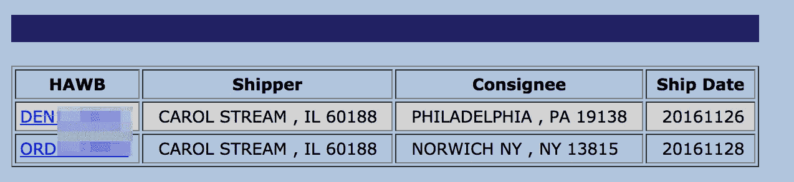
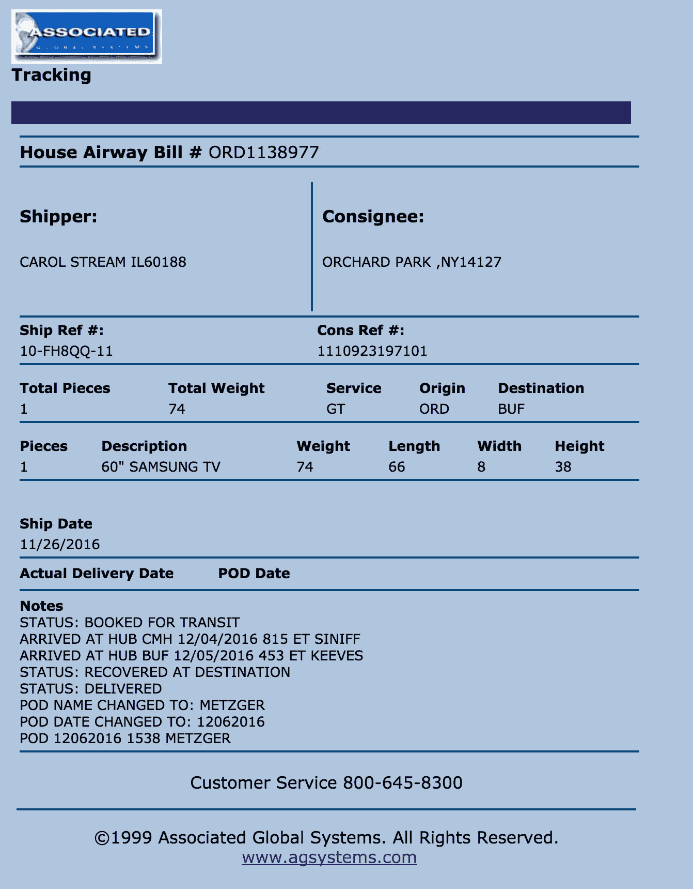
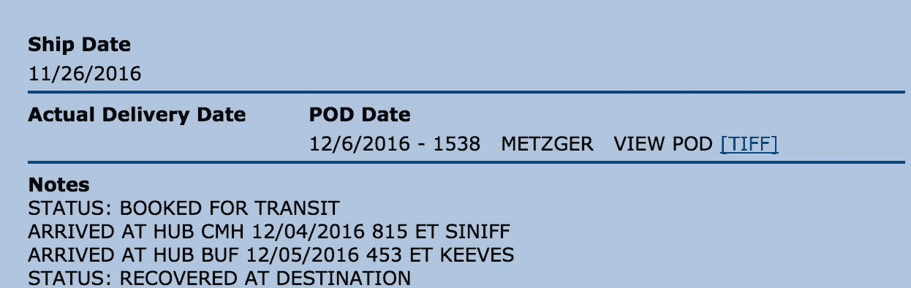
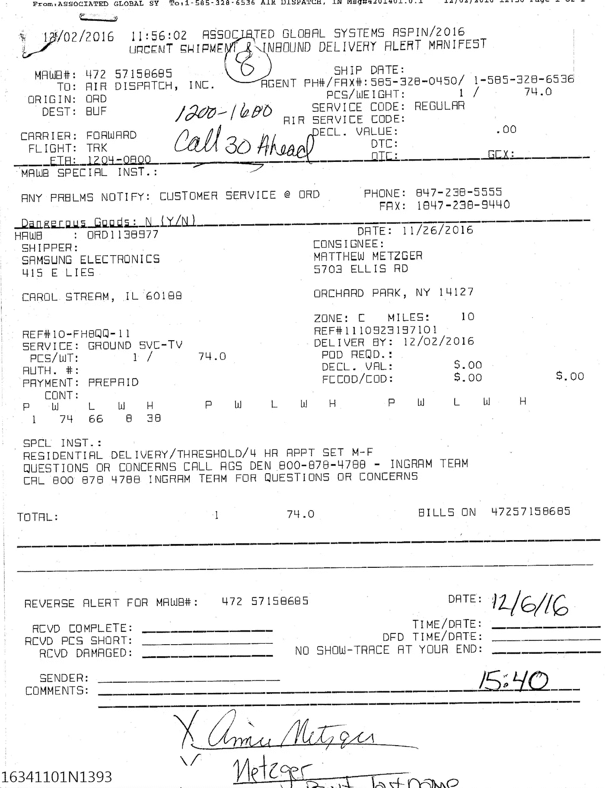
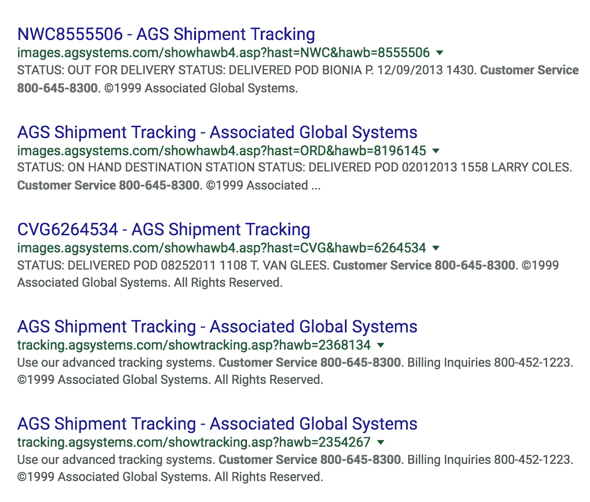
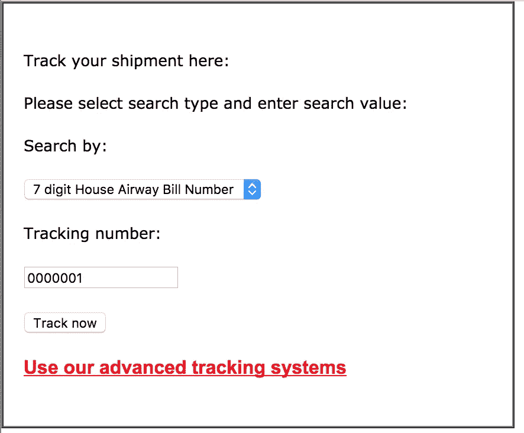
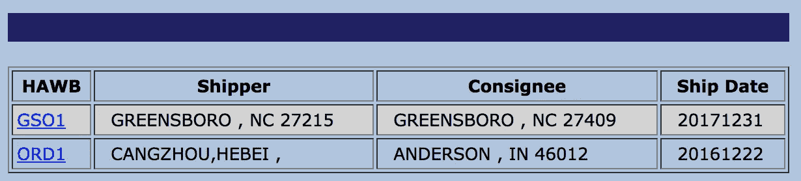

# 三星泄露客户信息

> 原文：<https://medium.com/hackernoon/samsung-leaking-customer-information-9b7e2dcb006d>

大约四个月前，我直接从三星的[在线商店](http://www.samsung.com/us/)订购了一台新电视。几天后，我通过电子邮件收到了一个跟踪链接。

```
http://www.agsystems.com/listhawb.asp?searchtype=hawb&searchvalue=1138977
```

# 重复使用跟踪号码

当我第一次收到链接时，它显示的订单不是我自己的。我以为是某种笔误，但我当时太忙了，没有联系三星。当我当天晚些时候回来查看时，现在在三星发给我的链接上显示有两个*订单——我自己的和另一个订单。*



Example tracking results showing multiple orders. Order numbers obscured because these are not my orders — not that it makes much of a difference (you’ll find out why below)

我有点担心我的跟踪号码显示有两个订单，所以我联系了三星公司，了解这是怎么回事。我收到了以下回复。

> 我知道你担心自己的行踪。AGS 每年都会回收他们的跟踪号码，这就是为什么你会在同一个跟踪号码下看到不止一个订单。您的跟踪信息已更新，并且是第一个列出的。对于可能影响您使用三星产品的任何不便，我们深表歉意。我们三星感谢您的业务，我们真诚地希望这种情况不会阻止您继续购买三星品牌的产品。如果您有任何其他问题或顾虑，请给我发电子邮件回复。

这似乎有点奇怪——三星告诉我不要担心这个，他们的发货商只是每年重复使用跟踪号码。这些订单显然是相隔几天发货的。

# 泄露订单信息

当我点击其中一个 HAWB(众议院空运法案)链接时，它把我带到了我自己订单的跟踪详情。



There sure is a lot of information about me there…

这确实是我的命令。一台 **60 英寸三星电视**运送到**纽约州果园公园**，POD(交货证明)**梅茨格**。它甚至还有我在三星网站上的订单号( **11109231971** )。对于未经认证的用户来说，这看起来有太多的[信息](https://hackernoon.com/tagged/information)要公开。

等一下……那个页面上不是有两个链接吗？我回到页面(三星*发给我一个*的链接)，点击了另一个 HAWB 链接。现在，我正在查看其他人订单的所有相同订单信息。(*我有点嫉妒，他们订了更大的电视。*)

如果三星给我发了一个链接来查看其他人的订单，那么那个人肯定也能看到我的订单。

# 可枚举的跟踪 id

这已经相当令人失望了。有人需要的只是三星发给我的跟踪网址，他们就能看到我的很多订单明细(还有别人的订单明细)。

在某些情况下，应用程序使用敏感功能的秘密网址(即。通过电子邮件发送的密码重置网址。)这不是那种情况。我的追踪网址肯定是用同样的 ID 发送给了别人——它已经失去了任何保密的概念。

即使其他人没有收到相同的跟踪 URL，这个链接仍然不能被视为秘密。请注意，该链接唯一特殊的部分是一个相对较小的整数(1138977)。此外，三星告诉我，发货人“*每年都会回收他们的跟踪号码”*这一事实表明，这些 id 是按顺序分配的。

它所需要的是*的知识，一个*的跟踪网址，你可以遍历所有的跟踪 id 顺序。通过大约五分钟的脚本编写，有人可以收集每一批三星产品的数据，得到:

*   订购者的姓氏
*   订购者的城市
*   订购的项目
*   序号

# 利用数据

让我们想想，仅仅是把这四条信息泄露给心怀不轨的人，会有多危险。因为我们有一个姓氏和城市，所以快速的互联网搜索会产生订购者可能的电话号码。

一旦我们有了一个潜在的电话号码列表，我们就戴上社会工程的帽子，给每一个人打电话。

```
Hello, this is Bob from Samsung. Can I please speak with Mr. **Metzger** regarding his recent order for a **60" Samsung TV**.
```

如果他们说他们没有点任何东西，挂断电话，然后继续下一个电话号码。如果听起来好像他们知道我们在谈论什么，提供更多的信息，让他们知道这个电话是合法的。

```
Just to make sure I'm looking at the right order - would you mind confirming that your order number is **1138977**?
```

我们已经迈出了[的第一步](https://en.wikipedia.org/wiki/Foot-in-the-door_technique)，我们已经明确表示我们是合法地从三星打来电话(骗子肯定不知道他们的订单号和他们订购了什么？)

是时候利用这种信任，通过一个无法拒绝的提议来提取支付细节了。

```
**-> If they ordered a small tv:** We're sorry for the inconvenience - there has been an accident at our shipper's facility, damaging an entire shipment of **50" TVs**. It will be approximately two weeks before we have more of this model in stock. As a consolation, we would like to offer you an upgrade to a 65" TV - which we currently have in stock - for $49.**-> If they ordered a large tv:**
We're sorry for the inconvenience - due to a glitch in our online store, our promotional warranty prices weren't showing for your model when you made your purchase. Your model is eligible for a 3 Year Accidental Damage Plan for only $29\. **-> If they took the bait:**
Great! Sorry again about the inconvenience. We'll just need your payment information again - we don't keep records of it when you order because PCI compliance.
```

你明白了——把这四条信息变成一次相当有说服力的社会工程攻击是非常容易的。

# 泄漏越来越大

在我的电视被送到后，我回去检查跟踪状态——希望这只是运输途中的短暂泄漏，在我收到货物后消失。

我发现恰恰相反。不仅订单信息还在，而且现在还有一个 TIFF 文件的链接。



Hmm… they added a link to a TIFF file…

那份 TIFF 文件原来是这次送货的*签名*运单的扫描件。



Oh wow, there’s even more information about me.

他们已经泄露了足够的信息进行社会工程攻击——现在他们泄露了更多的信息。

*   我的全名是
*   我的*完整*地址
*   我的签名(实际上是我妻子的)

# 能见度

所有这些信息都是直接从三星发给我的一个链接中获得的——但是你没有*从三星买东西来找到跟踪系统的链接。原来谷歌已经索引了一些空运账单的查询。*



Note: This method of finding tracking links is much cheaper than buying a TV and waiting for it to ship

即使运输公司从谷歌上删除了这些，找到这些物品仍然不是太难。他们有一个表格来搜索跟踪号码。



This convenient

表格清楚地表明这应该是一个七位数。从 **0000001** 开始，我们将看到熟悉的搜索结果:



在这一点上，毫无疑问——这个系统中的信息是*而不是*秘密。链接被直接发送给消费者，链接在谷歌中被索引，并且在网站上有一个用于执行搜索的开放表单。

# 三星的回应

我不喜欢所有这些信息都免费提供给任何愿意花几分钟收集数据的人，所以我再次回复了三星。我告诉他们，我的个人信息正在通过他们的托运人网站共享。我包含了对每条信息的描述，并有直接链接。我还告诉他们，数据很容易被枚举，因为它使用顺序 id——我要求他们加入他们的信息安全团队。

两周后，我收到了三星的回复:

> 我知道你想把这个转发给我们的安全小组。你的请求需要和 AGS 讨论。你需要通过 AGS 删除你的信息。对于可能影响您使用三星产品的任何不便，我们深表歉意。我们三星感谢您的业务，我们真诚地希望这种情况不会阻止您继续购买三星品牌的产品。

就是这样。三星说我需要向他们的发货人提出。

这是不可能的。我把我的数据委托给了三星，我认为是他们全权负责保护这些数据。如果三星的商业伙伴泄露了这些信息，三星需要补救这种情况。

当我写这篇文章时，我打算修改我的一些信息(或者至少是我妻子的签名)，但这不会有太大的影响。在我向三星披露这一信息的四个月后，这些信息仍然存在，任何人都可以检索。请不要试图向我推销我的电视机的保修。

[](http://bit.ly/HackernoonFB)[](https://goo.gl/k7XYbx)[](https://goo.gl/4ofytp)

> [黑客中午](http://bit.ly/Hackernoon)是黑客如何开始他们的下午。我们是 AMI 家庭的一员。我们现在[接受投稿](http://bit.ly/hackernoonsubmission)并乐意[讨论广告&赞助](mailto:partners@amipublications.com)机会。
> 
> 如果你喜欢这个故事，我们推荐你阅读我们的[最新科技故事](http://bit.ly/hackernoonlatestt)和[趋势科技故事](https://hackernoon.com/trending)。直到下一次，不要把世界的现实想当然！

