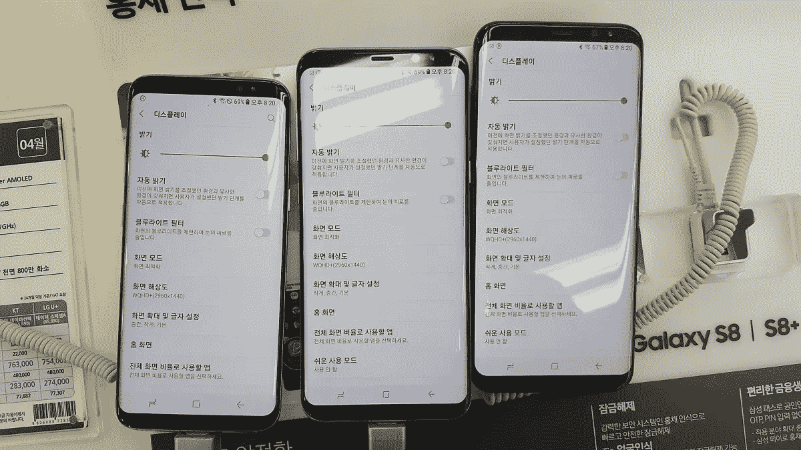

# 三星将发布针对 Galaxy S8 红色问题的软件补丁

> 原文：<https://medium.com/hackernoon/samsung-to-release-software-patch-for-galaxy-s8-red-tint-issue-b7fc2e7a2767>

备受期待的三星 Galaxy S8 发布已经四天了，总体反应相当积极。这款手机首次采用 Infinity 屏幕、全玻璃机身和无线充电，自 4 月 21 日发布以来获得了相当高的好评。事实上，许多人推测这款手机有机会与 IPhone 7 竞争，而且价格也便宜得多。然而，在过去的几天里，三星似乎被抓了个正着——或者说是红屏——许多新用户声称 S8 有一个非常独特的软件漏洞。

显然，你不需要为这款手机戴上玫瑰色的眼镜，因为它已经在屏幕上染上了红色，而且这种红色似乎不会很快消失。尽管三星声称手机中没有软件漏洞，并发表了一份简短的声明，鼓励个人进入他们的[设置以改变屏幕颜色](http://bgr.com/2017/04/19/galaxy-s8-red-tint-screen-issue/)，但他们选择昨天也宣布了一个软件补丁，该补丁将在未来几周内发布，可能会解决这个小问题。

虽然这个问题看起来似乎是一个相当大的问题，但事实是它似乎只出现在某些 S8 手机上，而大多数用户都没有经历过屏幕颜色的任何缺陷。最重要的是，体验过红色调的用户说,[只有在白色屏幕](https://arstechnica.com/gadgets/2017/04/samsung-galaxy-s8-to-get-software-patch-for-red-tint-issue/)上才能看到，比如脸书，因此，对于一部相当棒的手机来说，这是很小的代价。

到目前为止，无数的科技网站已经对新款三星 Galaxy 手机进行了评测，所有的网站都给予了非常积极的评价，在性能、耐用性、功能和响应性方面给了这款手机将近五颗星。尽管三星 Galaxy Note 7 获得了相当负面的评论，并且通过[三星智能冰箱](http://www.networkworld.com/article/2976270/internet-of-things/smart-refrigerator-hack-exposes-gmail-login-credentials.html)泄露了谷歌账户凭证的轻微黑客事故，但这家科技巨头似乎已经恢复了元气，并准备仅在今年就推出一些相当惊人的技术。

目前，Galaxy S8 屏幕的颜色没有什么可“变红”的，据说即将推出的软件补丁可以解决这个小问题，这款手机被认为是该公司迄今为止最好的手机。毕竟，如果手机的最新功能对你来说不够酷，我们能不能再多欣赏一会儿屏幕呢？

> [黑客中午](http://bit.ly/Hackernoon)是黑客如何开始他们的下午。我们是 [@AMI](http://bit.ly/atAMIatAMI) 家庭的一员。我们现在[接受投稿](http://bit.ly/hackernoonsubmission)，并乐意[讨论广告&赞助](mailto:partners@amipublications.com)机会。
> 
> 如果你喜欢这个故事，我们推荐你阅读我们的[最新科技故事](http://bit.ly/hackernoonlatestt)和[趋势科技故事](https://hackernoon.com/trending)。直到下一次，不要把世界的现实想当然！

