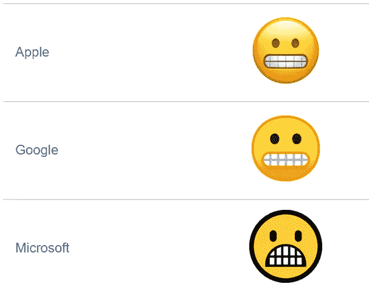
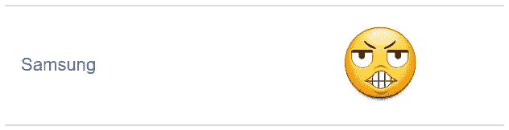
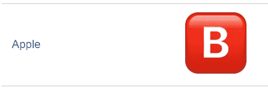
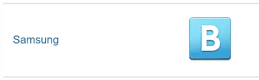
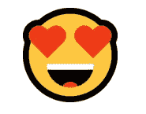
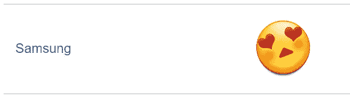
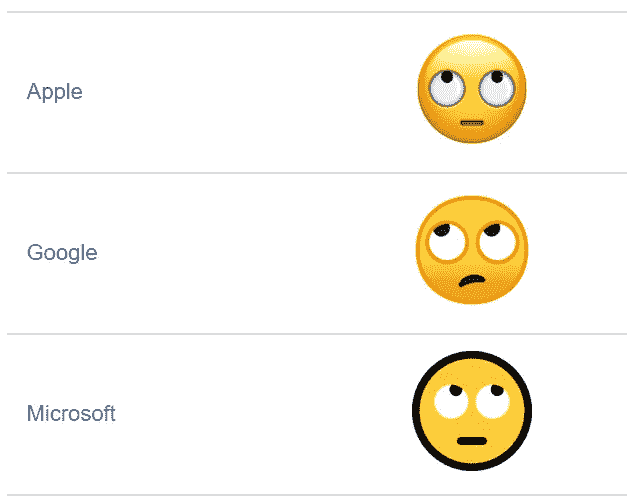
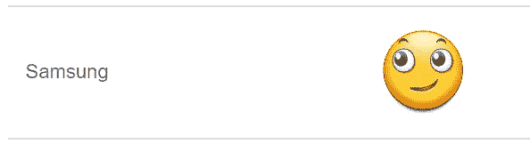
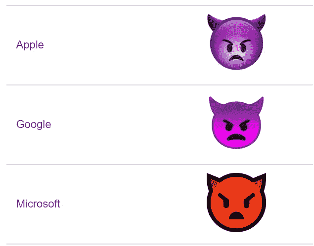
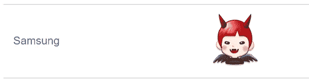

# 三星的奇异表情符号

> 原文：<https://medium.com/hackernoon/samsungs-bizarre-emojis-6be568a3b7d9>

我不知道三星在设计表情符号时的创作过程是什么样子的。是员工的孩子画的吗？设计师们是否从未在其他平台上见过或使用表情符号？他们只是时间不够了吗？
我们可能永远不会知道这些问题的答案。然而，我们可以深入研究三星表情库的一些最怪异之处。

## 情况一:😬，鬼脸表情。

在每个正常的表情库中，鬼脸表情所描绘的情感是很容易识别的。

所有平台对鬼脸的解释都相对一致。这是一张不适的脸，露出紧咬的牙齿和没有感情的眼睛。这就明白了。然而，三星决定用他们的鬼脸表情来逆潮流而动……

我完全不知道这个表情描绘的是什么情感。这不仅令人毛骨悚然，而且这个表情符号并没有传达所有其他表情所表达的不舒服情绪。三星的鬼脸表情以一种奇怪的方式看起来几乎令人满意。

## 病例 2:血型表情符号。

表情库包含 3 个图标——🅰️、🅱️、🆎和🅾️——旨在代表四种人类血型。在除三星之外的所有平台上，这些表情符号都是红色的。所有这些都与苹果的原创版本几乎相同:

这说得通，因为血是红色的。然而，出于人类未知的某种原因，三星所有的血型表情符号都是蓝色的:

为什么？

## 病例 3:心眼表情

心眼表情有许多用途，在大多数情况下完全适合工作。例如，用这个表情符号来表达你对同事成就的满意是完全恰当的。当然，三星必须毁掉这一切。

三星对这个表情符号的演绎与其他人完全不同。三星的心眼表情符号有着后仰的头、红红的脸颊和三角形的嘴，看起来明显带有色情色彩。

## 病例 4:眼球滚动表情。

这一个绝对令人困惑。以下是滚动眼睛表情符号的正常外观:

以下是三星的某个人(可能在醉酒状态下)认为的眼球滚动的样子:

什么？我认为 [Emojipedia](http://emojipedia.org/face-with-rolling-eyes/) 说得最好，简单地说“令人困惑的是，这在三星设备上被显示为一个愉快的侧视。”

## 情况五:“小鬼”表情

这种表情通常被称为“长着角的愤怒的脸”，主要用于以开玩笑的方式表达沮丧。其[设计](https://hackernoon.com/tagged/design)在所有平台上相对一致，通常以紫色出现，但有时会以红色或橙色出现。

然而，三星似乎认为这个表情符号最适合作为一个奇怪的微笑恶魔孩子。

这不仅传达了相反的情感，它只是简单的*怪异的*。

## 还有更多…

这篇文章只包括我最喜欢的怪异的三星表情符号。但是，还有更多奇怪的例子比如[累脸](http://emojipedia.org/tired-face/)、[绯红脸](http://emojipedia.org/flushed-face/)、[冷汗](http://emojipedia.org/face-with-open-mouth-and-cold-sweat/)、[小丑脸](http://emojipedia.org/clown-face/)。

总体来说，整个[三星](https://hackernoon.com/tagged/samsung)表情库都不一般。然而，我必须给它应有的荣誉，并承认三星比其他任何人都有更多详细的食物表情符号。

> [黑客中午](http://bit.ly/Hackernoon)是黑客如何开始他们的下午。我们是 AMI 家庭的一员。我们现在[接受投稿](http://bit.ly/hackernoonsubmission)并乐意[讨论广告&赞助](mailto:partners@amipublications.com)机会。
> 
> 如果你喜欢这个故事，我们推荐你阅读我们的[最新科技故事](http://bit.ly/hackernoonlatestt)和[趋势科技故事](https://hackernoon.com/trending)。直到下一次，不要把世界的现实想当然！

