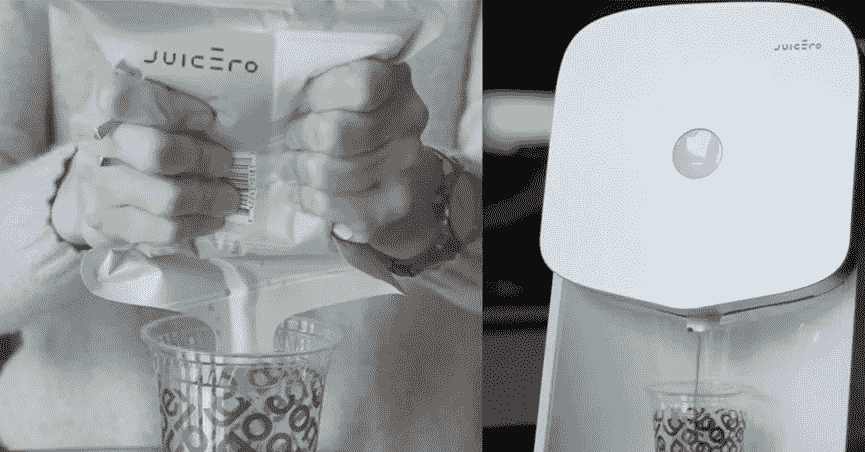
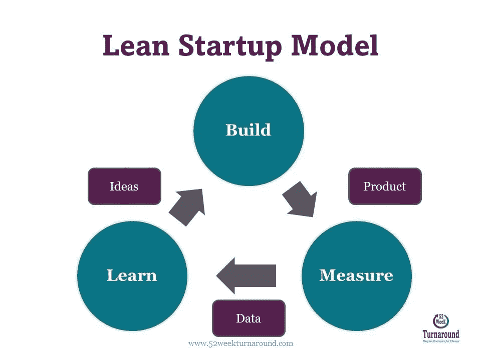
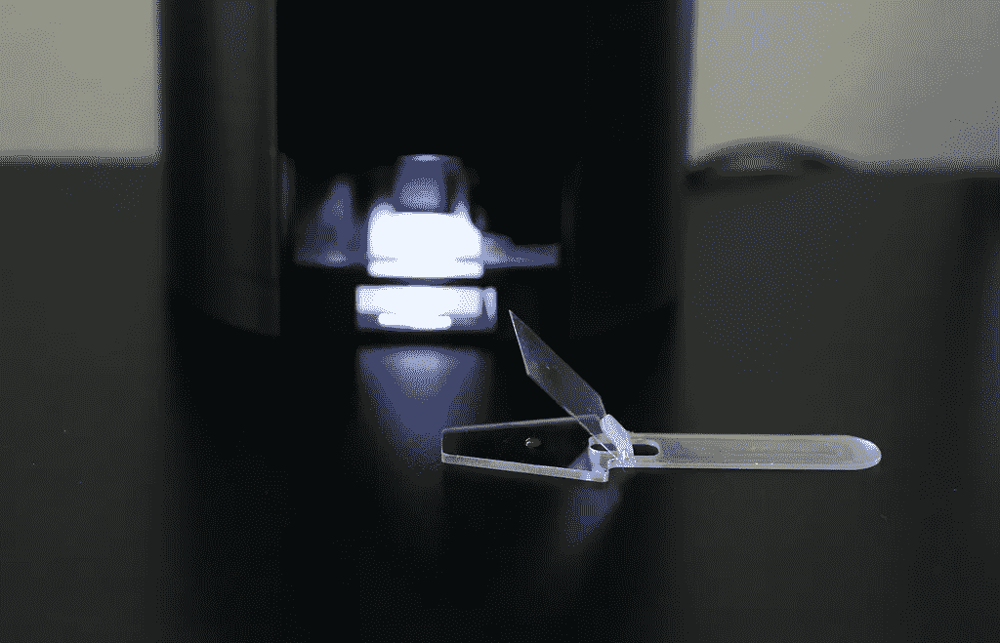
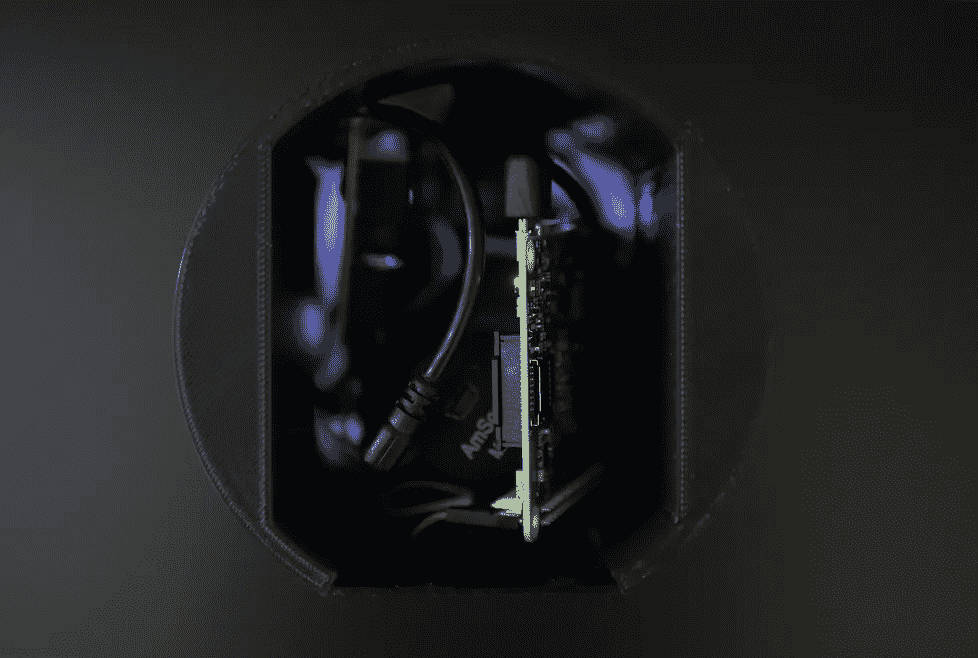
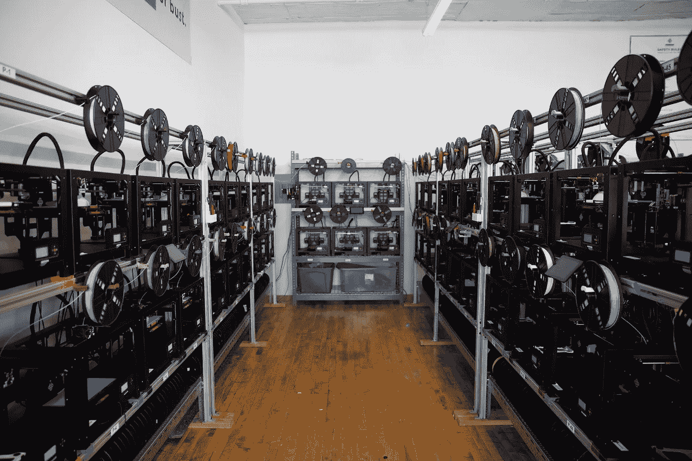
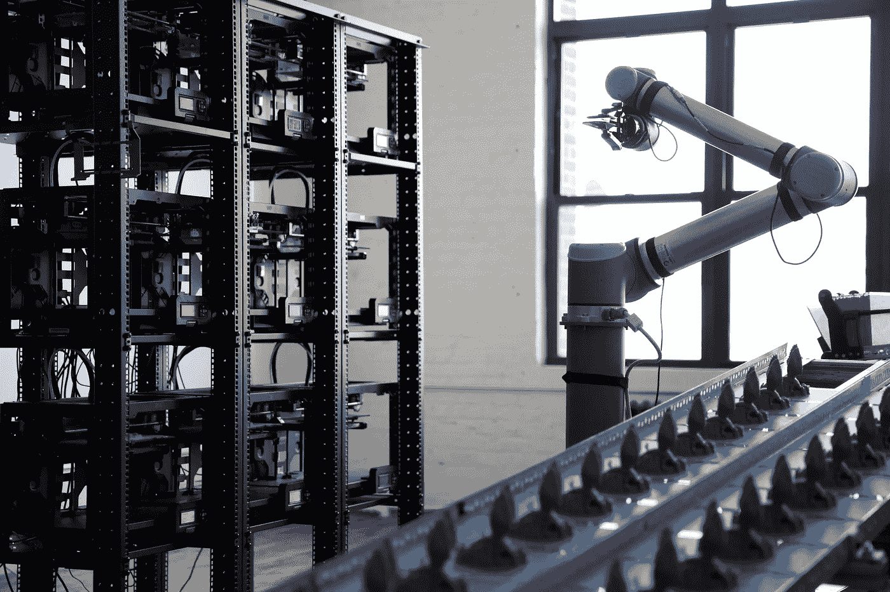
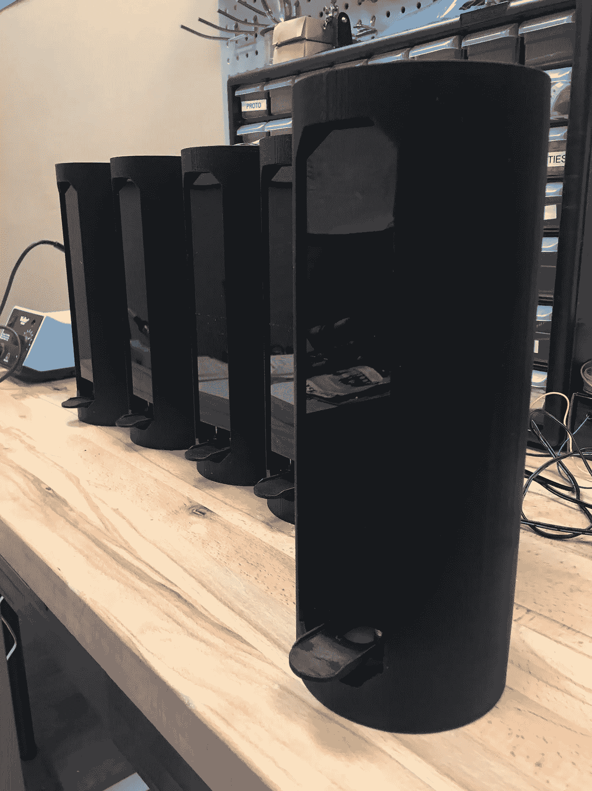

# 扩展人工智能硬件:对冲策略

> 原文：<https://medium.com/hackernoon/scaling-a-i-hardware-a-hedge-play-1cea22307f3d>

人们不知道他们想要什么样的新产品。那么，我们如何在不确定的市场中为新产品扩展昂贵且长期领先的硬件解决方案呢？在 [*阿瑟拉斯*](http://athelas.com) *我们正在通过层层流程限制挑战规模化制造的需求，转而选择关注用户和功能。我们的迭代方法由实验、整合、现成的集成和一点点* [*巫术*](https://twitter.com/voodoomfg) *驱动。*

> “如果我问人们想要什么，他们会说是更快的马。”——亨利·福特。

Source: Creative Commons

# 误解

你对产品的观点通常是狭隘和反复的:关注已经存在的问题，并在相同的背景下改进产品概念。如果一个新产品要有持久的生命力，而不是一个最终以价格和功能竞争告终的迭代改进，它需要改变我们想要的东西和我们想要的方式。

既然你可以问所有你想问的市场问题，但仍然像最近的 [Juicero 榨汁机](https://www.bloomberg.com/news/features/2017-04-19/silicon-valley-s-400-juicer-may-be-feeling-the-squeeze)故事一样失败，你会对一个几乎肯定是错误的产品投入什么资源？你对什么特征有多重视？你怎么知道什么时候足够好？换句话说，你如何用传统的项目管理工具来管理巨大的不确定性:**范围、预算和进度。**以下是阿瑟拉斯如何通过将硬件迭代时间缩短为两周的敏捷冲刺，最大限度地增加产品迭代次数，从而在诊断血液检测领域找到产品-市场契合度。

One of these costs $600 to purchase. Source: [Bloomberg](https://www.bloomberg.com/news/features/2017-04-19/silicon-valley-s-400-juicer-may-be-feeling-the-squeeze)

# 迭代限制因素:机械工程

由于用户需要看到一个产品才能知道它是否有意义，一家初创公司通过控制烧钱来优化其生存机会，同时实现尽可能多的产品迭代。这是通过最小化迭代时间和最大化从每个产品实验中学习来完成的，即**的*精益创业*模型构建、测量、学习**。

定制的机械组件通常会控制硬件产品迭代循环的长度。根据复杂性，设计、模拟、征求供应商、同意条款、订购材料、制造、检查、集成、测试、改进和重复所需的时间可能需要几个月。最糟糕的是，如果您错误地确定了应用程序或解决方案的范围(这种情况很有可能发生),那么后续的应用程序轴心将抹去您的努力，留给您下次的教训。

> 根据复杂性，设计、模拟、征求供应商、同意条款、订购材料、制造、检查、集成、测试、改进和重复所需的时间可能需要几个月。

Source: 52weekturnaround.com

# 玩追赶

机械工程在电气和软件方面取得进展的方式是专注于高度工程化的大规模制造组件的**集成:手机组件、驱动系统和紧固件，以及**将系统与能够实现快速定制的流程**联系在一起。这种产品测试可能与工程趋势不一致，工程趋势是展望材料和工艺信息设计或面向制造的设计(DFM):基于这两个领域的技术和经济约束优化您的架构。这种努力是值得的，但我认为只有在产品与市场的契合得到确认之后，除非对核心价值主张至关重要。**倾向于尽早完成 DFM 是因为部分概括了风险和复杂性的制造成本扼杀了可伸缩性。**然而，如果你优化了一个不被接受的产品，那么预先考虑就变成了浪费时间和精力。首先认识到产品机会，随后的优化工作本身将带来收入增长和最终利润。**

Athelas: In-Home Blood Testing

# 雅典的挑战:定制住房的升级

在[展会](http://athelas.com)上，我们的第一个 10 倍制造产量增长面临挑战:

*   我们真的需要围绕传统制造的各种限制来计划、设计和执行一个解决方案吗？这些限制包括机械加工等减法？
*   我们是否可以推迟或完全消除这些工作，直接大规模地转向变革(成型)过程？

我们构建项目的驱动力是广泛分发产品，以收集尽可能多的反馈，并快速建模趋势。花上几天或几周的时间进行可能在一个月内就过时的制造设计的想法，虽然被接受，但似乎是多余的。

至此，我们已经完成了大量的原型制作，我们的定制外壳符合标准的添加制造条款:每件几百美元，两天一次。在这个价位上，这款设备很难成为消费产品，除非我们决定在每次销售中大出血，直到我们达到规模。增材制造是原型制造和小批量制造的标准快速定制过程，但它在速度、成本和分辨率方面都不太好。

Segment of Voodoo Manufacturing’s Production Floor (used with permission)

进入[巫毒制造](http://voodoomfg.com)。在我的减法道路上运行对冲，我探索先进的高速和大批量印刷技术的公司。创立于小批量定制组件和大批量制造之间的海洋中，Voodoo 正采取一种狡猾的方法，以可扩展的按需方式制造定制产品。在 2014 年增材制造崩溃后，MakerBot 的前产品经理[乔纳森·施瓦兹](https://medium.com/u/10700039ba2d?source=post_page-----1cea22307f3d--------------------------------)和[马克斯·弗里菲尔德](https://medium.com/u/aabf8f28a723?source=post_page-----1cea22307f3d--------------------------------)意识到增材的问题是，与业余市场上 2000 美元的 MakerBot 相比，20 万美元的工业打印机除了更好的可靠性外，并不能提供太多。后来人们意识到，对于一台 20 万美元的工业打印机，你可以建立一个 100 台 MakerBots 的工厂，生产 100 倍的产品，同时通过利用你的过剩产能来对冲可靠性。

Source: Voodoo Manufacturing’s Project Skywalker (used with permission)

> 后来人们意识到，对于一台 20 万美元的工业打印机，你可以建立一个 100 台 MakerBots 的工厂，生产 100 倍的产品，同时通过利用你的过剩产能来对冲可靠性。

# 为什么你需要一点巫术来达到规模

伏都教为阿瑟拉斯提供了忘记流程优化的能力，因此我们可以在锁定我们的设计之前验证我们的垂直领域。为**生产我们的定制外壳比在工业打印机**中生产的少 80%,并且能够在短短 48 小时内交付超过 **100 个单元，而不是 7 天**,这是在 Athelas 获胜的明显 10 倍。随着我们使用 Voodoo 进行扩展，我们可以了解更多我们在市场中忽略的东西，建立解决方案模型，当天进行内部打印和测试，并在两天内完成用户部署的批量订单。这是我第一次意识到一家初创公司能够达到一家中型原始设备制造商的供货能力，但不需要为大型资本设备融资，也不需要向生产合作伙伴支付高额利润。对 Athelas 来说，最终的好处是，通过对我们的内部方法进行对冲，我们永远不需要对我们的用户在流程优化、工具和库存方面的承诺进行对冲或妥协。

“Run and Gun” on the Athelas Test Bench.

> 伏都教为阿瑟拉斯提供了忘记流程优化的能力，因此我们可以在锁定我们的设计之前验证我们的垂直领域。

# 最后的想法

定制的机械部件通常会定义产品迭代的速度。在巫毒教制造之前，添加工艺产品一直是机械设计的可扩展解决方案。在我们的流程中利用一些“巫术”,使 Athelas 在定制外壳上实现了 80%的成本削减，并在短短 48 小时内找到了 100 个单位的履约能力。Athelas 的直接好处是消除了制造活动的设计，直到产品垂直需求变得明确，这对于敏捷集成和以客户为中心都是一个优势。然而，核心优势是能够快速广泛地部署数据收集产品，而成本不是主要因素。下次的主题是什么？

*这是我的第一篇文章，我计划每季度发表一篇文章，深入探讨我们如何利用纵向扩展实现 10 倍的增长。我很想听听你的想法，并把它变成一次对话。如果你能走到这一步，谢谢！*

# 关于阿西拉斯

Athelas (Y-Combinator '16)正在将用于预测和安心的血液测试民主化，应用于护理点和家庭。作为一种经济实惠的物联网设备，Athelas 平台通过深度学习和先进光学的新融合来实现。请到 Athelas.com[的](http://athelas.com/)来看看我们，参与对话或继续阅读:

 [## CNN 在图像分割中的简史:从 R-CNN 到掩模 R-CNN

### 在 Athelas，我们使用卷积神经网络(CNN)不仅仅是为了分类！在本帖中，我们将看到…

blog.athelas.com](https://blog.athelas.com/a-brief-history-of-cnns-in-image-segmentation-from-r-cnn-to-mask-r-cnn-34ea83205de4) 

# 关于巫毒制造

voodoo Manufacturing(Y-Combinator ' 16)是一家位于布鲁克林的初创公司，其使命是改变我们的生产方式。在 voodoomfg.com[了解更多信息或继续阅读:](https://voodoomfg.com/)

 [## 我们如何建造一个机器人 3D 打印工厂

### 一家制造初创企业削减成本和接受注塑成型的旅程。与马克斯·弗里菲尔德合著。

medium.com](/voodoo-manufacturing/announcing-project-skywalker-bf9efa99a677) 

> [黑客中午](http://bit.ly/Hackernoon)是黑客如何开始他们的下午。我们是 [@AMI](http://bit.ly/atAMIatAMI) 家庭的一员。我们现在[接受投稿](http://bit.ly/hackernoonsubmission)并乐意[讨论广告&赞助](mailto:partners@amipublications.com)机会。
> 
> 如果你喜欢这个故事，我们推荐你阅读我们的[最新科技故事](http://bit.ly/hackernoonlatestt)和[趋势科技故事](https://hackernoon.com/trending)。直到下一次，不要把世界的现实想当然！

