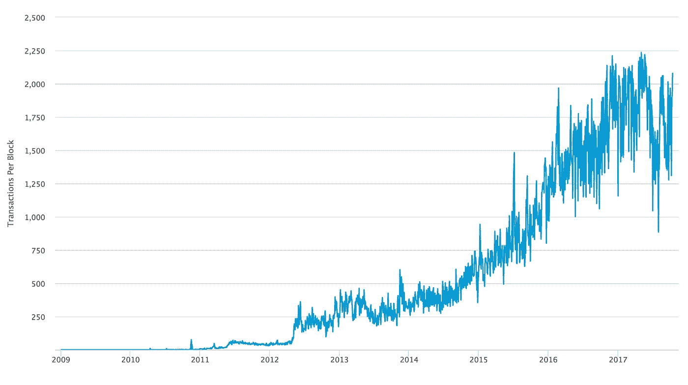

# 缩放比特币:没有废话版

> 原文：<https://medium.com/hackernoon/scaling-bitcoin-no-bullshit-edition-9b6fcb668111>

## 比特币不是你可能已经被引导相信的变革性技术。

比特币的突破不在于技术，而在于博弈论。BTC 背后的技术[区块链](https://hackernoon.com/tagged/blockchain)，实际上只是一个“共享交易列表”的花哨术语。是的，真的。关于[比特币](https://hackernoon.com/tagged/bitcoin)真正革命性的是**将矿工、用户和开发者的激励**在财务上*结合起来*。每个人都做正确的事情，因为这样做符合他们的财务自身利益。

理解任何讨论的关键是弄清楚提议的具体变化，然后将这些现实与声称的现实进行比较。这些具体变化的实际效果会是什么？有了这些改变，世界会变成什么样子？谁会是受益者？声称的好处和实际的好处大致相同吗？为什么会这样？

看看这张令人难以置信的图表:

[https://blockchain.info/charts/n-transactions-per-block?timespan=all](https://blockchain.info/charts/n-transactions-per-block?timespan=all)

这张图表显示了每个比特币区块的交易数量，追溯到开始。你可以看到，交易量在 2016 年年中之前一直稳步增长，此后一直保持平稳。它变平了，因为你不能挖掘无限数量的事务块。该限制目前不是按事务而是按总大小(1MB)进行的，事务可以有不同的大小。比特币越来越受欢迎，越来越多的人想拥有和使用它。任何金融体系的一个重要衡量标准就是“有多少人可以使用它”。假设每天 3 笔交易(每个参与者)，每个区块平均 1750 笔交易，当前的比特币网络可以支持大约 84k 人。那大约是我居住的城镇的大小。显然，如果我们想让比特币成为一个超过 700 亿美元的业余爱好项目，我们需要改变一些东西。

目前提议的主流变革有两种，莫名其妙地在 Medium、Twitter、Reddit 和其他地方殊死搏斗。让我们看看他们，使用这个粗略的“有多少人”指标，而不是他们的支持者兜售的任何说辞。

## 选项 1:闪电/塞格维特/ L2

一个提议的解决方案是把问题带到别处。通过建立一个与比特币并行的二级网络，我们将大部分交易排除在比特币网络之外，让更多人进行更多交易，而不会给比特币本身带来压力。目前，最受欢迎的解决方案被称为闪电，它在激励方面做得很好——它建立了一个系统，如果你不友好，你就会赔钱。不幸的是，这意味着要想玩，你就必须把钱捆起来。本质上，你得“买进”。你和某人交换“借据”(打开一个支付通道)，然后跟踪你和那个人之间的流水账。任何一方都可以随时“和解”(即关闭渠道)。

它的“网络”部分是，原则上你可以通过渠道网络在任何两个人之间汇款。如果爱丽丝想给查理寄钱，她可以把钱寄给鲍勃，鲍勃再把钱寄给查理。至少，理论上是这样。为了防止 Bob 带着 Charlie 的钱逃跑，Bob 必须在渠道中占用大量资金，至少与流经他的总金额一样多。鲍勃联系的人越多，他想转的钱越多，他就越像鲍勃银行。在我读过的提案中，鲍勃并没有因为他提供的资金转移服务而得到报酬，他只是出于好心才这么做的。如果说比特币教会了我什么的话，那就是 Bob(或 Bobabank)将开始收取交易费用。很公平，只要这些费用低于全区块链交易费，我们就赢了。

假设其他一切保持不变，我们现在有两种方法来衡量闪电比特币的容量。第一个问题是，如果我们除了增加新用户(开通一个频道需要在网络上进行交易)之外什么都不做，要花多长时间才能让全世界的人都加入这个系统？简单的数学答案是 65 年。真正的答案是:从来没有…每天出生的人(36 万)比我们目前每天的交易量(27 万)多。这个指标有点末日了，所以让我们试试另一个:假设每个人每月“定居”一次(我认为这是一个非常低的估计)，有多少人可以参与这个新的闪电网络？700 万左右。很好——我们从一个大镇到了一个大城市！作为参考，700 万人口以上的城市有 60 个。

太好了，现在我们只需要将规模扩大 100，000%就可以为全世界服务了(并且以某种方式确保人们每月只结算一次！).

## **选项 2:更大的块**

另一个受欢迎的选择是说“让我们把积木做大吧”。1MB，现在已经很小了。让我们试着为纽约服务，假设每人每天一笔交易。为了服务 850 万人，每天交易一次(同样，可能是一个很低的数字)，我们需要每个块 60k 个交易—因此 60MB 块是可行的。现在考虑的最大数据块大小增量还远未达到这一水平，所以去想想吧。最近有人在一个测试网络上挖掘了一个 1GB 的数据块，但是这里和那里之间存在很多问题。从根本上说，目前的比特币是一个连续处理的项目，交易一次一个地进行，填满一个又一个区块。我们越努力推动这个系统，我们遇到的问题就越多。你不可能在一条单车道上把纽约所有的车都开到洛杉矶，不管你把限速设得多高。

## 选项 3:以上所有选项，甚至更多

即使我们双管齐下，将交易压缩成渠道，让区块变得巨大，我们也会遇到更多问题:比特币越好，接触的人就越多，费用越低，每个人就越想使用它。一周 1 笔交易会变成一天 1 笔，会变成 10 笔。我们不知道将来会有多少人进行交易。随着我们不断降低壁垒，我们将继续看到交易量上升。我们永远无法通过保持串行来满足需求，我们的世界本来就是并行的。幸运的是，我们已经有了更多的通道——我们已经有了几十种主要的加密货币！那么，为什么我们不能添加更多的货币，并以这种方式解决缩放问题呢？替代硬币面临着与社交网络非常相似的问题:婴儿死亡率很高。当硬币很小时，它们很容易遭受所谓的 51%攻击——拥有大量计算能力的矿工基本上可以做他们想做的任何事情…

## 你是说我们注定要失败？

不完全是…我只是说，三个主要的提议(L2、大块和侧链/替代硬币)，即使放在一起，从现在到提议的每个人都使用加密货币的乌托邦隐藏在他们的推销中，还有许多未解决的问题。希望有一个解决方案。有很多聪明人在研究它。然而，如果你试图理解事物，你必须大量阅读，并且自己理解基本的技术。既然如此多的价值体现在加密资产中，有许多人出于经济动机改变网络以使其受益。你必须评估他们在技术现实上的主张，并弄清楚你想生活在谁的世界里。如果你不这么做，你会相信别人会为你这么做，而我们又回到了起点:法定货币。