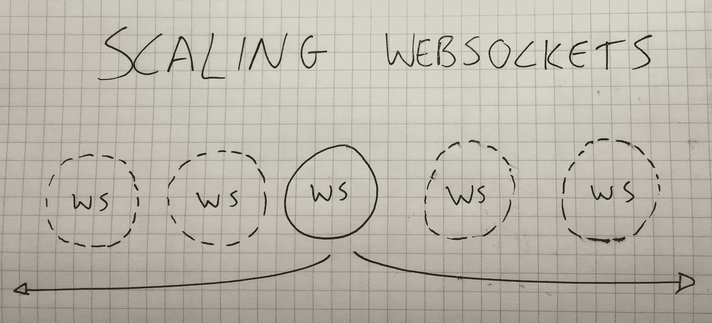

# 如何扩展 WebSockets

> 原文：<https://medium.com/hackernoon/scaling-websockets-9a31497af051>

Scaling WebSockets

在与还没有使用过 WebSockets 的开发人员交谈时，他们通常会有同样的担心:如何在多台服务器上横向扩展？

如果所有订阅者都连接到一台服务器上，那么发布到该服务器上的一个频道是可以的。一旦您有了多台服务器，您就需要添加一些其他的东西。这就是这篇文章试图解决的问题。

# 扩展 HTTP 与 WebSockets

为了理解为什么向外扩展 WebSockets 看起来令人生畏，让我们将其与 HTTP 进行对比，因为大多数人都很好地理解了它。

使用 HTTP，您有一个一次性的请求/回复模式，您不希望来自客户端的下一个请求返回到同一个服务器。至少您不应该这样做，因为这意味着您有一个棘手的会话问题，并且您不能轻松地向外扩展性能或冗余。

使用 HTTP，您可以在负载均衡器后面运行几乎无限量的 web 服务器实例。当请求到达时，负载平衡器将请求传递给一个健康的 web 服务器实例，一旦 web 服务器计算出响应，就将响应传递回客户机。HTTP 连接通常是非常短暂的，它们只存在到给出响应为止。这是一种很好理解的、无处不在的方法，它的伸缩性很好。长时间轮询是个例外，但这并不常见，对这篇文章来说也不重要。

另一方面，WebSockets 不同于 HTTP 请求，因为它们是持久的。WebSocket 客户端打开一个到服务器的连接并重用它。在这个长时间运行的连接中，服务器和客户端都可以发布和响应事件。这个概念被称为[双工连接](http://searchnetworking.techtarget.com/definition/duplex)。一个连接可以通过负载平衡器打开，但是一旦连接打开，它就一直在同一个服务器上，直到它被关闭或中断。

这反过来意味着交互是有状态的；对于每个打开的客户端连接，您最终将至少在 WebSocket 服务器的内存中存储一些数据。例如，您可能知道哪个用户在套接字的客户端，以及用户对哪种数据感兴趣。

WebSocket 连接是**持久的**这一事实使得它对于**实时应用**如此强大，但也使得它更加**难以扩展**。

# 一个示例 WebSocket 应用程序

让我们讨论一个示例应用程序，这样我们可以在更具体的环境中讨论问题和方法。

对于我们的例子，让我们选择一个协作白板应用程序。在这个应用程序中，有多个白板，这意味着人们可以在多个图纸上合作。当用户在特定的白板上绘图时，它通过 WebSocket 连接将坐标发布给所有其他打开相同白板的用户。换句话说，我们有一个通过 WebSockets 公开的发布/订阅模式。

在这个例子中，这意味着应用程序的每个用户的套接字连接的服务器端至少需要知道用户打开了什么白板。

像 [socket.io](https://socket.io/) 这样的 Web socket 实现有通道的概念。可以把它想象成一个地址，客户端可以订阅该地址，服务或其他客户端可以向该地址发布内容。

人们可能会认为，构建我们的协作白板应用程序所需要做的就是利用通道(每个白板都有自己的通道)，然后坐下来放松一下，但正如你将在本文的其余部分看到的那样，你仍然会遇到横向扩展和容错的问题。

# 你需要一个发布/订阅代理

首先，当我说“*”时，我指的是什么？有各种各样的技术在相当大的规模上支持[发布/订阅模式](https://en.wikipedia.org/wiki/Publish%E2%80%93subscribe_pattern)。*

*当您需要在套接字上扩展发布/订阅架构时，您需要找到一种好的发布/订阅技术作为您的解决方案的核心。*

*我们不需要为这篇文章指定一个特定的选项，但这里有一些好的选项: [Redis](https://redis.io/topics/pubsub) 、 [RabbitMQ](https://www.rabbitmq.com/tutorials/tutorial-three-python.html) 、 [Kafka](https://codurance.com/2016/05/16/publish-subscribe-model-in-kafka/) 和 [RethinkDB](https://rethinkdb.com/docs/changefeeds/javascript/) 。*

*为了理解为什么我们需要添加一个发布/订阅代理来帮助您扩展您的 WebSockets，让我们首先在一个服务器的上下文中考虑我们的例子。*

*有了一台服务器，只使用 WebSockets 构建发布/订阅服务实际上相当容易。这是因为在一个服务器上，该服务器将知道所有客户端以及客户端对什么数据感兴趣。*

*想想我们的示例应用程序。当客户端通过坐标发送绘图时，我们只需找到绘图的正确通道，并将对绘图的更新发布到该通道。所有的客户端都连接到一个服务器上，所以它们都会收到更改通知。**有点像内存发布/订阅**。*

*但实际上，我们希望跨多个服务器进行扩展，我们希望这样做有两个原因: **1)** **共享处理能力**，以及 **2)冗余。***

*那么，我们能做些什么来确保我们的应用程序能够横向扩展呢？嗯，我们需要某种方式让其他连接了客户端的服务知道数据已经改变。*

*当构建这样的应用程序时，您可能已经有了一个数据库，甚至在您开始考虑扩展之前。你不会仅仅信任连接的客户端来存储所有绘图的所有数据，对吗？不，您将希望保存来自客户端的绘图数据，以便您可以在用户打开绘图时提供绘图数据。*

*但问题来了。如果**服务器 A** 上的 WebSocket 向数据库中写入一些数据，那么**服务器 B** 上的 WebSocket 如何知道从数据库中获取最新的数据，以便通知其客户端新的数据呢？*

*让我们讨论一下在您的解决方案中使用 Redis 的过程。尽管您的集群中可能有数百个 WebSocket 服务器，但是让我们假设您只有 **3** 个服务器来简化事情。我们将这些服务器称为 **WS1** 、 **WS2** 和 **WS3** 。有时候，我会惊讶于自己给东西起的惊人的创意名字！*

*好吧，让我们假设你有 9 个人打开了一幅狗骑着小马骑着恐龙的特定图画，保存在你的数据库中，id 为 **abc123** 。假设您有 **3** 个人连接到集群中的每台服务器(WS1、WS2、WS3)。*

*连接到 **WS1** 的用户之一在白板上画了些东西。在您的 WebSocket 服务器逻辑中，您写入数据库以确保更改已被持久化，然后根据与绘图相关联的唯一标识符(很可能是根据绘图的数据库 id)发布到通道。假设这种情况下的通道名是 **drawing_abc123** 。*

*此时，您已经将数据安全地写在数据库中，并且您已经向您的发布/订阅代理(Redis 通道)发布了一个事件，通知其他相关方有新数据。*

*因为您有连接到其他 WebSocket 服务器(WS2、WS3)的用户，他们对同一个绘图感兴趣，他们将在 **drawing_abc123** 通道上开放 Redis 订阅。它们会收到事件通知，每个服务器都会向 DB 查询更新，并在 WebSocket 层上使用的 WebSocket 通道上发出更新。*

*因此，您可以看到，发布/订阅代理用于允许您通过横向扩展的 WebSocket 集群公开发布/订阅模型。*

# *处理故障转移*

*使用发布/订阅代理协调 WebSockets 的另一个好处是，现在可以轻松处理故障转移。*

*当客户端连接到 WebSocket 服务器时，如果该服务器发生故障，客户端可以通过负载平衡器打开到另一个 WebSocket 服务器的连接。新的 WebSocket 服务器将确保订阅 WebSocket 客户端感兴趣的数据的发布/订阅代理，并在 WebSocket 上发生更改时通过管道传输这些更改。*

# *使用增量*

*当客户端重新连接时，要考虑的一件事是让客户端足够智能，它通过某种数据同步偏移(可能以时间戳的形式)发送，这样服务器就不会再次向它发送所有数据。*

*如果对所讨论的绘图的每次更新都有时间戳，则客户端可以轻松地存储他们收到的最新时间戳。当客户端失去与特定服务器的连接时，它可以通过传入它收到的最后一个时间戳来重新连接到您的 websocket 集群(通过您的负载平衡器),这样就可以建立对数据库的查询，以便它只返回在客户端最后一次成功接收更新之后发生的更新。*

*在大量的应用程序中，担心副本被下载到客户端可能不是那么重要。但是即使这样，使用时间戳方法来节省资源和用户的带宽也是一个好主意。*

# *结论*

*构建一个在一台服务器上运行的发布/订阅服务相对容易。挑战在于构建一个可以水平扩展的服务，以实现负载共享和容错。*

*当您向外扩展时，您需要一种方法让 web socket 服务订阅更改的数据，因为对所述数据的更改也将来自其他服务器而不是它本身。支持实时查询的数据库非常适合这个目的，例如 RethinkDB。这样你只有 WebSockets 和你的数据库。也就是说，你可能已经在你的环境中使用了支持发布/订阅的[技术](https://hackernoon.com/tagged/technology) (Redis，RabbitMQ，Kafka)，这将比引入一种新的数据库技术要容易得多。*

# *感谢阅读！:)如果你喜欢它，请点击下面的心形按钮表示支持。💚*