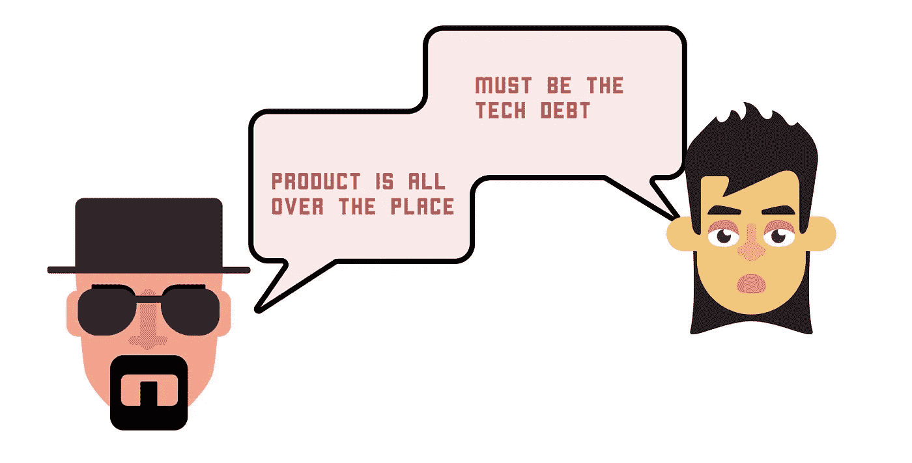
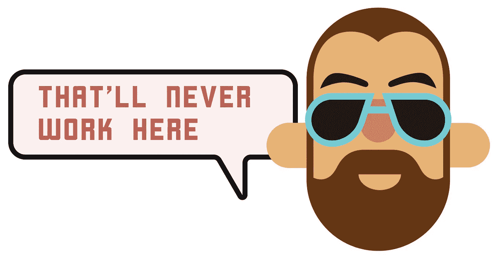
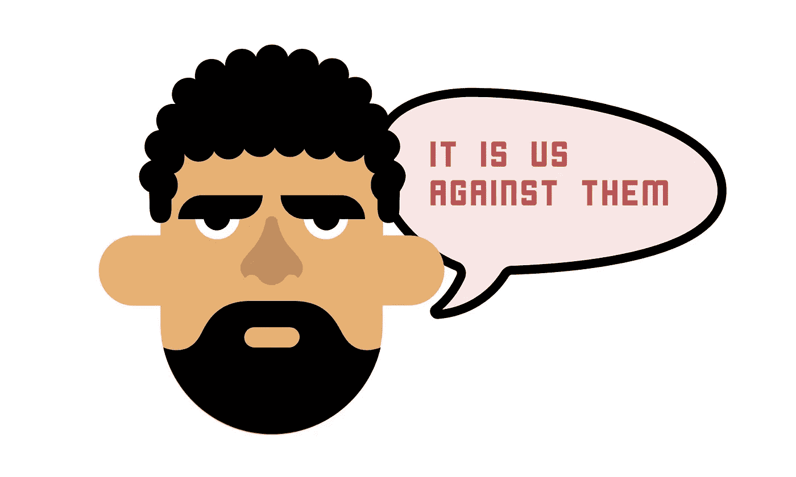

# 无内爆扩展

> 原文：<https://medium.com/hackernoon/scaling-without-imploding-79b46a91ac63>

## 早期预警信号、持续改进和(正确的)纪律

这篇文章是关于扩大你的公司。具体来说，这是关于明智决策和持续改进…把握公司的心跳和健康，并确保不可避免的问题不会成为慢性问题。我们倾向于认为我们的组织是独一无二的，但是以我的经验来看(至少)，这种动态倾向于非常相似。这些症状也会以某种可预测的方式变得混淆和困惑，这是我将在下面讨论的内容。

## **起初，事情是这样的:**

*   绿地工作的高百分比。一切都是第一次。
*   编写代码的开发人员仍然在公司工作，并且理解为什么要做出某些决定和权衡。
*   代码库和产品不太复杂。
*   团队倾向于雇佣以前工作中的“已知数量”(更直接的合作经验)。
*   组织更扁平。信息流动更加自由。更紧密的反馈循环。
*   不太可能局部优化的组(较少“王国构建”)
*   更容易的是“走到某人的办公桌前”(即使他们不在你的“部门”)。
*   早期客户更容易接近，更投入，更愿意提供反馈(并接受一些偷工减料)。

## **好，快进几年:**

*   绿地工作的百分比较低。“全新”的东西很少见。新工作必须在旧工作的限制下进行。
*   最初的开发者已经离开了，并且/或者已经不再是个人贡献者。决策/权衡的主体太大，无法有效沟通。
*   产品变得更加复杂。
*   更少的推荐雇员。
*   组织长高了。信息是通过层级结构中的各层传递的。
*   在部门和团队之间建立更多的王国。关注的是当地的生存与全球的健康。
*   减少部门间的交往。
*   与通过更传统的入职渠道获得的新客户相比，早期客户相形见绌。

## **当事情“慢下来”时，这种情况会导致很多问题和指责:**

*   为什么第一队在挣扎，而第二队在踢屁股？
*   我们降低了招聘门槛了吗？为什么？也许这是一个过程…也许我们之前太鲁莽了，这是“新常态”？
*   人失去动力了吗？他们努力了吗？
*   我们最初的团队成员是否在早期做出了糟糕的决策？
*   功能膨胀的情况应该归咎于产品吗？
*   新经理们没有学习如何管理吗？新的高级经理/执行官们的速度不够快吗？
*   我们有太多的事情要做吗？这是一个整体战略的事情吗？
*   我听说了一系列障碍，但它们不可能都有同等的作用。影响最大的是什么？
*   我听到的是真的吗？也许我们只是没有合适的人？

这是一个小样本的问题，但你得到的想法。

## 回答这些问题和解决这些争端非常困难:

*   大多数观点都部分正确。几乎任何东西都可以被正确地列为起作用的因素。
*   随着增长/规模的扩大，有些事情总是会变得更加困难。
*   局部观点并不能说明全部情况。
*   一个全球性的——但距离很远的——观点并不能说明全部情况。
*   在正确(但不完整)观点的激励下，派系将会形成。
*   任何试图全面展现这一问题复杂性的尝试——几乎从定义上来说——对普通大众来说都太复杂了(而且会被描述为太具威胁性和/或“政治自杀”)。
*   类似地，任何解决问题的适当细致的实验将跨越功能组和组织层级。因此，这将遇到很多阻力，因为它挑战现有的角色。
*   比较(团队之间和其他公司之间)几乎是不可能的。

## 这导致:

*   自我怀疑。例如，一个新来的人可能不知道他们的观察是否“正确”,或者他们是否遗漏了什么。
*   恐惧，以及更少的信息共享。
*   防御姿态。从解决问题到形成叙述和/或提出个人解决方案的转变。
*   不作为，或在最容易和最少争议的地方快速行动(通常在第一线)。
*   “绕过”障碍，而不是通过它们。
*   寻找特定团队和/或团体的替罪羊。
*   过多的流程来“证明”谁有错(例如，额外的管理层、更严格的评估实践、更严格的目标设定、进度检查等。)
*   充当信任代理的额外流程(例如，“人们需要更负责任！”)
*   出现问题的速度将会超过成功解决问题的速度，问题将会呈指数级增长，有些问题将会变成真正的慢性问题(并且是邪恶的)

## 讨论

当然，你可以将上述进展视为不可避免的事情(有些人确实如此)。其他人认为确定根本原因总是可能的，上面的动态表示“糟糕的管理”。他们会将组织描述为“下滑”，然后向更高层的外部人员求助以控制局面(不知何故，“正确角色的正确人员”很少涉及现有员工)。

我有稍微不同的看法。首先，我认为将这种动态视为“自然”是很重要的，因为它很少源于人们做恶意的事情(或不称职)。第二，我确实相信有办法抵消这种漂移，但不认为这仅仅是管理层的责任。你需要站在第一线，创造一个心理上安全的环境，在这个环境中，信息可以无所畏惧地交流。

在我看到这种情况发生的大多数组织中，都存在某种失误和/或务实的调整。这是一个预警信号。随着失误而来的是合理化。我职业生涯中的一些例子包括:

*   没有解决生产中某个问题的根本原因(我们稍后会修复它，它太大了，现在无法修复)
*   增加新团队成员的入职时间(我们现在雇佣更年轻的工程师)
*   计划的提前期和周期时间的下滑(该团队缺乏经验)
*   越来越多的高级团队成员离开公司(谁能责怪他们呢，文化总是在变)
*   无法进一步缩短发布周期(好吧，也许我们已经达到了每月发布的极限)
*   减少与客户相处的时间(我们最新一批工程师对直接与客户聊天不太感兴趣)

合理化是强有力的。如果环境已经是有毒的了，再多的努力去控制它也不会奏效，因为人们已经处于防御状态。

## 答案

我肯定不是专家，但我有偏见的预感是围绕纪律、强制功能和心理安全。

我一直在思考和阅读这方面的内容(钻研精益、约束理论和高安全性文化)。当我观察那些长期表现良好的公司时，我倾向于看到一些不可协商的价值观、原则、约束、强制功能和控制。

这些可能包括:

*   固定的招聘标准(或招聘方法，如试驾)
*   停止生产线并解决生产问题的根本原因
*   没有不可靠的测试(经常失败，但是被忽略的测试)
*   “计划外”工作的最大限制
*   能够在[一段时间内]将变更推进到生产中
*   每个人都在排队等候支援
*   每季度举行一次经过精心策划的持续改进活动，并立即解决最重要的问题
*   在制品限制
*   跟踪每个产品计划的数据，并在发布后跟进，将采用估计值与实际值进行比较
*   团队中始终包括一个(或多个)客户
*   团队成员定期轮换，交流信息和知识
*   对每个计划进行回顾，并同意对任何关键障碍采取行动，不管它是否完全在团队的控制之内
*   如果滚动 NPS 降到 40 以下，立即重新聚焦
*   CI/CD 不得超过 N 分钟/小时
*   每周目标
*   生产环境中的混沌工程(定期关闭系统以测试弹性)
*   定期缩短发布周期(例如 1 个月、2 周、1 周、1 天)

人们倾向于将这些事情归结为“控制欲太强”或“不够灵活”。或者……期望单个经理发现问题，相应地上报，和/或与其他经理一起解决问题。我不这么认为。为了鼓励持续改进和防止偏差，你需要一些固定的强制功能和“停止生产线”并解决问题的承诺。

这里的关键是选择能够真正推动学习和行动的强制功能。个人绩效评估和 okr 会让人觉得过于武断和局限。像“达到估计值的能力”这样愚蠢的事情也是如此。最好选择那些指向系统整体健康状况的东西。这是一个关键点，因为我们倾向于掩盖对团队的全球影响，这使得我们很容易找到个人/本地原因。

最重要的是，它不能涉及指责或个人化的问题。而且(这可能是最困难的)必须让每个人都参与选择约束，并让他们公开讨论。

# 摘要

让纪律变得安全。同意一组强制函数。当警报触发时，确保持续改进的安全性。不要把这变成管理问题。做一件有意义的事情。