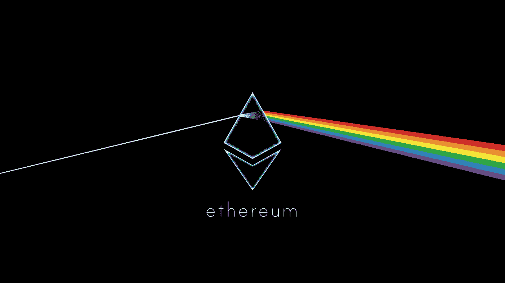
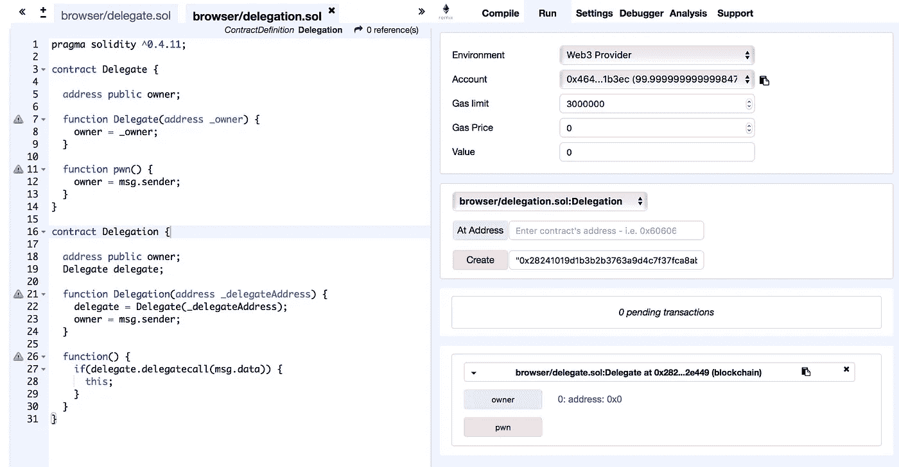

# 分析以太坊智能合约的漏洞

> 原文：<https://medium.com/hackernoon/scanning-ethereum-smart-contracts-for-vulnerabilities-b5caefd995df>

*[*MythX*](https://mythx.io)*的创造者伯恩哈德·穆勒(Bernhard Mueller)展示了如何检测以太坊智能合约中的漏洞。**

*下面，我们将运行 [Mythril](https://github.com/ConsenSys/mythril-classic/) 一些来自 [Ethernaut wargame](https://ethernaut.zeppelin.solutions/) 的故意易受攻击的合同(感谢 [Zeppelin solutions](https://zeppelin.solutions) 的家伙给我许可！).如果你没有亲自尝试过 wargame，请注意前方有剧透！如果你还没有尝试过，我建议你自己先尝试一下。*

**

# *代币*

*以太网的第三级的目标是破解一个名为`Token`的基本令牌契约。检查[代码](https://ethernaut.zeppelin.solutions/level/0x220beee334f1c1f8078352d88bcc4e6165b792f6)，看看你是否能发现这个错误。*

*使用 Mythril 分析智能合约时，您可以从三个输入选项中进行选择:*

1.  *坚固性代码文件:这只有在安装了 [solc 命令行编译器](http://solidity.readthedocs.io/en/develop/using-the-compiler.html)的情况下才有效。*
2.  *Solidity 字节码:如果没有 solc，可以用 [Remix](http://remix.ethereum.org/) 编译代码，并通过`-c`参数将运行时二进制代码传递给 Mythril。*
3.  *合同地址:要扫描区块链上的合同实例，请使用`-a ADDRESS`选项。*

*我将使用下面的选项 1——有关其他输入选项的详细说明，请查看[自述文件](https://github.com/b-mueller/mythril/blob/master/README.md)。*

*将代码复制/粘贴到文本文件中，保存为`ethernaut-token.sol`，然后运行`myth analyze`命令。Mythril 在控制台上输出检测到的问题:*

```
*$ myth analyze token.sol 
==== Integer Underflow ====
SWC ID: 101
Severity: High
Contract: Token
Function name: transfer(address,uint256)
PC address: 436
Estimated Gas Usage: 11935 - 52881
The binary subtraction can underflow.
The operands of the subtraction operation are not sufficiently constrained. The subtraction could therefore result in an integer underflow. Prevent the underflow by checking inputs or ensure sure that the underflow is caught by an assertion.
--------------------
In file: token.sol:13balances[msg.sender] - _value--------------------
(etc...)*
```

*在这种情况下，Mythril 在函数`transfer`中检测到一个整数溢出和两个整数下溢问题。让我们看一下代码，看看发生了什么:*

```
*function transfer(address _to, uint _value) public returns (bool) {
  require(balances[msg.sender] — _value >= 0);
  balances[msg.sender] -= _value;
  balances[_to] += _value;
  return true;
}*
```

*我们可以看到，如果`_value`大于`balances[msg.sender]`，那么`balances[msg.sender] — _value`确实会换行。在这种情况下，发送者将会得到天文数字的代币！*

# *余波*

*这是以太挑战的第二关。先看看代码——问题并不难发现！*

*以下是 Mythril 对此的看法:*

```
*$ myth analyze fallout.sol
==== Unprotected Ether Withdrawal ====
SWC ID: 105
Severity: High
Contract: Fallout
Function name: collectAllocations()
PC address: 934
Estimated Gas Usage: 1880 - 36491
Anyone can withdraw ETH from the contract account.Arbitrary senders other than the contract creator can withdraw ETH from the contract account without previously having sent an equivalent amount of ETH to it. This is likely to be a vulnerability.
--------------------
In file: fallout.sol:159msg.sender.transfer(address(this).balance)
--------------------Initial State:Account: [CREATOR], balance: 0x1000001328abc1e, nonce:0, storage:{}
Account: [ATTACKER], balance: 0x0, nonce:0, storage:{}
Account: [SOMEGUY], balance: 0x500d18006a4060402, nonce:0, storage:{}Transaction Sequence:Caller: [CREATOR], calldata: , value: 0x0
Caller: [ATTACKER], function: Fal1out(), txdata: 0x6fab5ddf, value: 0x0
Caller: [ATTACKER], function: collectAllocations(), txdata: 0x8aa96f38, value: 0x0*
```

*Mythril 声称可以使用函数`collectAllocations()`从合同中撤销 ETH。但是这个功能不是被`onlyOwner`修饰符保护着吗？注意*两个*交易显示在“交易顺序”部分。这些是触发漏洞的函数调用序列。第一个事务调用名为`Fal1out()`的函数，第二个事务调用`collectAllocations()`。*

*记住这一点，再仔细看看源代码。您可能会注意到构造函数名称与契约名称略有不同，因此编译成一个常规的公共函数，任何人都可以调用它来设置新的所有者！这类似于 [Rubixi 漏洞](https://blog.ethereum.org/2016/06/19/thinking-smart-contract-security/)。*

## *委托*

*以太网的第 4 级是一个多合同场景。幸运的是，Mythril 可以处理多个契约，并理解契约之间各种类型的消息调用。当您在区块链上分析合同时，Mythril 可以在运行时自动检测并下载依赖项。*

*为了进行测试，我在本地 [Ganache](https://truffleframework.com/ganache) 实例上部署了`Delegate`和`Delegation`契约。链接是通过将`Delegation`实例的地址传递给`Delegate`的构造函数来完成的。*

**

*使用`-a ADDRESS`参数启动链上分析。下面显示的命令还包括三个附加标志:*

*   *`--rpc ganache`激活 Ganache RPC 预置；*
*   *`-l`激活动态加载器。这告诉 Mythril 还要检索和扫描任何附加的引用合同；*
*   *`-v4`激活信息调试输出。这将让我们对加载程序正在做什么有一些了解。*

```
*$ myth -v4 --rpc ganache analye -la 0x64e1b27e8dbd44769dc8f43cb78447760b1bc1f0INFO:root:SVM initialized with dynamic loader: <mythril.support.loader.DynLoader object at 0x102329ef0>
INFO:root:Dynld at contract 0x64e1b27e8dbd44769dc8f43cb78447760b1bc1f0: Concat(0, Extract(167, 8, storage_1))
**INFO:root:Dynamic contract address at storage index 1**
INFO:root:Dependency address: 0x28241019d1b3b2b3763a9d4c7f37fca8ab02e449
**INFO:root:DELEGATECALL to: 0x28241019d1b3b2b3763a9d4c7f37fca8ab02e449**
INFO:root:Unsupported symbolic calldata offset
**INFO:root:- Entering function 0x28241019d1b3b2b3763a9d4c7f37fca8ab02e449:owner()** 
(...)INFO:root:Execution complete, saved 374 states
INFO:root:38 nodes, 37 edges
INFO:root:Resolving paths
INFO:root:Analyzing storage operations...==== Unchecked CALL return value ====
Type: Informational
Contract: 0x64e1b27e8dbd44769dc8f43cb78447760b1bc1f0
Function name: main
PC address: 171The function main contains a call to an address obtained from storage.The return value of this call is not checked. Note that the function will continue to execute with a return value of '0' if the called contract throws.--------------------==== CALLDATA forwarded with delegatecall() ====
Type: Informational
Contract: 0x64e1b27e8dbd44769dc8f43cb78447760b1bc1f0
Function name: main
PC address: 171This contract forwards its calldata via DELEGATECALL in its fallback function. This means that any function in the called contract can be executed. Note that the callee contract will have access to the storage of the calling contract.DELEGATECALL target: Concat(0, Extract(167, 8, storage_1))--------------------*
```

*这里发现了两个问题:*

*   *在`main` (fallback)函数中未检查的`CALL`返回值。这看起来很奇怪，因为我们可以清楚地看到回退函数中的`delegatecall()`被包装在一个`if`语句中。然而，如果你检查反汇编，你会发现编译器优化了这一点。*
*   *`CALLDATA`用`delegatecall()`转发:Mythril 还警告要通过`DELEGATECALL`转发`msg.data`，并指出可以执行被调用契约中的任意函数。*

*Mythril 似乎忽略了一个事实，即通过调用`pwn()`函数可以覆盖`_owner`状态变量。这是为什么呢？如果您考虑这两个契约的整体逻辑，您会注意到，即使更改名为`_owner`的状态变量看起来很关键，但它没有任何进一步的含义(即，它不允许您做任何您本来不可能做的事情)，因此 Mythril 不认为这是一个漏洞。*

# *关于 Mythril 和 MythX*

*Mythril 是一款免费的开源智能合同安全分析器。它使用符号执行来检测各种安全漏洞。*

*[MythX](https://mythx.io) 是一种基于云的智能合约安全服务，可以无缝集成到智能合约开发环境中并构建管道。它将多个领先的安全分析流程捆绑到一个易于使用的 API 中，允许任何人创建专门构建的智能合同安全工具。MythX 兼容以太坊、Tron、Vechain、Quorum、Roostock 和其他基于 EVM 的平台。*