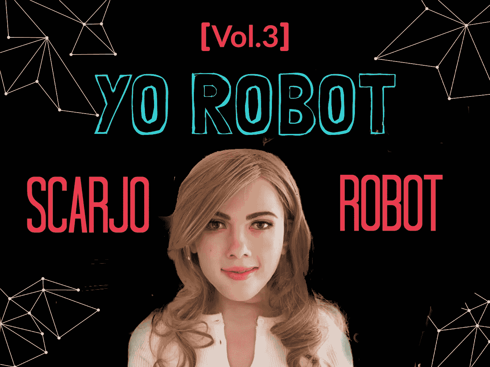

# ScarJo 机器人迫使我们考虑机器人复制品问题

> 原文：<https://medium.com/hackernoon/scarjo-robot-forces-us-to-consider-robot-replica-issues-ae447fc65fb9>

如果你某天早上醒来，通过主流媒体新闻发现香港某个不知名的家伙制造了一个和你一模一样的机器人，会怎么样？

你了解到这个二重身机器人已经被设定了一个固定的反应，*“呵呵，谢谢”*对这个家伙的评论，*“你真漂亮。”*然后呢？如果这个家伙开始和这个和你长得一模一样的机器人睡觉呢？当你晚上闭上眼睛，知道你的机器人双胞胎可能躺在某个兴奋不已的家伙旁边，你会有什么感觉？在这种情况下，一个人的权利在哪里？难道我们没有个人身份的版权吗？显然，没有任何法律禁止某人创造一个供个人使用的机器人版本。我觉得这太糟糕了。

# 在过去，一旦蜡像能够被建造成真人的精确复制品，人们就不得不面对几乎相同的法律问题。

*Image Source of a wax Justin Timberlake: Pixabay*

这来自于 *The Verge* ，它描述了一段探索 1894 年蜡像复制品相关法律的文字:

> 从 Monson 蜡像案的结果来看，aman 有合法权利阻止复制他自己的复制品。换句话说，一个人对他自己的肖像拥有版权，并且作为任何其他版权的拥有者，拥有复制他自己的复制品的专有权——用蜡。我们不太确定这个案子在这一点上已经有了定论，但应该是这样的。关于恐怖、诽谤和可起诉的错误的讨论有点太多了。这个决定的真正原因，正如我们所说的，是侵犯了人类自己的版权。诚然，他不是自己的作者，但可以说是通过继承获得了自己的版权。无论如何，不管给予什么理由，在我们看来，一个人应该能够阻止他的假冒自我的展示才是正确的。”——[*法注*](https://books.google.com/books?id=5V1FAQAAMAAJ&pg=PA36&lpg=PA36&dq=illegal+to+make+a+wax+statue+of+someone?&source=bl&ots=RjEsrALG7Y&sig=tH7nttc4muGGUI1uROM63hgXq40&hl=en&sa=X&ved=0ahUKEwj-l7Tlru7LAhVGXR4KHfB6AyUQ6AEIVzAJ#v=onepage&q=wax%20&f=false) *经* [*濒临*](http://www.theverge.com/2016/4/1/11350276/scarlett-johansson-robot-problematic)

# 很明显，创造斯卡乔机器人的里基·马从未得到斯嘉丽·约翰逊的许可来创造她的机器人复制品。

然而，目前还不清楚这个家伙是否和他的 ScarJo 机器人一起睡觉，但他建造它的原因非常明显。显然，这不是一个性爱机器人，而是一种伴侣机器人。嗯，我们实际上不知道，但他公开声明他的机器人不是性机器人。他正在寻找投资者来大规模生产他的机器人，但如果它们看起来像他建造的机器人，他可能会面临约翰逊阵营的一场大诉讼。

故事最早由 [*镜报*](http://www.mirror.co.uk/news/weird-news/man-builds-scarlet-johansson-robot-7667715) *报道。*

# 那么，这家伙到底是谁？

Ricky Ma 是一名图形和产品设计师，他对机电、编码或机器人一无所知。他花了大约一年半的时间来完成他的机器人，而且是他自己完成的。他承认从零开始建造所有部件是相当困难的。马说，“在这个过程中，很多人会问‘你是不是傻了？这要花很多钱。你知道怎么做吗？这真的很难。"

据路透社摄影记者[报道此事的叶竞生](https://widerimage.reuters.com/story/building-a-humanoid-hollywood-star)，

> “作为对称赞‘马克 1 号，你太美了’的回应，它的眉毛和眼睛周围的肌肉放松，嘴角上扬，露出一个看起来很自然的微笑，它说，‘呵呵，谢谢。’”——路透社，[叶竞生](https://widerimage.reuters.com/story/building-a-humanoid-hollywood-star)

有趣的是，他把斯嘉丽·约翰松的二重身机器人命名为马克 1 号。他还告诉路透社记者，在他的城市里很少有人理解他制造机器人的使命。马承认，他从小就痴迷于制造机器人。他说他小时候喜欢动画和卡通，并且从未停止过对它们的喜爱。

*Image Source: Pixabay*

人形机器人的硅胶皮肤覆盖了一个 3D 打印的骨架，其中 70%是使用 3D 打印技术制作的。标记 1 对一组编程的口头命令作出反应。机器人可以用胳膊和腿做简单的动作，还可以转头和鞠躬。此外，马克 1 可以创建非常详细的面部表情。

马说，建造马克一号是梦想成真。用他自己的话说，“如果我实现了我的梦想，我这辈子就没有遗憾了。”

真正奇怪的是，里奇甚至拒绝提及他的机器人长得和斯嘉丽·约翰逊一模一样。这几乎就像他生活在某种对现实的怪异否认中，但物理证据是如此痛苦地明显。在许多方面，里基·马确实让我想起了一个孩子，一个不太考虑在没有得到他们同意的情况下创造一个人类机器人复制品的后果的孩子。

对于这种情况，The Verge 也表达了类似的观点:

> *“实际上在 1992 年有一个案例***一家公司制作了一个机器人万纳·怀特的广告，被人类万纳·怀特告上了法庭。但那是广告。我不知道你能否阻止人们制造一个你的机器人复制品供个人使用。不过，看起来你应该这么做，因为这真的令人不安。我认为这也与《魔法奇兵》中的魔法机器人有关，教训是不要在没有他们明确同意的情况下制造机器人复制品。”——**

**很明显，需要制定一些明确的法律来保护个人身份不被复制和以机器人的形式制造。Ricky Ma 的 ScarJo 机器人，我认为加速了人类重新思考机器人复制品相关法律的进程。很明显，需要出台一些新的法律来保护机器人复制品的身份权。我们最好在汉森机器人公司与 DeepMind 和波士顿动力公司合作之前尽快完成这项工作，并在《西部世界》中创造出与你一模一样的现实世界。**

**请求许可非常简单。这似乎不是一件很难要求的事情。**

************

> **[黑客中午](http://bit.ly/Hackernoon)是黑客如何开始他们的下午。我们是阿妹家庭的一员。我们现在[接受投稿](http://bit.ly/hackernoonsubmission)并乐意[讨论广告&赞助](mailto:partners@amipublications.com)机会。**
> 
> **如果你喜欢这个故事，我们推荐你阅读我们的[最新科技故事](http://bit.ly/hackernoonlatestt)和[趋势科技故事](https://hackernoon.com/trending)。直到下一次，不要把世界的现实想当然！**

****