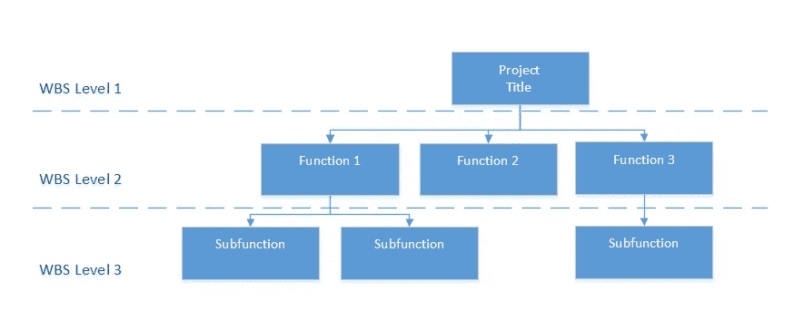
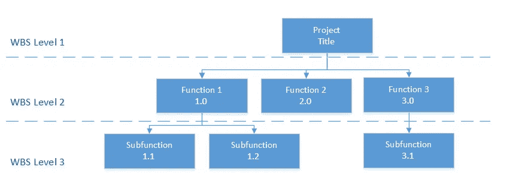

# 进度安排和工作分解结构

> 原文：<https://medium.com/hackernoon/schedule-management-is-a-cornerstone-of-good-project-management-7e065b4f86b8>

进度管理是良好项目管理的基石。如何制定时间表和如何管理时间表同样重要。在过去 15 年多的时间里，我查看了许多不同的时间表:在一张纸上手绘的任务(是的，有一次是在餐巾纸上)到强大的时间表软件中的 30，000 多个活动。根据项目的性质，有几个活动的手绘图表可能会有用。然而，通常情况下，需要计划帮助的项目无法通过一张纸上的草图来实现。这就是合适的时间表开发和管理的地方。

一个好的或坏的时间表的一个关键区别是，它可以用来正确地执行一个项目，而不是一个只是为了展示而打印的时间表，是如何开发和组织时间表的。制定进度计划的基础是创建工作分解结构(WBS)。这是一个层次结构，将项目中需要完成的所有工作分类到最低的可管理元素中。从最高级别的工作开始，然后确定每个级别下的从属元素。一个典型的项目有 3-5 个层次的工作分解结构。有些人可能有更多。一些组织可能会使用 associate Level 1 WBS 作为项目名称，以区分多个项目(参见下面的示例)。

当活动开展后，它们可以列在各自的 WBS 代码下。活动和 WBS 代码的区别在于，前者是一个行动，而后者是工作或行动的分类。

在定义了等级 WBS 之后，分配一个与结构一致的数字代码。例如，顶级(级别 1)中的所有类别将被赋予代码 1.0、2.0、3.0 等。从属级别(级别 2)将是 1.1、1.2 或 2.1、2.2 或 3.1 等。，类似于大纲结构。

一旦定义了 WBS，就可以将活动添加到符合其描述的最低级别 WBS 元素下。

WBS 的一些常见错误有:

WBS 不是一个组织结构——工作不应该按照谁报告谁在做工作的结构来分类。

粒度不够——只有一个或两个级别将不会为要分解的工作提供足够的细节；因此，可能存在分配给 WBS 要素的活动不是实际活动，而是另一个较低级别的 WBS 要素的风险。粒度不够也使得跟踪和管理项目需要完成的工作和相关活动变得困难。

同一 WBS 级别之间的不一致—例如，如果 WBS 1.0 是第一阶段，WBS 2.0 是第二阶段，那么 WBS 3.0 也应该是项目的一个阶段，而不是其他。不一致的 WBS 水平在将来分析进度时会造成困难。

列为 WBS 的活动—所有与行动相关的项目都不应是 WBS。它们应该是列在各自 WBS 代码下的任务或活动。

请记住，在时间表制定过程中定义良好的 WBS 将允许在执行过程中利用 WBS 管理项目的各种工作要素时更有效地使用时间表。

> [黑客中午](http://bit.ly/Hackernoon)是黑客如何开始他们的下午。我们是 [@AMI](http://bit.ly/atAMIatAMI) 家庭的一员。我们现在[接受投稿](http://bit.ly/hackernoonsubmission)，并乐意[讨论广告&赞助](mailto:partners@amipublications.com)机会。
> 
> 如果你喜欢这个故事，我们推荐你阅读我们的[最新科技故事](http://bit.ly/hackernoonlatestt)和[趋势科技故事](https://hackernoon.com/trending)。直到下一次，不要把世界的现实想当然！

