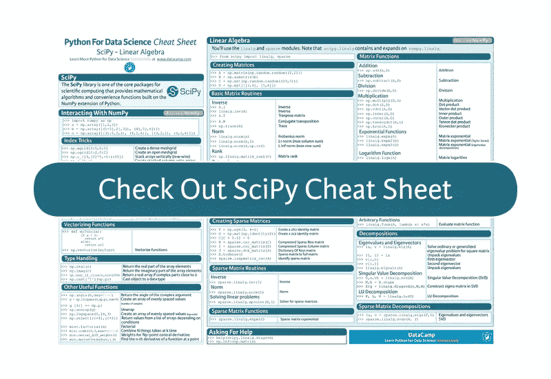

# SciPy 备忘单:Python 中的线性代数

> 原文：<https://medium.com/hackernoon/scipy-cheat-sheet-linear-algebra-in-python-6de942976ca0>

*最初发布于*[*https://www . data camp . com/community/blog/python-scipy-cheat-sheet*](https://www.datacamp.com/community/blog/python-scipy-cheat-sheet)

到现在为止，你应该已经知道了 NumPy，科学计算的基础包之一，至少在某种程度上形成了其他重要包的基础，你可以用它来进行数据操作和 Python 的机器学习。其中一个包是 SciPy，这是 Python 中科学计算的另一个核心包，它提供了基于 Python 的 NumPy 扩展的数学算法和便利函数。

你现在可能想知道为什么这个库会对数据科学[有用。](https://hackernoon.com/tagged/data-science)

嗯，SciPy 有许多模块可以帮助你理解学习数据科学时需要掌握的一些基本组件，即数学、统计和机器学习。你可以在这里找到学习数据科学还需要解决的其他事情[。你会看到，对于统计数据，例如，`scipy.stats`等模块。你肯定会感兴趣的。](https://www.datacamp.com/community/tutorials/learn-data-science-infographic)

提到的另一个主题是机器学习:在这里，`scipy.linalg`和`scipy.sparse`模块将提供你正在寻找的理解机器学习概念的一切，如特征值、回归和矩阵乘法...

但是，可能最明显的是，大多数机器学习技术处理高维数据，并且数据通常被表示为矩阵。更重要的是，你需要理解如何操作这些矩阵。

这就是为什么 DataCamp 制作了一个 SciPy cheat sheet 来帮助你用 Python 掌握线性代数。

点击下面的按钮查看一下:

点击[此处](https://www.datacamp.com/community/blog/python-scipy-cheat-sheet)查看完整的备忘单。

您将看到这个 SciPy 备忘单涵盖了您需要开始学习的线性代数的基础知识:它简要解释了该库必须提供的内容以及如何使用它与 NumPy 进行交互，并继续总结了线性代数中的主题，如矩阵创建、矩阵函数、可以用矩阵执行的基本例程，以及从`scipy.linalg`开始的矩阵分解。稀疏矩阵也包括在内，它们有自己的例程、函数和来自`scipy.sparse`模块的分解。

PS。不要错过我们针对数据科学的其他 Python 备忘单，它们涵盖了 [Numpy](https://www.datacamp.com/community/blog/python-numpy-cheat-sheet) 、 [Scikit-Learn](https://www.datacamp.com/community/blog/scikit-learn-cheat-sheet) 、 [Bokeh](https://www.datacamp.com/community/blog/bokeh-cheat-sheet-python) 、 [Pandas](https://www.datacamp.com/community/blog/python-pandas-cheat-sheet) 和 [Python 基础知识](https://www.datacamp.com/community/tutorials/python-data-science-cheat-sheet-basics)。

*原载于*[*www.datacamp.com*](http://www.datacamp.com/community/blog/python-scipy-cheat-sheet)*。*

> 黑客中午是黑客如何开始他们的下午。我们是这个家庭的一员。我们现在[接受投稿](http://bit.ly/hackernoonsubmission)并乐意[讨论广告&赞助](mailto:partners@amipublications.com)机会。
> 
> 如果你喜欢这个故事，我们推荐你阅读我们的[最新科技故事](http://bit.ly/hackernoonlatestt)和[趋势科技故事](https://hackernoon.com/trending)。直到下一次，不要把世界的现实想当然！

