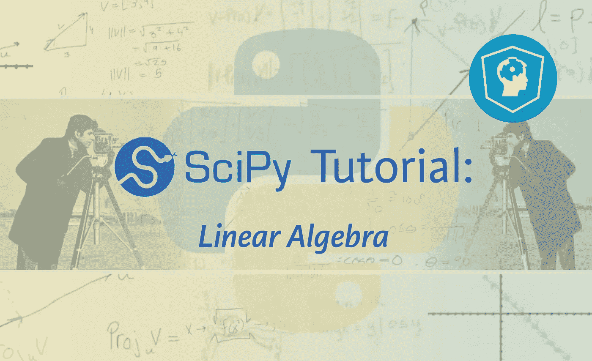
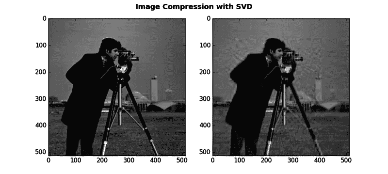

# 科学教程:线性代数

> 原文：<https://medium.com/hackernoon/scipy-tutorial-linear-algebra-ea0809c42086>



如果你想了解为什么你应该学习线性代数或 SciPy 用于[数据科学](https://hackernoon.com/tagged/data-science)或者当你使用 SciPy 时哪些 NumPy 函数是有用的，请查看[完整教程](https://www.datacamp.com/community/tutorials/python-scipy-tutorial)。

现在你已经知道了使用这两个软件包的好处，是时候深入本教程的主题:线性代数了。

# 准备工作区:安装 SciPy

但是在您开始使用 Python 之前，请确保您的工作空间已经完全准备好了！

当然，你首先需要确保你已经安装了 Python。如果您仍然需要这样做，请转到[本页](https://www.python.org/downloads/):)如果您正在使用 Windows，请确保您已经将 Python 添加到 PATH 环境变量中。此外，不要忘记安装一个包管理器，比如`pip`，它将确保您能够使用 Python 的开源库。

请注意，Python 3 的最新版本附带了 pip，所以请仔细检查您是否有 pip，如果有，请在安装任何其他包之前升级它:

```
pip install pip --upgrade pip --version
```

但是仅仅安装一个包管理器是不够的；你还需要下载库的轮子:点击[这里](http://www.lfd.uci.edu/~gohlke/pythonlibs/#scipy)获得你的 SciPy 轮子。下载完成后，在 pc 上的下载目录下打开终端并安装。此外，您可以检查安装是否成功，并确认您正在运行的软件包版本:

```
# Install the wheel 
install "scipy‑0.18.1‑cp36‑cp36m‑win_amd64.whl"

# Confirm successful install 
import scipy # Check package version 
scipy.__version__
```

完成这些步骤后，你就可以开始 goy 了！

**提示**:通过下载 Anaconda Python 发行版来安装包。这是一个快速入门的简单方法，因为 Anaconda 不仅包括 100 个最流行的]([https://docs.continuum.io/anaconda/pkg-docs](https://docs.continuum.io/anaconda/pkg-docs))Python、R 和 Scala 数据科学包，还包括几个开放课程开发环境，如 Jupyter 和 Spyder。如果你想开始使用 Jupyter 笔记本，请查看这个 [Jupyter 笔记本教程](https://www.datacamp.com/community/tutorials/tutorial-jupyter-notebook)。

如果您还没有下载，请点击[这里](https://www.continuum.io/downloads)下载。

# 线性代数:向量和矩阵

现在您已经确保您的工作空间已经准备好了，您终于可以开始使用 Python 学习线性代数了。本质上，这门学科主要研究向量空间和向量空间之间的线性映射。这些线性映射可以用矩阵来描述，这样也更容易计算。

**记住**向量空间是线性代数中的一个基本概念。这是一个空间，你有一个对象(向量)的集合，你可以添加或缩放两个向量，而不会产生离开空间的向量。还要记住，向量是矩阵的行(或列)。

但是这在 Python 中是如何工作的呢？

你可以用`np.array()`函数轻松创建一个矢量。同样，你可以用`np.matrix()`或`np.mat()`命令给每个一维或二维`ndarray`一个矩阵结构。

所以数组和矩阵是一样的，除了格式？

不完全是。有一些不同之处:

*   矩阵是二维的，而数组通常是二维的`n`，
*   正如上面的函数已经暗示的，矩阵是`ndarray`的子类，
*   数组和矩阵都有`.T()`，但是只有矩阵有`.H()`和`.I()`，
*   矩阵乘法的工作方式不同于基于元素的数组乘法，并且
*   除此之外，`**`操作对矩阵和数组有不同的结果

当你处理矩阵时，有时你可能会遇到一些大部分元素为零的矩阵。这些矩阵被称为“稀疏矩阵”，而大多数非零元素的矩阵被称为“密集矩阵”。

就其本身而言，这似乎是微不足道的，但是当您使用 SciPy 处理线性代数时，这有时会对您用来完成某些事情的模块产生影响。更具体地说，您可以对密集矩阵使用`scipy.linalg`，但是当您处理稀疏矩阵时，您可能还想考虑检查一下`scipy.sparse`模块，它也包含自己的`scipy.sparse.linalg`。

对于稀疏矩阵，有相当多的选择来创建它们。点击[此处](https://www.datacamp.com/community/tutorials/python-scipy-tutorial)阅读所有选项。

确实有很多选择，但是如果你自己在做一个稀疏矩阵，你应该选择哪一个呢？

没那么难。

基本上，它归结为首先是你如何初始化它。接下来，考虑你想用你的稀疏矩阵做什么。

更具体地说，您可以通过下面的清单来决定您想要使用什么类型的稀疏矩阵:

*   如果您计划用数字一个接一个地填充矩阵，选择一个`coo_matrix()`或`dok_matrix()`来创建您的矩阵。
*   如果你想用一个数组作为对角线来初始化矩阵，选择`dia_matrix()`来初始化你的矩阵。
*   对于基于切片的矩阵，使用`lil_matrix()`。
*   如果你正在从更小的矩阵块中构建矩阵，考虑使用`bsr_matrix()`。
*   如果你想快速访问你的行和列，分别使用`csr_matrix()`和`csc_matrix()`函数转换你的矩阵。当你需要初始化矩阵时，最后两个函数不是很好选择，但是当你乘法时，你肯定会注意到速度的不同。

很简单！

# 向量运算

现在，您已经了解或刷新了向量、密集矩阵和稀疏矩阵之间的区别，是时候进一步了解向量以及可以用它们进行什么样的数学运算了。本教程在这里明确地集中在数学运算上，这样你将会看到与矩阵的相似和不同之处，因为线性代数的很大一部分最终是与矩阵一起工作的。

您已经看到，您可以使用`np.array()`轻松创建一个矢量。但是现在您已经掌握了向量，您可能还想知道可以对它们执行的一些基本操作。

现在你已经成功地看到了一些向量运算，是时候开始真正的矩阵运算了！

# 矩阵:操作和例程

类似于您在上一节开始时离开的地方，您知道如何创建矩阵，但是您还不知道如何利用它们。本节将为您提供一些矩阵函数和基本矩阵例程的概述，您可以使用这些函数和例程来提高工作效率。

首先，让我们复习一些函数。如果您以前使用过 NumPy，这些功能会很容易实现，但是即使您还没有任何使用经验，您也会发现这些功能很容易实现。

让我们看一些函数的例子。

有`np.add()`和`np.subtract()`用于加减数组或矩阵，还有`np.divide()`和`np.multiply`用于除法和乘法。这看起来真的不像一个大博物馆，不是吗？同样，你在上一节看到的用于计算点积的`np.dot()`函数也可以用于矩阵。但是不要忘记传入两个矩阵而不是向量。

这些都是基本的吧？

让我们稍微简单一点。说到乘法，还有一些其他的函数可以考虑，比如`np.vdot()`用于向量的点积，`np.inner()`或`np.outer()`用于数组的内积或外积，`np.tensordot()`和`np.kron()`用于两个数组的克罗内克积。

除此之外，考虑`linalg`模块的一些功能也是有用的:矩阵指数函数`linalg.expm()`、`linalg.expm2()`和`linalg.expm3()`。这三者的区别在于计算指数的方式。对于一般的矩阵指数，坚持使用第一种方法，但是一定要尝试这三种方法，看看结果有什么不同！

还有三角函数如`linalg.cosm()`、`linalg.sinm()`、`linalg.tanm()`，双曲三角函数如`linalg.coshm()`、`linalg.sinhm()`、`linalg.tanhm()`，符号函数`linalg.signm()`，矩阵对数`linalg.logm()`，矩阵平方根`linalg.sqrtm()`。

此外，您还可以借助`linalg.funm()`函数评估矩阵函数。比如查看[原创教程](https://www.datacamp.com/community/tutorials/python-scipy-tutorial)。

您会看到，您传入了一个要将函数作为第一个参数应用到的矩阵，以及一个要应用到所传矩阵的函数(在本例中是 lambda 函数)。注意，传递给`linalg.funm()`的函数必须是矢量化的。

现在让我们来看看一些基本的矩阵程序。您可能想检查的第一件事是矩阵属性:`T`表示转置，`H`表示共轭转置，`I`表示逆，而`A`表示转换为数组。

当你转置一个矩阵时，你创建了一个新的矩阵，它的行是原矩阵的列。另一方面，共轭转置交换每个矩阵元素的行和列索引。矩阵的逆矩阵是这样一个矩阵，如果它与原矩阵相乘，就会得到一个单位矩阵。

但是除了这些属性之外，还有一些实函数可以用来执行一些基本的矩阵例程，比如分别用于转置和矩阵求逆的`np.transpose()`和`linalg.inv()`。

除此之外，还可以用`np.trace()`检索主矩阵对角线上元素的迹或和。类似地，您也可以使用 NumPy 中的`linalg.matrix_rank`来检索矩阵秩或数组中大于某个阈值的奇异值分解奇异值的数量。

如果矩阵秩暂时没有意义，也不用担心；在本教程的后面部分，你会看到更多的内容。

现在，让我们关注另外两个您可以使用的例程:

*   矩阵的范数可以用`linalg.norm`计算:矩阵范数是根据矩阵的元素定义的数。范数是一个有用的量，它可以给出关于矩阵的重要信息，因为它告诉你元素有多大。
*   除此之外，您还可以计算行列式，这是一个有用的值，可以用`linalg.det()`从方阵的元素中计算出来。行列式将方阵归结为一个单一的数，这个数决定了方阵是否可逆。

最后，解大型线性方程组是矩阵最基本的应用之一。如果你有一个 Ax = b 的系统，其中 A 是一个方阵，b 是一个一般矩阵，你有两种方法可以用来求 x，当然这取决于你使用的矩阵类型。如需代码示例，请点击[此处](https://www.datacamp.com/community/tutorials/python-scipy-tutorial)。

求解稀疏矩阵，可以用`linalg.spsolve()`。当您无法求解该方程时，仍有可能在`linalg.lstsq()`命令的帮助下获得一个近似值\(x\)。

**提示**:不要错过 DataCamp 的 [SciPy 小抄](https://www.datacamp.com/community/blog/python-scipy-cheat-sheet)。

# 用 SciPy 实现机器学习的线性代数

既然你已经得到了如何创建矩阵以及如何使用它们进行数学运算的线索，那么是时候解决一些更高级的主题了，你需要真正进入[机器学习](https://hackernoon.com/tagged/machine-learning)。

## 特征值和特征向量

你要解决的第一个问题是特征值和特征向量。

特征值是洞察矩阵核心的新方法。但是在你深入研究之前，让我们先解释一下什么是特征向量。当向量乘以矩阵时，几乎所有的向量都会改变方向。然而，某些例外的结果向量与乘法结果向量的方向相同。这些是特征向量。

换句话说，将一个特征向量乘以一个矩阵，乘法的结果向量等于原特征向量乘以λ，特征值:Ax =λx。

这意味着特征值给你提供了非常有价值的信息:它告诉你一个特征向量是否被拉伸、收缩、反转或保持不变——当它乘以一个矩阵时。

您使用来自`linalg` SciPy 模块的`eig()`函数来解决方阵的普通或广义特征值问题。

注意`eigvals()`函数是另一种解包矩阵特征值的方式。

当您处理稀疏矩阵时，您可以依靠模块`scipy.sparse`为您提供正确的函数来查找特征值和特征向量:

```
la, v = sparse.linalg.eigs(myMatrix,1)
```

**注意**上面的代码指定了必须检索的特征值和特征向量的数量，即 1。

特征值和特征向量是许多计算机视觉和机器学习技术中的重要概念，如用于降维的主成分分析(PCA)和用于[人脸识别的特征脸](http://scikit-learn.org/stable/auto_examples/applications/face_recognition.html)。

## 奇异值分解

接下来，如果你想真正学习数据科学，你需要了解 SVD。矩阵 a 的奇异值分解是将 a 分解成三个矩阵的乘积:a = u * \σ* v^t.

如果你知道矩阵 A 的大小为 M * N，那么各个矩阵的大小如下:

*   矩阵 U 的大小是 M * M
*   矩阵 V 的大小是 N * N
*   矩阵适马的大小是 M * N

*表示矩阵相乘，你在 V^t 看到的^t 表示矩阵转置，这意味着行和列互换。

简而言之，奇异值分解提供了一种将矩阵分解成更简单、更有意义的部分的方法。这些片段可能包含一些我们感兴趣的数据。在这里找到一个例子。**注意**对于稀疏矩阵，你可以使用`sparse.linalg.svds()`函数来执行分解。

如果您是数据科学的新手，矩阵分解对您来说将是相当不透明的:您可能不会立即看到任何应用它的用例。但是奇异值分解在许多任务中是有用的，例如数据压缩、降噪和数据分析。您将看到如何使用 SVD 来压缩图像:



有关这些图像的代码，请参见本页。

还考虑以下使用 SVD 的示例:

*   SVD 与用于降维的主成分分析(PCA)密切相关:两者都会产生一组“新轴”,这些轴由数据的特征空间轴的线性组合构成。这些“新轴”根据每个方向对数据方差的贡献来分解数据点中的方差。要查看 PCA 如何处理数据的具体示例，请访问我们的 [Scikit-Learn 教程](https://www.datacamp.com/community/tutorials/machine-learning-python)。
*   另一个链接是数据挖掘和自然语言处理(NLP):潜在语义索引(LSI)。这是一种用于文档检索和单词相似性的技术。潜在语义索引使用 SVD 将文档分组到可能由这些文档中的不同单词组成的概念中。不同的词可以组合成一个概念。同样在这里，SVD 减少了单词和它们的文档之间的噪声相关性，并且减少了原始数据的维数。

您知道，SVD 是您的数据科学之旅中的一个重要概念，您必须了解它。这就是为什么您应该考虑比本教程所涵盖的更深入地研究 SVD:例如，转到[本页](https://jeremykun.com/2016/04/18/singular-value-decomposition-part-1-perspectives-on-linear-algebra/)阅读更多关于矩阵分解的内容。

[点击此处阅读更多

*最初发表于*[*【www.datacamp.com】*](http://www.datacamp.com/community/tutorials/python-scipy-tutorial)*。*

[](http://bit.ly/HackernoonFB)[](https://goo.gl/k7XYbx)[](https://goo.gl/4ofytp)

> [黑客中午](http://bit.ly/Hackernoon)是黑客如何开始他们的下午。我们是 [@AMI](http://bit.ly/atAMIatAMI) 家庭的一员。我们现在[接受投稿](http://bit.ly/hackernoonsubmission)并乐意[讨论广告&赞助](mailto:partners@amipublications.com)机会。
> 
> 如果你喜欢这个故事，我们推荐你阅读我们的[最新科技故事](http://bit.ly/hackernoonlatestt)和[趋势科技故事](https://hackernoon.com/trending)。直到下一次，不要把世界的现实想当然！

