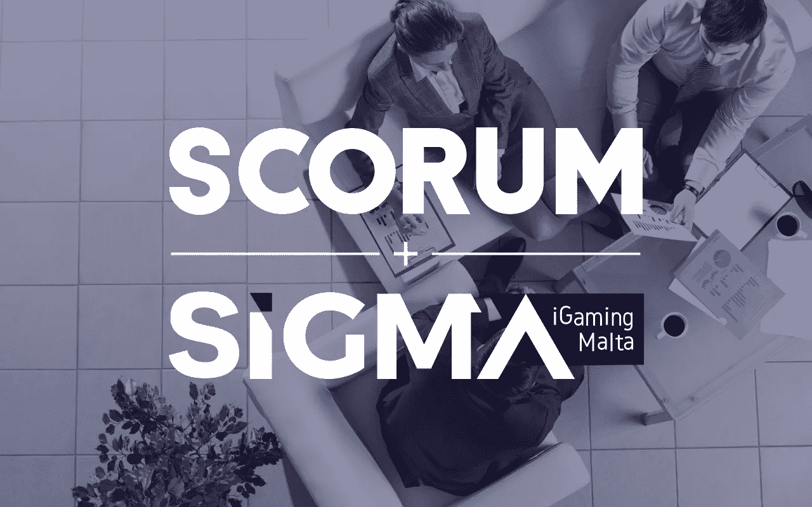
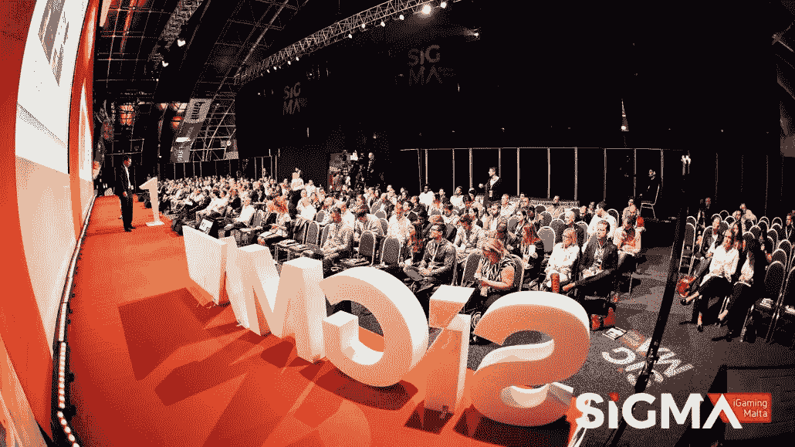
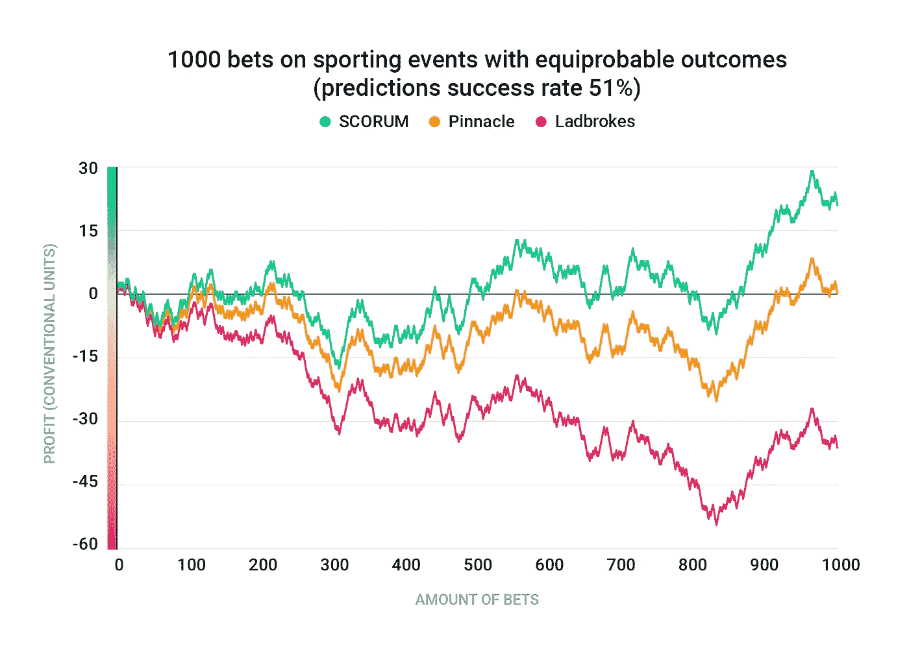

# Scorum 和 SiGMA 联手开放加密货币博彩解决方案进行整合

> 原文：<https://medium.com/hackernoon/scorum-and-sigma-join-forces-to-open-a-cryptocurrency-betting-solution-for-integration-8a1157861d21>

## 最近，我们宣布了与 SiGMA 的合作。

对此消息的回应引出了一些关于我们体育博彩解决方案细节的问题。[正如](https://maltaigamingsummit.com/latest-news/a-global-sports-betting-solution-provided-by-sports-media-platform-scorum/)所说，我们将在我们的 Scorum 平台上推出它，并允许其他开发者在我们的区块链上构建定制的博彩解决方案。

> 马耳他 iGaming(SiGMA)峰会是最大的活动，每年秋季在地中海举办一次，汇集了在线赌博、游戏和体育博彩行业的巨头。随着该行业各方面的持续稳定增长，游戏世界中的进步玩家自然会接受区块链理工大学提供的实用工具。

SiGMA 认可 Scorum 提供的优质博彩解决方案，并表示他们**愿意支持我们**，并帮助我们的团队与第三方开发商和其他相关方联系。

## 【SiGMA 在 Scorum 的博彩解决方案中看到了什么

Scorum 热衷于提供它的**免佣金博彩交换，供其他开发者和感兴趣的已建立的菲亚特在线博彩公司整合**。对于 Scorum 来说，这将是一个增加 SCR 令牌效用的好机会，并且**支持加密货币在全球体育迷和赌客中的大规模采用**。

虽然很多人都说主要加密货币的交易速度不够快，不足以维持大量的交易，但 **Scorum 基于石墨烯的区块链将能够维持每秒超过 3000 笔交易的流量**。这使得它特别适合国际体育博彩行业。石墨烯框架的高容量性能已经在几个项目中得到证明，并且不用担心密码猫堵塞网络！

不仅如此，分布式数字账本(区块链)的开放和透明性质意味着所有的赌注、付款和赔率都将被立即记录**并可供所有人查看**。通过使用授权的利益一致证明，当涉及到交易中的公平支付时，将没有可信任的中央权威。投注者可以肯定，他们的赌注将支付正确的赔率。

## Scorum 的博彩交易所为全世界热切的投注者提供零交易或佣金。

在下面的图表中，我们比较了 Scorum 的免佣金解决方案(0%利润率)与全球体育博彩平台 Pinnacle (2%利润率)和 Ladbrokes (6%利润率)相比，如何增加投注者的利润。简单地说，我们将使用一个例子，其中两个结果之一是预期的(英超联赛的总进球数)。为了便于理解，取足球总得分 2.5(有两种结果的事件)，并假设相同的概率超过/低于。两种结果都没有余量，我们得到系数 2.0。幅度为 2% — 1.961，幅度为 6% — 1.887。这种比率降低的距离效应是巨大的。显示的是 1000 个赌注的结果，其中 51%正确预测，随机排序为正和负。

正如你所看到的，面对 6%利润的赌博者在 1000 次赌博中最终会下跌超过 37 个单位，即使他们在大多数情况下预测正确。如果每次下注 10 美元，损失将超过 370 美元。Pinnacle 的赌客运气更好，但最终只能打平，这是一个在如此多的下注后令人遗憾的无聊结果。

Scorum 的利润率为 0%,**收益很明显**,因为在 1000 次下注后，下注者增加了 20 个单位——如果每次下注 10 美元，回报为 200 美元。由于保证金不会侵蚀他们的奖金，狂热的、临时的和新的投注者可以测试他们的分析投注技巧，并且**将他们所有的收入带回家**。

再加上深入的体育统计中心和博客平台中最新的众包体育报道，Scorum 为其用户提供了实时智能下注的所有工具。

## **了解最新动态，联系 Scorum 团队:**

*   前往我们的[网站](https://www.scorumcoins.com/en-us/)并注册[附属计划](/@scorum/believe-in-blockchain-tech-and-love-sports-a5daaf051f89)
*   加入我们为 Steemit 会员推出的特别[奖励计划](https://hackernoon.com/how-to-follow-these-steps-to-join-the-special-bounty-program-for-steemians-7af18bb9117d)
*   在[电报](https://telegram.me/SCORUM)或这里的评论中询问我们任何事情
*   关注脸书[和推特](https://www.facebook.com/SCORUM.COMMUNITY/)上的最新消息