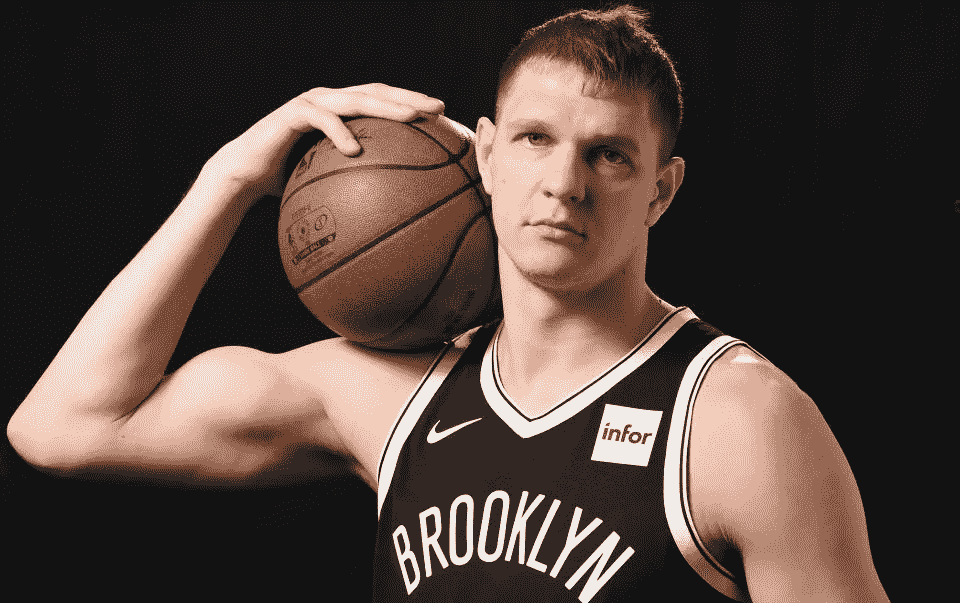
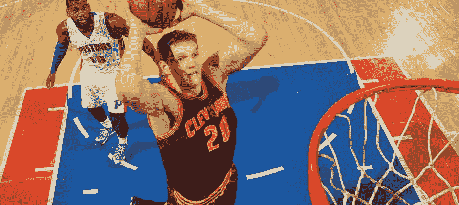

# Scorum 品牌大使:NBA 冠军提莫菲·莫兹戈夫

> 原文：<https://medium.com/hackernoon/scorum-brand-ambassador-timofey-mozgov-nba-champion-842b9489259d>

## 提莫菲·莫兹戈夫是 Scorum 品牌的官方形象大使。

他不仅支持产品理念，还作为顾问为产品使命的实现做出贡献。Timofey 很早就加入进来，帮助我们准备产品路线图和融资活动，在 Scorum 发布后，他将和我们一起**鼓励其第一批活跃用户**。

在 Scorum，我们看到[体育媒体的未来](/@scorum/five-reasons-to-believe-in-scorum-from-amazing-audience-to-stable-economy-41c733fd7a12)是一个更加开放、包容和互联的空间，运动员和粉丝可以在全球范围内互动。职业运动员通常非常进步，社交媒体上运动员粉丝互动的增加清楚地表明，今天的职业运动员需要**与支持他们的粉丝保持有益的联系**。

当我们联系蒂莫菲，告诉他我们对体育和社交媒体发展的想法时，他立刻表示出了兴趣。他很高兴将自己在体育行业的见解和经验添加到 Scorum 中，以便成为加密货币日益普及的先锋。

## Timofey 知道努力工作会得到回报，他可以看到这种情况在 Scorum 上发生:

## 以下是 Timofey 支持 Scorum 的几种方式:

*   NBA 比赛门票抽奖，有机会在赛后与莫兹戈夫见面聊天
*   通过 Scorum 的平台与 Mozgov 进行实时在线聊天
*   Scorum 上的个人博客帖子和更新
*   活跃用户和粉丝将在 Scorum Fest 上与 Mozgov 见面并打招呼
*   还有更多…

我们将依靠他的投入，将 Scorum 发展成为一个对每个热爱体育的人都有需求的平台，从成熟的专业人士到狂热的业余爱好者，再到大批粉丝。Mozgov 认为 Scorum 是所有运动员在不久的将来与粉丝建立更紧密联系的绝佳机会。

身高超过 7 英尺(215 厘米)，大个子提莫菲·莫兹戈夫在俄罗斯球队效力了五年，开始了他的职业生涯，然后在 2010 年被纽约尼克斯队签下，进入 NBA。他在顶级联赛的第一年表现突出，包括在尼克斯 124-106 击败底特律活塞队的比赛中得到 23 分和 14 个篮板。在丹佛掘金队的四年里，他一直保持着出色的表现。

在 2015-2016 赛季效力于克里夫兰骑士队时，蒂莫菲是第一个在 2015 年参加 NBA 总决赛的俄罗斯人，并在第二年回归，为骑士队的失利报仇，并成为第一个赢得 NBA 总冠军的俄罗斯人(与队友萨沙·考恩一起)。

在为俄罗斯国家队在欧洲打了一个夏天的比赛后，蒂莫菲现在效力于布鲁克林篮网队。关于蒂莫菲的最新片段，请在 Instagram 上关注他。

除了 Mozgov，Scorum 已经得到了其他杰出运动员**的支持。**

## 成为 Scorum 上的运动员意味着什么？

*   作为统计中心内的一个实体获得参与奖励
*   一个**体育优化博客**与支持者交流
*   一个展示最新装备的地方，粉丝可以在 Scorum 的平台上购买。

这只是 Scorum 改变游戏的几种方式。这对所有参与者来说都是一个巨大的成功！

在 YouTube[上关注我们，观看最新的运动员视频。我们欢迎所有感兴趣的运动员和粉丝加入我们的](https://www.youtube.com/channel/UCB1Tuh_-LEV3yxio_lXb_wg?view_as=subscriber)[电报聊天](https://telegram.me/SCORUM)并查看[网站](https://scorumcoins.com/en-us/)了解更多信息！