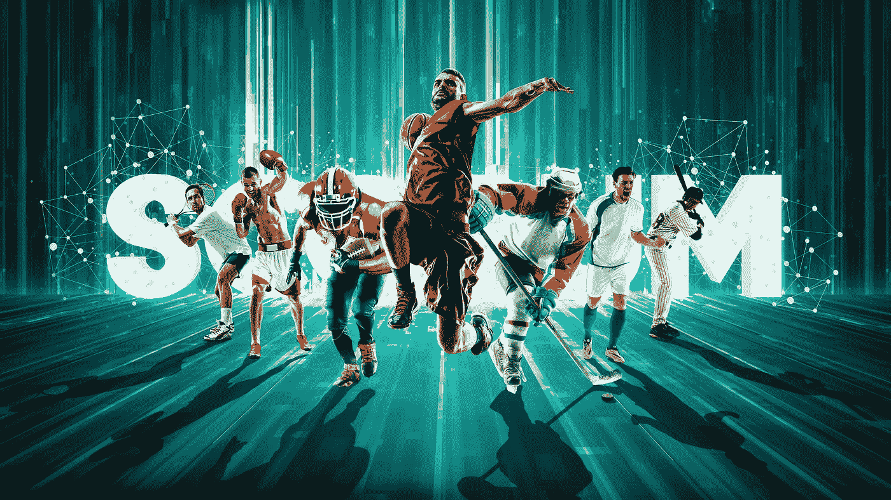
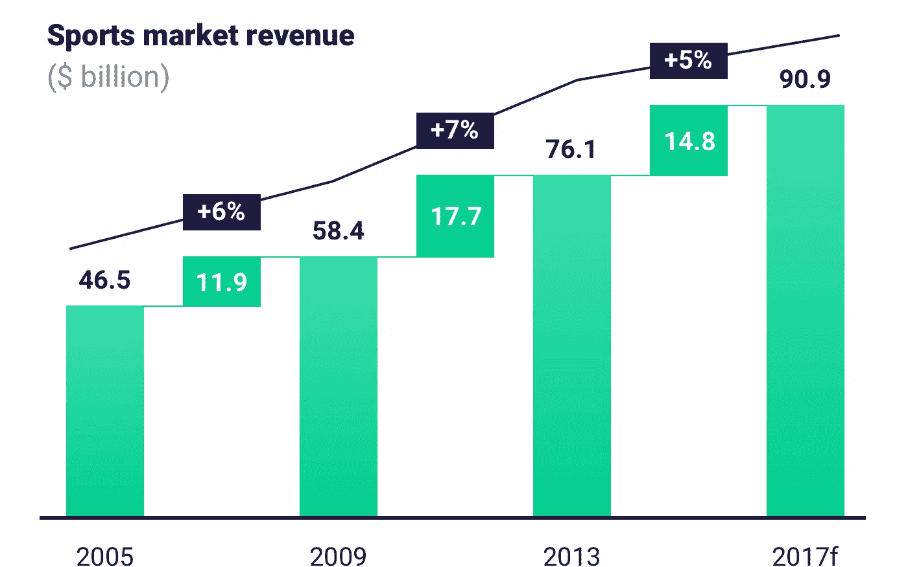

# Scorum:区块链驱动的体育媒体的未来

> 原文：<https://medium.com/hackernoon/scorum-sports-media-powered-by-blockchain-7ecc3969e495>

## 利用区块链的优点回报球迷，改变体育产业的模式。

长久以来，成熟的体育媒体行业通过向 10 亿体育迷推送广告获得了巨额收入，这些体育迷对各种各样的数字体育媒体资源进行了令人震惊的 85 亿次访问。*通过应用分散化和透明的技术，Scorum 将使全世界的球迷能够以一种令人兴奋和有益的方式与体育媒体分享和互动。*

*资料来源:* [*在体育事业中取胜*](https://www.atkearney.com/communications-media-technology/article?/a/winning-in-the-business-of-sports) *”科尔尼的报告*

出于对体育的热情，Scorum 在这里提供了一个大胆的新媒体平台，一个让粉丝参与到海量体育产业中的互动方式。我们认为每个人都有机会参与其中，分享一份成果。

> ****游戏将会完全重置一套新的规则，而不是只奖励那些从一开始就操纵规则使之对自己有利的顶层人物。@丹尼尔·杰弗里斯****

**确定了原因之后，让我们继续讨论我们希望如何改变游戏。Scorum 的核心将是创新的博客平台，作者和读者可以在这个平台上创作、策划、参与并获得回报。Scorum 处于不断发展的体育媒体领域的前沿。**

> ****根据这份** [**尼尔森报告**](http://www.nielsen.com/ma/en/insights/reports/2017/commercial-trends-in-sports-2017.html) **Scorum 命中 10 个趋势中的 5 个:****
> 
> **1.知识产权所有者控制内容和对话**
> 
> **2.体育直播在社交媒体上获得关注**
> 
> **3.随着粉丝之间的全面联系，新的收入来源不断涌现**
> 
> **4.增加数据投资，优化粉丝关系**
> 
> **5.社会责任变得更加普遍和有影响力**

# **体育迷的一站式媒体平台**

**Scorum 将有益和创新的体育媒体带回社区。这是一个包罗万象的跨平台资源，以公平透明的方式回报热情的粉丝。为了实现这一目标，我们设计了以下关键服务:**

*   ****博客平台**，内容创作和管理都将通过公平透明的经济模式获得回报。摆脱了出版业的典型限制，作家将能够访问创新的数据分析、一套为体育内容量身定制的高效编辑工具以及高质量的照片数据库。**
*   ****统计中心**将把体育数据处理推向新的高度。粉丝不仅可以浏览和挖掘关于他们喜爱的运动员或球队的统计数据，作家还可以使用微软的商业智能工具快速无缝地利用这些中心，将交互式信息图表嵌入到他们的出版物中。它将包括通过我们的合作伙伴计划和直播活动整合购买商品和服务等功能。**
*   ****免佣金博彩交易所**允许用户使用 Scorum 硬币快速下注。与 Scorum 用户的钱包相结合，再加上深入的统计分析，体育迷进入博彩世界从未如此容易。**

# **易于使用的解决方案，以区块链为后盾**

**鉴于最近分散系统的突破性发展，**区块链技术**显然是 Scorum 的基础。我们决定在[石墨烯框架](https://objectcomputing.com/resources/publications/sett/march-2017-graphene-an-open-source-blockchain/)上构建 Scorum 的区块链协议，利用一种委托的利益一致证明算法，最大限度地满足我们高流量网络的需求。随着我们越来越接近我们的[众筹](https://scorumcoins.com/)，我们将分享更多关于使用 Scorum 基础的细节。**

**我们与微软合作，在我们的统计中心使用他们的商业智能工具。传统上，这些功能只用于处理金融和商业数据，我们正在将这些功能引入体育分析领域，为球迷和作家提供深入的数据分析。**

> **我们的主要目标之一是以一种平易近人、直截了当的方式向普通用户介绍加密货币的世界。这就是为什么我们正在开发一个**方便而安全的生态系统**，以便无缝而快速地访问 Scorum 的服务。**

# **由实际价值驱动的强大经济模型**

**Scorum 经济模型是一个基于 Scorum 硬币的全面而透明的系统，旨在纳入真实的经济驱动因素:内部广告平台、照片数据库、活动广播的现场销售、门票和我们合作伙伴的其他服务。**

**我们愿景的实现将遵循三个基本原则:**

*   **我们的加密货币将得到真正的经济刺激的支持。**
*   ***系统内的所有参与者都必须从他们的参与中受益。***
*   ***利润分配应该客观公正，由用户群体来调节。***

# **认识产品背后的人**

**我们精心挑选了一个由近 30 名行业专业人士组成的优秀团队，他们正在努力开发并不断改进 Scorum。我们的领导层汇集了游戏理论、新闻、设计和先进技术实施方面的丰富行业经验和知识。**

**我们的顾问委员会包括一家成功的 IT 公司的代表，一位著名的旧金山律师的法律指导，他专门从事区块链行业的初创企业，以及著名的运动员。**

**我们与 NBA 球星提莫菲·莫兹戈夫、奥运会冠军 Alexandra Patskevich 以及所有主要运动项目的其他顶级运动员合作，将他们的经验和专业见解带到 Scorum。**

**球迷们已经准备好了一个分散的在线空间，在这里他们可以在全球范围内公开地相互交流，并在网上参与他们最喜爱的运动，从而获得公平的回报。**

**这个空间是火焰杯。**

## **对运动的热情必须得到回报。进入游戏:**

*   **在[网站](https://scorumcoins.com/)上了解更多信息，并查看[白皮书](https://scorumcoins.com/whitepaper.pdf)**
*   **【UPD 11 月 10 日:预售结束，[申请白名单](mailto:whitelist@scorumcoins.com)】[申请](mailto: presale@scorumcoins.com)预售，代币五折**
*   **加入我们的[附属计划](https://scorumcoins.com/affiliate)，从您吸引的每笔 SCR 购买中获得 5%**
*   **订阅我们的时事通讯，关注([脸书](https://www.facebook.com/SCORUM.COMMUNITY/)、[推特](https://twitter.com/SCORUM_en)、[电报](https://telegram.me/SCORUM))继续关注**