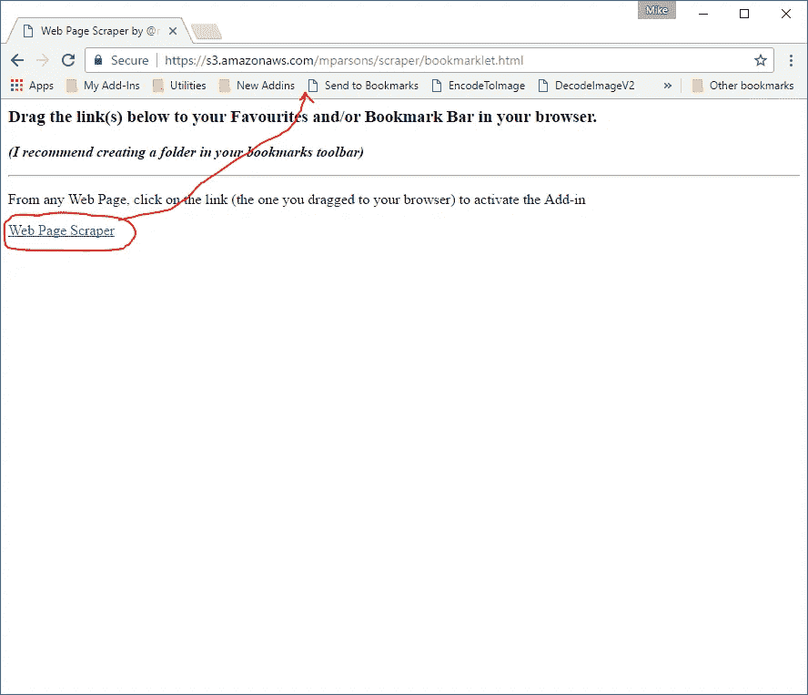
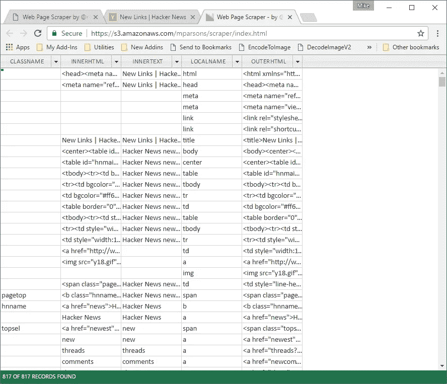
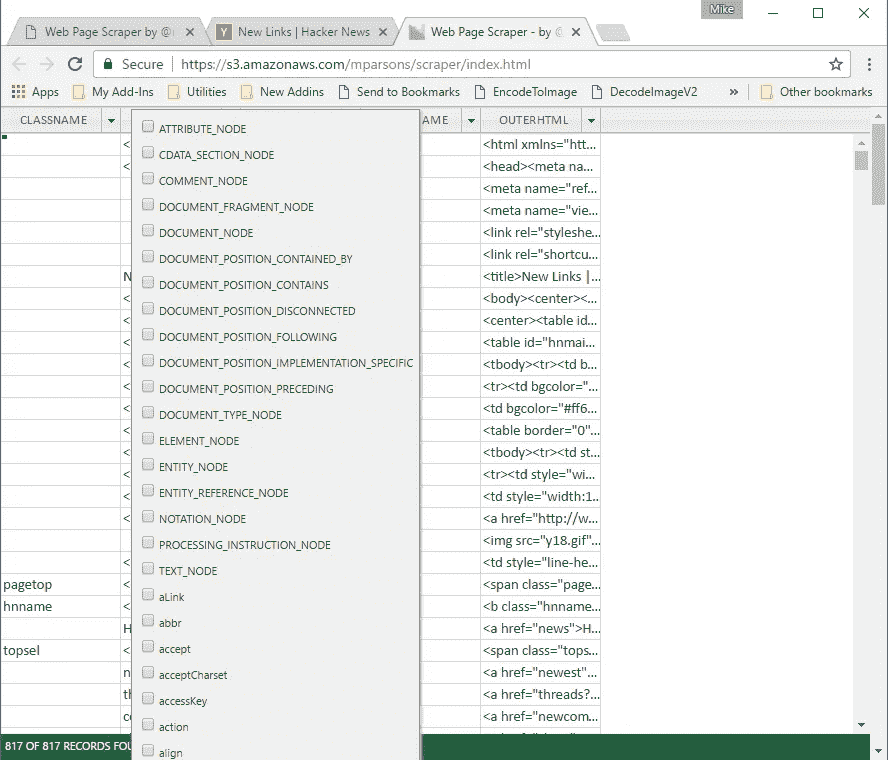
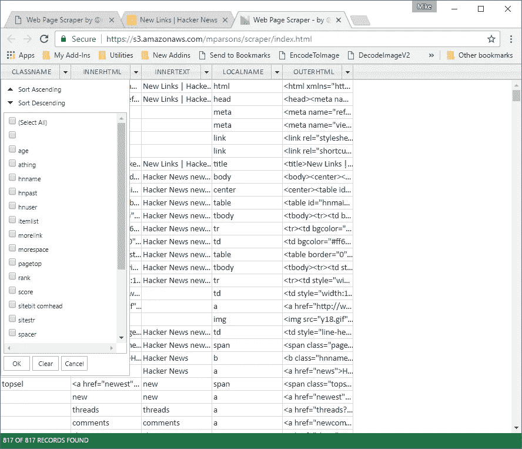
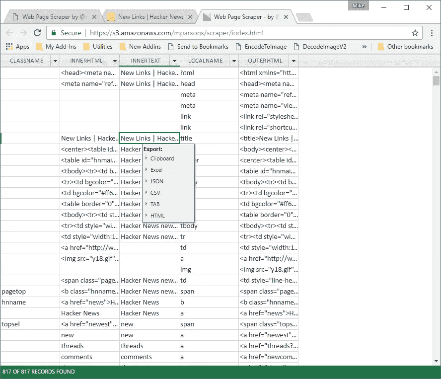

# 只需点击一下鼠标就能抓取任何网页…

> 原文：<https://medium.com/hackernoon/scrape-any-web-page-with-a-single-mouse-click-86092bb8f0b>

并可选择将其导出到剪贴板或 Excel、JSON、HTML、Tab 或逗号分隔的文件格式！

在之前的一篇文章中，我演示了如何用一条 SQL select 语句抓取任何网站。

 [## 用一条 SQL Select 语句抓取任何网站/服务/API

### 我喜欢 SQL，通过 SQL 语法的力量所能完成的事情总是让我惊讶不已。在本例中，我们…

hackernoon.com](https://hackernoon.com/scrape-any-website-service-api-with-a-single-sql-select-statement-8d60be1e9a49) 

这是一篇很受欢迎的文章，所以我决定采用不同的方法，在浏览器中完成类似的任务。在我的上一篇文章中，我使用了一种服务器端[技术](https://hackernoon.com/tagged/technology) (PhantomJS)来完成繁重的工作。在这个例子中，我们将使用一个[浏览器](https://hackernoon.com/tagged/browser)书签来使任务变得更加简单。

导航至:

 [## @mikeptweet 的网页抓取器

### 从任何网页中，单击链接(拖动到浏览器中的链接)来激活加载项

s3.amazonaws.com](https://s3.amazonaws.com/mparsons/scraper/bookmarklet.html) 

并将“网页抓取器”链接拖到浏览器工具栏上:

然后从任意一个网页，点击书签( ***即鼠标单次点击*** )来抓取网页。

**注意:您必须允许弹出窗口，因为网页抓取器使用外部浏览器窗口。**

您应该会看到类似这样的内容:

网页抓取器会加载一些默认列，但是您可以通过右键单击列标题从一堆其他列中进行选择:

您可以四处移动列，也可以对列进行筛选和排序:

一旦你有了你需要的数据，你可以把它导出成一堆格式，包括 Excel，JSON，HTML，TAB 和逗号分隔。只需右键单击网格即可导出:

这是一项正在进行的工作，您可能会注意到，包含大量元素的页面的性能很慢。我正在研究这个:-)

此外，我正在努力增加一些额外的功能，使这个工具更加有用。我将很快就此发表一篇文章。

喜欢的话请推荐这篇和我的其他文章！

 [## 迈克·帕森斯-中等

### 阅读麦克·帕森斯的作品。软件研究极客。每天，迈克·帕森斯和成千上万的其他声音…

medium.com](/@mikeptweet) 

谢了。

> [黑客中午](http://bit.ly/Hackernoon)是黑客如何开始他们的下午。我们是阿妹家庭的一员。我们现在[接受投稿](http://bit.ly/hackernoonsubmission)并乐意[讨论广告&赞助](mailto:partners@amipublications.com)机会。
> 
> 如果你喜欢这个故事，我们推荐你阅读我们的[最新科技故事](http://bit.ly/hackernoonlatestt)和[趋势科技故事](https://hackernoon.com/trending)。直到下一次，不要把世界的现实想当然！

