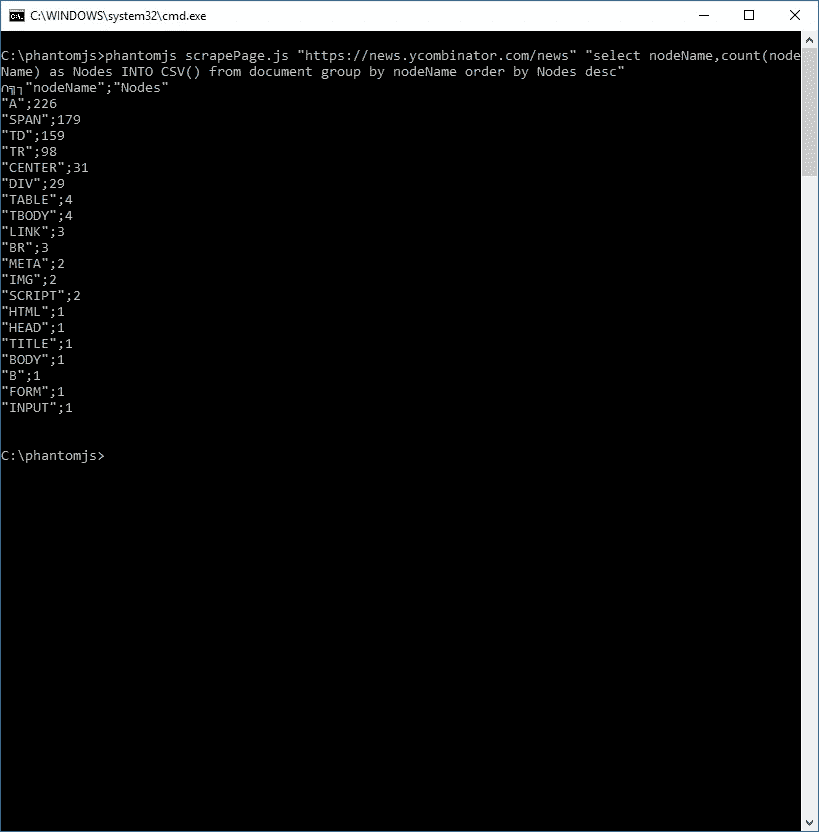
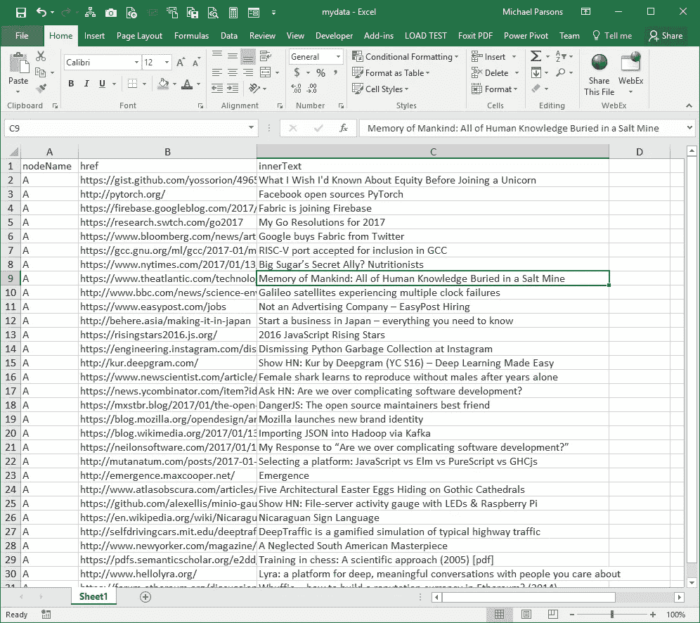
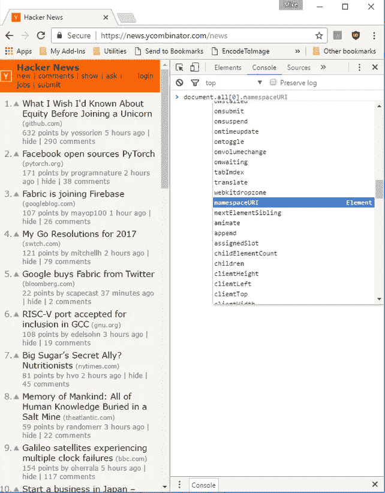

# 用一条 SQL Select 语句抓取任何网站/服务/API

> 原文：<https://medium.com/hackernoon/scrape-any-website-service-api-with-a-single-sql-select-statement-8d60be1e9a49>

我喜欢 SQL，通过 SQL 语法的力量所能完成的事情总是让我惊讶不已。在本例中，我们将创建一个简单的包装器，它将任何网页或 HTTP 端点视为一个 SQL 表，可以通过一个 SQL select 语句进行查询。此外，我们将演示如何将查询结果导出为各种有用的格式:(JSON、TEXT、TAB/CSV 分隔、EXCEL 等)。

这个例子利用了我最喜欢的应用程序之一，PhantomJS。

[](http://phantomjs.org/) [## 幻想|幻想

### 编辑描述

phantomjs.org](http://phantomjs.org/) 

PhantomJS 是一个无头的 WebKit，可以用一个 [JavaScript](https://hackernoon.com/tagged/javascript) API 来编写脚本，它支持以下功能:

## 无头网站测试

用 Jasmine、QUnit、Mocha、Capybara、WebDriver 等框架进行功能测试。[了解更多](http://phantomjs.org/headless-testing.html)

## 屏幕捕获

以编程方式捕获 web 内容，包括 SVG 和 Canvas。创建带有缩略图预览的网站截图。[了解更多](http://phantomjs.org/screen-capture.html)

## 页面自动化

使用标准的 DOM API 或 jQuery 等常用库来访问和操作网页。
[了解更多](http://phantomjs.org/page-automation.html)

## 网络监视

监控页面加载和导出为标准 HAR 文件。使用 YSlow 和 Jenkins 自动进行性能分析。[了解更多信息](http://phantomjs.org/network-monitoring.html)

结合 PhantomJS，我们还将利用来自以下网站的出色的 JavaScript [SQL](https://hackernoon.com/tagged/sql) 库- **ALASQL** :

[](http://alasql.org/) [## AlaSQL - javascript SQL 数据库库

### AlaSQL 是用纯 JavaScript 编写的，不使用浏览器 WebSQL 数据库。

alasql.org](http://alasql.org/) 

**AlaSQL**—‘àla SQL’—是一个轻量级的客户端内存 SQL 数据库，设计用于 browser 和 Node.js。

**AlaSQL** 是用纯 JavaScript 编写的，不使用浏览器 WebSQL 数据库。

AlaSQL 是一个全功能的压缩 SQL 服务器，支持连接、组、联合、ANY、ALL、IN、子查询和非常有限的事务。

**AlaSQL** 支持 ROLLUP()、CUBE()和 GROUPING SETS()函数

**AlaSQL** 适用于所有现代版本的浏览器(Chrome、Firefox、IE、Safari)、Node.js 以及移动 iOS 和 Android。

**AlaSQL** 之所以快，是因为它使用了一些优化方法。

执行我们任务的代码如下:

要实现这一点，首先需要安装 PhantomJS。说明在这里:

[](http://phantomjs.org/download.html) [## 下载|幻想

### 注意:对于这个静态构建，二进制文件是独立的。不需要安装 Qt、WebKit 或任何其他…

phantomjs.org](http://phantomjs.org/download.html) 

成功下载 PhantomJS 后，使用上面的代码创建一个名为 scrapepage.js 的新文本文件。然后，在命令提示符下，只需键入如下命令，即可开始使用该应用程序:

```
phantomjs scrapepage.js "[https://news.ycombinator.com/news](https://news.ycombinator.com/news)" "select nodeName,href,innerText from document where className='storylink' limit 5"
```

这将产生一个类似如下的列表:


或者，您可以尝试以下方法:

```
phantomjs scrapePage.js "[https://news.ycombinator.com/news](https://news.ycombinator.com/news)" "select nodeName,count(nodeName) as Nodes INTO CSV() from document group by nodeName order by Nodes desc"
```



请注意，您可以利用 ALASQL 的大多数选项，如下所述:

[](https://github.com/agershun/alasql/wiki) [## 阿格顺/阿拉 sql

### 用于浏览器和 Node.js 的 JavaScript SQL 数据库。处理传统的关系表和…

github.com](https://github.com/agershun/alasql/wiki) 

显然，您可以将查询结果通过管道传输到一个文件中，如下所示:

```
phantomjs scrapepage.js "url" "sql" > somefile.json
```

例如，让我们通过键入以下命令创建一个 Excel 电子表格:

```
phantomjs scrapepage.js "[https://news.ycombinator.com/news](https://news.ycombinator.com/news)" "select nodeName,href,innerText INTO XLSXML({headers:true}) from document where className='storylink'" > mydata.xls
```



正如你所看到的，你可以通过执行一个简单的命令将任何网页的内容转换成有用的格式。

文档表中的每一行代表网页的 HTML Dom(文档对象模型)树中的一个节点。要查看特定节点上的所有字段，请在浏览器中打开开发工具，查看控制台中的节点:



要访问节点上的子属性，请使用以下语法:

[](https://github.com/agershun/alasql/wiki/JSON) [## 阿格顺/阿拉 sql

### 用于浏览器和 Node.js 的 JavaScript SQL 数据库。处理传统的关系表和…

github.com](https://github.com/agershun/alasql/wiki/JSON) 

例如，要访问样式对象的属性，可以指定:

```
select nodeName,style->border as border from document
```

要调用方法，

```
select nodeName,attributes->getNamedItem("href") as href from document
```

本文只是触及了将 PhantomJS 与 ALASQL 结合使用的可能性的皮毛。我强烈推荐阅读这两种产品的文档，以掌握 web 页面清理的艺术。

如果你喜欢这篇文章，请推荐！

[](http://bit.ly/HackernoonFB)[](https://goo.gl/k7XYbx)[](https://goo.gl/4ofytp)

> [黑客中午](http://bit.ly/Hackernoon)是黑客如何开始他们的下午。我们是 [@AMI](http://bit.ly/atAMIatAMI) 家庭的一员。我们现在[接受投稿](http://bit.ly/hackernoonsubmission)，并乐意[讨论广告&赞助](mailto:partners@amipublications.com)机会。
> 
> 如果你喜欢这个故事，我们推荐你阅读我们的[最新科技故事](http://bit.ly/hackernoonlatestt)和[趋势科技故事](https://hackernoon.com/trending)。直到下一次，不要把世界的现实想当然！

