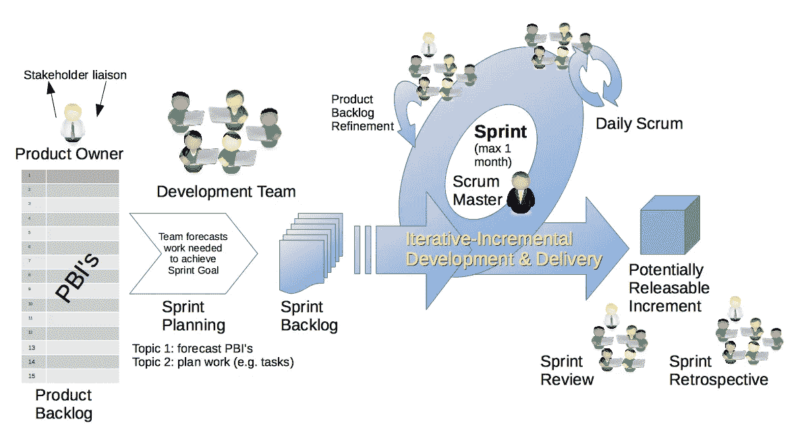
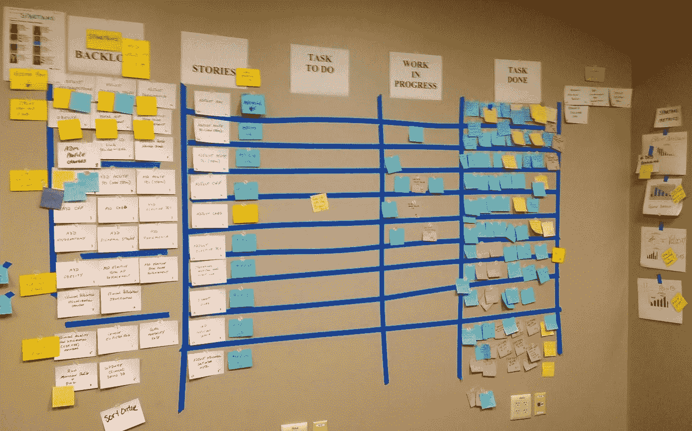
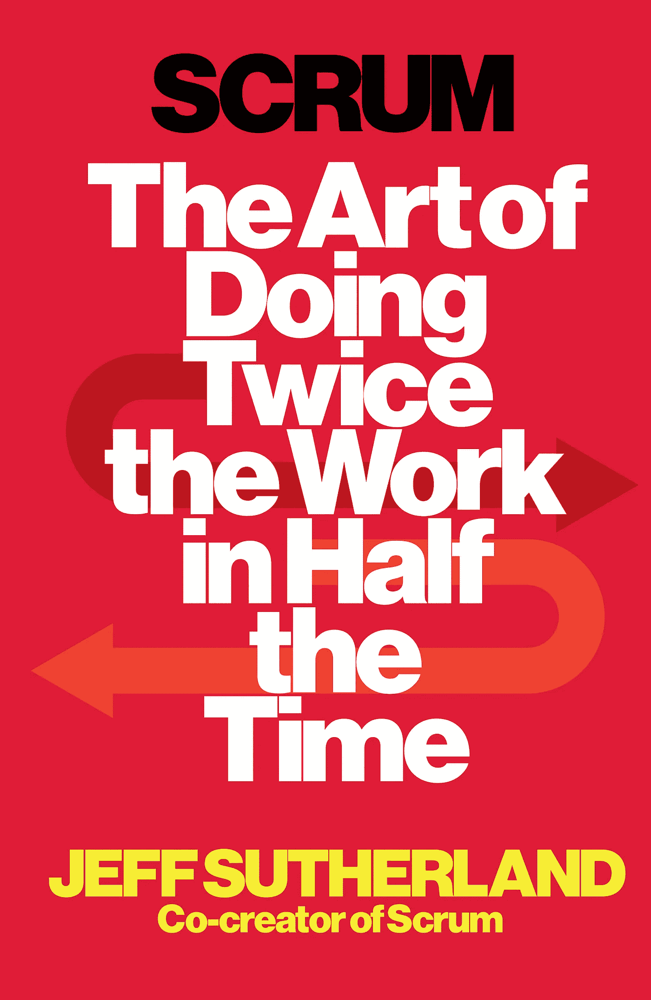

# 混乱

> 原文：<https://medium.com/hackernoon/scrum-7a1d91697501>

## 商业读者文摘

> 团队助推

SCRUM 是一种有效的[方法](https://hackernoon.com/tagged/methodology),它证明了自己在难以提前计划的情况下非常有用。它基于建立在反馈循环上的经验性方法，与更传统的命令-控制框架相反。

它的计划和项目管理方法是确定决策者和执行工作的人，*又名***Scrum 团队**。

在橄榄球比赛中，SCRUM 一词指的是一个动作，其中所有的前锋紧密地结合在一起，在这种情况下，它是一个团队的隐喻，这个团队作为一个充满活力和协调的实体正在朝着目标前进。

这种方法是在 90 年代在美国开发的，用于支持现代应用程序包的软件开发，但其根源必须在 80 年代在日本工厂达到完全成熟的丰田生产系统中寻找。

对于 Scrum 方法论，必须确定三个参与者:产品负责人、Scrum 团队和 SCRUM 主管。

**产品负责人**是客户(可以是内部客户)的代言人，承担创造商业价值的责任。产品负责人的主要任务是定义产品需求(*需要实现什么*)并分配优先级(*先做什么*)。

**Scrum 团队**负责交付产品，它由 3-9 名具有跨职能能力的人员*组成，他们实际上做所有的工作*:分析、计划、开发、测试、技术交流、文档编制……团队是自组织的，必须拥有所有必要的技能和知识来实现产品所有者的愿景。

Scrum Master 负责清除所有可能限制团队实现目标能力的障碍。不是团队领导，而是*团队仆人*:保持方法论的权威，协调会议，挑战团队。它既不是项目经理，因为 Scrum Master 不管理成员。

上图举例说明了 SCRUM 方法论。关键概念是团队通过*限时努力*前进，称为**冲刺**。在每个冲刺阶段(1-4 周)，团队的目标是完成待办事项的一个子集。在每年春天结束的时候，团队回顾已经完成的任务和没有完成的任务以及原因。采取行动消除任何障碍，并计划新的冲刺。

团队没有通过传统的甘特图进行计划，而是通过简单的*任务板*进行计划，该任务板由团队在*冲刺会议期间更新，*是团队用于内部沟通和相互协调的简短(15’)站立会议。

在每一次冲刺的最后，团队应该能够向产品负责人展示一个实现了目前已经开发的工作产品。背后的想法是在每个 sprint 中产生有形的和可销售的价值，采用增量和迭代的方法，而不是在最后才显示结果的长期项目。这使得 SCRUM 方法可持续，并对客户的早期反馈和团队的递归调整开放。

> **快速失败，以便尽早修复。企业文化通常更重视形式、程序和会议，而不是用户可以在短时间内检查的可见价值创造。不产生真正价值的工作是疯狂的。短周期的工作产品允许早期的用户反馈，你可以*立即*消除明显浪费的努力。杰夫·萨瑟兰**

> **自主。给予团队决定如何采取行动的自由——作为他们行业的大师受到尊重。无论是报道中东的革命还是进行销售，改进的能力都会产生很大的影响。**
> 
> **跨职能。**团队必须具备完成项目所需的所有技能，无论任务是交付 Salesforce.com 软件还是抓捕伊拉克的恐怖分子。
> 
> **责备是愚蠢的。**不要找坏人；寻找不好的系统——那些激励不好的行为和奖励糟糕表现的系统。
> 
> 扔掉你的名片。头衔是专门的地位制造者。因为你做了什么而出名，而不是别人怎么称呼你。
> 
> **大家什么都知道。**沟通饱和加速工作。

> 黑客中午是黑客如何开始他们的下午。我们是这个家庭的一员。我们现在[接受投稿](http://bit.ly/hackernoonsubmission)并乐意[讨论广告&赞助](mailto:partners@amipublications.com)机会。
> 
> 如果你喜欢这个故事，我们推荐你阅读我们的[最新科技故事](http://bit.ly/hackernoonlatestt)和[趋势科技故事](https://hackernoon.com/trending)。直到下一次，不要把世界的现实想当然！

