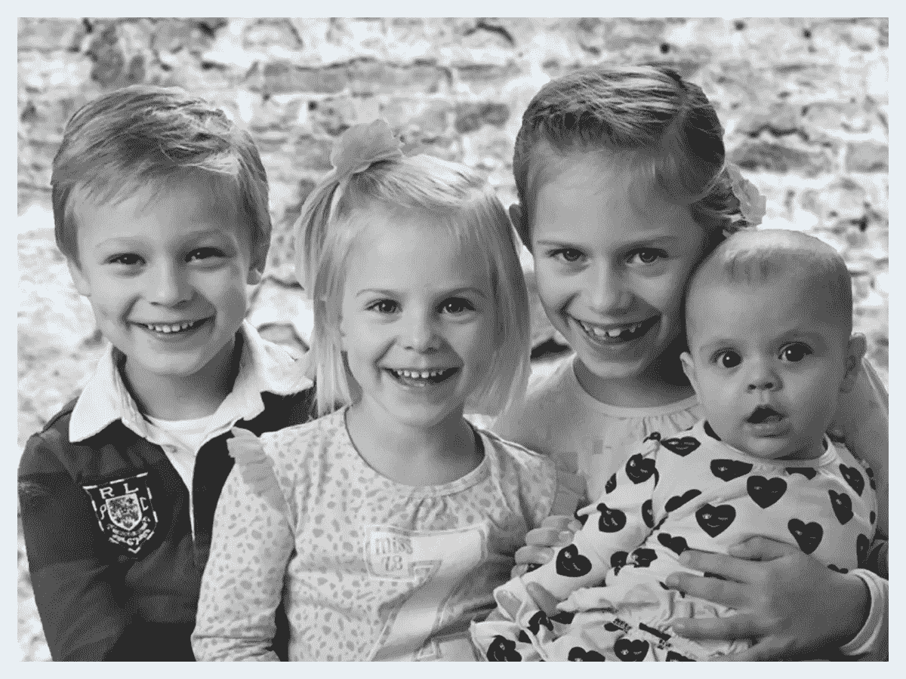
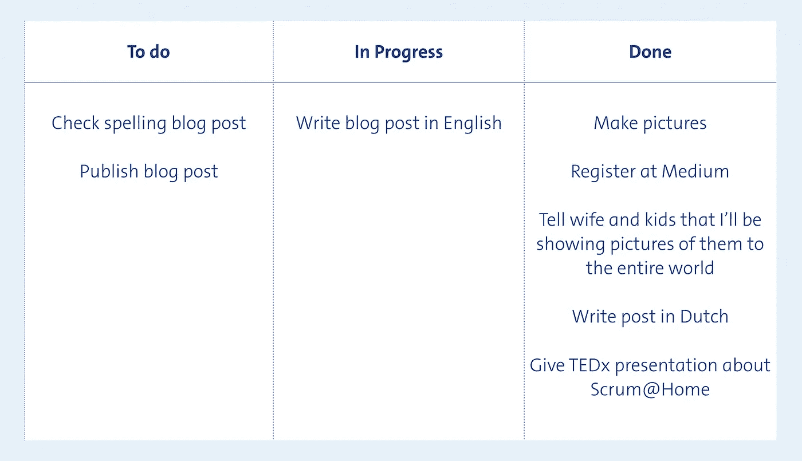
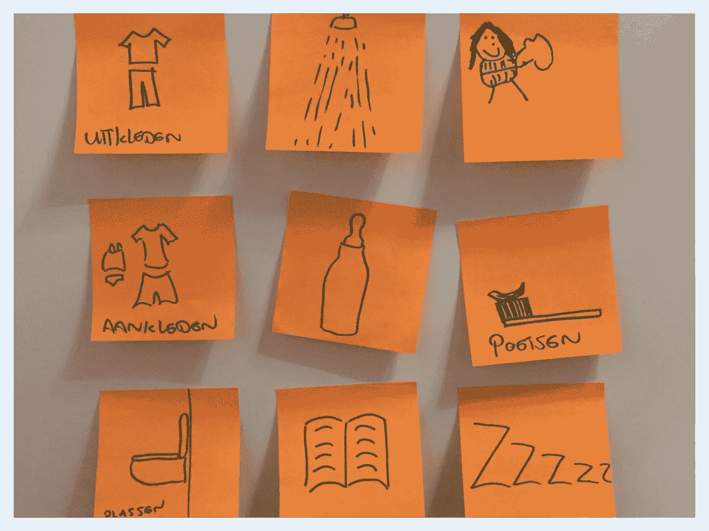
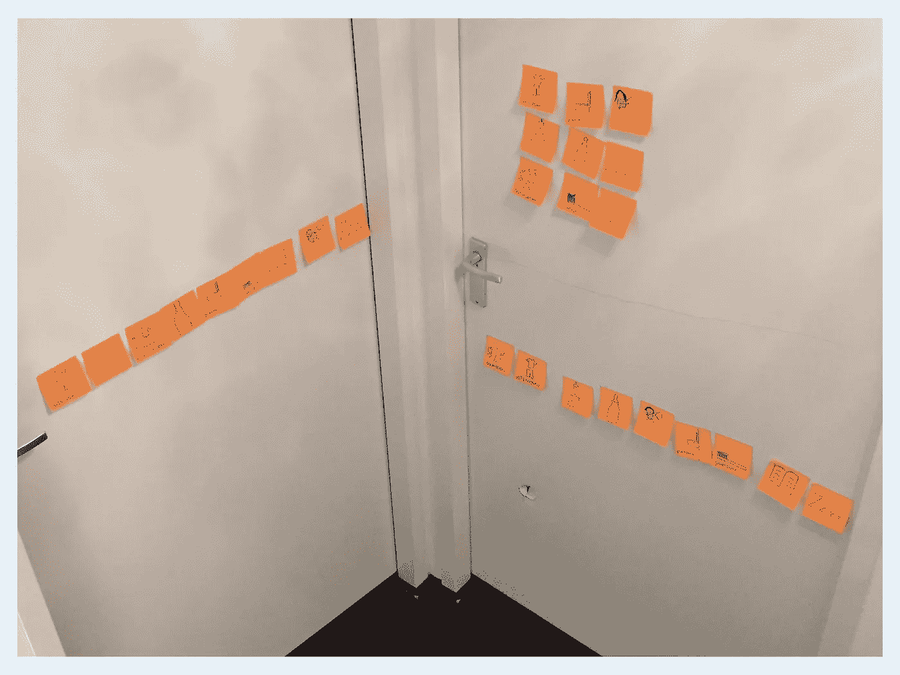
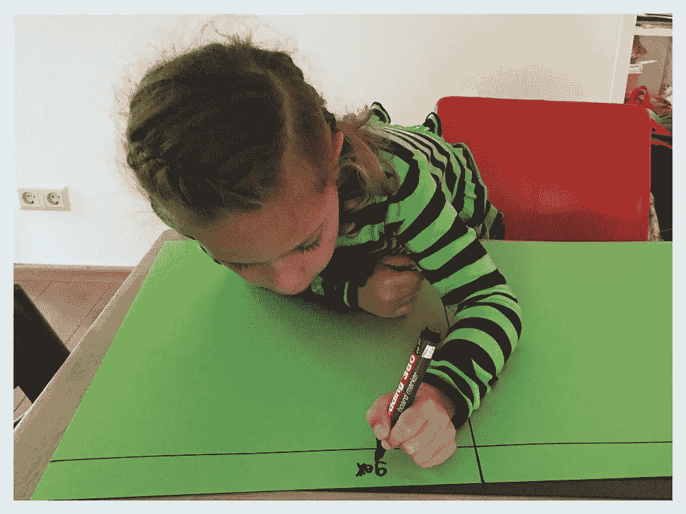
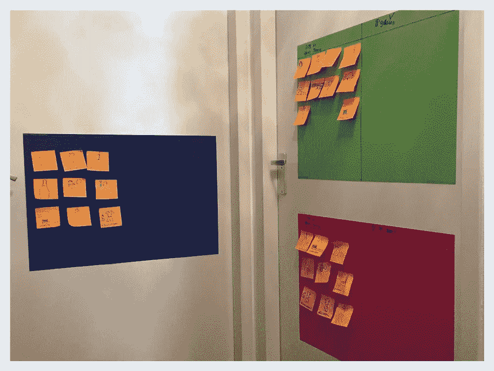

# Scrum @ Home

> 原文：<https://medium.com/hackernoon/scrum-home-en-84eb9df0790f>

Jesse, Fenne, Sterre and Lenthe

我妻子娜塔莉和我有 4 个孩子。2016 年 5 月初，当 4 号即将加入这个家庭时，是时候在一些日常事务中加入一些[结构](https://hackernoon.com/tagged/structure)了。晚上的例行公事通常要花很长时间(有时 1 个半小时)才能让每个人都入睡。我花了太多时间追着孩子们(*从浴缸里出来*)，也花了太多时间讨论(*为什么我应该先从浴缸里出来？*))

Scrum 是一种敏捷软件开发方法，几乎在任何地方都被用于软件开发。我所在公司的在线部门有 11 个活跃的 scrum 团队。至少可以说，我们已经有了一些经验。Scrum 确保团队会在很短的时间内发布工作软件。并不是说我们会在家里发布任何软件，但是 scrum 中使用的工具之一是 scrum 板。

## Scrum 板

Example of a scrum board

scrum 板放在显眼的地方，通常有 3 列。要做的，正在进行的和已经完成的。在这些列中是应该在特定时间内完成的分配任务，通常是两周，这被称为冲刺。这些任务是由团队自己创建和执行的。

通过使用 scrum 板，每个人都可以清楚地看到某项任务的当前状态和更大的图景。这让我想知道:

> “如果 scrum 在工作场所和成年人一起工作可以很好地完成工作，那么它在家里和孩子一起工作会有效吗？”

一点点的研究产生了布鲁斯·费勒的[鼓舞人心的 ted 演讲](https://www.ted.com/talks/bruce_feiler_agile_programming_for_your_family?language=nl)和一个关于儿童 Scrum 的[博客](http://scrumforkids.com/)。我很好奇这对我们是否有用。

因此，在一个星期天的早上，我们坐在厨房的餐桌旁，我向孩子们表达了我对晚上例行公事的担忧。需要很长时间，四处追逐，讨论。令我们惊讶的是，孩子们同意我们的观点，也有同样的感受！他们也不太喜欢，当我们生他们的气时，他们真的不喜欢。这就是我向他们解释 scrum 板的地方。

> “我们一起把你睡觉前需要做的事情做成卡片。每当你完成你卡上的一个任务，你就把卡移动到“完成！”。那是你完成所有卡片的地方。这样做你可以很容易地看到你已经做了什么，你接下来可以做什么。我们会帮助你并记录时间。"

The 1st iteration of the cards

他们喜欢这个主意！我们和孩子们一起写下了睡觉前需要完成的所有任务。孩子们充满热情地给出了他们自己的意见。脱衣服，洗澡，穿衣服，喝水，刷牙，尿尿，读书，当然还有睡觉。对于每一项任务，我都制作了一张有小图画的卡片，最后每个人都有一副卡片。然后我们把卡片贴在孩子们的床上，为晚上的新节目做准备。

## 第一个晚上(冲刺 1)

The end result after the 1st sprint

第一天晚上的结果非常好。孩子们有一个小时的时间来玩牌。斯特尔是 7 个孩子中最大的，她确实在权衡自己的决定，哪些事情应该先做。5 岁的男孩杰西告诉自己，如果他想要一个睡前故事，他需要快速洗个澡，没有任何麻烦。Fenne 是三个孩子中最小的一个，被允许在门上贴东西，她非常激动。甚至我的妻子——作为产品所有者——也很兴奋。

## 复古

每次冲刺都伴随着复古。那就是当你回顾这些活动的时候，谈论什么进行得很好，你需要继续做什么，什么出错了，你应该停止做什么，你还没有做什么，想开始做什么。所以第二天早上，我们简短地谈了谈我们对事情进展的看法。

“好玩！”据孩子们说。按照产品负责人的说法是“快速而冷静”。“我赢了！”据杰西所说。也有更多的反馈:我们需要更多的学习单词的卡片，例如，数学和玩耍。因为也需要一些有趣的事情去做。老大甚至建议我们创建一个 scrum 板作为早晨的例行公事。我们增加了额外的卡片，包括一张洗头卡。产品负责人，我的妻子可以决定这张卡片是否需要放在那天晚上的待办事项栏中。

接下来的几个晚上也过得很棒！孩子们认为这是一个挑战，并认为这很有趣。我们每天晚上都在调整，每天早上都在讨论。举例来说，睡眠卡总是留在待办事项栏中，这让人失去动力，所以我们删除了它。我们拿了董事会的阅读卡，只有在还有时间的情况下才添加它。所以如果你在给定的时间内完成了所有的事情，你就可以得到阅读卡。我们从一个小时到 50 分钟，再到 40 分钟，现在 30 分钟就完成了！大多数卡片都是孩子们自己做的(晚上也是如此),当然，需要的时候，我们中的一个可以帮忙。

因为它工作得很好，我们也创造了更好，更好的董事会。我们把卡片从床上移到门上的海报上，上面有两栏“要做的事”和“已完成的事”。当然，我们让孩子们自己做板子。我们还创建了晨间例行公告板，我们看到了同样的改进。更少的追逐，更少的重复，更少的麻烦。

**Left**: Sterre making her new and improved board. ***Right***: The new boards on their bedroom doors

## 结论

那么"*如果 scrum 在工作场所和成年人一起工作可以很好地完成工作，那么它在家里和孩子一起工作会有效吗？*”。**是的，的确如此！**我们了解到，不用追赶孩子，不用讨论，压力小得多，一起做，事情很容易完成得更快。

但在过去的 6 个月里，我们学到了更多:

*   我们认识到，如果我们让孩子参与我们想要完成的事情，我们作为一个家庭会变得更亲密，如果你定期与他们平等交谈，他们会给你宝贵的意见。
*   我们了解到，7 岁的 Sterre 可以做出很好的权衡选择，她知道什么时候加速，什么时候放松。
*   我们了解到，5 岁的杰西认为这是一场竞赛，他经常获胜。
*   我们了解到，3 岁的 Fenne 现在很容易理解需要做什么，因为手头的任务是可视化的。
*   我们了解到它能增强团结。孩子们很有动力，互相帮助完成卡片。
*   我们已经了解到，它与工作场所非常相似:复古和添加自己任务的可能性。让你的投入变得简单和正常是成功的一半，并确保每个人都被听到，对话可以在平等的水平上进行。孩子们掌握了自主权，而不仅仅是做被告知的事情。
*   我们了解到，即使在家里，也只能有一个产品负责人来决定想要的结果，也只能有一个 scrum 大师来推动团队。作为 scrum master，你是团队的一部分，你不是告诉团队做什么的客户。你帮忙。
*   我们知道这个系统很容易扩展和调整。老大要学她的字，多了一张卡。喂鱼是旋转卡，可以赚的 10 分钟 iPad 卡都很有效。
*   在被抓住、撕掉并再次粘上之后，我们现在可以肯定:便利贴真的是唯一的便利贴。

*在 ANWB 的一个 TEDx 活动上做了一个关于 Scrum @ Home 的演讲后，我用荷兰语写了这篇文章。由于我收到了关于演讲和文章的巨大反馈，我决定也用英语发表。希望你喜欢它，如果你决定在你家尝试一下，请留下你的经历。祝你好运，尽情享受吧！*

1 月 5 日更新:荷兰媒体收到了这篇文章，1 月 5 日，我受邀在荷兰国家电台解释 Scrum @ Home。[听广播片段](http://2bfrank.nl/2BFrank-bij-Ruud-de-Wild-Over-Scrum-at-Home.mov)(荷兰语，Mov。6，5MB)。荷兰新闻集团 RTL·纽斯也在他们的网站(荷兰语)上写了一篇关于此事的文章。

> [黑客中午](http://bit.ly/Hackernoon)是黑客如何开始他们的下午。我们是 [@AMI](http://bit.ly/atAMIatAMI) 家庭的一员。我们现在[接受投稿](http://bit.ly/hackernoonsubmission)并乐意[讨论广告&赞助](mailto:partners@amipublications.com)机会。
> 
> 如果你喜欢这个故事，我们推荐你阅读我们的[最新科技故事](http://bit.ly/hackernoonlatestt)和[趋势科技故事](https://hackernoon.com/trending)。直到下一次，不要把世界的现实想当然！

