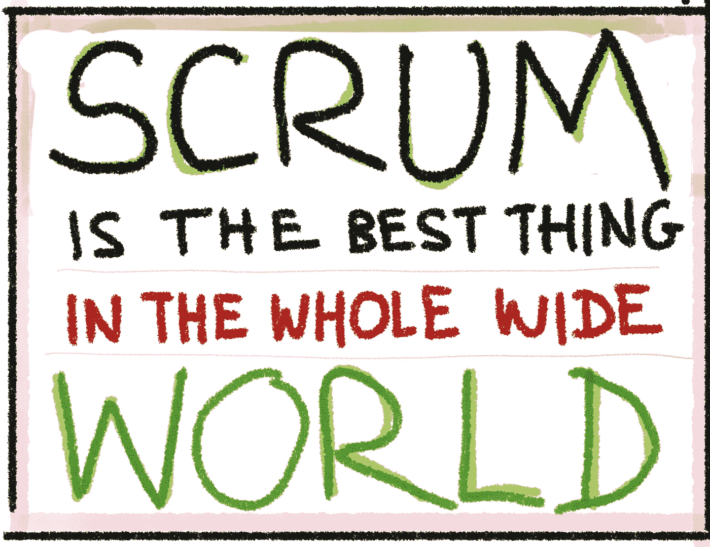

# Scrum 是世界上最好的东西

> 原文：<https://medium.com/hackernoon/scrum-is-the-best-thing-in-the-whole-wide-world-a2eb19a26c32>

Scrum 是:

> 开发、交付和维护复杂产品的框架。

这是整个世界上最好的东西。

Scrum 有一个*巨大且支持的*社区。想学就学。亚马逊上有 [858 本关于 Scrum 的书](https://www.amazon.com/s/s/ref=sr_nr_p_n_feature_nine_bro_0?fst=as%3Aoff&rh=n%3A283155%2Ck%3AScrum%2Cp_n_feature_nine_browse-bin%3A3291437011&keywords=Scrum&ie=UTF8&qid=1513655535&rnid=3291435011)(英文版)，包括一本[傻瓜书](http://www.dummies.com/store/product/Scrum-For-Dummies.productCd-1118905776.html)。YouTube 上充斥着 Scrum 视频。到处都有[聚会](https://www.scrumalliance.org/community/articles/2012/august/story-points-versus-task-hours)。世界各地都有会议和集会。人们发布[非常有用的模式列表](https://sites.google.com/a/scrumplop.org/published-patterns/retrospective-pattern-language/scrumming-the-scrum)。如果你喜欢的话，你可以获得认证。

你可以购买像吉拉这样为 Scrum 设计的工具。[参考卡](http://scrumreferencecard.com/ScrumReferenceCard.pdf)。[策划扑克牌](https://github.com/redbooth/scrum-poker-cards)。[吨级乐高游戏](https://www.lego4scrum.com/)。并不缺少愿意训练和指导你的团队的人。如果你想开始你自己的 Scrum 认证业务并[培训其他人](https://www.scrumalliance.org/certifications/trainers)…你也可以这么做！有些教练一个月能挣 10000 美元！这真的是整个世界上最好的东西。

现在。你可能会遇到说“Scrum 没用”的人它确实有效！我向你保证他们不会 100%这么做。他们是装的(FakeScrum)。没人说这容易。指南上写着:“轻便，简单易懂，*难掌握。*

*他们可能在做加州敏捷“开发者做他们想做的任何事情，所以你可以随时交付。”或者他们只是懦弱无能，无法应对无情的现实考验:*

> *Scrum 无情的现实检查暴露了个人、团队和组织中功能失调的约束。许多声称进行 Scrum 的人修改了需要突破组织障碍的部分，最终剥夺了他们自己的大部分利益。*

*也许他们没有得到“Scrum 是故意不完整的”的提示。“有一大堆事情——比如重要的技术实践——它并没有真正涵盖。马丁·福勒写道:*

> *Scrum 是以项目管理技术为中心的过程，与(例如)极限编程相反，它故意省略了任何技术实践。*

*Scrum 给你全世界最好的起点，然后给你全世界最好的社区，帮助你磨练你的 Scrum 优势。而且还有奖金。因为 Scrum 是整个世界上最好的东西，所有其他的功能都必须弄清楚如何使用 Scrum(例如，如何将 UX/UI 融入敏捷和 Scrum)。多棒啊。*

*没有什么问题是越界的任何事情都有答案:*

> *问:Scrum 指南说“Scrum Master 强制执行只有开发团队成员参与日常 Scrum 的规则”。这是否意味着产品负责人不能出席每日的 Scrum 活动，或者仅仅意味着产品负责人可以出席，但不能参与活动的进程。*
> 
> *答:欢迎产品负责人(PO)参加，以便倾听和观察，因为 Scrum 过程应该总是透明的，**但是 PO 可能不会交互**。*

*哦，等等，这个排名第一的答案和最新版本的 Scrum 指南不一致。但是你明白了。互联网上充满了精彩的内容，而 Scrum 一直在由 Ken 和 Jeff 对*进行官方*更新。最新更新包括这个…全球**最佳更新**:*

> *为了确保持续的改进，它(春季待办事项)包括至少一个在前一次回顾会议中确定的高优先级过程改进。*

*该死。如果我见过的话，这是对丰田生产系统的致敬。尊重你的根。([在这里阅读其他更新](https://www.infoq.com/news/2017/11/scrum-guide-updates))。*

*这是另一件让 Scrum 成为全世界最好的东西的事情。因为每个人都在做这件事(整个广阔的世界)，你可以肯定你的情况不是唯一的。[重温精彩剧情点 vs 小时预估辩论](http://www.agilebuddha.com/agile/story-points-and-man-hours-when-to-use-them-and-why/)。[用户不喜欢最新的增量怎么办？](https://softwareengineering.stackexchange.com/questions/226036/potentially-shippable-product-increment-what-if-users-dont-like-the-latest-in) [故事点数 vs 故事计数](https://martinfowler.com/bliki/StoryCounting.html)。[产品负责人与产品经理](https://blog.aha.io/the-product-manager-vs-product-owner/)。一旦你学会了行话，Google 将成为你的第二个 Scrum 大师。在你知道之前，你会像这样做:*

> *现在，我们对每个工程师参与的项目都使用 Git Hub Issues。我们正在向在吉拉处理的更广泛的新闻过渡。出于会计目的，我们将每个任务标记为 Cap 或 Exp，以便我们可以计算出出于会计原因我们可以资本化多少开发时间。当多个工程师可能在同一个用户故事上工作时，我们在吉拉怎么做呢？*

*赞。这是一些资本支出，运营支出，吉拉功夫。*

*现在，声明一下，这些都不是 Scrum。故事点不是 Scrum。吉拉不是 Scrum。伯恩斯不是 Scrum。[插入嫁接到 Scrum 上的怪异的非敏捷业务需求]不是 Scrum。滥用 Scrum 不是 Scrum。跟我重复:*

> *当它起作用的时候……它受到了 Scrum 的启发。当它不…你没有在做 Scrum，Scrum 让你去弄清楚，或者 Scrum 很难掌握。*

*明白了吗？记住…*

*Scrum 是一个绝对最小的 17 页，5200 字的开放式框架，有大约 80 条规则(“必须”、“应该”等等)。)，新角色，新工件，新会议。其中一个角色——Scrum Master——是全新的！Scrum 有自己的主人。那是整个世界上最美好的事情。*

*现在…你必须小心外面的仇恨者和蛇油骗子…向大众传播危险的假新闻。他们会谈到去除冲刺，变长冲刺，解耦节奏，让团队 Scrum 掌握自己，以及用看板方法“从他们所在的地方开始”。*

*它变得更加极端。谁知[这个异端](https://www.spikesandstories.com/scrum-is-not-agile/):*

> *Scrum 是我们的卖点。我们认证的东西。我们在一个组织中实现的东西，希望它能培养敏捷性。尽管如此，它本身并不敏捷。一个人可以敏捷，但永远不要使用 Scrum。相反，一个人可以使用 Scrum，但永远不会敏捷。*

*这来自于“热爱、生活和呼吸 Scrum 框架”的人。加油坦纳:)*

***以下是为什么这很危险**:这对青少年有潜在的危险。孩子们会相信他们在网上读到的任何东西(甚至是 StackExchange)。在你意识到之前，他们会打着“正在尝试”的幌子，搞乱他们的 Scrum 实现你知道会发生什么吗？出问题的时候他们会责怪 SCRUM！他们会放弃的！他们会从 Scrum 学校退学，偷辆车，然后去加州做加州 Scrum，或者更糟的 FauxScrum，或者，喘息一下…看板。*

*我们不能让这种事情发生在这个世界上最美好的事情上。[自由造型是一项国际扶轮活动](https://martinfowler.com/bliki/ShuHaRi.html)，必须保留给国际扶轮大师。团队可以自己发现这一点(在完美地完成 Scrum 之后)，然后我们会因此而受到表扬。在那之前，按规则行事。肯·施瓦布写道*

> *Scrum 就像国际象棋。你要么按照规则来玩，要么不玩*

*正如 Scrum 指南提醒我们的:*

> *Scrum 的角色、事件、工件和规则是不可变的，尽管只实现 Scrum 的一部分是可能的，但结果不是 Scrum。Scrum 只完整地存在，并且作为其他技术、方法和实践的容器运行良好。*

*因为…Scrum 是整个世界上最好的东西。*

*我在开玩笑吗？不是关于一些事情…*

*我真正的意思是，Scrum 社区是整个世界(软件开发项目管理)中最好的东西之一。这个社区绝对令人惊叹。如果你需要帮助，你可以得到它。有一个巨大的 n，有了慧眼(还有耳朵，也许还有预算)，你就能找到自己的路。*

*也就是说，我担心:*

*   *Scrum 被过度推销了*
*   *外面有太多可怕的建议，大部分是由错误的信息和用 Scrum 做坏事的组织驱动的*
*   *原因是没有接触到用户(团队)、认证的 SMs 和认证的 POs。我和许多不熟悉 Scrum 指南、Scrum 价值观或 Scrum 支柱的人交谈过，他们也没有读过敏捷宣言。*
*   *我们仍然没有强调技术实践、现代产品实践、现代 UX 实践等的重要性。*
*   *Scrum 关注的是认证，而不是最终用户(团队)*
*   *Scrum 经常被强加给团队，它的工具/实践被组织滥用。在某种程度上，它的处方水平太容易被滥用，钱太容易被忽视*
*   *Scrum 感觉越来越重量级和过时了*
*   *Scrum 的“业务”已经变得面向认证，而不是框架的“用户”…团队本身*
*   *更新更轻的方法正在出现，但是我们害怕推广它们，因为害怕“新手”*
*   *它并没有真正进化*

*那么你会怎么处理这些事情呢？你能从令人羡慕的实践潮涨潮落中“拯救 Scrum”吗？它感觉像是在积累的模式、几十年的使用、它的受欢迎程度、它的有用性、几十年的滥用(不支持，但仍在发生)、认证业务模型下变得紧张，并且感觉在较轻的方法旁边更重。【2009 年的马丁·福勒(再次):*

> *我确信正在运行的许多疲软的 Scrum 项目会损害 Scrum 的声誉，很可能还有更广泛的敏捷声誉。但是由于我认为语义扩散是不可避免的，所以我并没有过度担心。失败的团队很可能会失败，不管他们错误地应用了什么方法，成功的团队会将他们的实践建立在好的想法上，而 scrum 社区的角色就是广泛传播这些好的想法。*
> 
> *许多人期待精益成为下一个大的敏捷事物。但是精益越流行，就越会遇到和 Scrum 现在面临的问题一样的问题。这并没有让精益(或 Scrum)变得毫无价值，它只是提醒我们个人和交互比过程和工具更有价值。*

*好吧。精益还不是下一个敏捷的大事件。我猜？*

1.  *更多的团队，更少的 Scrum Master 和产品所有者关注*
2.  *不需要认证*
3.  *可由团队以自我指导的方式学习(但适应性强)*
4.  *与现代 UX 和产品实践更加融合*
5.  *结构化程度较低，基于规则*

*但是就像马丁一样…我可能是错的！*

*因为…Scrum 是世界上最好的东西。*