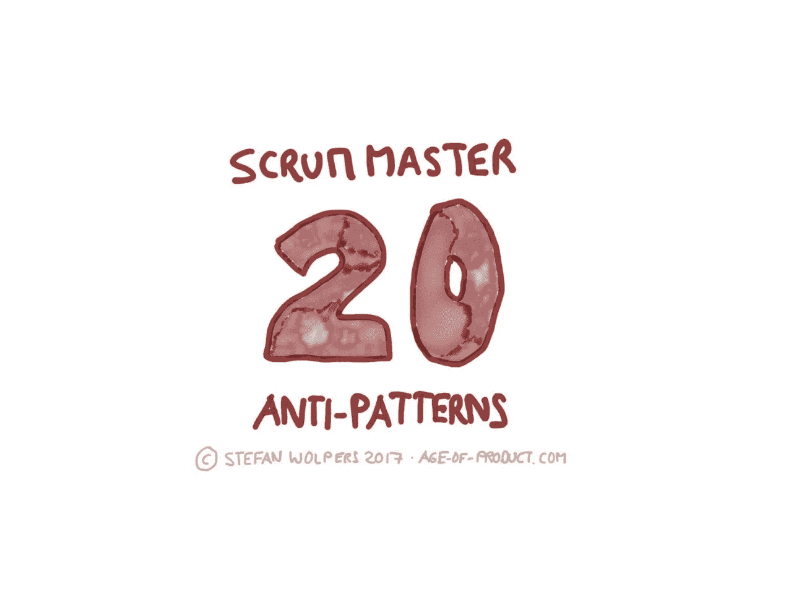
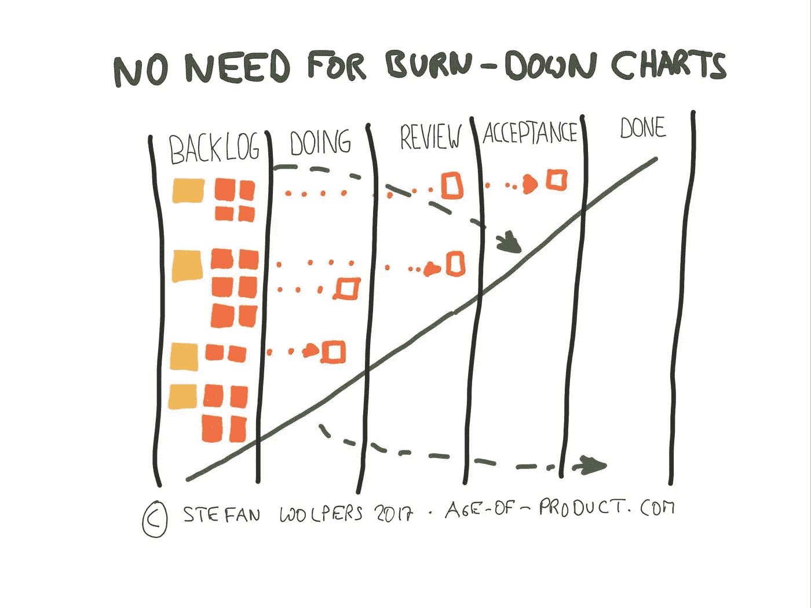
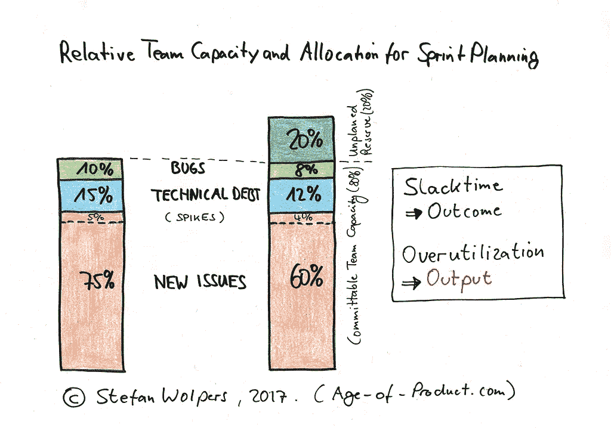

# Scrum 大师反模式

> 原文：<https://medium.com/hackernoon/scrum-master-anti-patterns-b3aeb35ffe31>

# TL；DR: Scrum 大师反模式

scrum masters 违反 scrum 指南精神的原因是多方面的。他们从不适合的个人特质和对个人议程的追求，到对团队本身的失望。

继续阅读这篇关于 scrum 反模式的最后一篇文章，学习如何识别你的 scrum 主人是否需要团队的支持来提升他或她的敏捷游戏。

# 根据 Scrum 指南，Scrum 大师

在我们开始剖析 scrum master 反模式的可能原因和表现之前，让我们回顾一下 scrum 指南是如何定义 scrum master 的角色的:

> 按照 Scrum 指南的定义，Scrum 主管负责推广和支持 Scrum。Scrum 大师通过帮助每个人理解 Scrum 理论、实践、规则和价值观来做到这一点。
> 
> Scrum Master 是 Scrum 团队的仆人领导。Scrum Master 帮助那些 Scrum 团队之外的人理解他们与 Scrum 团队的互动哪些是有帮助的，哪些是没有帮助的。Scrum Master 帮助每个人改变这些交互，以最大化 Scrum 团队创造的价值。

**来源** : [Scrum 指南 2017](http://www.scrumguides.org/scrum-guide.html#team-sm) 。

scrum master 角色定义的基础是仆人领导方面。在大多数 scrum master 反模式的案例中，个人没有达到的恰恰是这一部分。

# Scrum 大师离开敏捷之路的可能原因

scrum masters 违反 scrum 指南精神的原因是多方面的。他们从不合适的个人特质到追求自己的议程，再到对团队本身的失望。一些常见的原因是:

*   **无知还是懒惰:**一种敏捷适合每个团队。你的 scrum 大师在一个特定的环境中学到了这种技巧，现在他或她无论在什么样的环境中都在积极地推广这种模式。
*   缺乏耐心:耐心是一个成功的 scrum 大师需要大量使用的关键资源。当然，从 scrum 大师的角度来看，如果解决方案如此明显，那么多次重新处理同一个问题并没有什么乐趣。那么，为什么不告诉他们如何一直‘正确’地做，从而变得更有效率呢？可惜了，那个敏捷不能推，需要拉。
*   教条主义:一些 scrum 大师相信逐字应用 Scrum 指南，这不可避免地会引起摩擦。
*   **自由放任变成了漠不关心:**把团队指向一个方向，让团队成员自己能够找到解决问题的方法，这就是好的领导。然而，让他们在没有指导的情况下奔跑，很快就会变成漠不关心，或者更糟，变成一种我不在乎的心态。
*   scrum master 冒名顶替者:私下里，scrum master 确信这种敏捷/scrum 之类的东西是一种时尚，但也承认这是一种高薪职业:“我会通过获得 scrum master 证书来应对项目经理需求的下降。”随着时间的推移，这种信念将不可避免地暴露出他或她的真实面目。
*   **对牛弹琴——沮丧的 scrum master:**scrum master 已经拼命工作了几个月，但是团队并没有对此做出回应。沮丧的程度越来越大。这一级别的失败有很多潜在的原因:缺乏组织高层的支持，普遍认为“敏捷”只是最新的管理时尚，因此可以忽略不计。团队构成不对。解决团队内部的问题没有心理安全感，公司文化既不重视透明度，也不重视彻底的坦诚。或者个别团队成员怀有与团队目标不一致的个人议程——仅举几例。如果 scrum 团队没有成功扭转局面，团队可能会失去 scrum 大师。请注意，scrum 大师无法独自解决这个问题。需要团队的合作。
*   **最后，菜鸟:**如果你将[奥卡姆剃刀](https://en.wikipedia.org/wiki/Occam%27s_razor)应用于这种情况，你也可以得出结论，你的 scrum 大师还没有叛逃到黑暗面。他或她可能只是缺乏经验。鉴于我们都需要定期学习新技能，在这种情况下，放他或她一马，并伸出手来支持这一努力。

# Scrum 反模式指南

这本电子书涵盖了 140 多种 Scrum 反模式，可以在这里免费获得。 [*现在就下载《Scrum 反模式指南》* *！*](https://age-of-product.com/scrum-anti-patterns/)

# 作为敏捷经理的 Scrum 大师

在我看来，“敏捷管理”是一种矛盾修饰法。任何敏捷实践的主要目的都是让那些最接近问题的人找到解决方案。换句话说，随着时间的推移，团队将变得自组织。然而，自组织团队需要教练、导师和(仆人式)领导者，而不是泰勒主义意义上的经理。

注意与这种“敏捷经理”态度相对应的 scrum master 反模式:

*   敏捷管理:自组织并不意味着缺乏管理:例如，为什么 scrum 团队要承担支付角色的责任？这有助于为客户创造价值吗？可能更少。因此，成为一个自组织的团队并不意味着管理本身的缺失。然而，这确实意味着不需要像 1926 年通用汽车装配厂那样的微观管理。scrum 大师不是主管。
*   **召开会议允许某人发言:**当团队成员在发言前与 scrum 主管进行眼神交流时，scrum 主管已经放弃了促进角色，转而支持主管模式。
*   **烧毁图表执行者:**scrum 主管专注于每天更新烧毁图表。如果团队认为烧毁图表有用，并且 scrum master 同意更新它，那就这样吧。尽管如此，我仍然相信当前的 sprint 板一眼就能达到同样的目的，而不需要增加新的管理层。然而，如果仅仅为了报告的目的而跟踪输出，团队需要挑战这种态度。

*   追求有缺陷的度量标准:scrum master 跟踪个人的绩效度量标准，比如每个 sprint 的每个开发人员的故事点数，可能是为了向那个人的直线经理报告。这是通过后门重新引入 command &控制的典型主管黑客行为。这不可避免地导致了货物崇拜的混乱。
*   **表现不佳升级:**scrum 主管向更高层报告 scrum 团队将无法满足当前的 sprint 承诺或预测。这是我收到的一份工作邀请:“你将协调和管理其他团队成员的工作，确保时间表得到满足，违规行为得到上报。”或许，我们还应该重新引入针对表现不佳者的挑战？
*   **关注团队和谐:**scrum master 通过不使用回顾来公开解决冲突和问题，从而将冲突和问题隐藏起来。这种行为通常是向政治低头的标志，相反，它使用操纵来满足与 scrum 原则和价值观对立的组织需求。如果组织重视下属遵守“规则”而不是说真话，为什么你要首先进行有效的回顾？参与 cargo-cult 敏捷的“scrum master”也是一个管理者，而不是敏捷实践者。)

*请点击“拍手”*👏如果你觉得这篇文章有用——它对我来说意义重大！

# Scrum Master 反模式

## 在冲刺规划阶段 Scrum 掌握反模式

以下反模式侧重于冲刺计划:

*   没有异议的过大的 sprint backlog:团队经常接受比没有 scrum master 的发明所能忍受的更多的问题到 sprint backlog 中。如果在一个 sprint 结束时，所有问题的 50%溢出到下一个 sprint，这是一种模式，那么你的团队没有实践 scrum。很可能，这是一种限时看板——这也没问题。只要下定决心，你打算如何改善顾客的生活。或许，看板会是一个不错的选择。
*   **未精炼的故事被接受到 sprint backlog 中:**scrum master 没有解决将问题接受到 sprint backlog 中的问题，这违反了团队对就绪的定义。这是一个 scrum 团队不会交付 sprint 目标的确定方式，使得 scrum 原则变得无用:在 sprint 结束时提供一个潜在的可交付的产品增量。(这里指的是常规工作，不是突发事件。)
*   **100%的利用率:**产品负责人将额外的(功能性的)工作挤入 sprint backlog，而 scrum master 没有解决松弛时间的必要性。(如果团队没有在每个冲刺阶段解决技术债务，scrum 团队的效率将会受到严重的阻碍。例如，如果没有时间配对，它也会受到影响。100%的利用率总是会降低团队的长期生产力。100%的利用率是泰勒的经典生产线管理思想。)

## 在冲刺阶段，Scrum 掌握反模式

以下反模式关注 sprint 本身的错误处理:

*   流程中断:scrum master 允许涉众在冲刺阶段中断 scrum 团队的流程。风险承担者在冲刺阶段打断团队流程有几种可能性。任何一个例子都会阻碍团队的生产力。scrum master 必须阻止他们表现自己:
    a)scrum master 对开发团队的访问采取自由放任的政策。scrum 大师不反对直线经理让团队成员离开团队去分配其他任务。scrum 主管不反对管理层邀请工程师作为主题专家参加随机会议。scrum 主管对未经 scrum 团队批准的 sprint backlog 的中期变更视而不见。最后，scrum master 允许利益相关者或管理者将日常的 scrum 变成一个报告会议。
*   **给开发人员分配子任务:**scrum master 并不阻止产品负责人——或者其他任何人——直接给工程师分配任务。(开发团队在没有外部干预的情况下自行组织。在这方面，scrum master 是团队的盾牌。)
*   **定义技术解决方案:**工程师变成了 scrum 大师，现在“建议”scrum 团队如何实现问题。
*   **缺乏支持:**scrum master 不支持需要帮助的团队成员。通常，开发团队会创建工程师可以在一天内完成的任务。然而，如果有人在这样的工作中挣扎了两天以上，却没有说出他或她需要支持，那么 scrum master 应该解决这个问题。顺便说一下，这也是为什么如果任务没有移动到下一栏，每天在物理板上用红点标记任务的原因。

## 回顾中的 Scrum Master 反模式

最后一组反模式解决了 sprint 回顾:

*   **土拨鼠日:**回顾展从不改变构图、地点或长度。在这种情况下，团队倾向于一遍又一遍地重温相同的问题——尽管这是一个没有快乐结局的土拨鼠日。
*   下一次冲刺:scrum 主管将回顾会推迟到下一次冲刺。除了“检查&适应”任务之外，回顾还应该作为一个结束的时刻，重置每个人的思想，以便团队可以专注于新的冲刺目标。这就是我们在计划后续冲刺之前进行回顾的原因。推迟到下一个 sprint 可能会中断团队的流动。它还会将可能的改进延迟到冲刺阶段。
*   scrum 主管不会在 sprint 期间收集数据来支持团队即将到来的回顾。这也可能是沮丧的表现，见上文。
*   **# no documentation:**scrum master 不做会议记录以备后用。回顾是一项巨大的投资，scrum 团队应该认真对待。做笔记和拍照支持这个过程。
*   **没有心理安全:**回顾会是一个没有 scrum master 干预的无休止的指责和指责循环。团队一起赢，团队一起输。责备游戏记录了 scrum master 作为回顾主持人的失败，以及团队缺乏成熟和沟通技巧。
*   **欺凌被接受:**一两个团队成员主导了回顾会。这种交流行为通常是一个软弱或者不感兴趣的 scrum 大师的标志。回顾需要是一个安全的地方，每个人——包括内向的人——都可以解决问题并提供反馈，不受第三方的影响。如果一些团队成员主导了谈话，甚至可能欺负或恐吓其他队友，回顾会将无法提供这样一个安全的地方。这一失败将导致参与者退出回顾并使结果过时。scrum 主管的主要职责是确保每个人都被听到，并且有机会表达自己的想法。顺便说一下，根据谷歌的说法，平均分配的发言时间也是一个高绩效团队的标志。**阅读更多:** [谷歌从建立完美团队的探索中学到了什么](https://www.nytimes.com/2016/02/28/magazine/what-google-learned-from-its-quest-to-build-the-perfect-team.html)。
*   利益相关者提醒:scrum master 允许利益相关者参与回顾。有很多 scrum 仪式可以解决涉众的沟通需求:sprint 审查，可能是产品 backlog 细化，每日 scrum，更不用说在饮水机旁、喝咖啡时或午餐时间进行对话的机会了。如果这种可能性仍然不够，请随时举行额外的会议。然而，回顾是利益相关者的禁区，scrum master 需要执行这条规则。

# Scrum 大师反模式——结论

作为一个 scrum 大师，有很多失败的可能性。有时候，是缺乏组织的支持。有些人不适合这项工作。其他人出于可疑的原因将自己置于团队之上。一些 scrum 大师只是缺乏来自他们的 scrum 团队和利益相关者的反馈。不管是什么情况，试着帮助你有困难的 scrum 主人克服痛苦。Scrum 是一项团队运动。

我错过了哪些 scrum master 反模式？请在评论中与我分享。

# Scrum 大师反模式相关的帖子

[产品负责人反模式——作为采购订单的 31 种改进方法](https://age-of-product.com/product-owner-anti-patterns/)

*请点击【拍手】*👏如果你觉得这篇文章有用——它对我来说意义重大！

*你还想这样多读书吗？嗯:*

*   📰*加入 13，042 位同行和* [*报名参加本周简讯*](https://age-of-product.com/subscribe/?ref=Food4ThoughtMedium)
*   🐦*关注我的* [*推特*](https://twitter.com/stefanw) *并订阅我的博客* [*产品时代*](https://age-of-product.com)
*   💬*或者，免费加入* [*Slack 团队的 2100 多名同事“手把手的敏捷”*](https://goo.gl/forms/XIsABn0fLn9O0hqg2) *…*

Scrum Master 反模式——你的 Scrum Master 需要帮助的 20 个迹象首次发表在《产品时代》上。