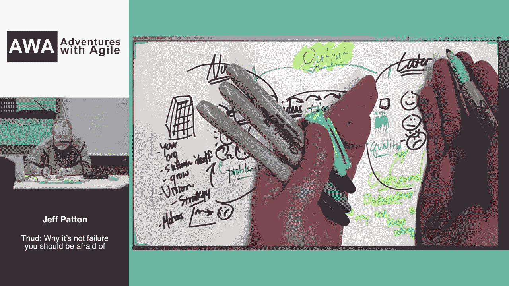

# 敏捷思维的食粮#118

> 原文：<https://medium.com/hackernoon/scrum-troubles-c29454e342a9>

敏捷思想的食粮第 118 期解决了不那么明显的 Scrum 问题:如果不认真地实施，它会很难，很贵，而且完全没有用。

Jeff Patton 解释了产品发现过程中的一系列人为缺陷和失败，这就是 AirBnB 努力进行实验的原因——从 Jan 那里了解详细的工作原理。

最后，我们再一次讨论了杰出的工程师也是混蛋的问题，这位头发尖尖的老板最终揭示了预测的目的。

祝你一周愉快！

# 🏆一周的结束

## 杰夫·巴顿:砰:为什么你不应该害怕失败

Jeff Patton 在这个视频中解释说，我们在庆祝我们的野生产品成功的同时，也在寻找灾难性失败的责任人。

来源:[砰:为什么你应该害怕的不是失败](https://www.youtube.com/watch?v=6Zq6pZGWeyE&feature=em-subs_digest)

作者:[杰夫·巴顿](https://twitter.com/JeffPatton)

# 敏捷和 Scrum 的麻烦