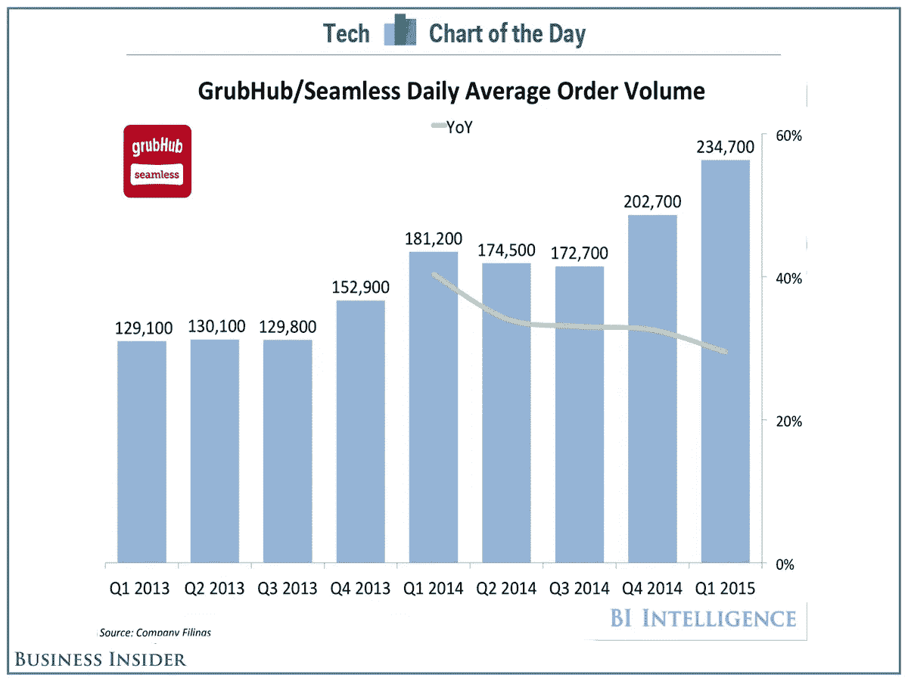
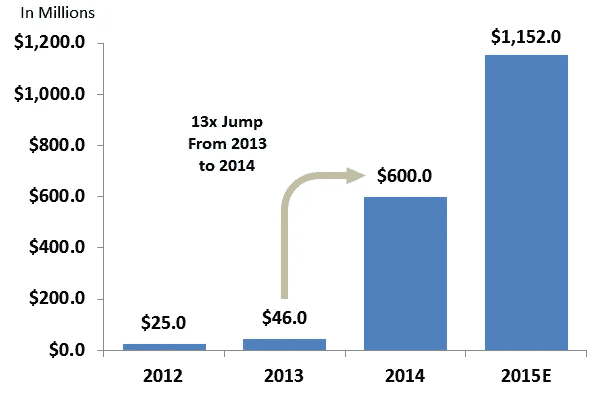
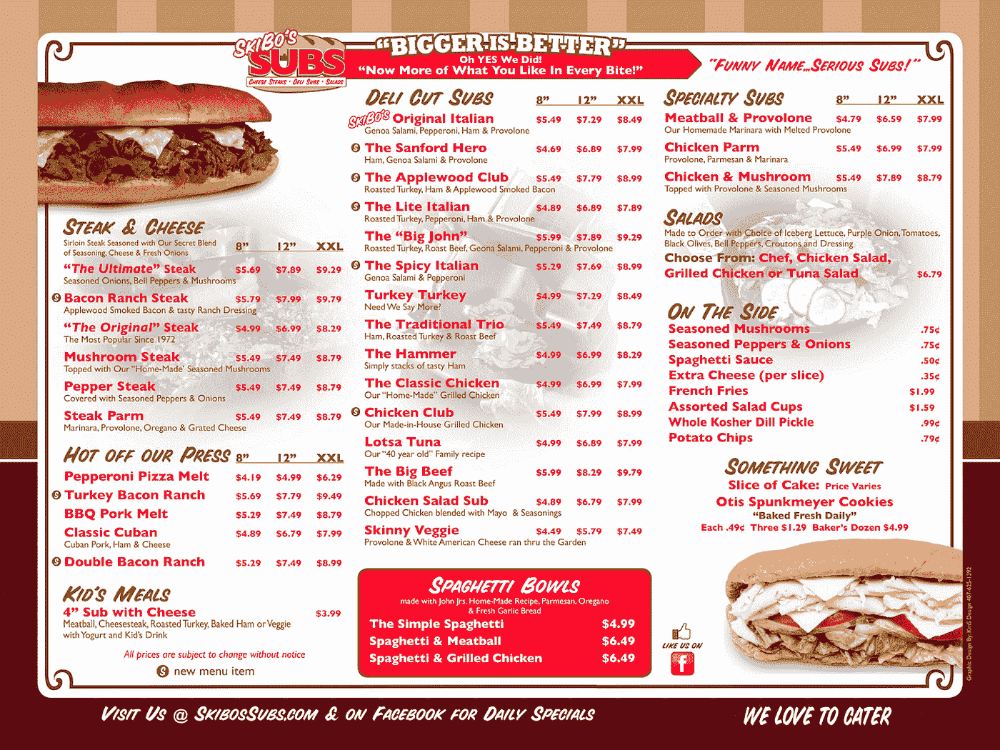
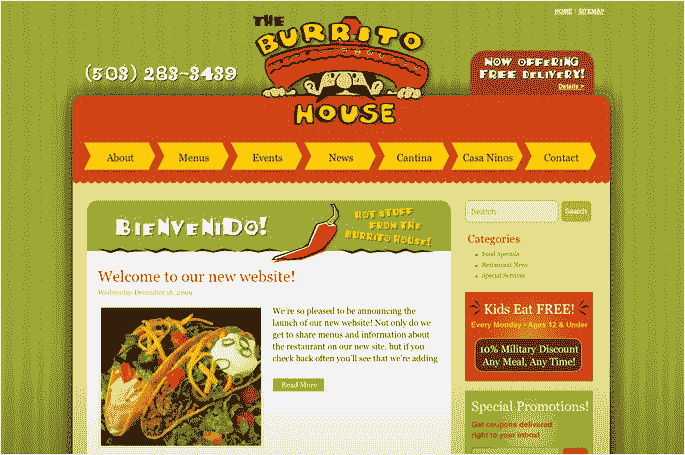
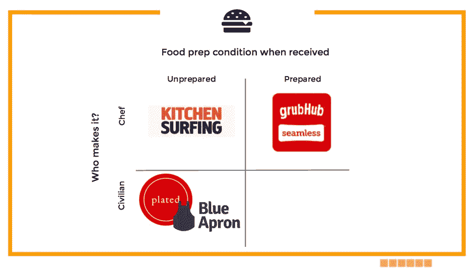

# 无缝——最后的前沿？

> 原文：<https://medium.com/hackernoon/seamless-the-final-frontier-df2d5a63d262>

## 事实真相

成立于 1999 年的[在线](https://hackernoon.com/tagged/online)食品订购服务 Seamless 允许用户通过他们的网站或一套移动应用程序从餐馆订购外卖食品。目前，它为美国和伦敦的 25，000 家餐厅提供服务。这导致这些餐厅每天约有 234，000 份订单。无缝/Grubhub ( [$GRUB](http://finance.yahoo.com/echarts?s=GRUB+Interactive#%7B%22range%22:%22max%22,%22allowChartStacking%22:true%7D) )于 2014 年 4 月上市。

## 市场尺寸

美国人每年仅在网上订餐上花费约 90 亿美元，这在总额为 700 亿美元的食品外卖和配送市场中只占很小一部分。无缝管的增长放缓是否预示着消费变化的出现？

[http://www.businessinsider.com/grubhub-seamless-handles-a-quarter-million-food-orders-a-day-on-average-2015-5](http://www.businessinsider.com/grubhub-seamless-handles-a-quarter-million-food-orders-a-day-on-average-2015-5)

*2012 to 2015E Capital Inflows to Food Ordering Space —* [http://techcrunch.com/2015/05/07/a-secular-shift-to-online-food-ordering/](http://techcrunch.com/2015/05/07/a-secular-shift-to-online-food-ordering/)

随着全球定位系统的改进，手机的无处不在，以及最近的无缝 IPO，该领域的投资正在升温。虽然 2013 年和 2012 年分别只有 4600 万美元和 2500 万美元投资于食品订购公司，但 2014 年的投资却达到了惊人的 6 亿美元。到 2015 年年中，我们迄今为止已经投资了大约 3.6 亿美元，按年计算，大约为 12 亿美元。这种增长并不常见。

## 食物订购的演变

当餐馆想为自己做广告时，一种方法是在人们的邮箱里张贴菜单。

Sample Restaurant Menu

这很好，但是缺少了一些方面。人们将不得不把传单保存在活页夹里，当他们饿了的时候就去找那个活页夹。

然后出现了张贴菜单的餐馆网站，这样你就不用保存菜单了。

Sample Restaurant Website

这很好，但是现在餐馆老板不得不担心 1)网站维护，2) [SEO](https://hackernoon.com/tagged/seo) ，以及 3)整体可发现性——所有这些都不是他们的核心竞争力。

所以就像谷歌一样，一个食物搜索引擎出现了——天衣无缝。你不需要记住你周围餐馆的名字，你只需要去 Seamless，点你的食物，它就会被送到。你甚至不需要给餐馆打电话——一切都在网上完成。

> *既然谷歌是可发现性的最后一次进化，那么无缝搜索不也是如此吗？*

**象限一**

为了理解这个问题的答案，我们需要理解什么是无缝。这是一个食品订购平台，它:

1.  有一个店面，而且
2.  有自己的送货员。

**象限二**

然而，有一些公司稍微改变了这种模式，并在 700 亿美元的食品外卖市场占据了相当大的份额。UberEATS 和 [Postmates](https://postmates.com/) 服务于有自己店面的市场，但没有自己的送货人。UberEATS 是“优步去年开始在十几个城市提供的午餐服务的扩展，将利用其超过 100 万名司机的[网络](https://hackernoon.com/tagged/network)运输货物和人员。”

Postmates 是“领先的按需物流提供商。该公司拥有超过 20，000 个活跃的邮局，在美国 40 个主要大都市市场运营着最大的按需交付车队。Postmates 的总体使命是推动本地按需物流，重点是从任何规模的商家进行快速交付。”

> 通过拆分无缝产品的物流部分，他们为服务不足的市场开拓了自己的产品。

**象限三**

UberEATS 和 Postmates 的直接对立面是什么？一个没有店面的“餐馆”，却有自己的送货员？答案是[枫](https://maple.com/)。枫叶公司自己准备和运送食物。

> “在高层次上，我们试图有目的地建立一个公司，它有一个独特的愿景，使交付在每个接触点都是卓越的，”[创始人] Caleb Merkl 说。“要做到这一点，我们真的必须拥有整个流程——从采购原料到最后一英里配送的一切。”

**象限四**

填写最后一个象限，一个没有送货员和店面的食物准备者，仅仅是一个餐饮服务商。下面是所有这些公司如何共存的视觉表现。

Food: Delivery people / Storefront

我们也可以稍微不同地切馅饼。在上面的例子中，我们假设所有的食物都是在交货时准备好的。如果情况并非总是如此呢？

**象限一**

无缝服务可以:

1.  厨师准备，然后
2.  顾客收到完全煮熟的食物。

**象限二**

厨师在准备食物，但你收到的食材还是生的，这种服务的例子有哪些？

[Kitchensurfing](http://www.kitchensurfing.com) 是为热爱美食的人提供的点播服务。它通过将厨师与食客直接联系起来，重新定义了用餐体验，并在此过程中为餐桌旁的每个人创造了更亲密、更有益的体验。

**第三象限**

顾客收到原料，自己根据食谱卡准备食物，这样的服务怎么样？

蓝色围裙(和它的直接竞争对手 [Plated](https://www.plated.com/) )是一家食品杂货递送服务公司，它将食谱和所需的配料直接送到顾客家门口。

下面是所有这些公司如何共存的视觉表现。

Food: Prep condition / Maker

随着趋势的变化，满足这些需求的公司也在变化。建立一个百年公司并不意味着遵循最初的商业计划，而是不断发展以满足市场的需求。识别短期和长期趋势是关键，因为“改变一艘行驶中的船的航向”需要超越时间和金钱的重大投资。

**如果你喜欢这篇文章，你可能也会喜欢:**

 [## 两类市场

### 有两种类型的市场需要考虑。

medium.com](/p/3d8af3cb04a5)  [## 可防御性—针对硬件和软件

### 当你是一家炙手可热的新公司，有很大的吸引力时，你肯定会被竞争对手追逐。创始人不得不…

medium.com](/p/a5ac218fcc22)  [## 进入壁垒——利基市场悖论(Plated，Foursquare，Hotel Tonight)

### 利基市场悖论指出，一个市场不能太小，它将无法产生足够的收入…

medium.com](/p/f93b8fc8bac)  [## vive——在最好的沙龙无限狂欢

### 今天早上我看到一篇关于一家新公司 Vive 的文章。查看定价页面、他们服务的城市以及…

medium.com](/p/e3f2cba05e04) 

如果你喜欢这篇文章的整体信息，请随时与我们联系。我们做演讲约定—

******

> *[黑客中午](http://bit.ly/Hackernoon)是黑客如何开始他们的下午。我们是 AMI 家庭的一员。我们现在[接受投稿](http://bit.ly/hackernoonsubmission)并乐意[讨论广告&赞助](mailto:partners@amipublications.com)机会。*
> 
> *如果你喜欢这个故事，我们推荐你阅读我们的[最新科技故事](http://bit.ly/hackernoonlatestt)和[趋势科技故事](https://hackernoon.com/trending)。直到下一次，不要把世界的现实想当然！*

**