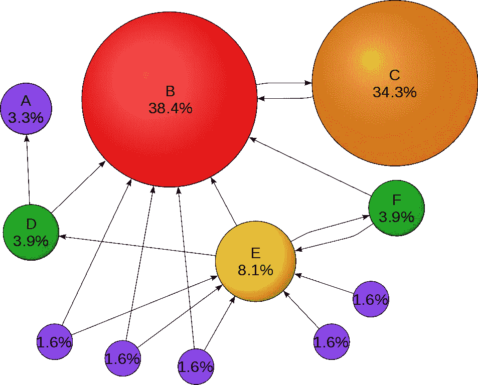

# 流行的搜索引擎优化

> 原文：<https://medium.com/hackernoon/search-engine-optimization-en-vogue-2b390bd9bc2f>

## 所有搜索引擎优化索赔都应该附带一份保证书

关于 SEO 有很多相互矛盾的建议。例如，像 http 或 https 孰优孰劣这样简单的问题就引起了争论。谷歌自己宣布他们将奖励使用 HTTPS/SSL 的网站。由于谷歌在搜索引擎领域的主导地位，可以肯定 HTTPS 会提高你的排名。然而，一个冲突的排名变量是网站加载速度。HTTPS 可以防止中间缓存，并且需要更长的握手来完成事务。这就是 Google 开发 SPDY 协议的原因。因此，现在我们有三个选择，目前还不清楚什么样的速度和安全组合会在谷歌的算法中获得最大的尊重。这只是一个搜索引擎，其他门户或引擎可能会分析你的网站非常不同。就我个人而言，我没有发现 HTTP 和 HTTPS 在搜索引擎排名上有任何统计学上的显著差异。

对于更实际的建议，最好是考虑什么能产生最好的客户体验。应该假设这是门户和站点的目标。因此，让我们来分解几个提高网站可用性的特性:速度、门户导航、网站导航、内容质量和流量质量。

速度很容易测量。谷歌提供工具[来分析你的网站速度](https://developers.google.com/speed/pagespeed/)并寻找提高的方法。好的建议是简单地设计好你的网站并使用 CDN。

门户导航取决于您的站点将出现的上下文。两个最常见的环境是谷歌和脸书。对于这两者来说，有一个可读的标题和页面元描述是一个好的建议。对脸书来说，良好的形象也是有益的。移动方面的考虑也很重要，谷歌[有一个工具来帮助解决这个问题。](https://search.google.com/test/mobile-friendly)

网站导航取决于你的设计师。对于爬虫的可访问性来说，让你所有的公共链接都不会陷入循环也是很重要的。此外，独特的网页不应该隐藏在 URL 参数后面。

内容质量可能是所有考虑因素中最重要的，但也没有单一的解决方案。跟踪你的用户，确保你的网站吸引人，用户在网站上停留的时间更长，并且会回来。搜索引擎有很多关于入口/出口的信息，所以好的流量模式会得到奖励。

流量质量足够简单。不发垃圾邮件，你就不会收到垃圾邮件。不买流量，避免欺诈点击。Moz 有一个工具可以帮助查看你的上游链接有多可靠。

我故意忽略了页面排名，因为据报道，它越来越不能预测排名。谷歌正在转向新的算法，更多地关注消费者体验，而不是内在的链接模式。

这是我目前能想到的。如果有人有建议，请在下面的评论中留下。

