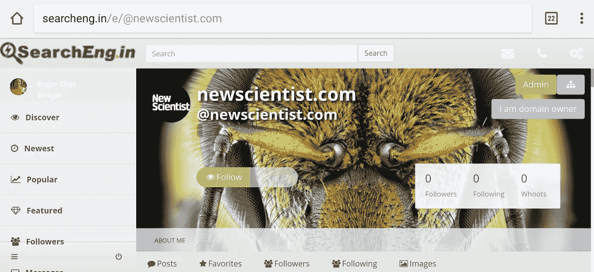
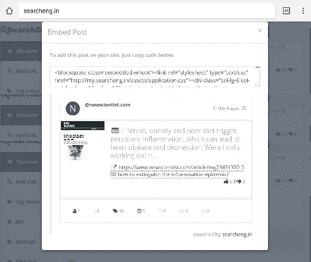
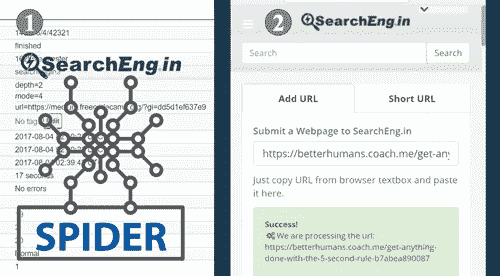
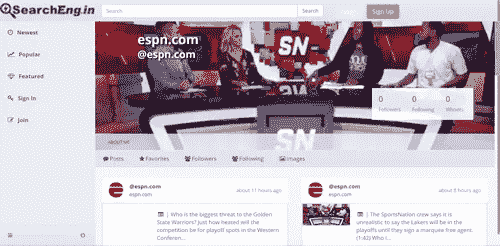
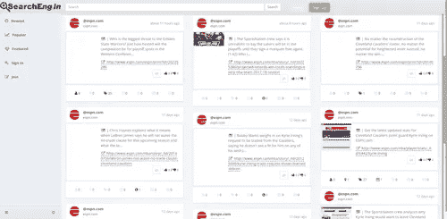
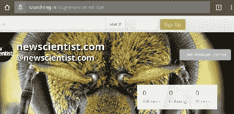
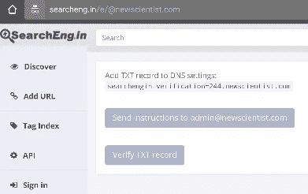
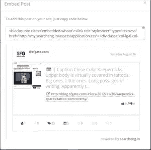
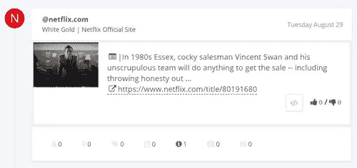

# 在社交网络中搜索网站

> 原文：<https://medium.com/hackernoon/searcheng-in-a-social-network-for-websites-40a4b4c15389>

SearchEng.in 是你[网站](https://hackernoon.com/tagged/website)的工具带。我们的目标是为网站提供一个方便、集中的地方:与网站用户交流、分享内容、联系和收取费用。

## 强调是在网站上

SearchEng.in 提供工具帮助网站与其追随者交流。SearchEng.in 提供的几个免费工具: [Url](https://hackernoon.com/tagged/url) 快捷方式、发布、分享、嵌入(网页片段)、文件共享、关注网站和用户。

SearchEng.in Embed Post

## 从头开始建造

SearchEng.in 主要关注网站以及推广与网站相关的域名和品牌。而最大的搜索引擎，如谷歌和必应，有超过 1 万亿的网页被抓取。SearchEng.in focus growth 正在有机地构建和增长其搜索索引。SearchEng.in 索引的增长发生在用户提交的 URL 和 SearchEng.in 蜘蛛爬行提交的 URL 的组合之间。

SearchEng.in 拥有适合持续稳定增长的工具。因为 SearchEng.in focus 是一个连接网站和用户的社交网络平台，网页通过[添加 Url](http://searcheng.in/#AddURL) 工具或者通过 SearchEng.in Spider 添加到索引中。

## **工作原理**

网站会自动添加到 SearchEng.in。可以通过两种方式添加网站:

1.  由 SearchEng.in 蜘蛛抓取。

2.提交给[的网页/网站](http://searcheng.in/#AddURL)上的“添加网址”

Q1ASearchEng.in Spider and SearchEng.in Add URL

## 用户名是域名。

ESPN.com page on SearchEng.in (http://searcheng.in/e/@espn.com)

网站在 SearchEng.in 上有自己的用户名，用户名格式为:@domainname.extension 例如@espn.com、@wikipedia.org、@searcheng.in

## 抓取或提交的网页会添加到域配置文件用户名下。

ESPN.com pages added to SearchEng.in (http://searcheng.in/e/@espn.com)

添加到 SearchEng.in 的网站的所有页面都可以在域名配置文件下找到。每个网站的格式都是一样的:http://searcheng.in/e/@domainname.ext
比如维基百科[http://searcheng.in/e/@](http://searcheng.in/e/@espn.com)wikipedia.org

**如何激活您的域名**

使用以下格式转到域配置文件页面:

http://searcheng.in/e/@domainname.ext
例如 http://searcheng.in/e/@espn.com 的 ESPN

如果您的域名在 SearchEng.in 中没有用户名，只需在[search eng . in 的添加 url 工具](http://searcheng.in/#AddURL)中提交您域名的网页。

要证明域名所有权，请点击“我是域名所有者”按钮。

要在 SearchEng.in 上激活和控制您的域名，您必须证明您拥有该域名。这是通过两种方式之一:通过发送到 admin@domain name 的电子邮件或添加 dns txt 记录来验证所有权。

Verify domain ownership through email or DNS TXT record.

# 为什么要用 SearchEng.in？

## 使用 SearchEng.in 的最大理由

我创建了 SearchEng.in 来提供围绕域名的必要工具。SearchEng.in 提供的工具旨在帮助品牌化您的域名，并从您的网站向 SearchEng.in 提供流畅的用户体验。

创建和发展一个网站可能会令人望而生畏，而且技术性很强。我们的目标是简化流程，一旦您证明了域名所有权，我们将为您提供实现这一目标的工具。每个工具都可以直接从域控制面板轻松访问。许多工具一开始就可以工作，但是有些需要较小的配置。

SearchEng.in 免费提供所有入门级的工具和服务。我们的入门级计划终身免费。SearchEng.in 也有付费计划，随着你的网站规模的扩大而扩大。

## 与您的用户轻松联系的地方

与关注您网站的 SearchEng.in 用户保持联系。当您的页面被抓取或添加到您的域配置文件中时，它们也会被添加到 SearchEng.in 索引中。这些新页面和内容将在网站上向用户显示。

## **基于标签的**

SearchEng.in 围绕 5 W 提供了一个基于标签的系统:谁、什么、哪里、何时、为什么(信息)。标签让你能够帮助用户识别:人，产品，日期，地点，公司和虚拟的任何类型的内容。标签是 SearchEng.in 搜索结果的核心功能。标签是自动添加的基础上，我们的爬虫，标签也可以手动添加。标签可以被嵌入和扩展，帮助用户潜在地认同你的网站。

## 嵌入和共享您的内容

SearchEng.in Embed Post and Content

网页、标签和其他与您网站相关的内容可以通过我们的嵌入工具进行扩展。将网站内容嵌入博客、网页和其他网站。嵌入就像复制和粘贴一样简单。

## 适用于您领域的工具

SearchEng.in 的目标是提供您可以在网站上使用的工具，以无缝地提供所需的服务。我们认为，一切都应该像复制和粘贴一样简单，以便让它工作。以下是 SearchEng.in 提供的一些工具:

*   **文件共享**
*   **视频主持**
*   **吊舱投**
*   **网址缩写**
*   **博客**
*   **接受付款**
*   **发送发票**
*   **电子邮件**
*   **接收/发送短信**

## (域)名称识别

SearchEng.in 希望用户能够识别你的域名。我们强调域名和到域用户配置文件页面的链接。内容围绕拥有该内容的域提升。我们为域名用户创建的所有工具都强调围绕域名的品牌化。

SearchEng.in listing of Netflix TV show White Gold.

## SearchEng.in 是一个精简搜索引擎

SearchEng.in 提供了一个基于 SearchEng.in 索引中网页的轻量级 SearchEng.in。SearchEng.in focus 关注的是那些希望吸引用户的活跃网站。搜索结果基于五个标签:谁、什么、哪里、何时和为什么(信息标签)。SearchEng.in 依靠一个活跃的社区来协作、贡献和管理网页在 SearchEng.in 搜索结果中的排名。

# 关于社区的一切

SearchEng.in focus on creating a culture for crowd source Contribution

## 没有域名，没问题

如果你没有网站或域名，你可以通过 SearchEng.in 免费注册[。SearchEng.in 的首要任务是创造一种文化，让用户和域名用户愿意在 SearchEng.in 平台上贡献、协作和管理内容。](http://my.searcheng.in)

## 我们需要编辑

SearchEng.in focus 旨在创建一个自治的编辑系统，允许贡献者自由添加内容。因为用户生成的内容对 SearchEng.in 的生态系统非常重要，我们需要编辑器来帮助验证内容是最新的和准确的。