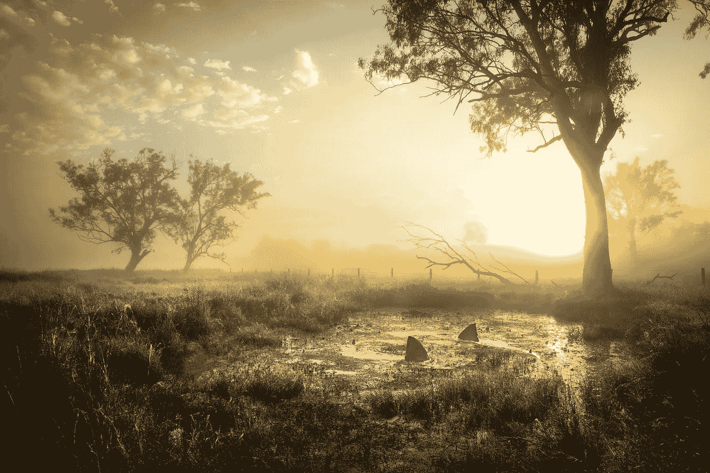

# 在杂乱的橱柜中寻找概念

> 原文：<https://medium.com/hackernoon/searching-for-concepts-in-a-cupboard-of-clutter-7b06b214b51a>

Storm in a Tea Cup © Kevin Lake

这是一个完全意料之中的讽刺，我曾多次试图写下这一点，说明将想法汇集在一起的困难。你看到的每一个句子都被删除，重写，变成各种草稿，夹在所有这些草稿中间，所有的草稿都被删除，以免影响我的想法，然后最终再次出现，作为对上述苦难的自我评论*(为此祈祷)*

事实上，想法无处不在，我们无法逃避事物，没有它们我们无法运作，它们是所有事物产生的火花，数量是无限的，所以当我们需要它们时，想出正确的想法并不困难。作为一个物种，我们对思想有一个合理的处理方式，社会的功能也很好，所以希望这意味着更多好的思想比坏的思想通过网络传播。

作为一名摄影师，我依靠好的创意来谋生，所以没有好的创意，我会吃得很饱。在所有这些日常决策、[谷歌](https://hackernoon.com/tagged/google)搜索和不必要的僵尸计划中，一定有一些很棒的计划可以利用，尤其是在积极尝试找到它们的时候。

然而，数量似乎不是问题。特别重要的那种想法，产生伟大的图像/故事/物品的原始宝石不像普通的想法，它们是新鲜的和新的，它们以不同于其他人的方式工作，无论我读多少 [99u](http://99u.com/) 文章或看多少 [TED 演讲](http://www.ted.com/)，我都觉得没有更接近于补救。至少在所有这些挫折中，我想我明白了为什么一个好主意如此难以找到，这至少是一个开始。

Big Fish in a Small Pond © Kevin Lake

首先，大多数想法似乎只是功能性的，对人类的生存至关重要。我们每天在选择吃什么、看什么、给谁发短信等的时候都会用到它们。他们的不断使用意味着他们已经成长为高大的体型，有着沉重的脚和吼叫的声音。创造力所需的较小的、罕见的成形想法对于这种舞台来说往往太脆弱了，所以发现自己被撞了出去。

当大海最平静的时候，阅读一本书，洗澡等等，最好的想法往往会被发现。在那里，他们可以自由地小心翼翼地从角落里走出来，让别人来考虑他们。你越冷静，他们就越能自由奔跑，被更多地研究，被允许成长。

然而，越是有趣的小想法，就越有可能在以后抓住它。很快，那片你称之为心灵的田园牧歌般的草地上就布满了四处劫掠的暴徒，他们想用棍子打那个小家伙的头，然后把他扔进一辆没有标志的货车的后座。刚才还平静地漫游的思想，现在正惊慌失措地四处乱窜，伺机撤退。

然而，过了一段时间，通过一点点练习，你可以训练你的功能侧走得更轻一点，更温和一点，这样如果运气好的话，你就可以充满爱意地把整件事捡起来，留到以后用，不要太戏剧化。一项出色的工作和另一幅生产中的画面。

问题是这不是真正的问题。真正的问题是当你依靠这些想法谋生的时候。这不再仅仅是你一天中漫步的情况，就像从你丰富的花园中采摘完全成熟的苹果一样。

通常你会在截止日期前工作，或者需要完成一个系列。紧迫性和压力确保你的头脑不再是一个充满可能性的仙境，在那里完美的想法自由而平静地漫游。你需要指挥上的想法，但是想法和命令很少能在同一个空间里很好地共存。

Fish out of Water © Kevin Lake

传统的反应是利用你积累的技巧来清理你的头脑，洗掉那些更具破坏性的想法，带一点平静回来。也许去做个按摩，喝杯咖啡，或者去某个地方游泳。这些方法可以奏效，而且经常奏效，但不可避免的是，有时来自各方的压力会打破规则。

那个曾经孕育心灵的巢穴可能会变成一个世界末日般的禁区，如果你朝他们的大方向看，工作保障和租金支付等丑陋无牙的老人们会向你扔鞋。

Moths to a Flame © Kevin Lake

在这样一个地方，没有任何正确的概念会被视为死亡，随着饥荒的到来，恐慌也随之而来。在这片贫瘠的荒地上，只有最自信的旧观念还在自由地行走。遇到困难的时候，这些可能会被塞进货车里，然后进行战略性的清理。你可能会从过去的几个想法中截取一些片段，这样它们也会变得更有吸引力。如果你幸运的话，你可能最终会有一些完整概念的表象，但其他时候它可能看起来像它是什么，一些糟糕的牙科工作带来的盲目恐慌。

当迷失在争斗中时，我的建议是找到你的平静，整洁地缝纫，并准备几顶帽子作为装饰。我可能不是最漂亮的，但一片完整的毛边总比下回被一大堆碎片绊倒要好。

*这样我就自由了，唷！*

> [黑客中午](http://bit.ly/Hackernoon)是黑客如何开始他们的下午。我们是 [@AMI](http://bit.ly/atAMIatAMI) 家庭的一员。我们现在[接受投稿](http://bit.ly/hackernoonsubmission)，并乐意[讨论广告&赞助](mailto:partners@amipublications.com)机会。
> 
> 如果你喜欢这个故事，我们推荐你阅读我们的[最新科技故事](http://bit.ly/hackernoonlatestt)和[趋势科技故事](https://hackernoon.com/trending)。直到下一次，不要把世界的现实想当然！

