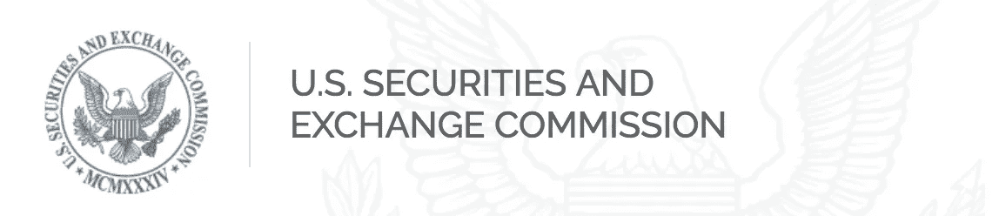

# 证券交易委员会正在打击名人代言的 ICO

> 原文：<https://medium.com/hackernoon/sec-is-cracking-down-on-celebrity-endorsed-icos-95285135dfa7>

有没有想过，你最喜欢的名人或社交媒体影响者是否因为推广 ICO 而暗中获得报酬？你现在可能不必再担心他们的文章或推文是否有财务偏见。

2017 年 11 月 1 日，美国证券交易委员会出面，[发布了一份声明](https://www.sec.gov/news/public-statement/statement-potentially-unlawful-promotion-icos)，要求所有支持 ICO 的名人和/或社交媒体影响者“必须披露性质、范围和获得的报酬金额，以换取推广。”

这是因为许多 ICO 可能属于证券类别。有鉴于此，所有在美国发行和出售证券的人都必须遵守联邦证券法。这包括反兜售条款。

需要说明的是，这并不意味着 ICO 明星代言的终结。这仅仅意味着你会被告知他们为其背书会得到多少报酬。这是一股受欢迎的新鲜空气，或许也是政府监管如何对加密货币产生积极影响的一个例子。

有趣的是，SEC 在声明中始终使用试探性的语言:

1.  "这些代言*可能*是非法的."
2.  "委员会警告说，在 ICOs *出售的虚拟代币或硬币可能是证券."*
3.  “作出这些背书的人*也可能*对反欺诈条款的潜在违反负有责任”

本质上，美国证券交易委员会使用了一句臭名昭著的台词:“看情况。”尽管一些投资者可能会发现这种缺乏清晰度的情况令人沮丧，但他们不愿将所有 ICO 都贴上证券标签的态度应该被积极看待，因为这表明他们对区块链技术未来的潜在应用持开放态度。

**但是，密码影响者如何确定 ICO 是否属于证券的定义范围？**

最好用最保守的定义，参考 SEC 在 1933 年[证券法](https://www.sec.gov/about/laws/sa33.pdf)中是怎么定义的。

“术语“证券”是指任何票据、股票、库存股票、证券期货、基于证券的掉期、债券、信用债券、债务凭证、利息证书或参与任何利润分享协议、抵押信托证书、组织前证书或认购、可转让股份、投资合同、投票信托证书、证券的存款证书、石油、天然气或其他矿产权利的部分未分割权益、任何证券的任何看跌期权、看涨期权、多空期权或特权、存款证书， 或证券组或证券指数(包括其中的任何权益或基于其价值的权益)，或在国家证券交易所签订的与外币相关的任何认沽期权、看涨期权、跨期期权或特权，或通常称为“证券”的任何权益或工具，或任何前述权益或参与证书、临时或中期证书、收据、担保或认购或购买权利。”

# 记得给我左边的掌声，下面的捐款，和你的朋友分享！直到下一次，向前和向上。😁

**捐赠地址** BTC:35 lfsm 2 eupceip 5 zzcgwmx 7 sccf ZK 7 jqyg
LTC:lpz 923h 556 f 8 G8 mgwnsuhqhvudrd 7 ccqyhf