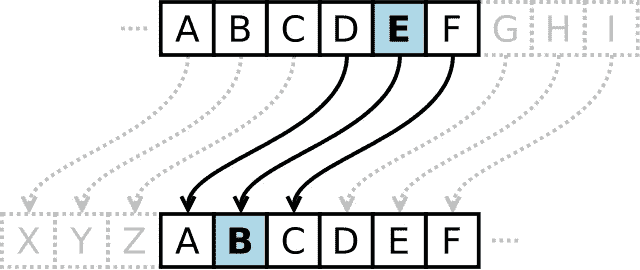
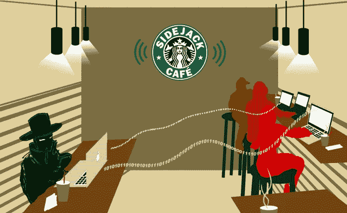
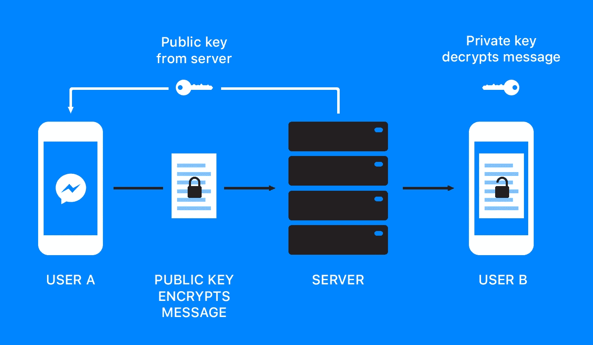
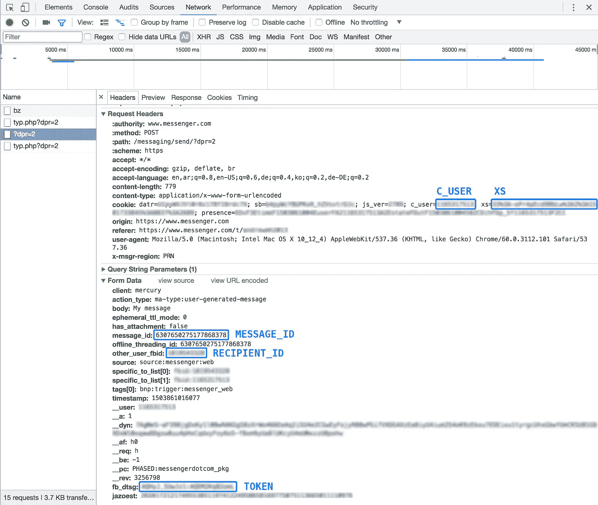
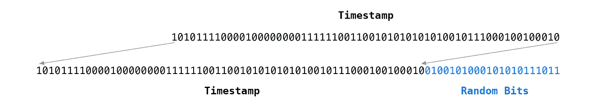
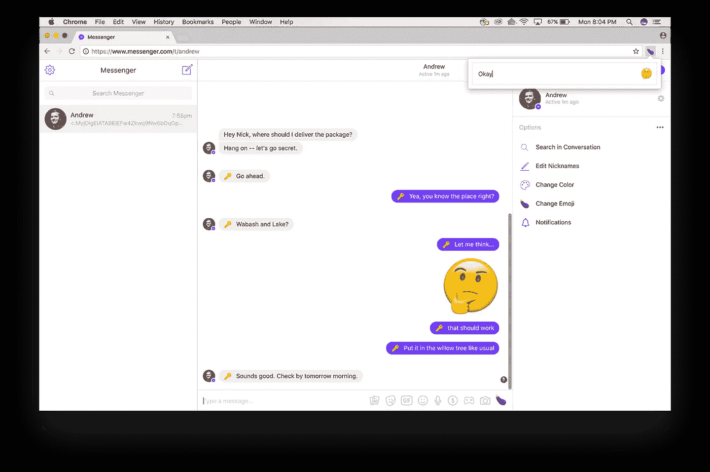

# 秘密，秘密男孩他们很有趣🙊

> 原文：<https://medium.com/hackernoon/secrets-secrets-boy-theyre-fun-61a62ca575ed>


> 还记得你小时候吗？
> 
> 你可能有一个疯狂的戒指，让你发送秘密信息给你的朋友。


你写给朋友的秘密信息并不是真正的秘密，但知道其他人不知道你在说什么是新奇和有趣的。

这些环被称为解码器环，使用简单的凯撒密码替代。通过旋转字母表，赋予每个字母一个新的值，就可以得到秘密字符。你的信息在有 30 分钟空闲时间的人手里很容易被破解，让他们有能力阅读你所有的信息。



这种怀旧的感觉促使我开发一个 chrome 扩展，对你的脸书信息进行端到端的加密。这不仅有趣，而且安全。

# 什么是端到端加密？

端到端加密意味着您的邮件在离开您的计算机之前是完全加密的。这使得当你的信息被发送到服务器时，人们不能窃取它们。这也意味着你使用的信息平台不能阅读你的信息。我喜欢认为任何时候离开你的电脑就像离开你的房子一样。你不会光着身子出去吧？给你的留言穿上衣服！



加密你的信息会把它变成一串天书:

```
**Original Message:**
This is a secret!**Encrypted Message:**
MyjDqDUIATABEiEFwoMPwqvChMKkV3gUL8KKYsKKcDXDq2zDhsOUcsKuw7/CvhYmw4wdGkzDmiDCk0QaIQXCvsOMOkARwoJrEWDDrFkCYwfCnx7DrS8zwoPDkcOwLxQCFMOuw6fCnsOSw6MBIlIzCiEFF8OhwoNQeQEkw74CwqbCiiDDjnoHwpYgTMKwwrtvwofCqA42w4/DqWI7QikNEAAYACIgwrMXwp0/w7DDusOHTMOXwp3Co0XDr8K1KcO5wpROwr7DhsKUU8ONwr4jw4wiwptSDzXDs1vDssKOwr42H8Kawo0=
```

太好了！我怀疑没人能看懂。

然而…你的朋友需要能够读懂它😝

# 不对称加密

如果你想让你的朋友能够打开你的信息，他们需要这把锁的钥匙。如果是我们的锁，我们可以把钥匙寄给他们！但是……我们不想只给他们钥匙，对吗？因为这样有人就能偷到钥匙并解开我们的信息😵那我们该怎么办？

我们可以通过使用“非对称加密”来解决这个问题。

这样想吧…当你想发送你的信息时，向**他们**要一把锁。他们应该是唯一有这把锁钥匙的人。现在你锁了发了，只有你朋友能打开，你不用交换任何钥匙。

使用非对称加密，您要处理成对的公钥和私钥。公钥可以被认为是打开的锁，可以自由地分发给你所有的朋友。私有密匙是真正的密匙，应该在一个安全的地方高度保密。



# 入侵脸书的消息 api

为了发送加密信息，我们需要知道如何发送普通信息。这是通过脸书传递信息所需的核心信息:

1.  您朋友的脸书用户 ID ( `RECIPIENT_ID`)
2.  唯一的消息 ID ( `MESSAGE_ID`)
3.  一枚`fb_dtsg`令牌(`TOKEN`
4.  一块饼干作为你的凭证(`C_USER` + `XS`)

通过检查 Facebook Messenger 的网络活动，可以轻松获取收件人 ID、`fb_dtsg`令牌和 cookie。



**注意:**打开网络面板后你还要发消息。

另一方面，消息 id 必须是唯一的。如果消息 id 冲突，那么该消息将永远不会出现。

脸书是如何生成 id 的？

```
**message_id:** 6306169721153220898
**timestamp:** 1503508024490
```

我发现 message_id 除以时间戳等于 4，194，304。这恰好是 2 的幂或者确切地说是 2 的幂。脸书将时间戳向左移动 22 位，并用随机数填充空位。



下面是一个发送消息的 cURL 命令示例:

```
curl '[https://www.messenger.com/messaging/send/'](https://www.messenger.com/messaging/send/') \
-H "cookie: \
    c_user=**C_USER**; \
    xs=**XS**;" \
-d "action_type=0\
&   body=My message.\
&   has_attachment=false\
&   message_id=**MESSAGE_ID**\
&   offline_threading_id=**MESSAGE_ID**\
&   other_user_fbid=**RECIPIENT_ID**\
&   source=0\
&   timestamp=0\
&   fb_dtsg=**TOKEN**"
```

**注意:**一定要用自己的值替换`C_USER`、`XS`、`MESSAGE_ID`、`RECIPIENT_ID`、`TOKEN`。*(出于测试目的，在最后发送的* `*MESSAGE_ID*` *上加 1 是安全的)*

# Chrome 扩展！

既然我们可以发送消息，我们需要一个实际的接口。Chrome 扩展给了你巨大的力量。您可以完全控制任何网站。你可以重构 html，操纵 css，甚至注入脚本。如果用户在 Facebook Messenger 上，你可以窃取他们的 cookies，并确定他们正在与哪个用户交谈。这正是我们所需要的。



如果你有一些 web 编程的经验，构建一个扩展是很容易的。这就像建立一个网站，在网站之上。如果没有，不用担心，Google 有一个非常全面的构建扩展的[演练](https://developer.chrome.com/extensions/getstarted)，以及一些有用的示例项目。

由于我不想把它变成 chrome 扩展的教程，所以我会把这个项目的[源代码](https://github.com/bourdakos1/Phat-Emoji)留给你。(如果您需要更多帮助，请随时联系我)

要运行您的扩展，请按照下列步骤操作:

1.  在浏览器中访问`chrome://extensions`
2.  确保右上角的**开发者模式**复选框被选中。
3.  点击**加载解压后的扩展名**弹出文件选择对话框。
4.  导航到您的扩展文件所在的目录，并选择它。

# 使用库和一些权衡

如前所述，我们需要使用某种形式的非对称加密。在处理安全性问题时，使用经过实战检验的库是一个好主意。据我所知， [WhisperSystems 的信号协议](https://github.com/WhisperSystems/libsignal-protocol-javascript)是信息加密的首选。它为实现自由留下了很大的空间，因为 Signal 只是一个协议。这种自由让我们处理一些权衡。

## 阅读你自己的信息

为收件人加密邮件时，加密方式是只有对方的私钥才能解密您的邮件。即使是你也无法解密这条信息。

如果你想阅读自己的信息，有几种方法。一种方法是加密两次，一次给你，一次给收件人。这有点慢，因为我们必须将所有内容加密两次。也不太安全。推荐的方法是将解密的消息存储在客户端本地。

## 向前渐进

该协议建议对您发送的每条消息使用唯一的公钥。这保持了旧消息的保密性。如果你的私钥泄露了，只有一条消息会被泄露，而不是整个对话。但是，这意味着您只能解密一次消息。

这就需要在服务器上存储一批**密钥。如果用户用完了公钥，他们就不能接收消息。也就是说，如果有人离线，他们只有 100 把钥匙，我们只能给他们发 100 条消息，直到他们重新上线。**

一个可能的折中方案是每 x 小时生成一个新密钥。这样用户就可以一直发送消息，多次解密，我们一次只需要在服务器上存储一个密钥。

# 最后的想法

这个项目一直是一个疯狂的过山车，远远没有完成。如果你对项目背后的代码感兴趣，可以在这里抓取[，在这里](https://github.com/bourdakos1/Phat-Emoji)查看实际的扩展[。玩得开心，有创意，继续黑客！](https://chrome.google.com/webstore/detail/phat-emoji/ognoiiipkkmdmihiinbpdfjbfncekbhj)

感谢阅读！如果您有任何问题，请随时联系 bourdakos1@gmail.com，通过 [LinkedIn](https://www.linkedin.com/in/nicholasbourdakos) 联系我，或者通过 [Medium](/@bourdakos1) 和 [Twitter](https://twitter.com/bourdakos1) 关注我。

如果你觉得这篇文章很有帮助，请给我一些掌声👏并分享给朋友。