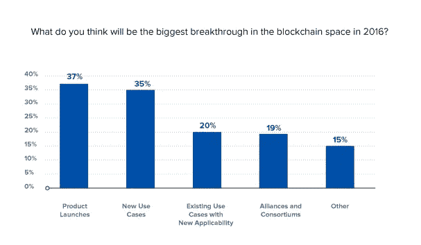
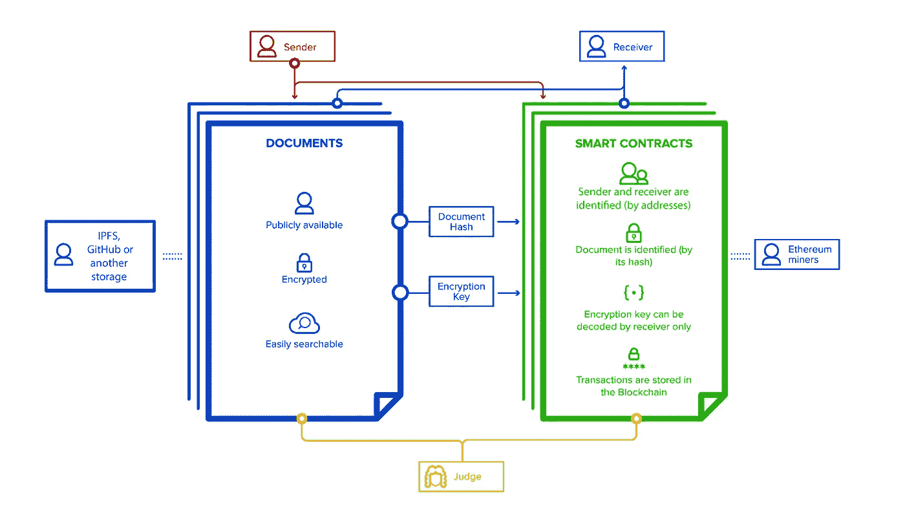
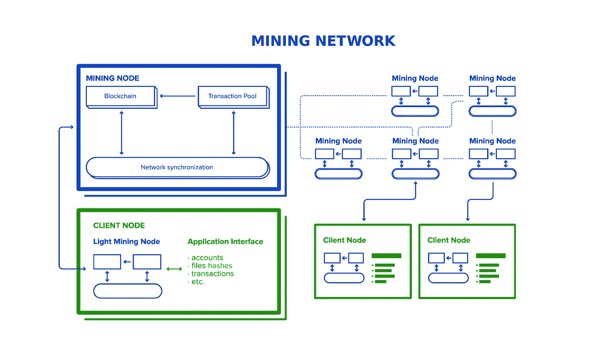

# 如何使用区块链技术进行安全的文档传输

> 原文：<https://medium.com/hackernoon/secure-document-transfer-built-on-top-of-blockchain-technologies-f5a040e5402f>

***UPD 2018 年 4 月*** *:本文已更新，以分享我们在为一家金融行业客户部署类似解决方案后获得的见解和成果。*

金融、政府和法律行业的组织对区块链和智能合同表现出最大的兴趣。这种方法的好处体现在安全性、速度和降低成本方面。麦肯锡估计，到 2021 年，区块链可以为企业节省至少 500 亿美元的 B2B 交易。

自 2008 年比特币出现以来，加密货币及其底层技术之一区块链已经成为金融界的流行语。如果纵观加密货币的短暂历史，从比特币问世的那一年开始，这项技术深度融入金融行业的时间不到 10 年。今天，我们已经有数百种替代硬币和加密货币可用。

支持这项技术的人认为，它可以像几十年前互联网一样改变全球格局。看起来主要的机会还没有到来。

# 区块链技术的潜力:金融及其他

随着 2016 年的开始，全球数字货币新闻和信息的领导者之一， [CoinDesk](http://www.coindesk.com/about-us/) 分享了一篇[文章](http://www.coindesk.com/2016-blockchain-reality-deloitte/)，其中介绍了德勤对数字货币和区块链行业在接下来一年可能如何发展的预测。这一预测是基于德勤在其内部加密货币社区进行的一项调查，旨在解决“你认为 2016 年区块链领域最大的突破是什么？”

下图显示了调查的高级结果:

根据调查结果，受访者认为，2016 年区块链趋势可能会加速，导致新的有前途的合作伙伴关系和高科技产品的推出，从而带来重大投资。

看起来这个预测已经开始变成现实了。据[cryptocoinsnews.com](https://www.cryptocoinsnews.com/)报道，微软最近宣布了与美国银行的[合作，旨在“用区块链的技术推动贸易融资交易的变革”](https://www.cryptocoinsnews.com/microsoft-partners-bank-of-america-on-blockchain-to-transform-trade-finance/)

德勤调查的另一个重要结果是关于区块链和去中心化方法本身的新兴新用例，因为这种技术似乎有很大的潜力超越金融领域，扩展到房地产、商品、零售、数字媒体等领域。这只是最近已经开始进行大量区块链实验的领域的一个简短列表。

这篇文章描述了我们如何从内部 PoC 开始，并最终为我们的一个来自金融行业的客户提供了一个真实的原型。您将看到我们如何推进我们的方法，以及技术堆栈如何发展。

当我们为客户开发安全文档传输系统时，我们选择了区块链，这是出于一些特定的原因—该技术允许在业务参与者之间建立一个集效率、安全、透明和信任于一体的环境。

一般来说，区块链事务的速度可能比数据库慢。这是因为，使用区块链时，系统需要执行一些额外的操作，如验证共识和应用加密技术来确保交易的安全性。然而，由于这些额外的步骤，区块链提供了信任和安全性，即使在半信任的环境中，因为每个利益相关者都可以立即获得交易历史。

# 挖掘智能合同的能力

当我们开始试验区块链技术时，我们了解到分散式方法实际上允许人们组织各种类型数据的安全传输，其潜力不限于金融交易。此外，随着智能合约的引入，这一功能得到了显著扩展。

智能合同是自动化的计算机程序，可以通过使用一些预编程的条件来自我执行和自我实施，并且运行时没有任何停机、审查、欺诈或第三方干扰的可能性。

智能合约的设计与纸质合约非常相似，可以执行任何协议的条款。它们以所涉及的双方(发送方和接收方)为特征，包括对正在传输的文档的引用以及其他属性，例如时间戳、块地址、自身地址等。

这项技术的主要目的是简化金融交易，允许两个匿名方通过互联网进行商业操作，不需要中间人。然而，智能合约并不仅限于金融领域。随着这项技术的成熟，它允许存储和转移涉及法律领域、房地产、知识产权等的资产。受到这一广泛技术潜力的启发，我们决定在区块链上创建一个智能文档管理的定制系统，允许用户安全地存储和转移各种资产。

换句话说，与数据库相比，区块链支持不同的目标。区块链使用去中心化的方法，而对于数据库，用户的访问权限有限，管理员可以随时修改数据。

# 开发一个基于以太坊的安全文件传输系统

我们决定在以太坊的帮助下构建我们的系统，以太坊是一个运行智能合约的分散平台。

我们选择以太坊的原因之一是因为它支持智能合约开发的广泛可能性。该平台还提供了一种高级编程语言，具有大量不同的数据类型、函数等。以太坊的另一个好处是，这个网络是活的；它已经起作用了。所有这些使得以太坊成为我们实验区块链的最佳选择。

以太坊区块链是一个没有许可的区块链，在这里任何人都可以加入网络以及写和读交易。但通常情况下，企业需要专用的区块链网络，这样只有预先定义的参与者才能加入网络，查看和进行交易。在这种情况下，应使用许可的区块链(如区块链 Hyperledger)。

就在最近(2017 年夏天) [Hyperledger](https://www.hyperledger.org/) 发展并发布了新版本，拥有更多功能和工具，这使其成为私人或半私人区块链的一个有趣平台。Hyperledger 更适合我们客户的业务，因为与公共区块链相比，它允许对谁能看到什么以及谁能访问什么建立更细粒度的控制，在公共中，所有信息对每个人都是可用的，我们必须考虑额外的加密技术。

该实验的目的是为各种金融、法律或任何其他类型的文档(如协议、所有权条款、私人照片等)提供安全的存储和传输。换句话说，我们希望创建一个环境，在这个环境中，可以安全地处理合法交易，并且不需要第三方中介。在日常生活中，当人们缔结法律协议时，这一过程需要公证人的参与，公证人的工作是核实协议，签署协议并在他/她的日记中登记。而在区块链世界，你不需要为公证服务付费，这通常要花很多钱。多亏了加密技术，所有的签名都可以得到保护，而区块链可以验证和维护注册表日志。

更重要的是，它花费的时间要少得多，尤其是当双方处于不同的时区时。想象一下，阿姆斯特丹的一个物流组织需要与新加坡港口和迪拜的一家银行签署协议。在执行常规法律合同的情况下，当所有代表在线时，双方可能需要组织视频电话并签署文件。使用区块链解决方案，所有参与者都可以在他们有空的时候给予批准；没有必要协调这个过程——业务逻辑和智能合同会完成这项工作。

我们创建的解决方案包括两个关键单元:文档存储和智能合同日志。

我们希望存储包含所有的文档，提供公共的验证访问和私有的受限的阅读访问，因此我们选择了 Github。我们将文件放在公共 GitHub 中，让每个人都可以看到它们，但它们仍然受到加密保护。结合公共存储和密码安全访问，我们使任何人都有可能访问文件；然而，如果没有加密密钥，这个文件只是一组普通的字节。

对于我们的客户来说，我们没有使用公共 GitHub，而是选择了 [IPFS](https://ipfs.io/) 专用网络作为存储。星际文件系统 IPFS 是一个内容寻址的对等分布式文件系统。利益相关者可以将文件上传到网络中，这些文件在对等者之间共享。参与者可以在 IPFS 客户端的帮助下将文件上传到系统，这是网络的一个入口点。

IPFS 网络也可以通过公开可用的网关直接从网络浏览器访问，这对于那些设备上没有安装 IPFS 客户端的用户来说是一个巨大的优势。为了确保安全，IPFS 对所有的交易都进行加密。

私有网络只允许 IPFS 连接到拥有共享密钥的其他对等方。私有网络中的所有节点都与公共网络隔离，数据只在私有网络中的节点之间共享。我们的解决方案用接收者的公钥加密密钥，这样只有接收者可以用他/她的私钥解密它。

在智能合同的帮助下，加密密钥通过以太坊区块链传送。这些合同包含发送者和接收者的地址，一个密钥，以及一个到公开存储文件的链接。合同规则被预先编程，只有接收者可以获得密钥。

我们使用智能合同日志来包含所有交易及其属性。该杂志还为私人访问提供了一个界面。我们决定增加变更追踪的选项。因此，发送方和接收方可以更改现有文档，并且所有更新都可以通过区块链进行跟踪。这样，每个人都会看到实现了一些更改，但是同样，如果没有加密密钥，没有人能够检查出更改了什么。

我们创建的区块链网络包含许多节点:挖掘节点和客户端节点。挖掘节点包含区块链的完整版本，并执行“工作验证”一致算法来挖掘新块。客户端节点还包含一个完整的区块链，除了提供一个区块链接口来启用智能合约创建和调用之外，不做任何工作。在我们的例子中，我们决定在客户端节点中保留区块链，这样我们就可以轻松地切换节点类型，但是客户端节点仍然可以只保留部分区块链。

挖掘节点作为一个虚拟机托管在 [Azure](https://azure.microsoft.com/en-us/) 上，使用 Ubuntu 操作系统。客户端节点是本地托管的(如[Geth](https://github.com/ethereum/go-ethereum/wiki/Geth)——区块链娱乐城的命令行界面)，用户界面写在上面。[网 WPF](https://msdn.microsoft.com/en-us/library/mt149842(v=vs.110).aspx) 。客户端 WPF 应用程序包含了使用 GitHub 作为文档存储和使用 Geth 作为区块链接口所需的所有逻辑。我们选择 WPF 的原因是，与“黑色命令行”相比，WPF 应用程序的界面更加用户友好。WPF 应用程序还提供了创建帐户的逻辑，钱包存储在本地 Geth 节点中。

因为应用程序的第一个版本是用。Net WPF，它只适用于 Windows。虽然我们的客户需要一个跨平台的解决方案，但我们选择了 Node.js 来让应用程序在 Windows、Linux 和 MacOS 上运行。

除了 Node.js，我们使用 C++和 Go 进行后端开发，使系统在高负载下高效运行。下面的方案详细展示了我们的网络。

网络节点以永久运行模式工作，以保持区块链正常运行。我们在本地测试了我们的网络，看看文件是如何传输的，这个过程看起来相当平稳可靠。因此，我们决定对我们网络的基本功能进行一些增强。

# 进一步改进:我们与以太坊区块链的下一步

为了提高传输过程的整体安全性，我们决定创建一个替代的文档管理系统:一个更安全的系统，允许创建备份，并与现有的法律法规兼容。我们还希望这个系统既可以通过网络访问，也可以在移动设备上使用。与帐户功能相关的下一个安全改进是实现密码恢复选项，允许用户在用户个人数据的帮助下恢复密码。至于私钥，我们希望将它存储在本地注册表中，或者将它拆分成多个文件。在这两种情况下，新功能都是可访问的，并且可以作为服务使用。

为了进行全面的网络分析，我们创建了一个工具的概念，该工具可以监控和显示网络性能并收集统计数据。这个工具将为网络搜索提供一个接口，包括块、地址、交易。它还将以清晰透明的方式显示所有这些交易。为了改善我们的网络提供的用户体验，我们开发了一种定制的货币化和支付方法，定义了客户节点支付交易的方式以及挖掘节点获得的利益。由于上述自定义文档存储和“钱包和账户”服务，区块链的共享经济可以轻松维护。

# 区块链商业的未来

对于企业来说，区块链和智能合约开启了各种新的机遇。在所有众包方法中，区块链很可能是最好的一个。还是可以认为有点未来感的；然而，事实证明，它的工作方式与自动驾驶的优步打车服务相同。想象一下，一个安全透明的系统，被政府接受，允许人们跟踪和管理任何有价值资产的合法操作:汽车、房子、股票等等。或者，这是一个投资管理的综合解决方案，人们可以从他们投资的上市公司获得股票和付款。事实上，区块链的可能性很大，而且随着这项技术的成熟，这种可能性还在不断扩大。预计在不久的将来会出现一些新的高级用例。

虽然对于一些企业来说，区块链和智能合约可能需要更长的时间来适应，但这项技术现在在金融服务行业及其他领域显示出巨大的潜力。如今，区块链和智能合约的先驱包括大型制药企业、电子商务领导者和金融服务巨头。

[立即联系我们在 ELEKS 的专家](https://eleks.com/contact-us/?utm_source=medium&utm_medium=referral &utm_campaign=Republ-Blockchain-Doc-Transfer-Labs)，我们将帮助您确定区块链技术是否适合您和您的企业。我们将量身定制最符合您需求的解决方案，以确保您的企业充分利用区块链和智能合同。

*原载于 2018 年 4 月*[*【labs.eleks.com*](https://labs.eleks.com/2016/10/secure-document-transfer-built-top-blockchain-technologies.html?utm_source=medium&utm_medium=referral &utm_campaign=Republ-Blockchain-Doc-Transfer-Labs)*。*