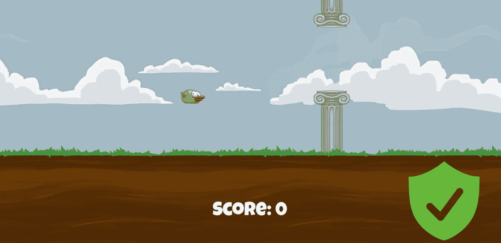
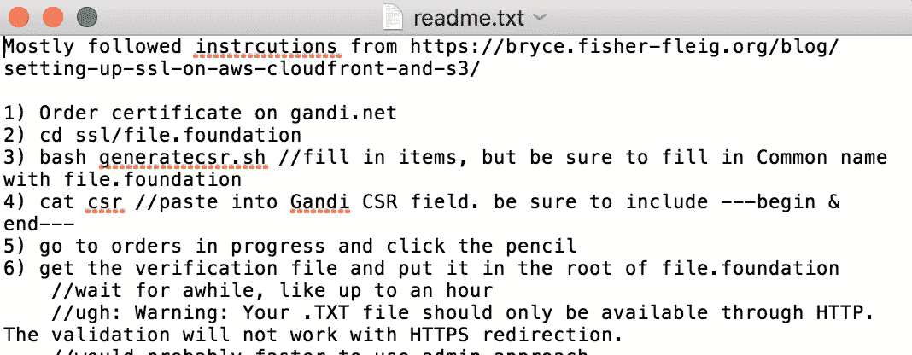
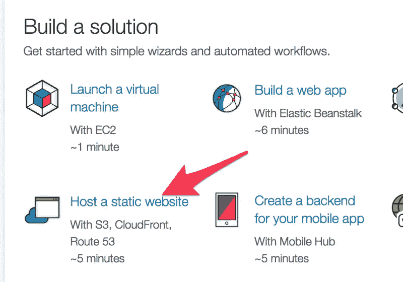
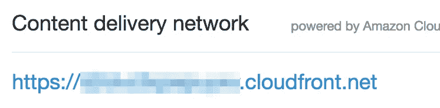
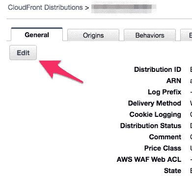
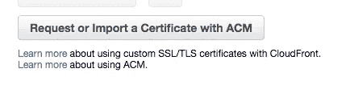
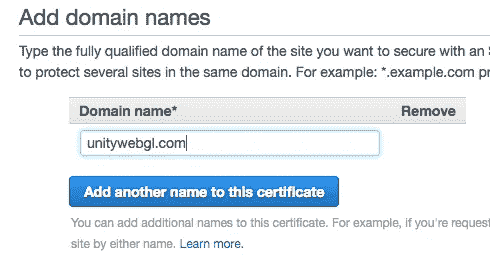
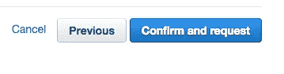
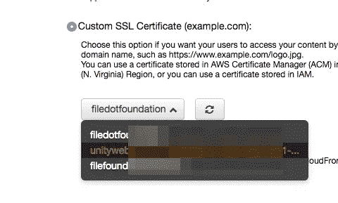
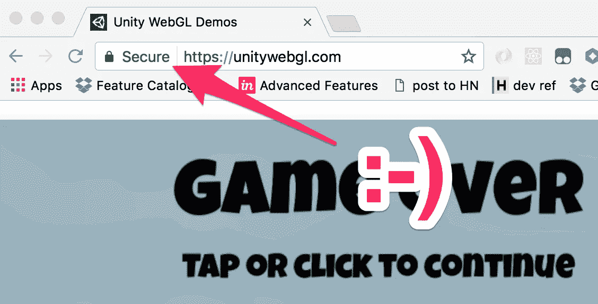

# 保护 Flappy Bird。HTTPS 在 AWS 上变得异常轻松

> 原文：<https://medium.com/hackernoon/secure-flappy-bird-https-just-got-insanely-easy-on-aws-6fe1d41ed12f>

大概 10 分钟左右。而且免费。关键是亚马逊网络服务上的亚马逊证书管理器。

几天前我[写了一篇关于](https://hackernoon.com/how-i-built-and-deployed-a-webgl-game-to-a-new-website-in-35m-15b2e8339c31)我如何能够在 35 分钟内构建并部署一个 WebGL 游戏《Flappy Bird》到[的直播网站](http://unitywebgl.com)的文章。我掩盖了没有 SSL 的事实。

谁在乎我的 Flappy Bird 是不是在 HTTPS 被端上来？

[谷歌](https://developers.google.com/web/updates/2016/10/avoid-not-secure-warn) **。**

你想让这个巨大的“不安全”图标出现在你的页面上吗？

…cause you’ll get it in a few months

Google 也在*[**2014**](https://webmasters.googleblog.com/2014/08/https-as-ranking-signal.html)*****宣布 SSL 是排名信号。你应该冒着在搜索结果中排名靠后的风险，因为你太懒/太穷而没有设置 SSL 吗？

## 借口一:你很懒

查看我为自己创建的这个疯狂的自述文件，了解如何使用我在[gandi.net](http://gandi.net)购买的域名设置 SSL:

it goes on for 12 steps…

我不想再这样做了。

## 借口 2:你很穷

Gandi.net 第一年给你免费的 SSL，但随后几年要收 16 美元，单个网站域名的价格要翻一番。为那个副业项目支付额外的现金真的值得吗？

## 别再找借口了

虽然我很喜欢支持像甘地这样的小域名提供商，但是在 AWS 上把域名连接到 SSL 的过程非常简单，成本也很低

**I like free.**

我是这样设置的。我假设你使用过 AWS 的静态站点向导，我在我的上一篇文章中解释过。

在 AWS 登录页面中，转到此处:

选择您已经设置的网站，然后转到您的 Cloudfront CDN:

编辑您的“常规”设置:

选择使用 ACM 请求或导入证书:

添加您的域名:

确认。他们会给你发一封电子邮件，你也需要批准。

回到常规设置，链接 ssl 证书:

你现在有安全的 flappy！：

SSL is easy, but flappy still isn’t

就是这样。十分钟零美元。

[https://unitywebgl.com](https://unitywebgl.com)

您有兴趣了解更多关于 Unity web GL 的信息吗？我现在提供一个关于 Udemy 的四小时 60+讲座课程。 [WebGL with Unity 终极指南](https://www.udemy.com/webgl-with-unity-the-ultimate-guide-to-games-in-the-browser/?couponCode=MEDIUM11)以超过 90%的价格向我的媒体读者提供。只需点击上面的链接！

如果你今天学到了新东西，请💚然后跟着走。它为我继续写这些文章提供了巨大的动力。

> [黑客中午](http://bit.ly/Hackernoon)是黑客如何开始他们的下午。我们是 [@AMI](http://bit.ly/atAMIatAMI) 家庭的一员。我们现在[接受投稿](http://bit.ly/hackernoonsubmission)并乐意[讨论广告&赞助](mailto:partners@amipublications.com)机会。
> 
> 如果你喜欢这个故事，我们推荐你阅读我们的[最新科技故事](http://bit.ly/hackernoonlatestt)和[趋势科技故事](https://hackernoon.com/trending)。直到下一次，不要把世界的现实想当然！

