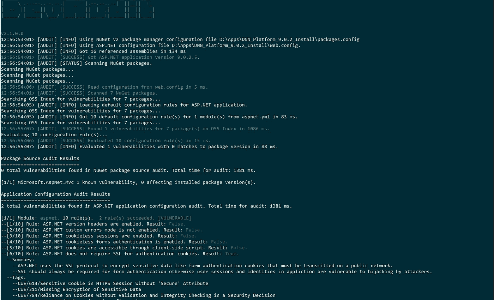
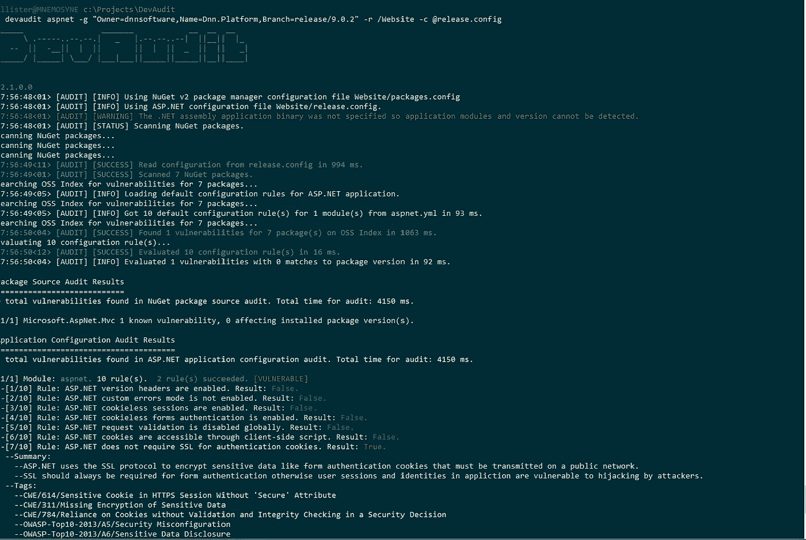
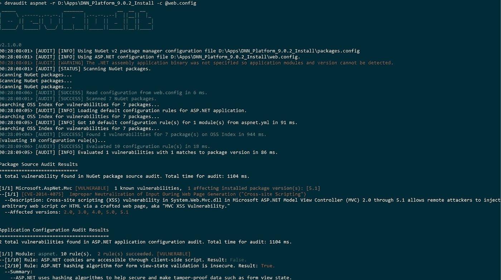
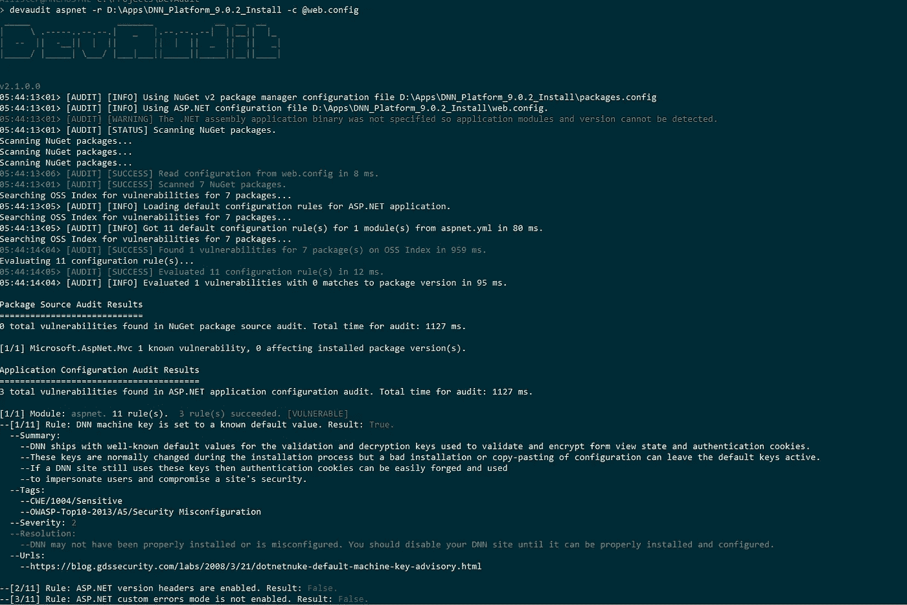
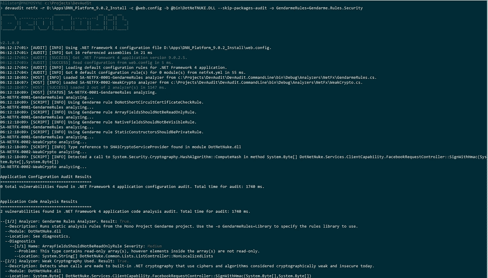

# 使用 DevAudit 对 ASP.NET 应用程序进行安全审计

> 原文：<https://medium.com/hackernoon/security-auditing-asp-net-applications-using-devaudit-ee31873be364>



Auditing the DNN CMS using DevAudit

在本文中，我将展示如何使用开源的跨平台多用途安全审计程序 [DevAudit](https://github.com/OSSIndex/DevAudit) 对一个流行的开源 ASP.NET web 应用程序:[DNN CMS](https://github.com/dnnsoftware/Dnn.Platform/)(née[DotNetNuke](http://www.dnnsoftware.com/))的库依赖项、应用程序配置和代码进行[安全审计。](https://hackernoon.com/tagged/security)

## 介绍

我已经关注[安装](https://medium.com/u/d282b2777ae0#installation)部分中的构建和安装说明:

1.  请确保您安装了先决条件:。Windows 上的 NET Framework 4.6 或 Linux 上的 Mono 4.4+。
2.  克隆 DevAudit 存储库:`git clone [https://github.com/OSSIndex/DevAudit](https://github.com/OSSIndex/DevAudit)`
3.  通过在 Windows 上从 Visual Studio 提示符运行`build.cmd`或者在 Linux 上运行`./build.sh`来构建项目。
4.  您应该能够通过在 Windows 命令提示符下键入`devaudit`从项目文件夹中执行 DevAudit。

在 Linux 上，您还可以从 Docker Hub 获取 DevAudit Docker 映像:

`docker pull ossindex/devaudit:unstable`

我们将审计开源 DNN CMS 的最新版本。你可以从 [DNN 软件](http://www.dnnsoftware.com/products)网站下载安装档案，并将其解压到本地目录。注意，你不需要**在你的服务器上安装 DNN；在您决定安装之前，DevAudit 将直接检查本地目录中的 DNN 应用程序文件，并报告任何检测到的安全问题。**

或者，使用 DevAudit 的 2.1.x 版本，您可以直接在 GitHub 上审计项目:



Auditing DNN directly on the GitHub project repository

您可以使用`-g`命令行参数指定 GitHub 项目所有者、名称和到 DevAudit 的分支，以直接连接到项目的 GitHub 存储库。还计划支持其他项目托管站点，如 BitBucket 和 GitLab。

要开始 ASP.NET 审计，您应该:

`devaudit aspnet -r D:\Apps\DNN_Platform_9.0.2_install -c @web.config`

如果您已经将 DNN 安装档案解压缩到 D:\ Apps \ DNN _ 平台 _ 9 . 0 . 2 _ 安装。`-r` 参数告诉 DevAudit ASP.NET 应用程序的根目录，而`-c` 指定要使用的 ASP.NET 配置文件的名称。这将启动对 DNN 应用程序的 NuGet 包依赖项和 ASP.NET 配置的审计。DevAudit 并行运行不同的审计任务，随着任务的进展，信息和其他消息将回显到终端。

```
_____                 _______            __  __  __
|     \ .-----..--.--.|   _   |.--.--..--|  ||__||  |_
|  --  ||  -__||  |  ||       ||  |  ||  _  ||  ||   _|
|_____/ |_____| \___/ |___|___||_____||_____||__||____|v2.1.0.0
12:56:53<01> [AUDIT] [INFO] Using NuGet v2 package manager configuration file D:\Apps\DNN_Platform_9.0.2_Install\packages.config 
12:56:53<01> [AUDIT] [INFO] Using ASP.NET configuration file D:\Apps\DNN_Platform_9.0.2_Install\web.config. 
12:56:54<01> [AUDIT] [INFO] Got 16 referenced assemblies in 134 ms 
12:56:54<01> [AUDIT] [SUCCESS] Got ASP.NET application version 9.0.2.5\. 
12:56:54<01> [AUDIT] [STATUS] Scanning NuGet packages.Scanning NuGet packages...
Scanning NuGet packages...
Scanning NuGet packages...
12:56:54<06> [AUDIT] [SUCCESS] Read configuration from web.config in 5 ms.
12:56:54<01> [AUDIT] [SUCCESS] Scanned 7 NuGet packages.
Searching OSS Index for vulnerabilities for 7 packages...
12:56:54<05> [AUDIT] [INFO] Loading default configuration rules for ASP.NET application.
Searching OSS Index for vulnerabilities for 7 packages...
12:56:54<05> [AUDIT] [INFO] Got 10 default configuration rule(s) for 1 module(s) from aspnet.yml in 83 ms.
```

您还可以指定`-n`选项，并将终端输出重定向到一个文件或其他程序，以处理大量文本。

## 审核库依赖关系

DevAudit 支持审计由不同应用程序和操作系统包管理器安装的库和软件，如 Linux 上的 NuGet、Bower、Composer、dpkg 和 rpm/yum，以及 Windows 上的 Chocolatey。对于 ASP.NET 应用程序，DevAudit 将查看根目录中的 [NuGet](https://www.nuget.org/) packages.config 文件，并根据从 [OSS Index](https://ossindex.net/) API 获得的漏洞数据审核应用程序库依赖项的名称和版本。

```
Searching OSS Index for vulnerabilities for 7 packages...
12:56:55<07> [AUDIT] [SUCCESS] Found 1 vulnerabilities for 7 package(s) on OSS Index in 1086 ms.
Evaluating 10 configuration rule(s)...
12:56:55<06> [AUDIT] [SUCCESS] Evaluated 10 configuration rule(s) in 15 ms.
12:56:55<07> [AUDIT] [INFO] Evaluated 1 vulnerabilities with 0 matches to package version in 88 ms.Package Source Audit Results
============================
0 total vulnerabilities found in NuGet package source audit. Total time for audit: 1381 ms.
```

在这种情况下，packages.config 文件中只列出了 DNN 的 7 个库依赖项。您可以使用`--list-packages`选项查看软件包管理器配置文件中列出的软件包。

```
> devaudit aspnet -r D:\Apps\DNN_Platform_9.0.2_Install -c [@web](http://twitter.com/web).config --list-packages                                                             
 _____                 _______            __  __  __                                                                                               
|     \ .-----..--.--.|   _   |.--.--..--|  ||__||  |_                                                                                             
|  --  ||  -__||  |  ||       ||  |  ||  _  ||  ||   _|                                                                                            
|_____/ |_____| \___/ |___|___||_____||_____||__||____|                                                                                            

v2.1.0.0                                                                                                                                           
21:26:16<01> [AUDIT] [INFO] Using NuGet v2 package manager configuration file D:\Apps\DNN_Platform_9.0.2_Install\packages.config                   
21:26:16<01> [AUDIT] [INFO] Using ASP.NET configuration file D:\Apps\DNN_Platform_9.0.2_Install\web.config.                                        
21:26:16<01> [AUDIT] [WARNING] The .NET assembly application binary was not specified so application modules and version cannot be detected.       
21:26:16<01> [AUDIT] [STATUS] Scanning NuGet packages.                                                                                             
Scanning NuGet packages...                                                                                                                         
Scanning NuGet packages...                                                                                                                         
Scanning NuGet packages...                                                                                                                         
21:26:16<01> [AUDIT] [SUCCESS] Scanned 7 NuGet packages.                                                                                           
[1/7] Microsoft.AspNet.Mvc 5.1.1                                                                                                                   
[2/7] Microsoft.AspNet.Razor 3.1.1                                                                                                                 
[3/7] Microsoft.AspNet.WebApi.Client 5.2.3                                                                                                         
[4/7] Microsoft.AspNet.WebApi.Core 5.2.3                                                                                                           
[5/7] Microsoft.AspNet.WebPages 3.1.1                                                                                                              
[6/7] Microsoft.Web.Infrastructure 1.0.0.0                                                                                                         
[7/7] Newtonsoft.Json 7.0.1
```

目前(幸运的是)没有任何漏洞被 OSS 索引为上述软件包版本。假设如果 DNN 依赖于一个旧的易受攻击的软件包版本，那么这将在软件包源审计结果中被标记。例如，如果我编辑 packages.config 文件并指定微软的 5.1 版本。AspNet.Mvc 包，而不是最近的 5.1.1:

```
<package id=”Microsoft.AspNet.Mvc” version=”5.1" targetFramework=”net45" allowedVersions=”[5.1]” />
```

这会导致 DevAudit 检测到一个漏洞:



Simulated NuGet package dependency vulnerability

在此模拟中检测到的漏洞是一个 [XSS 漏洞](https://technet.microsoft.com/en-us/library/security/ms14-059.aspx)，影响系统的 5.1 版本。Web.Mvc 库。但是，应用程序使用的实际版本是 5.1 (5.1.1)的修补程序版本，DevAudit 会正确地检测出该版本高于 5.1。得益于多功能库，DevAudit 中的版本检测可以处理 NuGet 版本控制和其他包管理器版本控制方案的语义。

## 在 DevAudit 中处理包版本

最小化误报和漏报是漏洞检测和安全审计的一个重要的次要目标。漏洞被报告为存在于软件包和库的特定版本或版本范围中，例如`< 1.3.0`。误报的一个主要来源是在确定特定软件包版本是否满足漏洞的版本范围时，对软件包版本和版本范围的不正确处理。当比较软件版本时，版本的排序不一定对应于版本组件的词汇排序，这使得试图确定范围表达式(如

```
>1.3.0-beta.1 and <1.3.0-beta.11
```

由 1 . 3 . 0-β2 这样的版本满足，因为就词汇排序而言，1 . 3 . 0-β2 版本将“大于”1 . 3 . 0-β11。这种情况因使用不同范围语法的不同版本方案而变得更加复杂。例如，NuGet 版本使用如下范围语法

```
[3.5, 3.9)
```

表示范围 3.5 ≤版本< 3.9, but this range syntax is not valid for Semver versioning.

DevAudit uses the [多功能](https://github.com/allisterb/Versatile)库，用于解析和比较软件包版本和版本范围，并确定指定的软件包版本或版本范围是否满足或与针对漏洞指定的版本或范围相交。Versatile 对软件版本和版本范围的语义进行全面的语法分析和建模。这意味着，例如，当给定类似“1 . 3 . 0-beta 11”的版本字符串和特定的版本类(NuGet、Composer 或 SemVer 等)时。)表示的字符串，通用工具根据 version 类语法将该字符串解析为组件:在本例中是主版本、次版本、补丁和特殊版本。通用将使用版本类(如 NuGet)的语义进行版本比较，因此在我们的示例中，版本 1.3.0-beta 11 比 1 . 3 . 0-beta 1 更晚，但比 1 . 3 . 0 更早，因为`beta`特殊版本组件指示这是预发布版本。

我们看到的大多数解决这个问题的代码都使用复杂的正则表达式来尝试解决使用不同软件版本格式的问题。我们相信，当将已安装的软件包版本与针对漏洞报告的版本范围进行比较时，我们尝试对软件版本和范围的完整语法和语义进行建模的方法将产生更准确的结果，并显著降低误报率和漏报率。当在 Debian 和 Ubuntu 等发行版上使用操作系统包时，这一点甚至更加重要，这些发行版通常有一套复杂的包版本规则，例如“7.3p 1–1”、“1.13~alpha1+dfsg”等等。

## 审核应用程序配置

DevAudit 还分析 ASP.NET 应用程序的 Web.config 配置文件，寻找已知的弱点和漏洞。对于 DNN，我们在安装程序附带的 Web.config 文件中有一些发现:

```
Application Configuration Audit Results                                                                                                                                                                                                         
=======================================                                                                                                                                                                                                         
2 total vulnerabilities found in ASP.NET application configuration audit. Total time for audit: 1521 ms.                                                                                                                                        

[1/1] Module: aspnet. 10 rule(s).  2 rule(s) succeeded. [VULNERABLE]                                                                                                                                                                            
--[1/10] Rule: ASP.NET does not require SSL for authentication cookies. Result: True.                                                                                                                                                           
  --Summary:                                                                                                                                                                                                                                    
    --ASP.NET uses the SSL protocol to encrypt sensitive data like form authentication cookies that must be transmitted on a public network.                                                                                                    
    --SSL should always be required for form authentication otherwise user sessions and identities in appliction are vulnerable to hijacking by attackers.                                                                                      
  --Tags:                                                                                                                                                                                                                                       
    --CWE/614/Sensitive Cookie in HTTPS Session Without 'Secure' Attribute                                                                                                                                                                      
    --CWE/311/Missing Encryption of Sensitive Data                                                                                                                                                                                              
    --CWE/784/Reliance on Cookies without Validation and Integrity Checking in a Security Decision                                                                                                                                              
    --OWASP-Top10-2013/A5/Security Misconfiguration                                                                                                                                                                                             
    --OWASP-Top10-2013/A6/Sensitive Data Disclosure                                                                                                                                                                                             
  --Severity: 3                                                                                                                                                                                                                                 
  --Resolution:                                                                                                                                                                                                                                 
    --Set the requireSSL attribute to true in the forms element of the system.web element in the Web.config file.                                                                                                                               
    --Note that additional steps are required to configure the IIS web server to use SSL, e.g                                                                                                                                                   
    --[https://www.iis.net/learn/manage/configuring-security/how-to-set-up-ssl-on-iis](https://www.iis.net/learn/manage/configuring-security/how-to-set-up-ssl-on-iis)                                                                                                                                                            
  --Urls:                                                                                                                                                                                                                                       
    --[http://www.developerfusion.com/article/6745/top-10-application-security-vulnerabilities-in-webconfig-files-part-two/3/](http://www.developerfusion.com/article/6745/top-10-application-security-vulnerabilities-in-webconfig-files-part-two/3/)                                                                                                                    

--[2/10] Rule: ASP.NET cookieless forms authentication is enabled. Result: False.                                                                                                                                                               
--[3/10] Rule: ASP.NET request validation is disabled globally. Result: False.                                                                                                                                                                  
--[4/10] Rule: ASP.NET hashing algorithm for form view-state validation is insecure. Result: True.                                                                                                                                              
  --Summary:                                                                                                                                                                                                                                    
    --ASP.NET uses hashing algorithms to help secure and make tamper-proof data such as form view state.                                                                                                                                        
    --By default, ASP.NET after version 4 uses the HMACSHA256 algorithm for hash operations for validating form view-state.                                                                                                                     
    --Older hashing algorithms like MD5 are today considered cryptographically insecure.                                                                                                                                                        
    --Compliance with standards like FIPS requires more secure hash algorithms like HMACSHA256 to be used.                                                                                                                                      
  --Tags:                                                                                                                                                                                                                                       
    --OWASP-Top10-2013/A5/Security Misconfiguration                                                                                                                                                                                             
    --CWE/327/Use of a Broken or Risky Cryptographic Algorithm                                                                                                                                                                                  
  --Severity: 2                                                                                                                                                                                                                                 
  --Resolution:                                                                                                                                                                                                                                 
    --Set the validation attribute on the machineKey element of system.web in the Web.config file to HMACSHA256 or another cryptographically secure hash algorithm.                                                                             
  --Urls:                                                                                                                                                                                                                                       
    --[https://msdn.microsoft.com/library/w8h3skw9(v=vs.100).aspx](https://msdn.microsoft.com/library/w8h3skw9(v=vs.100).aspx)                                                                                                                                                                                

--[5/10] Rule: ASP.NET cookies are accessible through client-side script. Result: False.                                                                                                                                                        
--[6/10] Rule: ASP.NET version headers are enabled. Result: False.                                                                                                                                                                              
--[7/10] Rule: ASP.NET custom errors mode is not enabled. Result: False.                                                                                                                                                                        
--[8/10] Rule: ASP.NET cookieless sessions are enabled. Result: False.                                                                                                                                                                          
--[9/10] Rule: ASP.NET compilation is set to debug mode. Result: False.                                                                                                                                                                         
--[10/10] Rule: ASP.NET tracing is enabled. Result: False.
```

DevAudit 能够在 DNN 网站安装程序附带的股票配置文件中检测到 2 个漏洞。在第一种情况下，应用程序被配置为不需要 SSL 进行身份验证 cookies，这意味着用户可以通过不安全的 HTTP 连接发送他们的登录凭证。这是意料之中的，因为 DNN 默认不启用 SSL，应用程序的用户手册详细说明了在 IIS 上为您的 DNN 站点启用 SSL 所需的[步骤](http://www.dnnsoftware.com/wiki/how-to-ensure-ssl-for-all-authenticated-sessions)。然而，对于管理员来说，了解 ASP.NET 应用程序的常规配置包含的潜在漏洞仍然非常重要。让应用程序处于默认配置状态而不进行额外的配置和保护是 web 应用程序中漏洞的主要来源。

第二个发现与 ASP.NET 用来验证视图状态数据的哈希算法有关。ASP.NET 的旧版本默认使用 HMACSHA1 哈希算法，而 ASP.NET 的新版本[默认使用 HMACSHA256 算法，这种算法更加安全，并且通过了 FIPS 认证。但是像 DNN 这样的应用程序可能仍然需要使用旧的哈希算法来向后兼容以前版本的软件。](https://msdn.microsoft.com/en-us/library/w8h3skw9(v=vs.100).aspx)

DNN 9.0.2 的股票配置仍然使用 HMACSHA1 作为视图状态验证的哈希算法。这被 DevAudit 标记为漏洞。要自定义此行为，您可以通过使用自定义审核规则来更改或增加 DevAudit 检测应用程序中配置漏洞的方式。

## 使用自定义审计规则

DevAudit 附带了一组默认的审计规则，存储在您的 DevAudit 版本的`Rules`目录中(如果您直接从源代码构建，那么这个文件夹将在`DevAudit.CommandLine\bin\Debug`中)。您可以通过编辑`aspnet.yml` YAML 文件来定制 ASP.NET 应用程序的审计规则。这里，我们将添加以下规则来检测 DNN 中的特定漏洞:

```
-  id: 11
       title: DNN machine key is set to a known default value
       tags: 
        -   CWE/1004/Sensitive
        -   OWASP-Top10-2013/A5/Security Misconfiguration
       severity: 2
       xpathtest: >
                boolean(/configuration/system.web/machineKey[@validationKey='F9D1A2D3E1D3E2F7B3D9F90FF3965ABDAC304902']) or
                boolean(/configuration/system.web/machineKey[@decryptionKey='F9D1A2D3E1D3E2F7B3D9F90FF3965ABDAC304902F8D923AC'])
   summary: |
       DNN ships with well-known default values for the validation and decryption keys used to validate and encrypt form view state and authentication cookies.
       These keys are normally changed during the installation process but a bad installation or copy-pasting of configuration can leave the default keys active.
       If a DNN site still uses these keys then authentication cookies can be easily forged and used
       to impersonate users and compromise a site's security. 
   resolution: |
       DNN may not have been properly installed or is misconfigured. You should disable your DNN site until it can be properly installed and configured.            
       urls:
           -   https://blog.gdssecurity.com/labs/2008/3/21/dotnetnuke-default-machine-key-advisory.html
```

它检测与不良 DNN 安装相关的漏洞。将此规则附加到我们的`aspnet.yml`规则文件后，第二次审计运行会产生第三个结果:



Detecting a potential DNN vulnerability using a custom audit rule

随着开发的进展，我们将为 ASP.NET 应用程序(如 DNN)添加专门的规则集，以检查应用程序配置是否符合已发布的安全和强化准则。

## 通过静态分析进行审计

除了审核包依赖关系和应用程序配置之外，DevAudit 还可以通过静态分析审核. NET 应用程序的代码。如果已经编译了应用程序，则可以使用`-b`命令行参数指定应用程序二进制文件的路径



Static analysis of DNN application code

在这里，我们使用 Mono 项目的[宪兵](http://www.mono-project.com/docs/tools+libraries/tools/gendarme/)静态分析器。NET CIL 代码，此外还有一个来自 DevAudit 项目的自定义分析器的初步版本，用于检测应用程序中弱加密的潜在用途。在这种情况下，自定义分析器检测到使用了`SHA1CryptoServiceProvider`类，并请求了对`ComputeHash` 方法的调用，这表明请求了 SHA1 散列操作。在这种情况下，这是在 DNN 的`FacebookRequestController`类的`SignHMAC`方法中完成的，这表明应用程序正在使用 SHA1 向 API 进行远程请求，以创建密钥散列消息认证码。这不一定是漏洞，但了解应用程序使用的加密方法和算法仍然很重要。最近对 SHA1 的攻击已被证明是可行的，将来 SHA1 可能会作为一种散列算法而被弃用。自定义分析程序存储在 DevAudit 项目文件夹的`Analyzers`文件夹中，可根据需要删除。

目前，您可以使用宪兵分析器在应用程序代码审核中使用宪兵定义的任何规则集。比如我们可以使用[宪兵。规则。正确性](https://github.com/mono/mono-tools/blob/master/gendarme/rules/Gendarme.Rules.Correctness)通过将`GendarmeRules`命令行参数设置为`Gendarme.Rules.Correctness:`来设置规则

```
> devaudit netfx -r D:\Apps\DNN_Platform_9.0.2_Install -c [@web](http://twitter.com/web).config -b [@bin](http://twitter.com/bin)\DotNeTNUKE.DLL --skip-packages-audit -o GendarmeRules=Gendarme.Rules.Correctness -n | more             
08:12:43<01> [AUDIT] [INFO] Using .NET Framework 4 configuration file D:\Apps\DNN_Platform_9.0.2_Install\web.config.                                                                 
08:12:43<01> [AUDIT] [INFO] Got 16 referenced assemblies in 19 ms                                                                                                                    
08:12:43<01> [AUDIT] [SUCCESS] Got .NET Framework 4 application version 9.0.2.5\.                                                                                                     
08:12:43<03> [AUDIT] [SUCCESS] Read configuration from web.config in 4 ms.                                                                                                           
08:12:43<04> [AUDIT] [INFO] Loading default configuration rules for .NET Framework 4 application.                                                                                    
08:12:43<04> [AUDIT] [INFO] Got 0 default configuration rule(s) for 0 module(s) from netfx4.yml in 60 ms.                                                                            
08:12:44<03> [HOST] [INFO] Loaded SA-NETFX-0001-GendarmeRules analyzer from c:\Projects\DevAudit\DevAudit.CommandLine\bin\Debug\Analyzers\NetFx\GendarmeRules.cs.                    
08:12:44<03> [HOST] [INFO] Loaded SA-NETFX-0002-WeakCrypto analyzer from c:\Projects\DevAudit\DevAudit.CommandLine\bin\Debug\Analyzers\NetFx\WeakCrypto.cs.                          
08:12:44<03> [HOST] [SUCCESS] Loaded 2 out of 2 analyzer(s) in 1169 ms.                                                                                                              
08:12:44<08> [HOST] [STATUS] SA-NETFX-0001-GendarmeRules analyzing.                                                                                                                  
08:12:44<08> [SCRIPT] [INFO] Using Gendarme rule TypesWithNativeFieldsShouldBeDisposableRule.                                                                                        
08:12:44<08> [SCRIPT] [INFO] Using Gendarme rule DoNotRecurseInEqualityRule.                                                                                                         
08:12:44<08> [SCRIPT] [INFO] Using Gendarme rule AttributeStringLiteralsShouldParseCorrectlyRule.                                                                                    
08:12:44<08> [SCRIPT] [INFO] Using Gendarme rule AvoidConstructorsInStaticTypesRule.                                                                                                 
08:12:44<08> [SCRIPT] [INFO] Using Gendarme rule TypesWithDisposableFieldsShouldBeDisposableRule.                                                                                    
08:12:44<08> [SCRIPT] [INFO] Using Gendarme rule ReviewSelfAssignmentRule.                                                                                                           
08:12:44<08> [SCRIPT] [INFO] Using Gendarme rule ProvideCorrectArgumentsToFormattingMethodsRule.                                                                                     
08:12:44<08> [SCRIPT] [INFO] Using Gendarme rule AvoidCodeWithSideEffectsInConditionalCodeRule.                                                                                      
08:12:44<08> [SCRIPT] [INFO] Using Gendarme rule AvoidFloatingPointEqualityRule.                                                                                                     
08:12:44<08> [SCRIPT] [INFO] Using Gendarme rule ReviewDoubleAssignmentRule.                                                                                                         
08:12:44<08> [SCRIPT] [INFO] Using Gendarme rule EnsureLocalDisposalRule.                                                                                                            
08:12:44<08> [SCRIPT] [INFO] Using Gendarme rule UseNoInliningWithGetCallingAssemblyRule.                                                                                            
08:12:44<08> [SCRIPT] [INFO] Using Gendarme rule ReviewUselessControlFlowRule.                                                                                                       
08:12:44<08> [SCRIPT] [INFO] Using Gendarme rule ReviewUseOfInt64BitsToDoubleRule.                                                                                                   
...
```

在这里，我们使用`-n`参数来指示我们想要非交互程序输出，并通过`more` Windows 命令管道输出，因此我们可以很容易地查看输出的长页面(您可以使用`less`命令在 Linux 上完成相同的事情。)许多调查结果似乎都是良性的，这与页面上使用 ASP.NET 控件的方式有关。不过，似乎还有一些令人关切的问题:

```
--[882/2084] Name: DisposableFieldsShouldBeDisposedRule Severity: High                                                                                         
     --Problem: This type contains disposable field(s) which aren't disposed.                                                                                     
     --Location: DotNetNuke.Services.Cache.DNNCacheDependency DotNetNuke.Services.Cache.DNNCacheDependency::_cacheDependency                                      
   --[883/2084] Name: DisposableFieldsShouldBeDisposedRule Severity: High                                                                                         
     --Problem: This type contains disposable field(s) which aren't disposed.                                                                                     
     --Location: Lucene.Net.Index.IndexWriter DotNetNuke.Services.Search.Internals.LuceneControllerImpl::_writer                                                  
   --[884/2084] Name: DisposableFieldsShouldBeDisposedRule Severity: High                                                                                         
     --Problem: This type contains disposable field(s) which aren't disposed.                                                                                     
     --Location: Lucene.Net.Index.IndexReader DotNetNuke.Services.Search.Internals.LuceneControllerImpl::_idxReader                                               
   --[885/2084] Name: DisposableFieldsShouldBeDisposedRule Severity: High                                                                                         
     --Problem: This type contains disposable field(s) which aren't disposed.                                                                                     
     --Location: DotNetNuke.Services.Search.Internals.LuceneControllerImpl/CachedReader DotNetNuke.Services.Search.Internals.LuceneControllerImpl::_reader        
   --[886/2084] Name: DisposableFieldsShouldBeDisposedRule Severity: High                                                                                         
     --Problem: This type contains disposable field(s) which aren't disposed.                                                                                     
     --Location: System.Collections.Generic.IEnumerator`1<T> DotNetNuke.Collections.Internal.NaiveLockingList`1/NaiveLockingEnumerator::_enumerator               
   --[887/2084] Name: DisposableFieldsShouldBeDisposedRule Severity: High                                                                                         
     --Problem: This type contains disposable field(s) which aren't disposed.                                                                                     
     --Location: DotNetNuke.Collections.Internal.ISharedCollectionLock DotNetNuke.Collections.Internal.NaiveLockingList`1/NaiveLockingEnumerator::_readLock       
   --[888/2084] Name: DisposableFieldsShouldBeDisposedRule Severity: High                                                                                         
     --Problem: This type contains disposable field(s) which aren't disposed.                                                                                     
     --Location: DotNetNuke.Collections.Internal.ExclusiveLockStrategy DotNetNuke.Collections.Internal.MonitorLock::_lockStrategy                                 
   --[889/2084] Name: DisposableFieldsShouldBeDisposedRule Severity: High                                                                                         
     --Problem: This type contains disposable field(s) which aren't disposed.                                                                                     
     --Location: System.Threading.ReaderWriterLockSlim DotNetNuke.Collections.Internal.ReaderWriterSlimLock::_lock                                                
   --[890/2084] Name: DisposableFieldsShouldBeDisposedRule Severity: High                                                                                         
     --Problem: This type contains disposable field(s) which aren't disposed.                                                                                     
     --Location: DotNetNuke.Collections.Internal.ILockStrategy DotNetNuke.Collections.Internal.SharedDictionary`2::_lockController                                
   --[891/2084] Name: DisposableFieldsShouldBeDisposedRule Severity: High                                                                                         
     --Problem: This type contains disposable field(s) which aren't disposed.                                                                                     
     --Location: DotNetNuke.Collections.Internal.ILockStrategy DotNetNuke.Collections.Internal.SharedList`1::_lockStrategy                                        
   --[892/2084] Name: EnsureLocalDisposalRule Severity: High                                                                                                      
     --Problem: This disposable local is not guaranteed to be disposed of before the method returns.                                                              
     --Location: System.Drawing.Bitmap DotNetNuke.UI.WebControls.CaptchaControl::CreateImage(System.Int32,System.Int32)
...
```

看起来实现`IDisposable`的一些类字段没有在类的`Dispose`实现中被释放，并且实现`IDisposable`的一些方法变量不能保证在方法返回之前被释放。这些都表明应用程序的正确性存在潜在问题。诸如此类的问题可能会在运行时导致内存泄漏。像这样的信息对于 ASP.NET web 应用程序的管理员来说是非常有价值的，他们希望了解应用程序中潜在的问题点，或者在部署后对 web 服务器问题进行故障排除。

随着开发的进展，我们将显著增加适用于 ASP.NET 应用程序的静态分析规则集和分析器。我们计划增加一些功能，比如分析 ASP.NET 页面中变量的数据流，以及检测潜在 XSS 漏洞的控制器方法。重要的是，这种分析只需要访问应用程序二进制文件(即 DLL 程序集文件)而不需要访问源代码，这意味着您将能够审计已经部署到服务器上的应用程序、现成的商业应用程序、遗留应用程序或任何无法访问. NET 应用程序源代码的场景。

## 结论

DevAudit 提供了一系列审计功能，可以自动进行安全审计。NET 应用程序的潜在漏洞和问题。在这里，我没有介绍 ASP.NET 审计的几个很酷的 DevAudit 特性，比如 SSH 和 WinRM 上的远程审计以及 Docker 容器审计，但是可以在以后的文章中找到更多描述该项目的关键特性的文章。DevAudit [wiki](https://github.com/OSSIndex/DevAudit/wiki) 是项目信息的第一站。

我们正在构建项目的功能，以审计越来越多的服务器和应用程序(如 Drupal)以及 PHP 等语言。我们的最终目标是为采用 DevOps 和 DevSecOps 的开发人员和团队提供一个自动化安全审计所有方面的完整平台。

[](http://bit.ly/HackernoonFB)[](https://goo.gl/k7XYbx)[](https://goo.gl/4ofytp)

> [黑客中午](http://bit.ly/Hackernoon)是黑客们下午的开始。我们是 [@AMI](http://bit.ly/atAMIatAMI) 家庭的一员。我们现在[接受投稿](http://bit.ly/hackernoonsubmission)并乐意[讨论广告&赞助](mailto:partners@amipublications.com)机会。
> 
> 如果你喜欢这个故事，我们推荐你阅读我们的[最新科技故事](http://bit.ly/hackernoonlatestt)和[趋势科技故事](https://hackernoon.com/trending)。直到下一次，不要把世界的现实想当然！


## 链接

*   [GitHub 项目 pag](https://github.com/OSSIndex/DevAudit) e
*   [关于 DevAudit 的简短介绍](https://gitpitch.com/OSSIndex/DevAudit)。
*   [OSS 指数:](https://ossindex.net/)开源包和漏洞数据的指数。
*   [VR 安全](https://vorsecurity.com/):联系商业支持选项。