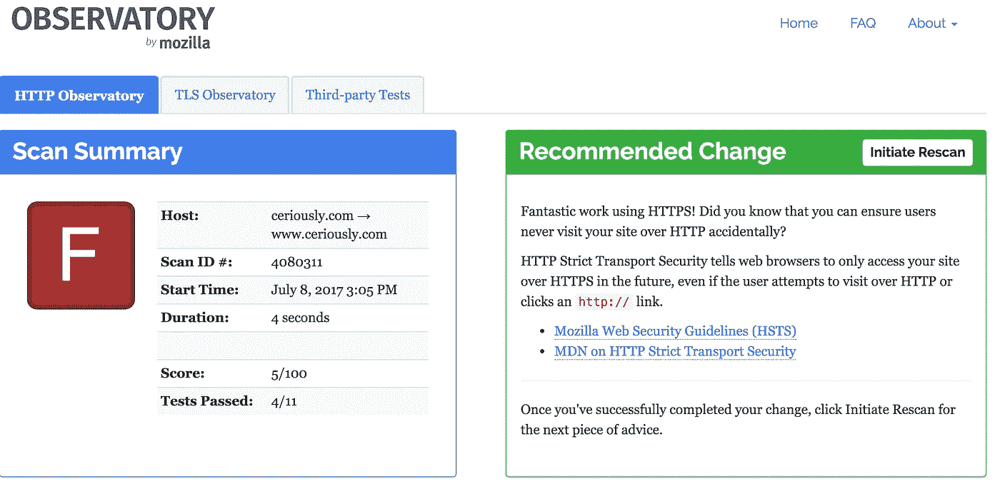
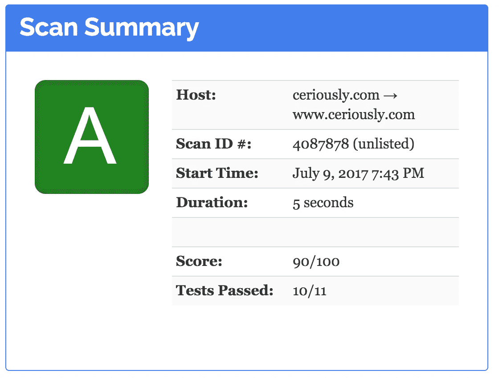

# 网络安全:2017 年最佳实践

> 原文：<https://medium.com/hackernoon/security-best-practices-in-2017-cfdf1784c0a2>

我最近发现了 [Mozilla Observatory](https://observatory.mozilla.org) ，并通过该工具运行了[我的网站](https://www.ceriously.com)。结果令人沮丧…一个又大又肥又丑的 **F** 。对于那些不熟悉美国评分的人来说，F 是可能的最低分数。这对我的自尊来说就像是当头一棒。



Observatory results for ceriously.com

好吧，每天都是一次学习的经历，所以让我们深入一点，也许你也能学到新的东西！

# 让我们安全

到目前为止，您可能已经从优秀的[让我们加密](https://letsencrypt.org/)组织或另一个著名的认证机构获得了一个免费的 HTTPS 证书。但是 HTTPS 只是保护你的网站的一个步骤。

Mozilla Observatory 提供了一整套测试来检查您的网站的最佳实践，如 HSTS，XSS 预防性标题，以及任何外部资产的子资源完整性。这会给你一个满分 100 分的分数和一个字母等级来增强你的自信心。

我不及格的原因完全是因为无知。这些功能都没有实现，我在 Mozilla 的评分中只得到 5/100 的分数。我的目标是达到 90，这被认为是一个**一个**。

请访问[https://observatory.mozilla.org](https://observatory.mozilla.org)在你的网站上试试吧

你做得怎么样？如果你像我一样，你可能不会经常更新你的网站、博客或应用程序，所以也许你的网站也失败了。别担心。

如果您使用 Apache 作为 web 服务器，您可以很快从我的错误中吸取教训，只需抓取下面的`.htaccess`文件并将其放入您的 web 目录中。或者，如果你对 ASP.NET 更熟悉的话，可以查看这个网站。

标题直接取自 Observatory 结果，在那里您可以阅读更多关于意图和安全含义的内容(真的，去阅读文档)。如果您的网站有任何用户输入，您可能希望将内容安全策略更改得更严格一些，以防范 XSS 病毒。

在标题下面，有一个重定向来确保浏览器总是被重定向到`[https://www.*](https://www.*)`这将使谷歌(和你的访问者)点击安全的 www 子域。这对安全性和 SEO 都有好处。

我还修改了`<script>`标签，增加了子资源完整性，如果 CDN 遭到破坏，这将避免执行恶意脚本。这很容易，因为 jQuery CDN 已经支持这个特性，并在下载页面上提供了散列。

```
<script src=”https://code.jquery.com/jquery-2.2.4.min.js" integrity=”sha256-BbhdlvQf/xTY9gja0Dq3HiwQF8LaCRTXxZKRutelT44=” crossorigin=”anonymous”></script>
```

如果你的 CDN 没有提供这些信息，你可以使用类似 [SRI 哈希生成器](https://www.srihash.org/)这样的工具。

还不算太糟。通过额外的标题和一行 HTML，Observatory 报告了令人垂涎的绿色 **A** ，得分为 *90* ！



# 压缩和缓存

既然你的网站是安全的，为什么不使它变得更快呢？

看看上面的`.htaccess`文件中的`<ifmodule>`检查。

在通过网络发送之前， *deflate* 头将压缩 html、css 和 js 等资源。这意味着首次访问者将更快地看到您的内容。

*expires* 头将告诉浏览器将资产缓存几天，因为它们可能不会经常更改以保证到服务器的往返行程。这意味着回头客会很快看到你的内容。

将这两个设置相加，我在桌面上从[Google PageSpeed Insights](https://developers.google.com/speed/pagespeed/insights/)得到了 94/100。在你的网站上试试，看看你做得怎么样！

[](https://www.ceriously.com/blog/post.php?id=2017-07-10-security-best-practices-2017.md) [## 让我们安全

### 这篇文章是从 ceriously.com 交叉邮寄的

www.ceriously.com](https://www.ceriously.com/blog/post.php?id=2017-07-10-security-best-practices-2017.md)