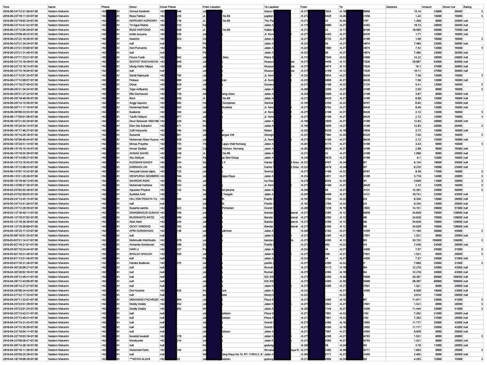
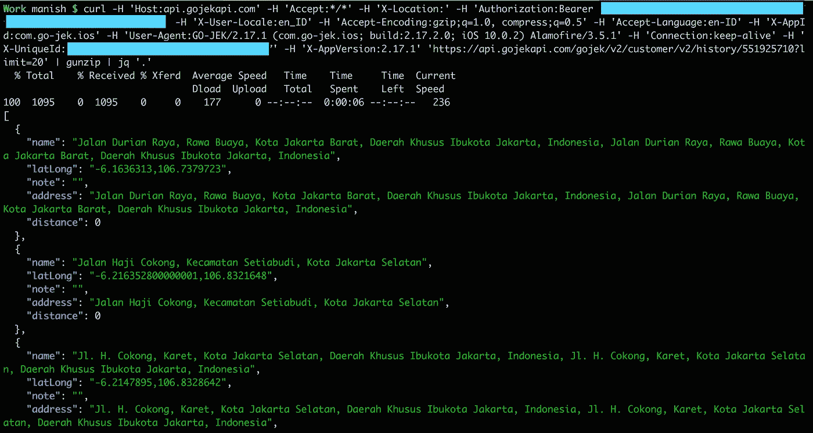
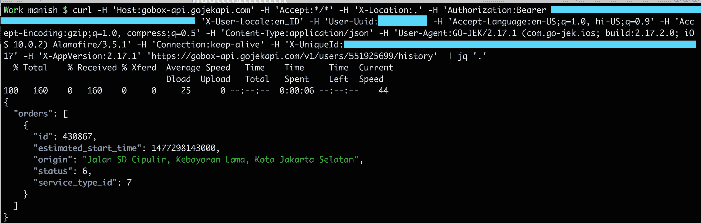

# 围棋 JEK 的安全漏洞

> 原文：<https://medium.com/hackernoon/security-vulnerabilities-in-go-jek-a9126b33788c>

## GO-JEK 是印度尼西亚的独角兽&优步，抓住竞争对手

GO-JEK 是印度尼西亚的一家独角兽运输初创公司，通常被视为印度尼西亚最著名和最大的初创公司。GO-JEK 提供自行车出租车、出租车、送餐、移动支付订票等服务。

在 Fallible，我们正在努力的一件事是，即使在复杂的逻辑流程场景和使用的非标准授权程序中，也要尝试准确地自动进行数据泄漏检测。在对移动应用程序使用的 GO-JEK 公共 API 进行安全审计期间，我们在 GO-JEK 中发现了多个安全漏洞。我们就 GO-JEK 首席执行官纳迪姆·马卡里姆先生的数据泄露样本联系了 GO-JEK(下面是部分编辑过的截图)。GO-JEK 在 2016 年 6 月的回应是，他们完全了解所有的安全问题，并在当前的路线图中进行了修复。我们最近联系了 GO-JEK，他们的 CISO 向我们确认，现在可以公开披露这些漏洞了。

# 漏洞#1 乘车历史数据泄露

您可以获得使用该 API 端点的任何用户的所有乘坐列表，包括精确的 GPS 坐标。授权令牌存在，但未用于验证。

[https://API . gojekapi . com/gojek/v2/customer/v2/history/551925748](https://api.gojekapi.com/gojek/v2/booking/history/551925748)

History API

# 漏洞# 2 订单详细信息泄露

获取通过 Go-jek API 下订单的详细信息:

https://gobox-api.gojekapi.com/v1/users/551925748/history

Orders

# 漏洞# 3 用户数据泄露

您可以使用这个 API 端点通过用户的 Id 号获得用户的个人信息。这包括他们的电话号码、姓名、司机的个人信息、上下车地点以及其他与乘车相关的信息。

并且响应将包含骑手和驾驶员的电话号码以及起点和目的地坐标。

findByOrderId

# 未经确认的# 4 获取其他用户的 Android 通知去 JEK

我们检测到的一个不寻常的漏洞是，您可以在 API 端点和中使用另一个用户 id，并且您已经设置为窥探针对该用户的 GO-JEK 通知。我们正在研究这个漏洞，看看这是否会导致其他一些东西，并会避免透露这个 API 端点。

还有其他几个 API 端点可以用来破坏用户数据和中断操作。例如，您可以为所有用户更改所有已取消乘坐的取消原因。在这一点上，我们不会提及写访问 API。

> [黑客中午](http://bit.ly/Hackernoon)是黑客如何开始他们的下午。我们是 [@AMI](http://bit.ly/atAMIatAMI) 家庭的一员。我们现在[接受投稿](http://bit.ly/hackernoonsubmission)，并乐意[讨论广告&赞助](mailto:partners@amipublications.com)机会。
> 
> 如果你喜欢这个故事，我们推荐你阅读我们的[最新科技故事](http://bit.ly/hackernoonlatestt)和[趋势科技故事](https://hackernoon.com/trending)。直到下一次，不要把世界的现实想当然！

