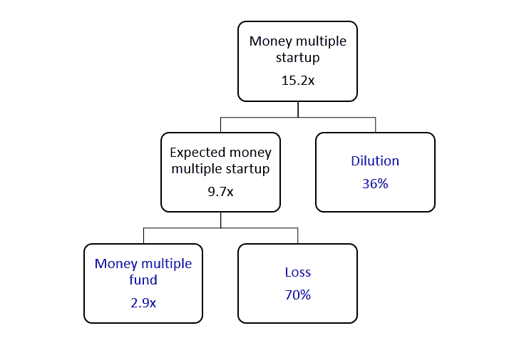

# 种子投资者真的需要赚 15.2 倍

> 原文：<https://medium.com/hackernoon/seed-investors-really-need-to-make-15-2x-126eb28f2b6b>

在最近的一篇文章中，弗雷德·威尔逊写道:

> *“当你损失了 60-80%的投资时，你真的需要有能力让你的赢家获得 10-20 倍的回报。”*

这有意义吗？

## 货币多重基金

假设一个种子[投资者](https://hackernoon.com/tagged/investor)投资了一只基金。

他想让这只基金每年有 12-15%的内部收益率。

他在 7-10 年后退出了一家创业公司。

每年的 IRR 为 13.5%，距离退出还有 8.5 年，种子投资者需要在他的基金上获得(1 + 13.5%) ^ 8.5 = 2.9x。

## 失败

像弗雷德一样，假设种子投资者损失了 60-80%的投资。

在他的基金有 2.9 倍的资金倍数和 70%的损失的情况下，种子投资者需要以 2.9/(1-70%)= 9.7 倍的预期资金倍数对他投资的每个创业公司进行定价。

种子投资者需要从他投资的每个创业公司获得 9.7 倍的回报。不仅仅是他的赢家。

## 稀释

假设每个创业公司都筹集了 1-3 轮后续融资。

每一轮购买公司 15-25%的股份。

在 2 轮后续轮次和每轮 20%新股的情况下，种子投资者将稀释 1 - (1 - 20%) ^ 2 = 36%。

由于 9.7 倍的预期资金倍数和 36%的稀释，种子投资者需要以 9.7/(1-36%)= 15.2 倍的资金倍数对他投资的每个初创公司进行定价。

## 因此

如果你相信这 3 个假设，那么 Fred 的“当你损失 60-80%的投资时，你真的需要有能力让你的赢家获得 10-20 倍的回报”是有道理的。

“当你想让你的基金获得 2.9 倍的回报，损失 70%的投资，稀释 36%时，你真的需要将你投资的每家初创公司的估值定为 15.2 倍”，这更有道理。

*约阿希姆·布雷泽是* [*【创业估值第一指南】*](https://www.amazon.com/gp/product/B07FXGY8RK/ref=dbs_a_def_rwt_hsch_vapi_tkin_p1_i0) *的作者。*

