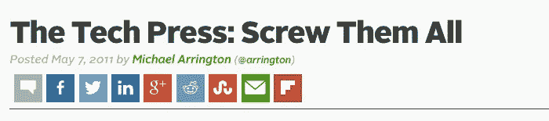
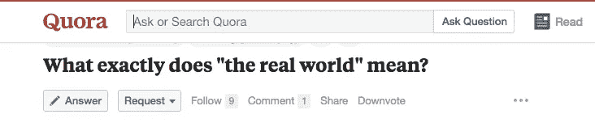
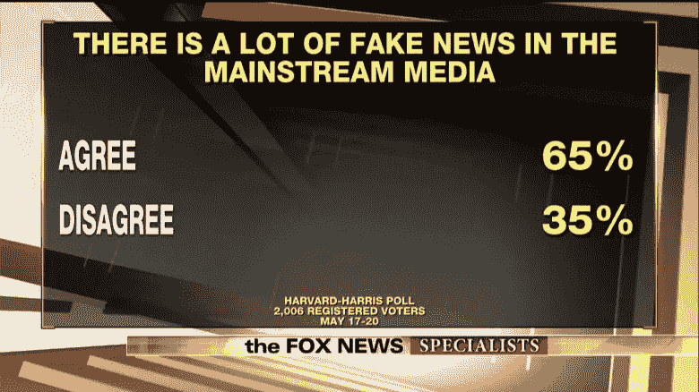

# 种子轮是假新闻

> 原文：<https://medium.com/hackernoon/seed-rounds-are-fake-news-4c99cc71548e>

筹资无疑是困难的，即使对那些看起来容易的人来说也是如此。在种子阶段很难，在 A 系列赛中，在 B 和 c 阶段也很难。如果你是优步或新公司，那就更难了。不同的阶段，不同的问题；没有一个比另一个更好。

但这是达到目的的手段。

我已经完成了大约 30 笔交易，大部分是在种子期，我不认为向媒体宣布种子期有任何帮助。

以下是我的理由:

## **…你即将失去对现实的掌控**

对于一家初创公司及其创始人来说，没有什么比融资后出现在科技媒体上更令人兴奋的了。你坐在 [kvelling](http://www.jewish-languages.org/jewish-english-lexicon/words/289) ，想象你的竞争对手脸上的恐惧表情，同时看着你的收件箱塞满祝贺电子邮件，并从你从未听说过的地方获得不同的随机新闻媒体对你的故事的联合报道。

在所有的兴奋中，你大脑中的化学物质突然让你变得无所畏惧。*“去他的计划，我们要雇佣摇滚明星。3 个月后，我们将制作一个怪物系列 A，让其他人大吃一惊。”*

抱歉，伙计。

刚刚发生的事情是，你说服了一群人去推测，你将证明你的假设是正确的，然后(如果它们足够正确)有能力再筹集一轮资金来衡量结果。

你刚刚放弃了你公司的一大块，这样你就可以得到钱来尝试把它发展成有价值和值得为之欢呼的东西。现在不是过于自信和表现一切的时候*硅谷*——正是你需要牢牢把握现实的时候，事实上你有足够多的事情要做，有足够大的任务要完成，而不是浪费精力去应付媒体。

## …你会失去很多注意力

所以现在全世界都知道你在做什么，你最好有一个好的入站系统。

招聘人员、投机性合作请求、投资者(见下文)、外包专家、律师(euch)、活动人士、寻找实习机会的学生、想向你推销奖项的出版物(因为这就是它的工作方式)、投资银行(是的，在种子轮之后)、求职后的朋友等等。都会伸出手来，占用你的时间——即使说“不”也需要很长时间。如果你无视他们呢？这些人知道怎么追你。

现在这成了你的工作。但那不是你的工作。

你只有一个工作，那就是首席执行官。其他一切都是噪音——非常大的、无用的、超级分散注意力的噪音。

## …不知何故，它会咬你的某个地方

现在，你点击了《卫报》科技版的专题报道，记者非正式地问你的目标是什么，你说你将在 12 个月内占据 5%的市场份额，或者在 12 月达到 200 万，或者可能只是说你准备签署一份重要的合作协议。他们出版了它。

问题是，生意很少按计划进行。你改变了投资方向，或者与合伙人发生了洗牌，或者竞争对手募集了 500 万美元的 A 轮融资，让你的注册会计师落花流水。

这就是你的目标。你没拿到？现在你有责任了。要是你能保持安静就好了…

## …你将会得到大量你并不真正需要的风险投资的关注

几个月前，你希望得到风投的关注，现在你得到了。大多数首轮投资者是根据种子公告进行投资的，因此他们可以在决定 A 轮是否匹配之前建立关系。

这很好，但你没有什么可报告的(除非，呃……见上一点)，现在见面真的没有意义，因为你实际上没有证明多少，在你需要钱之前还有 12-18 个月。

但你还是会遇到——谁会拒绝与第 1 层 VC 的会面呢？
就算是协理，也值一杯咖啡吧？

好吧，合伙人可能只是想在市场上建立一个论点，并将其提交给合作伙伴——他们也会对你的竞争对手做同样的事情，并通过每隔几个月检查一次来比较你。

就在你开始筹集 A 轮资金时，你联系了这位合伙人，但她在大约 6 个月前就沉默了。邮件被退回——她转到了另一家公司，或者加入了一家投资组合公司。太好了。

你可以浏览一下该基金的网站，看看还有哪些人可以联系，并在他们的投资组合中发现，他们已经投资了你所在领域的另一家公司。该死的。

## …你刚刚调高了高压锅的温度

毫无疑问，内部表现的压力很大，但现在世界其他地方也期望你表现出色。"那么你打算和谁一起做你的系列赛？"

你突然成为其他人谈论和猜测的对象，这是很愚蠢的，但会增加你关注错误事情或遵循惯例的压力——这可能不是最好的计划。

## …这是一个愚蠢的战略错误

初创企业需要在最有效的时候利用他们的“媒体资本”。这并不是宣布一轮融资，而是在你即将进行一轮融资之前——在这一点上，你想告诉全世界，你已经达到了 200 万 ARR，5%的市场渗透率或签署了一项重要的合作伙伴关系。

## …你会黯然失色

最丢脸的事情莫过于，当你的一个竞争对手在你之后加注时。更大的一轮，有“更好”的投资者。

要么是这样，要么是他们玩得更好(或更差)并加大了赌注(不管真实与否)。

你只是不需要玩那个游戏。

你需要建立一个令人敬畏的创业公司。
为了你，为了你的团队，为了股东。
关注现实事物。

阿门。