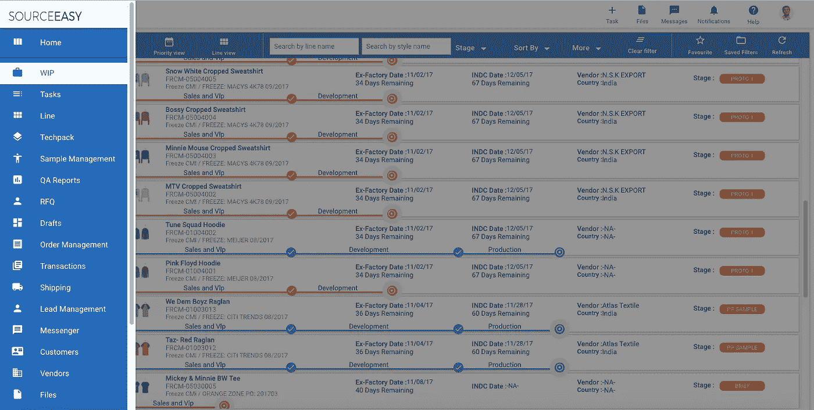

# 在万亿美元的市场中播种 SaaS 市场。

> 原文：<https://medium.com/hackernoon/seeding-a-saas-marketplace-in-a-trillion-dollar-market-2c953b5019a4>

> SOURCEEASY 的愿景一直是将服装行业数字化。
> 
> -SaaS 自动化工作流程并管理业务数据。
> 
> -市场控制着生产交易
> 
> -品牌网络在分销中构建知识产权价值。

我们刚刚经历了一场狗屎风暴，向潜在投资者解释它是如何运作的。

# 2016 年是最糟糕的一年。

在筹集了大量种子资金后，我们觉得我们有足够的动力去筹集 A 轮资金，因为我们拥有所有的未来收入。

2016 年 6 月，我们差点失去了一位 1000 万美元 A 轮投资的投资者，因为我们无法恰当地表达我们的愿景。这是毁灭性的。

我们勇敢地坚持下去，走遍了硅谷和纽约的风投。

但是反馈不断传来…

*   生意太复杂了。
*   它有太多的活动部件。
*   它不够“科技”。
*   我们的客户都没有使用这个软件。
*   我们的供应商都不使用这个软件。
*   我们的收入周期很难理解。

在我们的头脑中，我们无法理解什么是行不通的——服装市场的规模从来都不是问题。行业对自动化、可扩展性和技术的需求也是如此。团队和我们的执行能力都受到了表扬。

事后看来，缺少的是 ***关键叙述*** :

-这项业务如何扩展？

-为什么软件不公开？

-为什么关注商业而不是 SaaS？

-最终目标是什么？卖 t 恤还是卖缩放软件？

-为什么没有可扩展的销售可见性？

-这和电商有什么区别？

-为什么要陷入现金流循环和应收账款？

伟大的存在主义问题。

同时，我们的现金也快用完了。迅速地。

## 2016 年 9 月 30 日应该是 Sourceeasy 技术上死亡的日子。

我们应该就此打住，回家疗伤。

***但是车队没有放弃。顾客不停地写订单。产品持续滚动。***

我们提高了债务(几乎每周！)，恢复了财务平衡，解决了现金流问题，微观管理流动性，积极追收账款，管理与供应商的条款，实现了超过 400 万美元的现金流。

在过去的几个月里，我们面临了许多财务、运营和业务方面的挑战。在没有安全网的情况下，在微小的误差范围内运营并不容易。我们有过几次濒死体验，承受了很多压力和痛苦。

我们的团队、我们的董事会和投资者、我们的客户和我们的供应商在整个风暴中表现得非常耐心、支持和相对冷静。

# **他们相信。**

> ***2017 年是市场开始运转的时候..***

在 Sourceeasy，我们一直知道服装是一个艰难的市场。为服装行业开发软件是一项吃力不讨好的工作。

# 那是因为客户并不真正关心软件。他们关心产品、成本和销售。

> 他们关心服装的生产——按时、以优惠的价格和正确的质量标准生产。
> 他们关心可以信任的关系——不分昼夜。
> 他们关心一致性、清晰性和沟通。
> 他们关心减少工作的无缝工作流程。最重要的是:他们关心储蓄和赚钱。

因此，我们没有把面临重大采用挑战的软件强加给他们，收取微不足道的订阅费，这解决不了任何问题，也没有把买家扔给没有体验的供应商，而是选择解决市场在万亿美元的 B2B 服装市场面临的更大问题:

*   我们通过向品牌商、批发商和分销商提供低成本供应链解决方案来创造**客户需求**，这些解决方案适用于基本产品，如提供上门服务的图形 t 恤，因此他们依赖我们作为来源，并使用软件进行监控和沟通。
*   我们创造了**供应商流动性**,通过向工厂保证低利润的大批量订单，这些订单是可重复的和有资金支持的，因此他们有经济激励去生产小批量产品和采用我们的软件
*   我们与合规的工厂、开放的沟通、透明的利润、对产品的保证、前期争议解决和产品所有权建立了双边信任。
*   我们使用自己的软件平台**运营整个业务，使用我们自己的 SaaS 工具帮助我们代理客户和工厂工作流，解决 bug 和功能请求，使应用程序达到企业级。**

# 因此，在过去的 12 个月里:

*   2016 年第 4 季度—2017 年第 3 季度的收入为**478 万美元**。 ***比 2015 年第 4 季度增长 250%***2016 年第 3 季度收入为**192 万美元。**
*   **2016 年第四季度—2017 年第三季度销量为 **1，593，333 辆**。， ***较*** 从 Q4 ' 15–Q3 ' 16 销量上涨 1100%**146，340 台**。**
*   **2016 年第四季度—2017 年第三季度运营费用为**282 万美元**，**比 2015 年第四季度—2016 年第三季度运营费用**402 万美元**下降 30%****

# **我们的 SaaS 市场将于下月推出。**

*   **我们将于 11 月 1 日开始公测。**
*   **我们将向注册用户收取订阅费，一旦我们的客户达到一定的交易门槛，我们将**免除**。**
*   **我们永远不会保留功能，并向**所有人**提供**整个**套件。**
*   **我们会确保你得到你想要的产品。不仅仅是**软件**。**
*   **我们将使最低库存管理变得非常简单。**
*   **我们将以具有行业竞争力的价格来完成。**

# **敬请关注。**