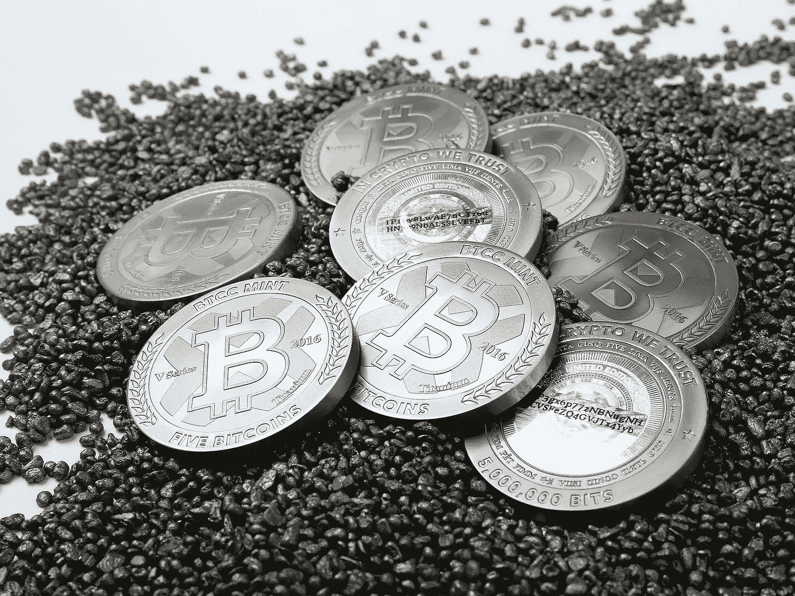

# SegWit2x:简要概述及其对 CEX 的意义。IO 客户

> 原文：<https://medium.com/hackernoon/segwit2x-a-brief-outline-and-what-it-means-for-cex-io-customers-e12fcd8c79e7>

继今年 5 月签署[纽约协议](/@DCGco/bitcoin-scaling-agreement-at-consensus-2017-133521fe9a77)和成功激活 SegWit 之后，比特币和更广泛的加密社区内流传着许多关于今年 11 月可能出现第二次硬分叉的谣言。根据那些支持增加区块规模的人的观点，今年 5 月在纽约签署的合约应该会保证第二次分叉的出现。然而，由于空间内仍然存在相当大的脱节，许多签署者似乎违背了他们以前的升级承诺，尚不清楚这种链分裂是否会发生。

# SegWit2x 是什么？

对网络的所有更新都是通过“分支”实现的。这些可以是软的，也可以是硬的。软分叉可以在不导致网络分裂的情况下发生。然而，硬分叉会导致两个独立的链。如果对更新有共识，硬分叉可能相对容易。所有矿工随着升级同时切换到新链，原来的那个死了。然而，目前在矿工和网络用户之间[还没有达成共识](http://www.cityam.com/272419/bitcoin-faces-another-split-scaling-debate-rages-within)。正如我们在今年夏天早些时候看到的[比特币现金](http://fortune.com/2017/08/07/bitcoin-cash-bch-hard-fork-blockchain-usd-coinbase/)，如果一些矿工选择新的分叉，一些选择旧的分叉，那么两个链都将继续。这导致加密货币的持有者收到与拆分时他们最初持有的相同数量的新硬币。在 B-Cash 的情况下，市场赋予这些硬币价值，投资者可以决定交易或持有他们的新代币，以及原始链的代币。

SegWit2x 是一个旨在通过两个独立的硬分叉来增加比特币区块链效用的提案。对于那些不太懂技术的人来说，这是一个增加网络交易数量的更新。人们普遍认为，更大的主流采用取决于比特币网络处理更多数据的能力，从而能够同时为更多人服务。多年来，关于如何最好地做到这一点有各种各样的建议，SegWit2x 是两个对立思想流派之间的妥协。

有些人认为，增加每秒事务数量的最佳方式是增加链中每个块的大小。同时，其他人认为正确的扩展方式是使用第二层协议。我们不会详细讨论 SegWit 如何增加比特币网络的交易量，但它基本上允许交易的一些必要数据存储在区块链之外。这在不牺牲安全性的情况下释放了块内的空间。

# 纽约:持久的和平？

有关各方于 2017 年 5 月在纽约举行会议，讨论在网上肆虐多年的缩放问题。他们似乎达成了一项被称为 SegWit2x 的妥协——双方提议的综合。所达成的协议此后被称为《纽约协议》。决定首先激活 SegWit，然后增加块大小。然而，就在 SegWit 截止日期之前，该网络无论如何都被意外地分叉(分裂)。由此产生的链，比特币现金，增加了块的容量从原来的 1MB 大小。这一事件导致许多人质疑增加原 BTC 链块大小的必要性。论点是，现在我们有一个使用第二层协议(SegWit)的比特币实例和一个使用更大块(B-Cash)的比特币实例。反对 11 月分叉的人声称，市场可以决定它喜欢哪种缩放系统，没有必要冒着潜在动荡的风险，也没有必要因为区块链的再次分裂而给交易所、钱包提供商和用户带来负担。这随后导致纽约协议的一些签署者反驳该协议，并且很大一部分社群[完全拒绝该协议](http://www.newsbtc.com/2017/10/18/segwit2x-impact-on-bitcoin-price/)。目前还不清楚分叉是否会发生。这导致了市场的不确定性。

# CEX 是如何？木卫一计划如何应对？

[CEX。IO](https://cex.io/) 已经打电话给客户和合作伙伴，让他们了解[将如何应对今年 11 月可能或可能不会发生的事件](https://blog.cex.io/news/segwit2x-16585)。交易所欢迎有助于加密货币行业发展的发展。比特币需要规模和 CEX。IO 意识到一个更强大的网络将为普通用户带来更好的体验。尽管社区内部缺乏共识，CEX。IO 渴望支持任何为客户提供改进的功能和可用性的更新。

然而，任何体验上的改进都不应该以牺牲用户的安全为代价。在任何情况下，他们都不应该冒失去任何东西的风险。CEX。无论市场未来如何发展，IO 都坚持这一原则。因此，本交易所将继续观察业内的发展，并考虑随着社会情绪的变化而改变的选择。客户应该放心，CEX。IO 将从他们的利益出发，不断努力提高他们的安全性。目前，他们正忙于分析 11 月硬分叉的每一个预期结果的技术含义。这自然包括全链分裂的事件。

然而，尽管整个行业笼罩着不确定的气氛，CEX。IO 保证，无论结果如何，如果发生 SegWit2x 分叉，客户确实会收到新硬币。让 BTC 留在站台上不会有任何风险，但是关于奖金的细节目前正在制定中，需要最后敲定。