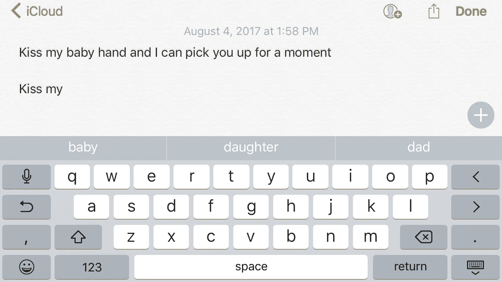

# 我，我的妻子&苹果的人工智能文选。

> 原文：<https://medium.com/hackernoon/selected-writings-by-me-my-wife-apples-artificial-intelligence-87de8daa01c8>

我想出了一个新游戏。可能别人以前玩过。但在我的世界里，我是在飞机上发明的，规则如下:

1.  打开苹果笔记应用。
2.  丈夫问妻子一个词。
3.  妻子说了算。
4.  丈夫打开新的笔记并输入单词。
5.  然后苹果的 AI 建议三个字。
6.  丈夫从三个建议的单词中选择一个。然后苹果的 AI 又建议了 3 个单词，老公又选择了 word。这个过程一直持续到这个短篇故事或句子被认为是“完整的”为了更多的乐趣，丈夫在选择用词时应该大声朗读句子。注意:丈夫/妻子的角色互换是受欢迎的——这正是这个游戏被发明出来的原因。

现在你已经理解了这个游戏，下面是我、我妻子和苹果人工智能按字母顺序排列的精选作品。

> 如果你想玩这个游戏，请分享你的作品作为对这个帖子的回应。

## “婴儿”

在过去的几个月里，婴儿们太忙了。

## “美”

美丽是有史以来最好的东西，但它似乎不起作用。

## “生日”

今天是不是生日派对？

## "颜色"

颜色很酷，但是拍照就不酷了。

## “甜点”

甜点是唯一不太书呆子气的东西。

## “腹泻”

腹泻是最严重的。

## “死”

虎胆龙威，我等不及了。

## “连衣裙”

为你的商务旅行打扮一下，买辆自己的车。

## “自我”

自负会让你觉得自己是个了不起的人。

## “期望”

期望是我们唯一可以拥有的衡量标准。

## “门面”

门面是唯一挑的。

## “家庭”

家庭是有史以来最美好的东西，我会得到更多。

## “放屁”

在推特上放屁。

## “脚”

英尺不是唯一的公制单位

## “好”

早上好，我的宝贝。

## “酒店”

明年的酒店已经订好了，但我还是和我妈睡在一起。

## "是"

是有是有。

## “意大利人”

意大利菜不错。

## “吻”

吻一下我的小手，我就可以抱你一会儿。

## “少”

在过去的两年里，我生命中只有不到一半的时间被弥补了。

## “市长”

市长说她一直在努力为她的新工作卖掉公司。

## “中等”

媒介和你是一回事。

## 《午夜》

我宝贝的午夜回忆。

## “镜子”

与脸书最佳球员的自拍。

## “母亲”

母亲和女儿是我仅有的。

## “牛顿”

牛顿是唯一一个对未来有更多重要细节的人。

## “仅”

只有好人死得早。

## “仅”(第二次使用不同选项)

除非你喜欢这个游戏但是你不会玩。

## “便便”

在推特上便便。

## “存在”

我的生意是我唯一拥有的东西。

## “双关语”

双关语是我一天中最喜欢的部分。

## “真的”

真的想要更多的东西。

## “运行”

跑出去找新工作。

## “意外之喜”

意外之喜是最好的事情。

## “唱歌”

和妈妈女儿在电话里唱同一首歌，妈妈女儿很酷。

## “滑雪”

和我爸爸一起滑雪是最棒的。

## “困”

昏昏欲睡，但我越来越兴奋。

## “慢”

慢下来我都不会玩了。

## “袜子”

袜子在我的脑海里。

## “污渍”

我孩子身上的污渍。

## “味道”

尝起来像星条旗，她看着我。

## “这个”

最棒的是你可以看到你的朋友在做什么。

## “今天”

今天是我开新车出门的第一周。

## “脚趾”

脚趾是唯一不太好的。

## “厕所”

卫生纸是有史以来最漂亮的东西。

## “转”

开大声点！

## “婚礼”

和朋友一起吃结婚蛋糕，我很喜欢。

## “年轻”

愿意的年轻人。

> 如果你想玩这个游戏，请分享“你的”精选作品作为对这个帖子的回应。