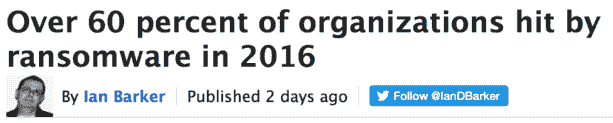

# 选择偏差和信息安全调查

> 原文：<https://medium.com/hackernoon/selection-bias-and-information-security-surveys-c991b79aab17>

审计员茫然地盯着我。凝视变成了一个开口，持续了足够长的时间，让我在椅子上不舒服地移动，点击我的笔，看向别处，然后我回头看着他。

茫然的神色闪过愤怒。

> “当然，恶意的内部人员是这家公司最大的威胁。他们是所有公司的最大威胁。”

他挥舞着一份供应商报告的最新副本，这份报告会让任何人相信恶意的内部人士是自埃玛·戈尔德曼以来对美国商业的最大威胁。

他在房间里挥舞的报告根本不是研究。这是供应商营销，几乎伪装成“信息安全领导者调查”这仅仅是基于对一小群人的不科学的调查。它充满了错误和偏见。

选择偏差使得这些调查实际上毫无价值。我[以前写过](/@tdmv/the-problem-with-security-vendor-reports-304a6589849d#.9ddst2b7o)关于信息安全厂商报告中调查的问题，我想更深入地挖掘上一篇文章中的一个主题:从被调查的一般人群中恰当地选择一个有代表性的样本。这非常重要。这也许是进行统计调查时最重要的一步。

## **为什么这很重要**

风险分析师是许多依赖内部和外部事故数据来评估风险的职业之一。如果风险分析师正在对窃取客户数据的现任或前任员工进行评估，有两个主要的地方可以查找事件数据以确定频率:内部事件报告和关于发生频率的外部数据。

风险分析师首先会查看的地方之一是许多已发布的关于内部威胁的报告。然后，分析师会找到一个或多个关于现任或前任员工窃取数据频率的统计数据，并使用这些数据来帮助提供损失事件的可能性。

如果调查在统计学上是合理的，那么调查结果可以推断出一般人群。换句话说，如果调查表明 12%的内部人员使用 USB 设备窃取数据，在误差范围内，您可以使用相同的范围来帮助您进行评估。

如果调查在统计上不合理，结果**仅适用于调查**的回答者。这就是所谓的选择偏差。

## **什么是选择偏差？**

在统计学中可以发现多种形式的偏差，推而广之，在调查中也可以发现，但最常见的是选择偏差。这是最容易出错的，也是最容易丢掉结果的。

当调查结果与正在研究的人群有系统性差异时，就会出现选择偏差。以下是发生这种情况的几种方式。

*   **覆盖不足**:样本中某些群体的代表性不足。例如，如果你正在调查信息安全专业人士，你会想要钢笔测试员，风险分析师，部门主管，CISO 的-本质上是一个横截面。如果你很难让 CISO 回答这个调查，那么这个调查就会偏向于对 CISO 的报道不足。
*   **自愿回答**:这发生在你的调查者是自选的时候。最常见的例子是在线调查或民意测验。Slashdot 民意调查很有趣——但因为是自愿回答，所以完全不科学。最理想的情况是，我们希望随机选择参与者，以确保人群具有良好的代表性。
*   **参与偏差**:当某一组参与者比其他人更可能或更不可能参与时，就会出现这种情况。当某个群体比其他群体更重视调查的价值时(风险分析师对笔式测试员)，或者如果调查参与者受到奖励，如奖励点数或现金，就会发生这种情况。对调查参与者进行补偿是一种非常有争议的做法，通常会导致参与调查的人不在预期的样本人群中。

## **现实世界的例子**

可供选择的有很多，但我从一个随机的谷歌搜索中找到了“[2015 vor metric Insider Threat Report”](http://enterprise-encryption.vormetric.com/rs/vormetric/images/CW_GlobalReport_2015_Insider_threat_Vormetric_Single_Pages_010915.pdf)。这份报告在美学上经过了润色，从表面上看，内容丰富。它的预期效果是让任何读者对员工和承包商的数据失窃感到紧张。

该报告基于对 818 名完成在线调查的 IT 专业人员的调查。报告作者非常谨慎；他们把报告框定为受访者的意见。此外，在报告的结尾有一个简短的披露，说明了调查方法，确定了进行调查(Harris Poll)的公司，并说明“…在线调查不是基于概率样本，因此无法计算理论抽样误差的估计值。”

让我翻译一下:这份报告仅用于营销和娱乐目的。

Why not?

这里还有一个问题:哈里斯民意调查公司会补偿他们的调查者。调查参与者每填写一份调查都会获得积分(称为“HIpoints”)。这些积分可以兑换礼品卡和其他物品。从披露的信息中我们已经知道该调查在统计上并不显著，但人们必须问一问，如果调查对象是自我选择的，并且如果他们说了任何符合调查条件的话就会得到奖励，那么该调查是否可以只包括 IT 专业人员？

这里最明显的问题是自愿选择和参与偏差；这两种情况都导致你不应该利用调查结果来做任何严肃的决定。

我的意思不是专门挑 Vormetric。有数百个类似的调查。

这里还有一个。 [**网络威胁防御小组**](https://cyber-edge.com/) 进行了一项在线调查，询问了许多企业安全问题。其中一个结果是，2016 年，**受访者的组织**中有 60%受到了勒索软件的攻击。我快进到描述方法的部分。他们含糊地透露了这样一个事实:调查者是有报酬的，调查结果代表了调查者的观点。这是头版新闻，但至少它在那里。这就是问题所在:

现在，这不是一个小的，自我选择的，有报酬的群体的意见，他们可能安全，也可能不安全。现在这是事实。

然后它会被转发，转发，点赞，等等。现在是信息安全民间传说。

看到问题了吗？

> [黑客中午](http://bit.ly/Hackernoon)是黑客如何开始他们的下午。我们是阿妹家庭的一员。我们现在[接受投稿](http://bit.ly/hackernoonsubmission)并乐意[讨论广告&赞助](mailto:partners@amipublications.com)机会。
> 
> 如果你喜欢这个故事，我们推荐你阅读我们的[最新科技故事](http://bit.ly/hackernoonlatestt)和[趋势科技故事](https://hackernoon.com/trending)。直到下一次，不要把世界的现实想当然！

