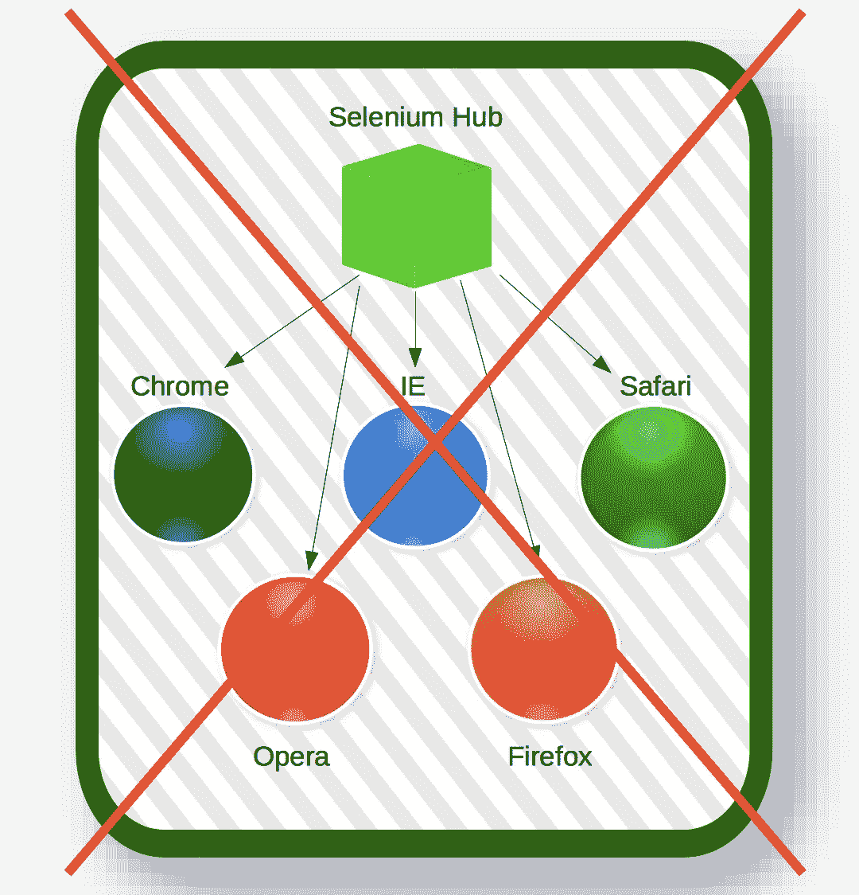
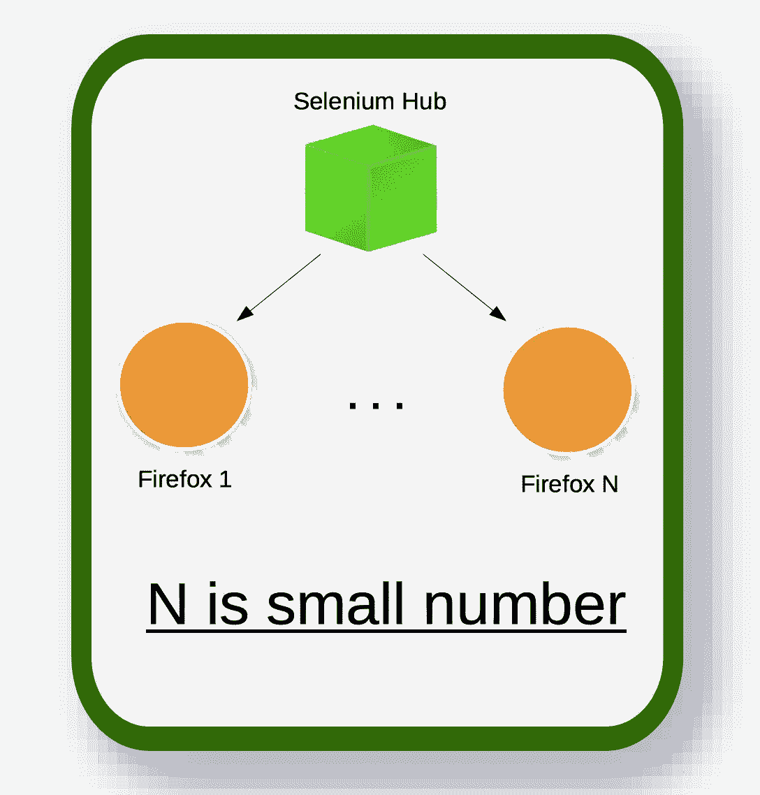
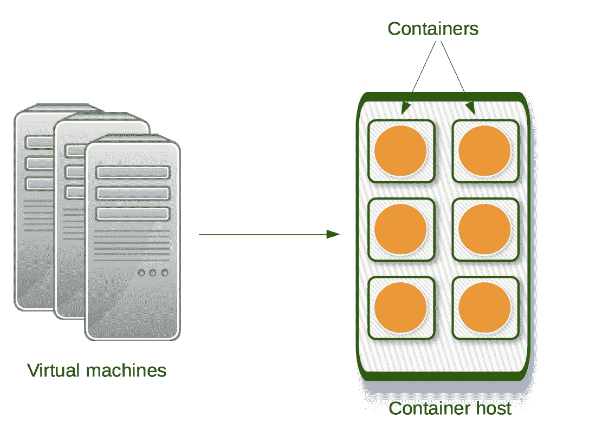
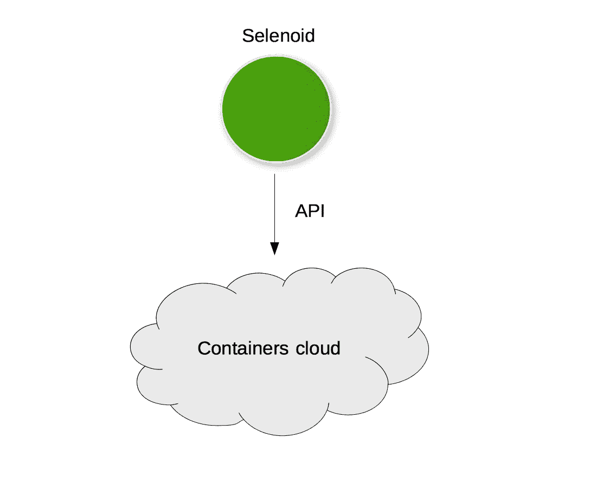
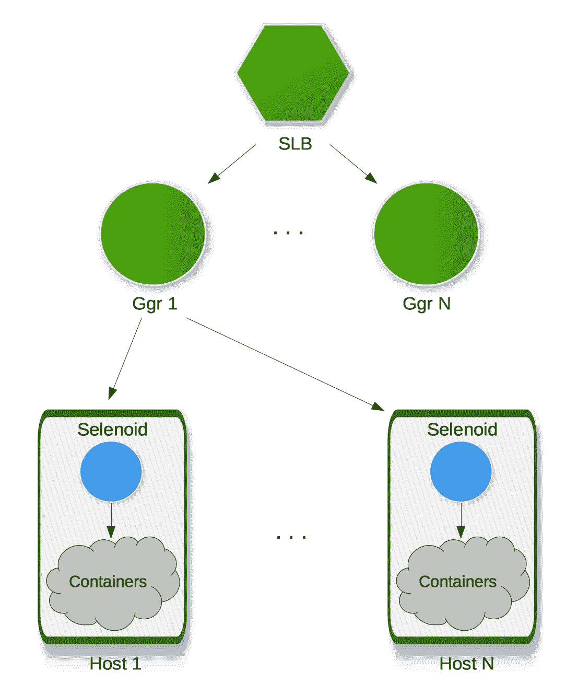

# 硒测试:新的希望

> 原文：<https://medium.com/hackernoon/selenium-testing-a-new-hope-a00649cdb100>

# 第二部分。减肥和去集装箱。

在第一部分中，我讲述了无需编写任何代码就能构建可伸缩 [Selenium](https://hackernoon.com/tagged/selenium) 集群的简单方法。在这一部分，我们将深入探讨更微妙的硒问题:

1.  如何使用标准 Selenium hub 准备易于扩展的工作节点
2.  为什么可以甚至推荐在容器中运行大多数浏览器，以及如何做到这一点
3.  有哪些现成的开源工具

# 工作节点内部有什么

第一部分中描述的所有新的[工具](https://hackernoon.com/tagged/tools)实际上都是智能瘦代理，将用户请求重定向到真正的 Selenium Hub 和节点。然而，当你想到更多的问题时:

*   如何安排集线器和节点以有效消耗硬件资源并保持可伸缩性？
*   使用哪个操作系统？
*   应该安装哪个软件？
*   没有真实显示器我们能工作吗？

人们可以尝试使用具有一个 Selenium Hub 和许多用于不同浏览器的 Selenium 节点的硬件服务器。看似合理，但实际上毫无用处:



1.  正如我前面说过的，Selenium hub 在加载大量节点时会变得非常慢。不确定实际原因，但这是我们的经验所显示的。一个建议——如果你希望睡觉时没有噩梦，睡觉时不要看 Selenium 源代码。所以我们不能在同一个 hub 上使用几十个 Selenium 节点。然后，让我们只使用几个节点和一个集线器。为了保持效率，我们需要减少每个集线器的 CPU 核心总数——这是迁移到云的一个很好的理由。例如，我们的安装在很长一段时间内都是使用只有 2 个 VCPUs 和 4gb RAM 的小型虚拟机。
2.  不清楚如何简单地安装同一浏览器的不同版本(例如，使用二进制软件包)。
3.  不清楚如何轻松计算每个浏览器版本的总量。
4.  不同的 Selenium 节点版本兼容不同的浏览器版本。例如，较新的 Selenium 节点不能支持相对较旧的浏览器版本。

始终将相同数量的节点连接到同一个 hub 的最简单方法是在同一个虚拟机上启动 hub 和节点。如果每个浏览器版本使用一台机器，那么计算可用浏览器的总数就成了小学的任务。您可以轻松地添加和删除包含 Selenium 节点和浏览器兼容版本的虚拟机。这是我们在云中使用 Selenium 集群时的建议，每个版本都有静态数量。



但是，除了 Selenium Hub 和 Selenium Node 之外，这样的虚拟机内部还应该存在什么才能顺利工作呢？

*   首先，我们建议尽可能使用 Linux 作为基础操作系统。有了 Linux，你可以满足 80%的浏览器需求。列举未涵盖的内容更简单:

1.  Internet Explorer 和 Microsoft Edge。这些只能在 Microsoft Windows 中运行，将在另一篇文章中讨论。因为从未有过如此悲伤的故事。
2.  桌面 Safari。有人在用吗？Selenium 对这个浏览器的支持相当差。
3.  iOS 和真正的苹果设备。你需要使用苹果的硬件，比如 MacMini 和 [Appium](http://github.com/appium/appium/) 来配合它们工作。

*   要运行标准的 Selenium，您需要安装 Java (JDK 或 JRE)并提供所需版本的 Selenium JAR。
*   虚拟机没有真正的显示器，所以您需要在特定的 X 服务器上启动 Selenium node，它可以在没有显示器的情况下工作。这样的实现被称为 [Xvfb](https://www.x.org/releases/X11R7.6/doc/man/man1/Xvfb.1.xhtml) 。这可以通过以下方式完成:

```
xvfb-run -l -a -s '-screen 0 1600x1200x24 -noreset' java -jar \  selenium-server-standalone.jar -role node <...other args>
```

请注意，Xvfb 仅用于 Selenium 节点进程。

*   你可能还想安装额外的字体包，如[微软的 True Type 字体](http://askubuntu.com/questions/578057/installation-of-fonts-in-ubuntu-14-04)。
*   如果你想截图，建议[关闭基于 Gtk 的浏览器的光标闪烁](http://stackoverflow.com/questions/2324348/how-to-disable-caret-blinking)。
*   如果您的测试需要与声音系统交互，您还需要设置虚拟声卡。Ubuntu 的脚本可能如下所示:

```
#!/bin/bash
apt-get -y install linux-sound-base libasound2-dev
apt-get -y install alsa-utils alsa-oss
apt-get -y install --reinstall linux-image-extra-`uname -r` \
  modprobe snd-dummy
if ! grep -Fxq "snd-dummy" /etc/modules; then
    echo "snd-dummy" >> /etc/modules
fi
adduser $(whoami) audio
```

# 减肥

您可能已经注意到 Selenium 是一个 Java 应用程序。您需要在系统上安装 Java 虚拟机(JVM)来运行 Selenium。最小的 Java 安装包叫做 JRE，大约 50 兆。最新版本 3.0.1 的 Selenium JAR 增加了 20 兆字节。然后考虑操作系统的大小，所有需要的字体，浏览器的分布大小，你可以很容易地增加到几百兆字节。尽管磁盘存储现在相对便宜，但我们可以做得更好。Selenium 2.0 和 3.0 系列也称为 Selenium WebDriver。这是因为不同的浏览器支持是使用所谓的 webdriver 二进制实现的。它是这样工作的:


1.  浏览器开发者可以用他们想要的任何方式实现他们的产品。为了让 Selenium 支持该产品，他们需要提供一个独立的二进制文件，该文件具有与 Selenium Server 相同的 API，并支持 JSONWire 协议。该二进制文件应该能够启动浏览器进程，根据其规范执行协议命令，并在请求时停止进程。驱动程序二进制文件和浏览器二进制文件之间的任何通信细节都留给了浏览器开发人员。唯一的契约是支持相同的 Selenium API。比如 Chrome 有 [Chromedriver](https://sites.google.com/a/chromium.org/chromedriver/) ，Opera Blink 有 [OperaDriver](https://github.com/operasoftware/operachromiumdriver) 等等。
2.  当设置 Selenium 时，您只需指定驱动程序二进制文件的路径。
3.  当您请求一个新的会话时，Selenium 实际上会启动驱动程序二进制文件，然后将您的请求委托(代理)给驱动程序进程。司机做剩下的。您可以通过在所需端口上手动启动驱动程序进程并在该端口上运行测试来获得相同的结果。

话虽如此——为一个简单的代理服务器花费数百兆字节不是有点贵吗？一年前，答案肯定是否定的，因为 Firefox——最广泛使用的 Selenium 浏览器——没有这样的二进制文件。Selenium 服务器负责启动 Firefox 进程，向它上传一个扩展，并向这个扩展打开的端口发送代理请求。去年，情况发生了变化。从 Firefox 48.0 开始，Selenium 通过使用名为 [Geckodriver](https://github.com/mozilla/geckodriver) 的独立驱动程序与浏览器进行交互。这意味着至少对于大多数桌面浏览器来说，我们可以安全地删除 Selenium 服务器和代理对驱动程序二进制文件的直接请求。

# 转到容器

在前面的小节中，我描述了如何使用云中的虚拟机来组织 Selenium 集群。在这种方法中，虚拟机总是在运行，因此花费你的钱。此外，具体浏览器版本的主机总数是有限的，这可能会导致免费浏览器在高峰负荷耗尽。我听说过一些正在工作甚至已经获得专利的复杂解决方案，它们根据当前负载预启动并预热一个虚拟机池，以便始终拥有免费的浏览器。这行得通，但我们能做得更好吗？虚拟机管理程序虚拟化的主要问题是速度。启动新的虚拟机可能需要几分钟时间。让我们再想一想——我们是否需要为每种浏览器配备一个独立的操作系统？答案是否定的——我们只需要文件系统和网络隔离快速工作。这就是容器虚拟化发挥作用的地方。目前，容器主要在 Linux 下工作，但是正如我所说的，Linux 很容易覆盖 80%最流行的浏览器。集装箱在几秒钟内启动，下降速度更快。



我们应该在集装箱里放什么？—几乎与我们为虚拟机所做的一样:浏览器二进制、字体、Xvfb。对于旧版本的 Firefox，我们仍然需要 Java 和 Selenium 服务器，但对于 Chrome、Opera 和最新的 Firefox，我们可以使用驱动程序二进制文件作为容器主进程。使用极简的 Linux 发行版，比如 Alpine，我们可以交付极小且轻量级的容器。

# 硒样的

实际上最流行、最知名的容器平台是 [Docker](https://www.docker.com/) 。Selenium 开发人员提供了一组预构建的 Docker 容器，用于在 Docker 环境中启动 Selenium server standalone 或 Selenium Grid。不幸的是，要创建一个集群，你需要手动启动和停止这些容器，或者使用一些自动化工具，如 [Docker Compose](https://docs.docker.com/compose/) 。这已经比从包中安装 Selenium 要好，但最好是获得一个具有以下行为的轻量级守护进程:

1.  有人启动了这个守护进程，而不是标准的 Selenium Hub
2.  守护进程知道，例如，为了启动 Firefox 48，它需要拉取并运行容器 X，对于 Chrome 53，它需要拉取并运行容器 y。
3.  用户像往常一样请求 Selenium 会话，但是来自这个新的守护进程。
4.  守护进程分析所需的功能，启动正确的容器，然后将所有请求代理到其主进程(Selenium 服务器或 webdriver 二进制文件)。我们做到了…甚至更多。

在大规模使用标准 Selenium 服务器的这些年中，我们明白使用 JVM 和 fatty Selenium JAR 来代理请求是一种开销。所以我们在寻找一种更轻便的技术。最后我们选择了 [Go](http://golang.org/) 编程语言，又名 Golang。为什么对我们的目的更好？

1.  静态链接。编译结果是运行单个二进制文件。有了二进制文件，就不需要再安装任何类似 JVM for Java 的东西了。
2.  交叉编译。我们可以使用同一个 Go 编译器为不同的平台编译二进制文件。
3.  丰富的标准库。对我们来说，最重要的是开箱即用的反向代理和 HTTP/2 支持。
4.  大社区。它已经成为主流了。
5.  受流行的 IDE 支持。在同一个平台上有一个很好的 IntellijIDEA 插件和一个 Gogland IDE 的 alpha 版本。

我们没有为这个新的 Go 守护进程找到一个好名字。这就是为什么它仅仅被称为[月形](http://github.com/aandryashin/selenoid)的原因。要开始使用 Selenoid，请执行三个简单的步骤:

*   使用浏览器版本到容器的映射创建一个 JSON 文件:

```
{
  "firefox": {
    "default": "latest",
    "versions": {
      "48.0": {
        "image": "selenoid/firefox:48.0",
        "port": "4444"
      },
      "latest": {
        "image": "selenoid/firefox:latest",
        "port": "4444"
      }
    }
  },
  "chrome": {
    "default": "53.0",
    "versions": {
      "53.0": {
        "image": "selenoid/chrome:53.0",
        "port": "4444"
      }
    }
  }
}
```

像在 GridRouter XML 文件中一样，您可以指定可用的浏览器版本。但是 Selenoid 在同一台机器上或使用远程 Docker API 启动容器，所以不需要输入主机名和区域。对于每个浏览器版本，您需要提供容器名称、版本和容器监听的端口。

*   运行 Selenoid 二进制文件:

```
$ selenoid -limit 10 -conf /etc/selenoid/browsers.json
```

默认情况下，它从端口 4444 启动，就像 Selenium Hub 一样。

*   像对标准 Selenium 一样，运行指向 seleniod 主机的测试。



我们的测试表明，Docker 容器甚至可以在几秒钟内启动。相反，您得到的是有保证的内存和磁盘状态。浏览器状态总是像全新安装后一样。除此之外，您还可以在一个主机集群上安装 Selenoid，这些主机具有作为 Docker 映像存储的一组相同的所需浏览器。这为您提供了一个大型 Selenium 集群，它可以根据浏览器的使用情况自动扩展。如果当前的请求需要更多的 Chrome 会话，就会启动更多的容器。当没有 Chrome 请求时——所有容器都关闭，为其他浏览器请求腾出空间。

为了提供更好的负载分配，Selenoid 会自动将超过会话限制的请求放入等待队列，并在同一主机上的一些会话结束时处理它们。但是 Selenoid 不仅仅是一个容器管理工具。它不仅允许您按需启动容器，还允许您启动任何驱动程序二进制文件。该特性的主要用例是替换 Windows 上的 Selenium 服务器。在这种情况下，Selenoid 将启动 IEDriverServer 二进制文件，从而节省内存消耗并避免 Selenium 服务器中的一些代理错误。

# Go 网格路由器(又名 ggr)

你还记得 GridRouter 也是 Java 应用吗？我们努力创建了一个轻量级的 Go 实现，叫做 Go Grid Router(简称 ggr)。有什么好处？

1.  性能提升。可以满足至少 25%以上的需求。
2.  更低的内存消耗。在 150 rps 负载下，它消耗 100-200 兆内存，并且这种消耗保持稳定。
3.  客户端断开问题已修复。当客户端断开连接(例如，由于超时)时，原始 GridRouter 继续尝试创建新会话。当太多的集线器变得不可用时，这会使网络变得混乱并降低 GridRouter 的性能。相反，Go 实现会在客户端断开连接后立即停止新的尝试。
4.  优雅重启。当在 Docker 容器之外使用时，您可以通过发送 SIGUSR2 来优雅地重启服务器(不会丢失客户端请求)。
5.  根据请求重新加载配额。在负载均衡器后面使用多个 GridRouter 实例时，同步更新配额 XML 文件很重要。在运行的集群上添加新的中心主机和更新 XML 文件时，可能会出现配额不一致的情况。在这种情况下，一些客户端会话可能会出现 404 错误，因为并非所有 GridRouter 实例都已经安装了最新的主机列表。Go 实现不会自动重新加载配额文件，而是等待 SIGHUP 信号。这适用于独立的二进制文件和 Docker 容器。
6.  加密密码。Ggr 使用 Apache [htpasswd](https://httpd.apache.org/docs/2.4/misc/password_encryptions.html) 文件，带有纯文本用户名和加密密码。
7.  缩减二进制大小。目前大约是 6 兆字节。不需要下载安装 Java。当包装在 Alpine Docker 集装箱内时，集装箱总容量为 11 兆字节。

当与 Selenoid 结合使用时，它允许创建可扩展且健壮的集群，如下所示:



# 结论

在这一部分中，我向您介绍了可以用来以现代方式组织 Selenium 集群的前沿技术:

1.  为什么硒适合在容器环境中运行
2.  集装箱里应该放些什么
3.  有哪些开源解决方案可以实现这一点

在下一部分，我将展示如何在流行的云平台中开始使用本部分描述的解决方案。

àbientt…

[](http://bit.ly/HackernoonFB)[](https://goo.gl/k7XYbx)[](https://goo.gl/4ofytp)

> [黑客中午](http://bit.ly/Hackernoon)是黑客如何开始他们的下午。我们是 [@AMI](http://bit.ly/atAMIatAMI) 家庭的一员。我们现在[接受投稿](http://bit.ly/hackernoonsubmission)并乐意[讨论广告&赞助](mailto:partners@amipublications.com)机会。
> 
> 如果你喜欢这个故事，我们推荐你阅读我们的[最新科技故事](http://bit.ly/hackernoonlatestt)和[趋势科技故事](https://hackernoon.com/trending)。直到下一次，不要把世界的现实想当然！

