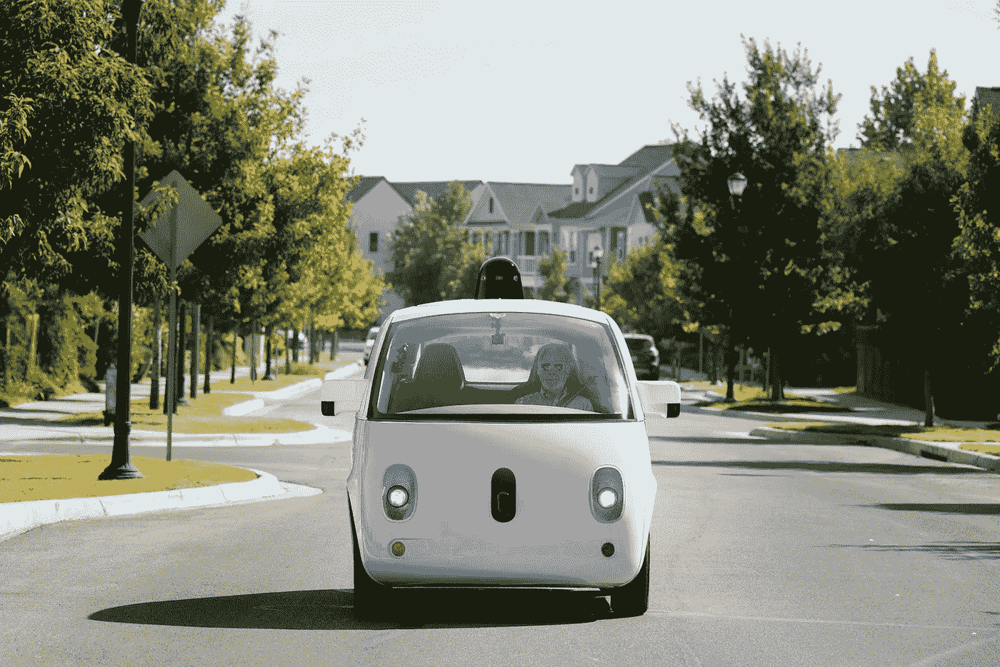

# 自动驾驶汽车，解释

> 原文：<https://medium.com/hackernoon/self-driving-cars-explained-db9fc8ced7e8>

Hope it’s ok I used your photo, [## 自动驾驶汽车将改善我们的城市。如果他们不毁了他们。

### 十年前，我发现自己站在密歇根州迪尔伯恩的汽车名人堂外面。我向外望去…

www.wired.com](https://medium.com/u/1e12980dc791#.n6anq0bf5) 

🚘 🚘 🚘 🚘

**编辑注:**这份文件直接基于[罗宾·蔡斯](http://www.robinchase.org/)关于 FAVES 和我们自主未来的开创性想法、写作和研究。我的目标是从她关于这个主题的聪明想法开始(见 [Osmosys](https://www.osmosys.org/) )，结合所有致力于使自动驾驶汽车成为全球变化的积极力量的好人的想法和灵感，并为该领域创建一个有用的工作文件草案。

接下来:第 2 部分将涵盖我们仍然需要回答的关于劳动力、政策、数据和安全、文化转变等棘手问题。

如果有任何想法、编辑或补充，请联系我。感谢阅读，推荐，并与可能发现它有用的人分享！

干杯，
亚历克斯菲尔德
推特:[@亚历克斯菲尔德](https://www.twitter.com/alexfield)

> [黑客中午](http://bit.ly/Hackernoon)是黑客如何开始他们的下午。我们是 [@AMI](http://bit.ly/atAMIatAMI) 家庭的一员。我们现在[接受投稿](http://bit.ly/hackernoonsubmission)，并乐意[讨论广告&赞助](mailto:partners@amipublications.com)机会。
> 
> 如果你喜欢这个故事，我们推荐你阅读我们的[最新科技故事](http://bit.ly/hackernoonlatestt)和[趋势科技故事](https://hackernoon.com/trending)。直到下一次，不要把世界的现实想当然！

