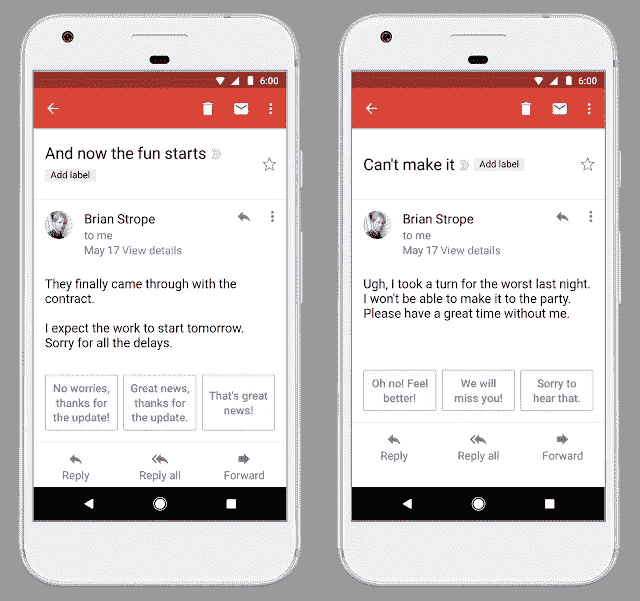
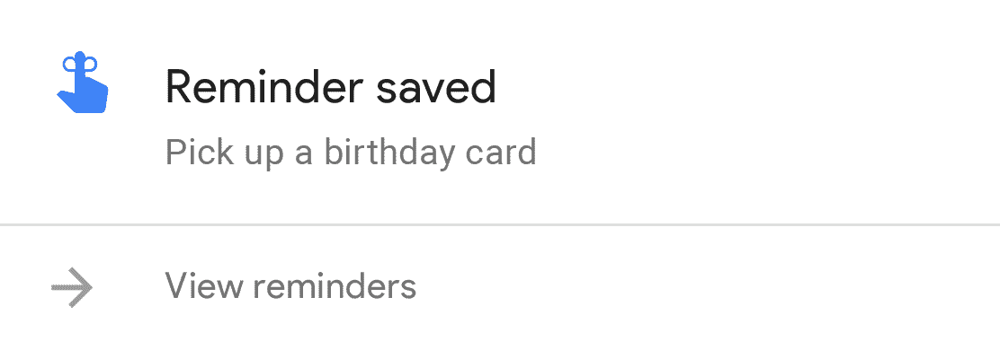

# 自动驾驶手机

> 原文：<https://medium.com/hackernoon/self-driving-phones-3edf70775405>

## iPhone X 在这里，代表了硬件设计的新水平——但是它没有驱动力。

来自凯洛格商学院莫汉比尔·索内教授的最新一期[:](http://fortune.com/2017/11/02/apple-iphone-x-ai-google-amazon/)

> “正如我们所见，当差异化的载体转移时，市场领导者往往会半途而废。在人工智能这个美丽的新世界中，谷歌和亚马逊明显优于苹果。以谷歌的 Pixel 2 手机为例:由基于人工智能的技术驱动，它提供了前所未有的照片增强功能和更深层次的硬件-软件集成，如与谷歌的特殊耳机配合使用时的实时语言翻译……差异化向人工智能和代理的转移对苹果来说不是好兆头……
> 
> 玻璃板不再是创新的沃土。这意味着苹果迫切需要将重点和投资转移到人工智能驱动的技术上，作为创造亚马逊和谷歌正在快速建立的生态系统的更广泛努力的一部分。然而，苹果在人工智能竞赛中落后了，因为它仍然是一家核心的硬件公司，而且它没有接受谷歌和亚马逊在人工智能领域开创的开源和合作方法。"

设备或玻璃片当然将继续是创新的领域，但正如 Sawhney 教授上文所描述的那样——向新的人工智能世界的范式转变就在这里。目前，我们正处于这个新时代的黎明，人工智能世界的组件正在[开发](https://research.googleblog.com/2017/11/fused-video-stabilization-on-pixel-2.html)。

人工智能和机器智能当然是一个广阔的领域，但让我们专注于与移动计算和面向消费者的产品相关的人工智能。计算的巅峰是当技术高效地执行任务，很少或没有人类互动时——对我来说，这是一种**自动驾驶**技术。

好吧，那么让我们更深入地挖掘人工智能的哪些支柱和技术将实现自动驾驶标签。

为了概述这种设备的威力，我在这个新世界中看到了以下情景:

**我把手机忘在家里了，我会整天戴着苹果手表——这是我回到手机的链接。**

## 自然语言处理

智能代理的核心是语言处理或理解。我家里的手机收到以下短信:

> 今晚来参加生日派对吗？

我的手机处理由短信和电子邮件组成的设备数据(是的，这令人毛骨悚然，但却是必要的)，以确定我已经在亚马逊上为聚会购买了礼物。

> 好的，8 点见！

这种独立人工智能技术的先驱存在于 GMail 中，它有[智能回复](https://research.googleblog.com/2017/05/efficient-smart-reply-now-for-gmail.html)。

GMail with Smart Reply

当我回家时，手机已经列出了所有的智能回复，我可以在那里查看任何潜在的变化。

## 计算机视觉

下一个支柱是视觉，类似于自然语言处理，[近年来计算机视觉的创新](https://research.googleblog.com/2017/06/supercharge-your-computer-vision-models.html)已经被深度学习和神经网络提升。

我姐姐给我发了一条短信:

> 你能把昨晚生日聚会的照片发给我吗？

Google photos 使用该产品出色的搜索和图像识别技术，通过短信将我设备中的一组照片(标有适当的位置和时间戳)直接发送给我妹妹。也许在发布照片之前，我的 Apple Watch 会收到一个确认请求，但大部分繁重的工作都是在这个时候完成的。

## 艾将军

位于核心技术之上的层由各种人工智能和机器学习算法组成，以激活自动驾驶行为。无论是基于信号建议晚餐想法的推荐引擎，如发出的文本消息，“不确定今晚晚餐做什么”，还是在家中收听这种讨论的始终打开的麦克风。

当我带着 Apple Watch 出去慢跑时，当我回来时，手机正忙于使用这一顶层收集适当的通知:

谷歌正在推动创新，基于人工智能的软件和代理是差异化的载体，这在[谷歌 Pixel 2](https://research.googleblog.com/2017/11/fused-video-stabilization-on-pixel-2.html) 上得到了清晰的展示。自动驾驶手机的组件正在开发中，我看到自己将设备留在家里处理我的生活和任务。

罗布·桑德胡

[天气嬉皮士](https://itunes.apple.com/us/app/weather-hippie/id1274367210?mt=8)的创造者