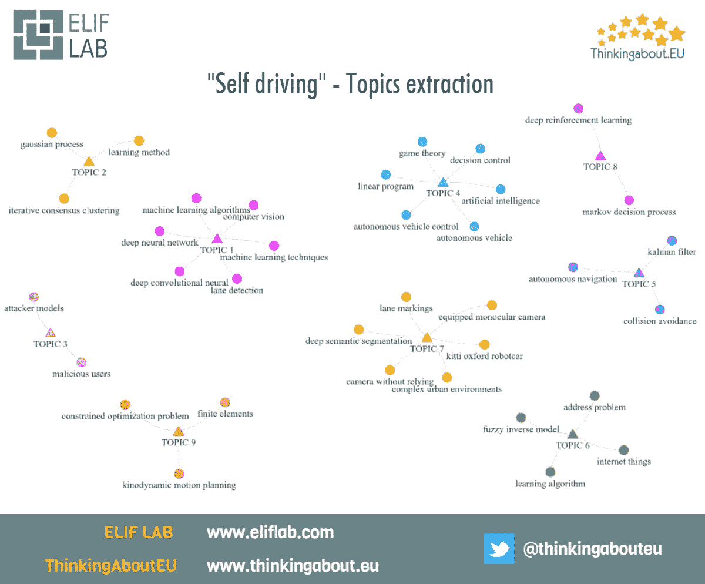

# 自驾:触及主题的表面

> 原文：<https://medium.com/hackernoon/self-driving-scratching-the-surface-of-topics-abae5701b85d>

“**自动驾驶**”问题正在成为主流新闻的中心，它可能会在未来几年内重塑汽车市场。

当我们想到“**自动驾驶**及其技术挑战时，总是很难跟上新出现的想法和概念。

人们很容易接受这样一个错误的推论，即既然网络上充满了技术信息和科学论文，这些知识也是随时可用的。不幸的是，**的科学论文**经常受到**超级技术**(有时是自我指涉)行话和**过度生产**出版物的影响。

# **起点**

为了尝试提取一些关于这个主题的见解，我们分析了发表在 [**arXiv**](https://arxiv.org/) 数据库中的几篇文章。

ArXiv 似乎是一个很好的起点:它可能是**最权威的预印本数据库，它的 API 简单而快速**。

我们的研究只是第一步，但我们想分享一些早期的发现，我们很高兴收到下一步的想法。

这一分析并不声称是对这一主题的详尽概述。这只是试图从大量信息中挖掘出表面的 T21。

这项工作也是我们尝试一些技术的机会，这些技术可能有助于在没有每个特定主题的普通博士知识的情况下，从技术文档集中获得**见解(无论如何，拥有博士头衔并不足以确保你成功:)。**

# **手法**

我们已经尝试了几种方法，下面的方法似乎提供了一些有希望的起点。

-我们已经获得了来自 **arXiv API** 的论文列表，从一些与主题“自驾车”相关的通用查询开始。

-我们已经过滤了结果**，删除了明显不相关的**主题(即:所有的天体物理学论文)

-我们已经**将获得的语料库转换为矩阵**(经过一些调整的 tf-idf)并基于单词之间的**连接创建了一个**图**。**

-为了减少噪音并提取更清晰的数据，我们使用**分层算法**检测了该图中的**社区**。

这个过程的最终产品是**一棵树**，它允许我们探索一些最有希望的 [**n-gram**](https://en.wikipedia.org/wiki/N-gram) **s** 以及它们在论文中的接近程度。

这个分析的最后一步类似于淘金者用他的筛子做的事情。我们试图**通过阅读一些相关论文和其他可以在网上找到的材料，更深入地分析一些 n 元语法**。

在这篇小文章中，我们选择了代表每个集群的**前 n 个字母，试图**将潜在的主题**联系起来。**

# **主题**

Topics emerging from the corpus of papers related to self driving

*-机器学习算法、深度卷积神经、机器学习技术、深度神经网络、计算机视觉、车道检测*

这是最令人期待的话题，因为它与软科学新闻和现代工作标题中流行的一些关键词有关。

**机器学习算法**和**深度神经网络**是一些与“计算机视觉*的有效性的提高紧密相关的技术。*

**-迭代一致聚类，学习方法，高斯过程**

***迭代一致性聚类**是一种有趣的集成方法，它允许**混合几种算法**的结果，以提高分类的精度。*

*高斯过程在统计学和物理学中无处不在，所以在这里发现它们并不奇怪。同样，在这个集群中，我们发现了“垄断”大数据分析的学习方法。*

**-攻击者模型，恶意用户**

*这对组合真的很有趣，因为它向我们展示了科学界内部对**安全问题**的考虑。*

*随着交互系统和自主算法数量的增加，以及大量数据的不断产生，恶意用户可以利用的弱点领域将会增加。*

**-自动驾驶汽车控制、决策控制、线性规划、博弈论、人工智能、自动驾驶汽车**

*有趣的是，(经典)**线性规划**、**博弈论**和**人工智能**(从最一般的意义上来说)正确地是一个关键话题，与机器学习和神经网络分开。*

**-卡尔曼滤波、防撞、自主导航**

***卡尔曼滤波器**是一种快速可靠的技术，广泛应用于机器人领域，目的是**滤除统计噪声**。在这里，它与“**防撞**”的话题有关，当谈到自动驾驶汽车时，这(显然)不是一个次要问题！*

**-模糊逆模型，学习算法，地址问题，物联网**

***模糊模型**是与这类问题密切相关的另一个主题。使用模糊约束的想法并不新颖，但仍然有用。*

*更一般地说，某种模糊逻辑或一组模糊约束是一个经典话题。*

*在这里，我们还发现了与物联网的联系，这是几个赞助商提出的另一个口号。*

**- kitti oxford robotcar，无依托摄像头，复杂城市环境，深度语义分割，车道标线，配备单目摄像头**

*这个组包含了一些有用的信息，可以帮助那些想尝试与主题相关的算法的人。*

*Kitti oxford robotcar 参考了庞大的牛津 robotcar 数据集:[http://mrg.robots.ox.ac.uk/the-oxford-robotcar-dataset/](http://mrg.robots.ox.ac.uk/the-oxford-robotcar-dataset/)。*

**-深度强化学习，马尔可夫决策过程**

*我们期望在这个分析中更经常地发现一些马尔可夫技术。*

*马尔可夫技术被广泛应用于人工智能领域，因为它们功能强大，同时在计算需求方面也是可行的。*

*我们在这个集群中发现了另一种深度学习技术:**深度学习**，它现在得到了大量的赞助。*

**-动态运动规划、有限元、约束优化问题**

*这组单词对我们来说非常有趣，因为我们从来没有听说过任何关于**运动学运动规划的事情**(我们的无知)。这很好，因为它听起来像《星际迷航》中的技术泡沫，所以它让我们想起了 90 年代。*

*经过简短的研究，我们现在知道这是一类必须满足**速度、加速度和力/扭矩界限**以及**运动学约束**的问题，例如避开障碍物。*

# ***结论***

*像任何资金充足、曝光率高的目标一样，这期“**自动驾驶**”杂志收集了**有趣的新想法(也有无聊的和循环利用的想法)**。*

*这个话题是非常多面的，我们确信在不久的将来，一些有趣的研究将会在其他领域大量涌现。*

*为了适应这种模式的变化，调整法律法规对 T2 来说也是一项艰巨的任务。在这个科技市场似乎可以自我维持的世界里，**将科技**(非纯科学)**与人类**的需求结合起来的目标似乎是一项真正的艰巨任务。*

# *谁*

*我们是 [**Elif Lab**](http://www.eliflab.com/) ，一家提供政治、社会和制度分析的数据公司。*

*我们还在做一个名为 [**ThinkingAbout 的项目。欧盟**](http://www.thinkingabout.eu/) 分析来自欧洲机构的各种数据。*

*在我们的网站[**www.eliflab.com**](http://www.eliflab.com)联系我们，或者发邮件到**info@eliflab.com***

******

> *[黑客中午](http://bit.ly/Hackernoon)是黑客如何开始他们的下午。我们是这个家庭的一员。我们现在[接受投稿](http://bit.ly/hackernoonsubmission)并乐意[讨论广告&赞助](mailto:partners@amipublications.com)机会。*
> 
> *如果你喜欢这个故事，我们推荐你阅读我们的[最新科技故事](http://bit.ly/hackernoonlatestt)和[趋势科技故事](https://hackernoon.com/trending)。直到下一次，不要把世界的现实想当然！*

**